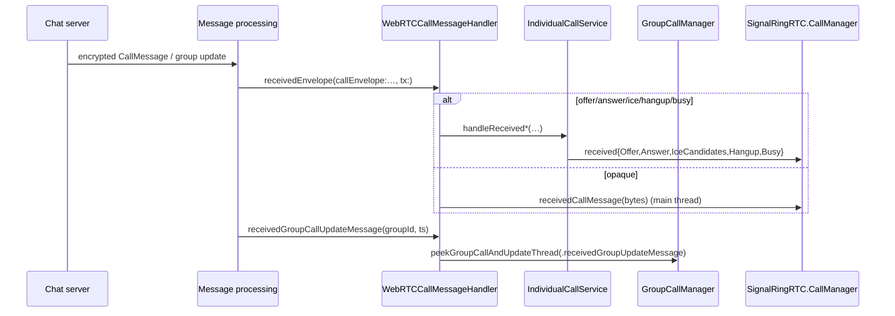

# Call Message Handling

"Call messages" are the out-of-band signalling payloads exchanged over Signal's
normal encrypted message channel to set up and tear down calls. This doc covers
the inbound routing protocol and its implementations, plus the outbound
`OutgoingCallMessage`.

## `CallMessageHandler` — inbound protocol

**File:** `SignalServiceKit/Calls/CallMessageHandler.swift`

[High] `CallEnvelopeType` enumerates the six RingRTC signalling payloads that can
arrive inside a `CallMessage` (`CallMessageHandler.swift:8-15`):

```
offer / answer / iceUpdate([…]) / hangup / busy / opaque
```

[High] `public protocol CallMessageHandler` (`CallMessageHandler.swift:17-44`)
has two requirements:

- `receivedEnvelope(_:callEnvelope:from:toLocalIdentity:plaintextData:wasReceivedByUD:sentAtTimestamp:serverReceivedTimestamp:serverDeliveryTimestamp:tx:)` —
  a 1:1-style signalling payload addressed to this device, delivered inside a
  write transaction. Carries the caller `(aci, deviceId)` and sealed-sender flag.
- `receivedGroupCallUpdateMessage(_:forGroupId:serverReceivedTimestamp:) async` —
  a group-call update ("someone joined/left") that triggers a peek.

## `NoopCallMessageHandler`

**File:** `SignalServiceKit/Calls/NoopCallMessageHandler.swift`

[High] A `public` stub conformance whose methods call `owsFailDebug("")`
(`NoopCallMessageHandler.swift:7-32`). [Medium] Used in contexts that should
never receive call messages (e.g. extensions / tests), so a delivery is a
programming error.

## `WebRTCCallMessageHandler` — the production implementation

**File:** `Signal/Calls/WebRTCCallMessageHandler.swift`

[High] The app-side handler (`WebRTCCallMessageHandler.swift:11-156`). It holds
references to `CallService`, `GroupCallManager`, and `TSAccountManager`, and
dispatches by envelope type:

| Envelope | Action (`WebRTCCallMessageHandler.swift`) |
| --- | --- |
| `.offer` | `individualCallService.handleReceivedOffer(…)` (`:38-50`) |
| `.answer` | `individualCallService.handleReceivedAnswer(…)` (`:51-58`) |
| `.iceUpdate` | `individualCallService.handleReceivedIceCandidates(…)` using `iceUpdate[0].id` as the call ID (`:59-65`) |
| `.hangup` | Decodes `type`/`deviceID` (defaulting to `.hangupNormal`, deviceId `0`) then `handleReceivedHangup(…)` (`:66-89`) |
| `.busy` | `individualCallService.handleReceivedBusy(…)` (`:90-95`) |
| `.opaque` | Computes `messageAgeSec` from server timestamps, requires a valid local device id, then **on the main thread** calls `callService.callManager.receivedCallMessage(…)` handing the raw bytes to RingRTC (`:96-130`) |

[High] `receivedGroupCallUpdateMessage` forwards to
`groupCallManager.peekGroupCallAndUpdateThread(forGroupId:peekTrigger:)` with a
`.receivedGroupUpdateMessage(eraId:messageTimestamp:)` trigger
(`WebRTCCallMessageHandler.swift:132-155`).

[Medium] Note the division of labor: 1:1 offer/answer/ice/hangup/busy go to a
Signal-side state machine (`IndividualCallService`), while `opaque` is RingRTC's
own multi-purpose signalling channel (used heavily by group calls) and is passed
straight through to `CallManager`.

## `OutgoingCallMessage` — outbound signalling

**File:** `SignalServiceKit/Calls/OutgoingCallMessage.swift`

[High] A `public final class OutgoingCallMessage: TransientOutgoingMessage`
(`OutgoingCallMessage.swift:10-154`). It is **not** persisted
(`encode(with:)` calls `owsFail`, `init?(coder:)` returns `nil`,
`shouldRecordSendLog` is `false`), and does **not** sync a transcript.

- [High] `MessageType` mirrors `CallEnvelopeType`:
  `offerMessage / answerMessage / iceUpdateMessages([…]) / hangupMessage /
  busyMessage / opaqueMessage` (`OutgoingCallMessage.swift:11-18`).
- [High] `contentBuilder(thread:transaction:)` builds an `SSKProtoCallMessage`,
  setting the relevant field; for offers and answers it also attaches the local
  profile key via `ProtoUtils.addLocalProfileKeyIfNecessary`
  (`OutgoingCallMessage.swift:76-121`). An optional `destinationDeviceId` targets
  a specific device.
- [High] `isUrgent` is `true` for offers and for opaque messages whose urgency
  is `.handleImmediately`, otherwise `false`
  (`OutgoingCallMessage.swift:123-141`). [Medium] Urgency controls push-priority
  so an incoming ring wakes the callee promptly.
- [High] `contentHint` is `.default` (`:154`).

> Not to be confused with `TSCall` (a 1:1 chat-history interaction) or
> `OWSGroupCallMessage` (a group chat-history interaction). `OutgoingCallMessage`
> is pure signalling. The class comment calls this out
> (`OutgoingCallMessage.swift:8-10`).

## End-to-end inbound flow


