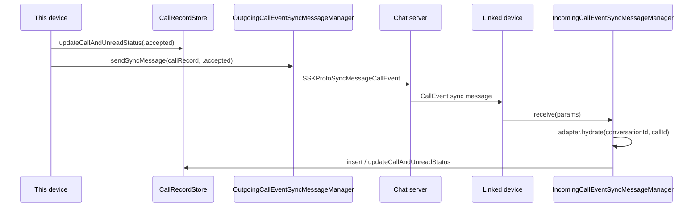

# Call Records & Sync

`CallRecord` is the canonical, cross-device record of a call. It powers the
Calls Tab ("call log") and "call disposition" — the sync messages that keep call
state consistent across a user's linked devices. This doc covers the model, its
store, deletion/tombstoning, the per-call-type managers, querying, and the
sync-message machinery. All files are under
`SignalServiceKit/Calls/CallRecord/` and `SignalServiceKit/Calls/DeletedCallRecord/`
unless noted.

## The `CallRecord` model

**File:** `CallRecord/CallRecord.swift`

[High] `public final class CallRecord: Codable, PersistableRecord, FetchableRecord`
(table `CallRecord`, `CallRecord.swift:12-240`). It is the source of truth that
bridges a cross-device **call ID** to this device's interaction.

- [High] `CallRecord.ID` = `(conversationId, callId)` — a device-local unique
  identifier (`CallRecord.swift:24-45`). `callId` is a `UInt64` that is
  caller-generated for 1:1 calls and derived from the SFU `eraId` for group
  calls, so it's paired with a conversation reference to be globally unique.
- [High] `ConversationID` = `.thread(threadRowId:)` or
  `.callLink(callLinkRowId:)`; `InteractionReference` = `.thread(threadRowId:,
  interactionRowId:)` or `.none` (call-link calls have no interaction)
  (`CallRecord.swift:70-96`).
- [High] `callType: CallType` = `audioCall`/`videoCall`/`groupCall`/`adHocCall`
  (`CallRecord.swift:243-248`); `callDirection` = `incoming`/`outgoing`;
  `callStatus: CallStatus` (below); derived `unreadStatus`
  (only missed calls are ever unread, `CallRecord.swift:250-262`).
- [High] `groupCallRingerAci` is settable only for ring statuses
  (`CallRecord.swift:117-137`).
- [High] `callBeganTimestamp` prefers the **earliest** known begin time across
  devices (long doc comment, `CallRecord.swift:139-176`); `callEndedTimestamp`
  is currently used mainly for group-call Backups.
- [High] `callId` is persisted as a **String** because GRDB/SQLite struggle with
  `UInt64` (`CallRecord.swift:200-240`). `didInsert(with:)` captures the SQLite
  row ID.

### `CallStatus`

**File:** `CallRecord/CallRecord+CallStatus.swift`

[High] `enum CallStatus` = `individual(IndividualCallStatus)` /
`group(GroupCallStatus)` / `callLink(CallLinkCallStatus)`
(`CallRecord+CallStatus.swift:7-200`). The three inner enums have **disjoint raw
values** because they share a single integer column:

| Enum | Cases (raw) |
| --- | --- |
| `IndividualCallStatus` | `pending(0)`, `accepted(1)`, `notAccepted(2)`, `incomingMissed(3)` |
| `GroupCallStatus` | `generic(4)`, `joined(5)`, `ringingAccepted(6)`, `ringingDeclined(7)`, `ringingMissed(8)`, `ringing(9)`, `ringingMissedNotificationProfile(10)` |
| `CallLinkCallStatus` | `generic(11)`, `joined(12)` |

[High] Encoding/decoding uses a single `Int` value and reconstructs the right
case by raw value (`CallRecord+CallStatus.swift:150-196`). [High]
`CallLinkCallStatus.canTransition(to:)` only permits moving to `.joined`
(`:140-143`). [High] `missedCalls` = `[.individual(.incomingMissed),
.group(.ringingMissed), .group(.ringingMissedNotificationProfile)]`;
`isMissedCall` tests membership (`:230-260` region).

### Supporting model files

- [High] `CallRecord/CallRecord+Sorting.swift` — `CallRecord` + `Array<CallRecord>`
  sorting helpers used by the Calls Tab (`CallRecord+Sorting.swift:6-30`).
- [High] `CallRecord/CallRecordAssociatedInteraction.swift` — marker protocol
  `CallRecordAssociatedInteraction: TSInteraction`, conformed to by `TSCall` and
  `OWSGroupCallMessage`, plus a `CallRecord` extension
  (`CallRecordAssociatedInteraction.swift:6-30`).
- [High] `CallRecord/CallRecordLogger.swift` — a `PrefixedLogger` subclass for
  call-record events.

## `CallRecordStore` — persistence

**File:** `CallRecord/CallRecordStore.swift`

[High] `public protocol CallRecordStore` + `CallRecordStoreImpl`
(`CallRecordStore.swift:30-370`). Key operations:

- `insert` / `delete` — delete creates `DeletedCallRecord` tombstones and posts
  a `.deleted(recordIds:)` notification on a transaction finalization block
  (`CallRecordStore.swift:220-250`).
- `updateCallAndUnreadStatus`, `markAsRead`, `updateDirection`,
  `updateGroupCallRingerAci`, `updateCallBeganTimestamp`,
  `updateCallEndedTimestamp`.
- `updateWithMergedThread(from:into:)` — rewrites `threadRowId` on thread merges.
- `enumerateAdHocCallRecords`.
- `fetch(callId:conversationId:)` → `MaybeDeletedFetchResult`
  (`.matchDeleted`/`.matchFound`/`.matchNotFound`) — it first consults the
  `DeletedCallRecordStore` so a tombstoned call is distinguishable from a never-
  seen one (`CallRecordStore.swift:1-27`, `:470-500` region).
- `fetch(interactionRowId:)` returns a `CallRecord` directly (interactions and
  records are deleted together).

[High] All mutations post `CallRecordStoreNotification`s via a sync-completion
block (`CallRecordStore.swift:300-320`). A `TESTABLE_BUILD`-only
`ExplainingCallRecordStoreImpl` runs `EXPLAIN QUERY PLAN` to assert index usage.

### `CallRecordStoreNotification`

**File:** `CallRecord/CallRecordStoreNotification.swift`

[High] `public struct CallRecordStoreNotification` with `UpdateType` =
`inserted` / `deleted(recordIds:)` / `statusUpdated(recordId:)`, round-tripped
through `NSNotification` (`CallRecordStoreNotification.swift:6-50`). [Medium] The
Calls Tab and badging observe this.

## Deletion & tombstoning — `DeletedCallRecord/`

**Files:** `DeletedCallRecord/DeletedCallRecord.swift`,
`DeletedCallRecordStore.swift`, `DeletedCallRecordExpirationJob.swift`

[High] `DeletedCallRecord` is a tombstone inserted when a `CallRecord` is
deleted, so that late-arriving updates for that call are silently ignored rather
than re-creating it (`DeletedCallRecord.swift:7-100`). It is kept **8h** from
`deletedAtTimestamp`.

[High] `DeletedCallRecordStore` protocol + `…Impl`
(`DeletedCallRecordStore.swift:6-230`): `fetch`, `insert`, `delete`,
`nextDeletedRecord` (oldest), `updateWithMergedThread`, `deleteRecords(forThreadId:)`,
and a default `contains(…)`.

[High] `DeletedCallRecordExpirationJob: ExpirationJob<DeletedCallRecord>`
(`DeletedCallRecordExpirationJob.swift:21-90`): `expirationDate` = deletedAt +
8h; on expiry it deletes the tombstone and, for a call-link conversation,
attempts to delete the now-unreferenced `CallLinkRecord` (unless the link itself
is still awaiting Storage Service).

## Per-type record managers

### `IndividualCallRecordManager`

**File:** `CallRecord/IndividualCallRecordManager.swift`

[High] `public protocol IndividualCallRecordManager` + `…Impl`
(`IndividualCallRecordManager.swift:6-320`): `createOrUpdateRecordForInteraction`
and `updateInteractionTypeAndRecordIfExists` keep a `TSCall` and its `CallRecord`
in sync (called from `CallEventInserter`). [High]
`IndividualCallRecordStatusTransitionManager`
(`IndividualCallRecordManager.swift:322+`) encodes the legal status transitions
(e.g. you can't move away from `accepted`), used to reject invalid updates.

### `GroupCallRecordManager`

**File:** `CallRecord/GroupCallRecordManager.swift`

[High] `public protocol GroupCallRecordManager` + extension + `…Impl`
(`GroupCallRecordManager.swift:8-302`): `createGroupCallRecordForPeek(…)` (used
by `GroupCallManager`), `updateCallBeganTimestampIfEarlier(…)`, and ring/joined
transitions. [High] `GroupCallRecordStatusTransitionManager`
(`GroupCallRecordManager.swift:302+`) governs group-status transitions.

### `AdHocCallRecordManager`

**File:** `CallRecord/AdHocCallRecordManager.swift` — documented in
[call-links.md](./call-links.md#adhoccallrecordmanager).

### `CallRecordDeleteManager`

**File:** `CallRecord/CallRecordDeleteManager.swift`

[High] `public protocol CallRecordDeleteManager` + `…Impl`
(`CallRecordDeleteManager.swift:8-56+`): the high-level "delete a call" entry
point. Beyond calling `CallRecordStore.delete`, it inserts `DeletedCallRecord`s
and can send a delete sync message. Doc comment cross-links `DeletedCallRecord`,
the expiration job, and the low-level store delete.

### `CallRecordMissedCallManager`

**File:** `CallRecord/CallRecordMissedCallManager.swift`

[High] `public protocol CallRecordMissedCallManager` + `…Impl`
(`CallRecordMissedCallManager.swift:6-290`): marks missed calls as read and
computes unread counts, sending a `CallLogEvent` "mark-as-read" sync message via
a sender shim (`_CallRecordMissedCallManagerImpl_SyncMessageSender_Shim`).

### `GroupCallRecordRingUpdateDelegate`

**File:** `CallRecord/GroupCallRecordRingUpdateDelegate.swift`

[High] `public protocol GroupCallRecordRingUpdateDelegate` +
`GroupCallRecordRingUpdateHandler` (`GroupCallRecordRingUpdateDelegate.swift:9-31+`):
updates `CallRecord`s in response to RingRTC ring updates (ring accepted,
declined, expired, cancelled).

## Querying the Calls Tab

**Files:** `CallRecord/CallRecordQuerier.swift`, `CallRecordCursor.swift`

[High] `public protocol CallRecordQuerier` + `…Impl`
(`CallRecordQuerier.swift:14-331`) performs the ordered, filtered queries behind
the Calls Tab. The doc comment stresses these must be **index-only** (no table
scan, no temporary B-tree) because a user may have very many records
(`CallRecordQuerier.swift:14-26`). `CallRecordQuerierFetchOrdering` selects
ascending/descending order. [High] `CallRecordCursor` protocol +
`GRDBCallRecordCursor` (`CallRecordCursor.swift:8-45`) must not outlive their
transaction. A `TESTABLE_BUILD` `ExplainingCallRecordQuerierImpl` verifies the
query plan.

## Interactions ↔ records bridge

**File:** `CallRecord/InteractionStore+CallRecord.swift`

[High] `public extension InteractionStore`
(`InteractionStore+CallRecord.swift:8-132`) provides
`insertGroupCallInteraction`, `updateGroupCallInteractionAcis`,
`markGroupCallInteractionAsEnded`, and `fetchAssociatedInteraction(callRecord:)`
— the methods `GroupCallManager` and `CallEventInserter` use to keep
`OWSGroupCallMessage`/`TSCall` in step with records.
`GroupCallInteractionUpdatedNotification` (`:132+`) notifies observers of changes.

## Sync messages (call disposition)

Signal keeps call state consistent across linked devices with two families of
sync messages: **`CallEvent`** (per-call: accepted/declined/deleted/observed)
and **`CallLogEvent`** (bulk Calls-Tab actions: clear, mark-as-read).

### Conversation-ID encoding

- [High] `CallRecord/CallEventConversation.swift` — `enum CallEventConversation`
  (`individualThread(serviceId:isVideo:)` / `groupThread(groupId:)` /
  `adHoc(roomId:)`) encodes the `CallEvent.type` + `conversationId` pair, which
  must be interpreted together because the ID is ambiguous without the type
  (`CallEventConversation.swift:14-60`).
- [High] `CallRecord/CallRecordSyncMessageConversationIdAdapter.swift` —
  `hydrate(conversationId:callId:)` resolves an inbound sync message back to a
  `CallRecord`, and `getConversationId(callRecord:)` produces the wire ID
  (ServiceId bytes / group ID / call-link roomId)
  (`CallRecordSyncMessageConversationIdAdapter.swift:8-110`).

### Outgoing

- [High] `SignalServiceKit/Calls/OutgoingCallEventSyncMessage.swift` —
  `OutgoingCallEvent` (NSSecureCoding payload with `CallType`/`EventDirection`/
  `EventType`) and `OutgoingCallEventSyncMessage: OutgoingSyncMessage` whose
  `syncMessageBuilder` builds `SSKProtoSyncMessageCallEvent`
  (`OutgoingCallEventSyncMessage.swift:9-205`). `EventType` =
  `accepted`/`notAccepted`/`deleted`/`observed`.
- [High] `CallRecord/OutgoingCallEventSyncMessageManager.swift` —
  `OutgoingCallEventSyncMessageEvent` enum + `OutgoingCallEventSyncMessageManager`
  protocol + `…Impl` (`OutgoingCallEventSyncMessageManager.swift:8-28+`): the
  entry point that builds and enqueues the message for a given `CallRecord`.
- [High] `SignalServiceKit/Calls/OutgoingCallLogEventSyncMessage.swift` — the
  bulk Calls-Tab counterpart (clear-all / mark-all-read).

### Incoming

- [High] `CallRecord/IncomingCallEventSyncMessageManager.swift` — protocol +
  `…Impl` applies an inbound per-call event to local records, with a
  mark-as-read sub-shim (`IncomingCallEventSyncMessageManager.swift:8-640`).
- [High] `CallRecord/IncomingCallEventSyncMessageParams.swift` — the parsed
  parameters struct for the above.
- [High] `CallRecord/IncomingCallLogEventSyncMessageManager.swift` — applies
  bulk Calls-Tab actions, delegating deletions to a `DeleteAllCallsJobQueue`
  shim (`IncomingCallLogEventSyncMessageManager.swift:6-130`).
- [High] `CallRecord/IncomingCallLogEventSyncMessageParams.swift` — parsed
  parameters for the bulk event, including the "anchor" call reference
  (`IncomingCallLogEventSyncMessageParams.swift:8-18`).

