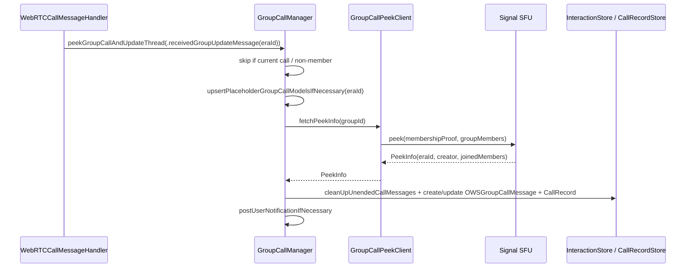

# Group Calls

Group calls (both group-thread calls and call-link calls) use RingRTC's
SFU-based `GroupCall` API rather than peer-to-peer signalling. Signal's job is
to (a) **peek** calls to keep chat history and the Calls Tab current, (b) talk
to the SFU over HTTP, and (c) wrap RingRTC's `GroupCall` with Signal state.

## `GroupCallManager` — peeking & model updates

**File:** `SignalServiceKit/Calls/GroupCallManager.swift`

[High] `public class GroupCallManager` "fetches & updates group call state"
(`GroupCallManager.swift:20-70`). Dependencies include `CallRecordStore`,
`GroupCallRecordManager`, `InteractionStore`, and a `GroupCallPeekClient`.

### Supporting types

- [High] `public protocol CurrentCallProvider` — `hasCurrentCall` +
  `currentGroupThreadCallGroupId` (`GroupCallManager.swift:8-12`); the app
  implements it via `CurrentCall`, and `CurrentCallNoOpProvider` is a null
  implementation (`:14-18`).
- [High] `enum PeekTrigger` — `.receivedGroupUpdateMessage(eraId:messageTimestamp:)`
  or `.localEvent(timestamp:)`, with a redacting `description`
  (`GroupCallManager.swift:22-48`).

### `peekGroupCallAndUpdateThread(forGroupId:peekTrigger:)`

[High] (`GroupCallManager.swift:72-187`):

1. If the group is the **current** call, skip — a connected call gets automatic
   RingRTC updates.
2. Require an existing, non-terminated group thread where the local user is a
   full member; otherwise clean up unended call messages and return.
3. For a `.receivedGroupUpdateMessage` carrying a concrete `eraId`,
   `upsertPlaceholderGroupCallModelsIfNecessary` pre-creates models so the call
   shows up even before the peek completes.
4. `groupCallPeekClient.fetchPeekInfo(groupId:)` → `PeekInfo`.
5. Decide `shouldUpdateCallModels` — for an update message with a *stale* era ID
   (not matching the live call), silently drop; a future peek will reconcile.
6. `updateGroupCallModelsForPeek(…)` inside a write transaction.
7. On error: network/timeout errors are logged `warn`; staging credential
   failures are expected; everything else is `owsFailDebug` — **failures are
   non-fatal** (`GroupCallManager.swift:170-186`).

### `updateGroupCallModelsForPeek(peekInfo:groupId:…)`

[High] (`GroupCallManager.swift:189-320`): cleans up unended call messages that
don't match the live call ID, then finds-or-creates the `OWSGroupCallMessage`
for the current call ID (reusing a recently-concluded record if the server still
reports the same call ID), updating joined members/creator and posting a user
notification when a previously-empty call gains participants.

- [High] `cleanUpUnendedCallMessagesAsNecessary(currentCallId:…)` marks every
  unended group-call interaction whose call ID ≠ the current call ID as ended,
  bridging legacy `eraId` interactions and modern `CallRecord`-backed ones; it
  returns the interaction for the live call, if any
  (`GroupCallManager.swift:322-430`).
- [High] `createModelsForNewGroupCall(…)` inserts the interaction via
  `InteractionStore.insertGroupCallInteraction` and a record via
  `groupCallRecordManager.createGroupCallRecordForPeek`
  (`GroupCallManager.swift:400-430`).
- [High] `upsertPlaceholderGroupCallModelsIfNecessary(eraId:…)` guards on
  `existsGroupCallMessageForEraId`, and either updates an earlier
  begin-timestamp, ignores a deleted record, or inserts a placeholder
  (`GroupCallManager.swift:432-497`).
- [High] `postUserNotificationIfNecessary(…)` suppresses notifications for the
  current call and for calls the local user created
  (`GroupCallManager.swift:499-530`).
- [High] A private `CallId` wrapper redacts the raw `UInt64` in logs to its last
  three digits (`GroupCallManager.swift:536-566`).

## `GroupCallPeekClient` — SFU peek

**File:** `SignalServiceKit/Calls/GroupCallPeekClient.swift`

[High] Holds a `SignalRingRTC.SFUClient` (backed by a retained `CallHTTPClient`)
and a `GroupCallPeekLogger` (`GroupCallPeekClient.swift:8-38`). `fetchPeekInfo`
(main-actor, `:40-73`):

1. Read the V2 group's `secretParams`.
2. `fetchGroupMembershipProof(secretParams:)` → fetches external credentials via
   `groupsV2.fetchGroupExternalCredentials` and returns the token bytes
   (`:75-85`).
3. Build `[GroupMemberInfo]` (ACI + `userIdCipherText`) via `groupMemberInfo`
   (`:87-115`).
4. `sfuClient.peek(PeekRequest(sfuURL:membershipProof:groupMembers:))`; a
   non-nil `errorStatusCode` throws.

[High] `sfuUrl` chooses `TSConstants.sfuTestURL` vs `sfuURL` based on
`DebugFlags.callingUseTestSFU` (`:18-20`).

## `CallHTTPClient` — RingRTC's HTTP transport

**File:** `SignalServiceKit/Calls/CallHTTPClient.swift`

[High] Wraps a `SignalRingRTC.HTTPClient` and conforms to `HTTPDelegate`
(`CallHTTPClient.swift:8-74`). `sendRequest(requestId:request:)` (main thread)
builds an `OWSURLSession` with `signalServiceSecurityPolicy` and
`canUseSignalProxy: true`, disables the 2xx/3xx requirement, allows redirects
while **re-attaching the `Authorization` header** on redirect, performs the
request, and reports back via `receivedResponse` / `httpRequestFailed`. Network
errors are logged `warn`; other errors `owsFailDebug`. [High] Adapter extensions
map `SignalRingRTC.HTTPMethod` and `SignalServiceKit.HTTPResponse`
(`CallHTTPClient.swift:76-99`).

## Group chat-history interaction — `Group/`

### `OWSGroupCallMessage`

**Files:** `Group/OWSGroupCallMessage.h` / `.m` / `+SDS.swift`

[High] `OWSGroupCallMessage : TSInteraction` is the group analog of `TSCall`
(`OWSGroupCallMessage.h:11-98`): `creatorUuid`/`creatorAci`,
`joinedMemberUuids`/`joinedMemberAcis`, `hasEnded`, `read`, disappearing-message
fields, and a **deprecated** legacy `eraId` (modern messages instead have a
corresponding `CallRecord` storing a call ID — `OWSGroupCallMessage.h:47-52`).

### `GroupCallInteractionFinder`

**File:** `Group/GroupCallInteractionFinder.swift`

[High] Two index-backed queries (`GroupCallInteractionFinder.swift:7-85`):

- `existsGroupCallMessageForEraId(_:thread:transaction:)` — a legacy lookup
  powered by the one-off `Interaction_groupCallEraId_partial` index.
- `unendedCallsForGroupThread(_:transaction:)` — uses the
  `Interaction_unendedGroupCall_partial` index to list in-progress group calls.

### `OutgoingGroupCallUpdateMessage`

**File:** `Group/OutgoingGroupCallUpdateMessage.swift`

[High] `@objc(OWSOutgoingGroupCallMessage)` `TransientOutgoingMessage` that tells
other participants our state changed; `dataMessageBuilder` sets a
`SSKProtoDataMessageGroupCallUpdate` with the `eraId`
(`OutgoingGroupCallUpdateMessage.swift:9-85`). Not to be confused with
`OWSGroupCallMessage` (the comment calls this out).

### `CancelledGroupRing`

**File:** `SignalServiceKit/Calls/CancelledGroupRing.swift`

[High] A GRDB record (table `cancelledGroupRing`) tracking ring IDs we've
cancelled, with `deleteExpired(expiration:transaction:)`; insert conflicts
`.replace` so a newer cancellation wins (`CancelledGroupRing.swift:8-33`).
[Medium] Used by `CallService` to suppress rings that were cancelled.

## App-side `GroupCall` hierarchy

**Files:** `Signal/Calls/GroupCall.swift`, `Signal/Calls/GroupThreadCall.swift`,
`Signal/Calls/CallLinkCall.swift`

[High] `class GroupCall: SignalRingRTC.GroupCallDelegate` is the base type
(`GroupCall.swift:57-330`). It owns `commonState`, the `ringRtcCall`, a
`videoCaptureController`, `hasInvokedConnectMethod`, and
`shouldTerminateOnEndEvent`. Notable behavior:

- [High] `GroupCallObserver` protocol surfaces every delegate event to the UI —
  local/remote device state, peek, ended, reactions, raised hands, speaking,
  remote-mute, observed-remote-mute, and untrusted-identity
  (`GroupCall.swift:11-54`).
- [High] On join, `groupCall(onLocalDeviceStateChanged:)` stamps the connected
  date and starts the RTC audio activity (`GroupCall.swift:195-205`).
- [High] `groupCall(onRemoteDeviceStatesChanged:)` is **debounced 0.25 s** to
  avoid spamming the UI (`GroupCall.swift:208-233`).
- [High] `onEnded` shows a `CallQualitySurveyManager` survey, tagging the call
  type (`signalGroup`/`callLink`), and notifies observers
  (`GroupCall.swift:280-320`).
- [High] `Constants.autoMuteThreshold = 8` — auto-mute on join if ≥ 8 members are
  already present (`GroupCall.swift:58-61`, `shouldMuteAutomatically`
  `:95-100`).
- [High] `ConcreteType` enum distinguishes `groupThread(GroupThreadCall)` vs
  `callLink(CallLinkCall)` (`GroupCall.swift:118-135`).

[High] `GroupThreadCall: GroupCall` adds `groupId`/`threadUniqueId`, ringing
support, and group-membership tracking (`GroupThreadCall.swift:17-230`):

- `RingRestrictions` OptionSet (`callInProgress`, `groupTooLarge`) — set from
  `maxGroupCallRingSize` and active-call detection
  (`GroupThreadCall.swift:84-116`).
- `GroupCallRingState` enum: `doNotRing`, `shouldRing`, `ringing`,
  `ringingEnded`, `incomingRing(caller:ringId:)`, `incomingRingCancelled`
  (`GroupThreadCall.swift:131-150`).
- Overrides `groupCall(onLocalDeviceStateChanged/onRemoteDeviceStatesChanged/
  onPeekChanged/requestMembershipProof/requestGroupMembers)` to update ring
  state, derive `callInProgress` from peek device counts, and forward
  membership-proof / group-member requests to a `GroupThreadCallDelegate`
  (`GroupThreadCall.swift:156-215`).

[High] `SignalRingRTC.GroupCall` extensions add `isFull` and `maxDevices`
helpers (`GroupThreadCall.swift:219-237`).

[High] `CallLinkCall: GroupCall` adds `callLink`, `adminPasskey`,
`callLinkState`, plus `isAdmin` and `mayNeedToAskToJoin`
(`CallLinkCall.swift:11-45`) — see [call-links.md](./call-links.md).
