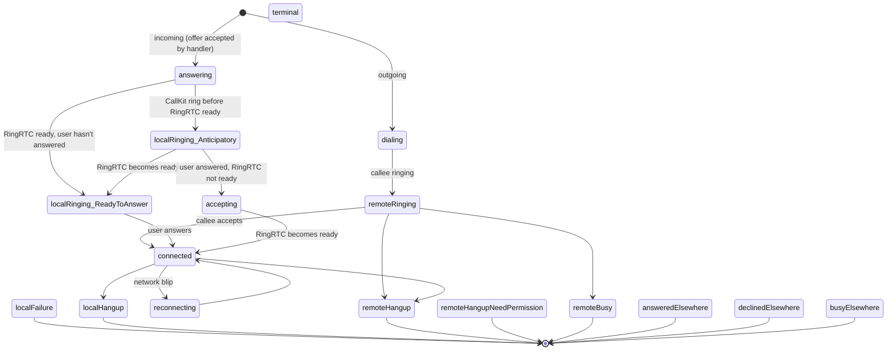
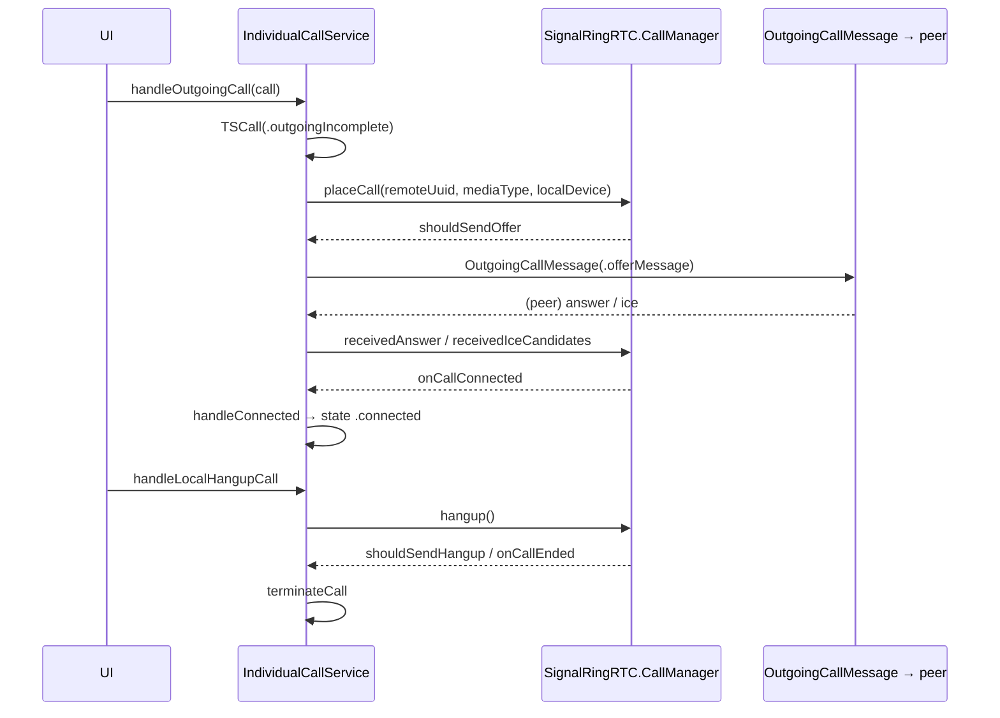

# Individual (1:1) Calls

1:1 calls use RingRTC's peer-to-peer `CallManager` API. Signal maintains a
parallel `IndividualCall` state object, inserts a `TSCall` chat interaction plus
a `CallRecord`, and drives the whole lifecycle from `IndividualCallService`.

## Models

### `TSCall` — the chat-history interaction

**Files:** `SignalServiceKit/Calls/Individual/TSCall.h` / `.m` / `TSCall+SDS.swift`

[High] `TSCall : TSInteraction <OWSPreviewText>` represents a 1:1 call update in
chat history (`TSCall.h:39-105`). Key properties:

- `callType: RPRecentCallType` — encodes both the kind of call and its state.
  The enum (`TSCall.h:14-26`) includes `Incoming`, `Outgoing`,
  `IncomingMissed`, `OutgoingIncomplete`, `IncomingIncomplete`,
  `IncomingMissedBecauseOfChangedIdentity`, `IncomingDeclined`,
  `OutgoingMissed`, `IncomingAnsweredElsewhere`, `IncomingDeclinedElsewhere`,
  `IncomingBusyElsewhere`, `IncomingMissedBecauseOfDoNotDisturb`,
  `IncomingMissedBecauseBlockedSystemContact`.
- `offerType: TSRecentCallOfferType` — `Audio` or `Video` (`TSCall.h:28-31`).
- `read` + disappearing-message fields (`expiresInSeconds`, `expireStartedAt`,
  `expiresAt`).

[High] The header comment states a `TSCall` is paired with a `CallRecord`, which
bridges between cross-device "call IDs" and the local interaction
(`TSCall.h:33-47`). `callType` is written both by CallKit callbacks and by
incoming call-event sync messages (via `CallRecord`).

### `IndividualCall` — the live call state object

**File:** `Signal/Calls/IndividualCall.swift`

[High] `class IndividualCall` is the main-thread-only data model for a live WebRTC
voice/video call (`IndividualCall.swift:76-247`). It owns:

- `callId: UInt64?`, `direction: CallDirection` (`incoming`/`outgoing`,
  `:65-70`), `thread: TSContactThread`, `offerMediaType`, `localDeviceId`.
- `state: CallState` — the state machine (below) that fires observer callbacks
  and stamps `commonState.connectedDate` on `.connected`
  (`IndividualCall.swift:197-213`).
- A `CallEventInserter` for persisting `TSCall`/`CallRecord`.
- Remote media flags (`isRemoteVideoEnabled`, `isRemoteAudioMuted`,
  `isRemoteSharingScreen`), local flags (`isMuted`, `hasLocalVideo`,
  `isOnHold`), and a `videoCaptureController`.
- `IndividualCallObserver` protocol for UI (`IndividualCall.swift:40-62`).
- Factory methods `outgoingIndividualCall(…)` (initial state `.dialing`) and
  `incomingIndividualCall(…)` (initial state `.answering`)
  (`IndividualCall.swift:264-299`).

[High] `createOrUpdateCallInteractionAsync(callType:)` sets `callType`
synchronously then `asyncWrite`s through `CallEventInserter`
(`IndividualCall.swift:339-360`); `setOutgoingCallIdAndUpdateCallRecord(_:)` wires
the server-assigned call ID into the record once dialing yields one
(`IndividualCall.swift:95-105`).

### `CallEventInserter` — TSCall + CallRecord persistence

**File:** `SignalServiceKit/Calls/Individual/CallEventInserter.swift`

[High] `public class CallEventInserter` inserts/updates a `TSCall` and its
`CallRecord` for a single call (`CallEventInserter.swift:9-250`). Highlights:

- `createOrUpdate(callType:tx:)` resolves the interaction in priority order:
  in-memory cache → existing interaction found via `CallRecord` (by `callId`) →
  create a new `TSCall` (`CallEventInserter.swift:76-170`). On create it also
  marks prior unread call interactions read and cancels missed-call
  notifications.
- `shouldUpdateCallType(…)` guards against invalid status transitions, because a
  linked device's sync message may have already advanced the status; it consults
  `IndividualCallRecordStatusTransitionManager`
  (`CallEventInserter.swift:200-242`).
- `createOrUpdateCallRecordIfNeeded(…)` delegates to
  `IndividualCallRecordManager.createOrUpdateRecordForInteraction(…)`
  (`CallEventInserter.swift:244-285` region).

## Offer handling — `CallOfferHandlerImpl`

**File:** `SignalServiceKit/Calls/Individual/CallOfferHandler.swift`

[High] `CallOfferHandlerImpl.startHandlingOffer(…)` performs all pre-flight
checks for an inbound offer and returns a `PartialResult` (identity keys, media
type, thread, local device id) or `nil` if the call should be rejected
(`CallOfferHandler.swift:55-204`). Checks, in order:

1. Resolve/create the `TSContactThread`; map offer type to audio/video.
2. **Not registered** → insert `.incomingMissed`, return `nil`.
3. **Untrusted identity** → notify (verified/default/noLongerVerified variants),
   insert `.incomingMissedBecauseOfChangedIdentity`, return `nil`.
4. **Missing identity keys** → insert `.incomingMissed`, return `nil`.
5. **Not allowed inbound** (sender not in profile whitelist / system contacts) →
   send a `.hangupNeedPermission` back (only for the ACI identity, not PNI),
   insert `.incomingMissed`, return `nil` (`CallOfferHandler.swift:149-179`).
6. **Muted thread** without "notify when muted" → insert `.incomingMissed`,
   return `nil`.

[High] `CallHangupSender.sendHangup(…)` builds an `OutgoingCallMessage` with a
`.hangupMessage` and enqueues it high-priority
(`CallOfferHandler.swift:218-269`). [High] `CallIdentityKeys` and the
`OWSIdentityManager.getCallIdentityKeys` helper fetch the local + contact
identity keys needed to validate the offer (`CallOfferHandler.swift:206-230`).

## The `CallState` state machine

**File:** `Signal/Calls/IndividualCall.swift:17-39`

[High] `enum CallState` has these cases (terminal ones noted):

[High] The three "local ringing" states exist because CallKit may ring the user
*before* RingRTC is ready to answer; the call only connects once both the user
has answered and RingRTC is ready (`IndividualCall.swift:22-30` comment).
[High] `isEnded` / `hasTerminated` return `true` for the eight terminal states
(`IndividualCall.swift:160-247`).

## `IndividualCallService` — the controller

**File:** `Signal/Calls/IndividualCallService.swift`

[High] `IndividualCallService` holds the shared `CallManager` and
`CallServiceState`, and registers as a `CallServiceStateObserver`
(`IndividualCallService.swift:17-32`). It is both the originator of RingRTC
commands and the `CallManager` delegate.

### Call-control actions

| Method | Behavior | Cite |
| --- | --- | --- |
| `handleOutgoingCall(_:)` | Creates an `.outgoingIncomplete` interaction, resolves a remote UUID (synthesizing a stable UUID per PNI), then `callManager.placeCall(…)`; failure → `handleFailedCall`. | `:67-102` |
| `handleAcceptCall(_:)` | Verifies `currentCall`, writes `.incomingIncomplete`→`.incoming`, calls `handleConnected` **before** `callManager.accept` (so the `AVAudioSession` is configured before CallKit fulfils the answer). | `:107-153` |
| `handleLocalHangupCall(_:)` | `callManager.hangup()`; errors are logged, not failed. | `:158-174` |

### Inbound signalling

[High] `handleReceivedOffer(…)` runs `CallOfferHandlerImpl.startHandlingOffer`,
constructs an incoming `IndividualCall`/`SignalCall`, installs an
`OWSBackgroundTask` whose expiry raises `CallError.timeout` if the call hasn't
connected, then calls `callManager.receivedOffer(…)` with the sender/receiver
identity keys and computed `messageAgeSec`
(`IndividualCallService.swift:181-279`). [High] `handleReceivedAnswer`,
`handleReceivedIceCandidates`, `handleReceivedHangup`, and `handleReceivedBusy`
hand their payloads to the matching `callManager.received*` methods, hopping to
the main thread (`:284-402`).

### Outbound signalling & lifecycle (CallManager delegate)

[Medium] The large block of `callManager(…)` delegate methods
(`IndividualCallService.swift:406-1054`) implements RingRTC's
`CallManagerDelegate`: it emits `OutgoingCallMessage`s when RingRTC asks to send
an offer/answer/ICE/hangup/busy, and reacts to lifecycle events via
`handleRinging`, `handleConnected`, `handleReconnecting`, `handleReconnected`,
`handleMissedCall`, `handleAnsweredElsewhere`, `handleDeclinedElsewhere`,
`handleBusyElsewhere`, `setIsOnHold`, and `handleCallKitProviderReset`
(`:1061-1270`). Exact per-method behavior was summarized from the symbol map,
not line-by-line — **[Medium]**.

### Error & timeout paths

[High] `handleFailedCall(failedCall:error:shouldResetUI:shouldResetRingRTC:)`
(`IndividualCallService.swift:1278-1314`):

1. Wraps the error with `CallError.wrapErrorIfNeeded`.
2. If the call failed before any record existed (states `answering`,
   `localRinging_*`, `accepting`), inserts a missed-call record via
   `handleMissedCall`.
3. Bails if the call already ended.
4. Sets `.localFailure`, optionally calls `callUIAdapter.failCall`.
5. If `CallError.shouldSilentlyDropCall()` (i.e. `.doNotDisturbEnabled` /
   `.contactIsBlocked`), `callManager.drop(callId:)` to avoid sending a hangup;
   otherwise `callManager.reset()`.
6. `callServiceState.terminateCall(failedCall)`.

[High] A **presentation failsafe**: `startCallTimer` runs a 1 Hz timer; if a
call has been connected for more than 5 s but the call screen is not visible,
`ensureCallScreenPresented` fails the call with an assertion error (one tick of
"slop" is allowed) (`IndividualCallService.swift:1316-1382`).

