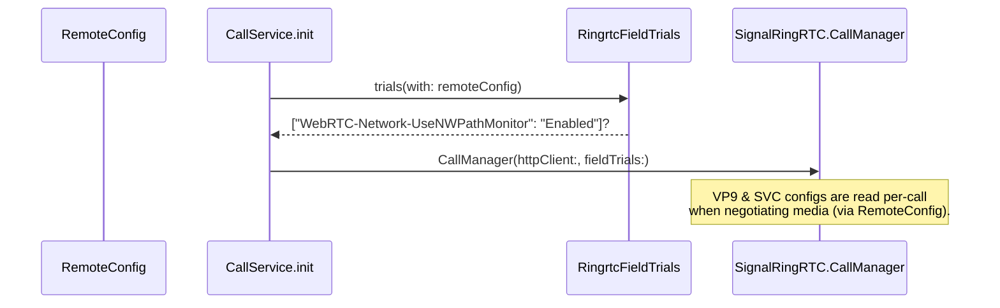

# RingRTC Configuration

These three small, UI-independent utilities translate server-driven
`RemoteConfig` values (and local `DebugFlags`) into the knobs RingRTC/WebRTC
expect. They are consumed when `CallService` builds its `CallManager` and when
calls negotiate codecs.

## `RingrtcVp9Config` — VP9 codec gating

**File:** `SignalServiceKit/Calls/RingrtcVp9Config.swift`

[High] A `public enum` namespace with two static methods
(`RingrtcVp9Config.swift:8-34`):

- `enableVp9Encode(with:) -> Bool`
- `enableVp9Decode(with:) -> Bool`

[High] Each follows the same decision logic:

1. If `DebugFlags.callingOverrideCodecs` is set, return the matching debug flag
   (`callingEnableVp9Encode` / `callingEnableVp9Decode`) — a developer override.
2. Read the hardware model via `sysctlKey: "hw.machine"`; if unavailable,
   return `false`.
3. Otherwise require `remoteConfig.ringrtcVp9Enabled` **and** that the device
   model is **not** in the respective denylist
   (`ringrtcVp9DeviceModelEncodeDenylist` / `…DecodeDenylist`).

[Medium] The encode/decode split lets the server disable VP9 on devices where
only one direction misbehaves (the denylists are independent).

## `RingrtcSvcConfig` — scalable video coding

**File:** `SignalServiceKit/Calls/RingrtcSvcConfig.swift`

[High] `public enum RingrtcSvcConfig` exposes four static accessors
(`RingrtcSvcConfig.swift:8-30`):

| Method | Source | Notes |
| --- | --- | --- |
| `enableSvc(with:)` | `DebugFlags.callingEnableSvc` else `remoteConfig.ringrtcSvcEnabled` | Debug flag force-enables. |
| `svcMode(with:)` | `remoteConfig.ringrtcSvcMode` | String mode for normal video. |
| `svcModeForScreenshare(with:)` | `remoteConfig.ringrtcSvcModeForScreenshare` | String mode for screen share. |
| `svcMaxBitrateBps(with:)` | `DebugFlags.callingSvcMaxBitrateBps` (if `> 0`) else `remoteConfig.ringrtcSvcMaxBitrateBps` | `UInt32` ceiling. |

## `RingrtcFieldTrials` — WebRTC field trials

**File:** `SignalServiceKit/Calls/RingrtcFieldTrials.swift`

[High] `public enum RingrtcFieldTrials` has a single static method
`trials(with:) -> [String: String]` (`RingrtcFieldTrials.swift:9-18`). It builds
a WebRTC field-trial dictionary. Currently the only trial: when
`remoteConfig.ringrtcNwPathMonitorTrial` is set, it adds
`"WebRTC-Network-UseNWPathMonitor" = "Enabled"`.

[High] This dictionary is passed directly into the `CallManager` initializer:
`fieldTrials: RingrtcFieldTrials.trials(with: remoteConfig)`
(`Signal/Calls/CallService.swift:113-116`).

## Where configuration flows

[Medium] `RingrtcVp9Config` / `RingrtcSvcConfig` are read at call-negotiation
time rather than at `CallManager` construction; they take a `RemoteConfig`
snapshot each time so a config refresh affects subsequent calls. The exact
call sites live outside these three files (in RingRTC-facing call setup) and
were not traced line-by-line here. **[Low]** for the precise call site; **[High]**
for the gating logic itself.
