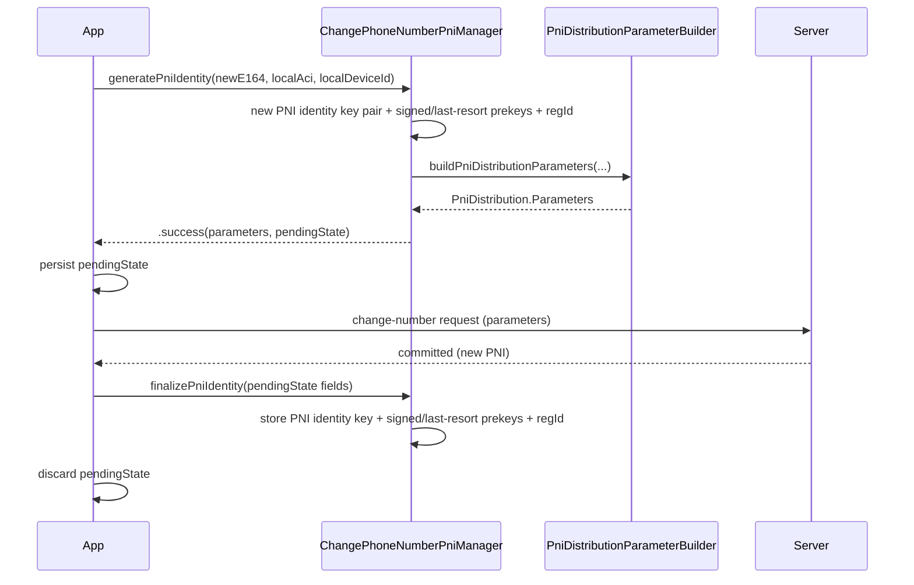

# `SignalServiceKit/ChangePhoneNumber/` — Changing the Account's Phone Number

Changing phone number keeps the stable **ACI** but mints a **new PNI identity**
for the new E.164 and distributes it to all of the account's devices. This
directory contains the manager that generates and finalizes that new PNI
identity; the actual distribution payload is built by
`Account/PniDistributionParameterBuilder.swift` (see the Account doc, §6).

- [1. Why change-number is a two-phase operation](#1-why-change-number-is-a-two-phase-operation)
- [2. `ChangePhoneNumberPniManager`](#2-changephonenumberpnimanager)
- [3. `ChangePhoneNumberPni` types](#3-changephonenumberpni-types)
- [4. Implementation details & error paths](#4-implementation-details--error-paths)
- [5. File reference checklist](#5-file-reference-checklist)

---

## 1. Why change-number is a two-phase operation

A change-number request may be **interrupted** (crash, connection loss) *after*
the server has already accepted and committed the new PNI identity but *before*
the client has committed it locally. To stay consistent, the API splits into:

1. **Generate** — produce `(parameters, pendingState)`. Persist `pendingState`,
   then send the change-number request with `parameters`.
2. **Finalize** — once the client has **confirmed** the server committed the new
   identity, call `finalizePniIdentity(pendingState…)` and discard the pending
   state.

If the client restarts holding a `pendingState`, it must check whether that
state matches the server; if so, finalize immediately; if not, discard it. This
is spelled out in the protocol doc comment
(`ChangePhoneNumberPniManager.swift:9-55`). **[High]**

---

## 2. `ChangePhoneNumberPniManager`

`protocol ChangePhoneNumberPniManager` (`ChangePhoneNumberPniManager.swift:11-58`): **[High]**
- `generatePniIdentity(forNewE164:localAci:localDeviceId:) async
  -> ChangePhoneNumberPni.GeneratePniIdentityResult`
- `finalizePniIdentity(identityKey:signedPreKey:lastResortPreKey:registrationId:tx:)`
  — note `signedPreKey`/`lastResortPreKey` are `Result<…, DecodingError>` because
  they're round-tripped through serialization and may fail to decode.

---

## 3. `ChangePhoneNumberPni` types

`enum ChangePhoneNumberPni` namespace (`ChangePhoneNumberPniManager.swift:62-96`): **[High]**
- `PendingState { newE164; pniIdentityKeyPair: ECKeyPair;
  localDevicePniSignedPreKeyRecord; localDevicePniPqLastResortPreKeyRecord;
  localDevicePniRegistrationId }` — everything needed to finalize later.
- `GeneratePniIdentityResult { case success(parameters:
  PniDistribution.Parameters, pendingState: PendingState); case failure }`.

---

## 4. Implementation details & error paths

`ChangePhoneNumberPniManagerImpl` (`ChangePhoneNumberPniManager.swift:100-...`): **[High]**

- **`generatePniIdentity`** (`:140-185`):
  1. `identityManager.generateNewIdentityKeyPair()` — a brand-new PNI identity.
  2. Generate the local device's signed prekey
     (`SignedPreKeyStoreImpl.generateSignedPreKey(signedBy: pniPrivateKey)`) and
     PQ last-resort kyber prekey
     (`generateLastResortKyberPreKeyForChangeNumber`), plus a new registration
     ID.
  3. Build a `PendingState`.
  4. `pniDistributionParameterBuilder.buildPniDistributionParameters(…)` to make
     the per-device payload.
  5. Returns `.success(parameters, pendingState)`, or **`.failure`** if the
     builder throws (no automatic retry recommended). **[High]**
- **`finalizePniIdentity`** (`:189-...`):
  1. `identityManager.setIdentityKeyPair(identityKey, for: .pni, tx:)`.
  2. Store the last-resort kyber prekey and signed prekey; if either **fails to
     decode**, logs a warning and sets `refreshSignedPreKey = true` (we expect to
     be deregistered, but if not, we'll recover by uploading new prekeys).
  3. `tsAccountManager.setRegistrationId(registrationId, for: .pni, tx:)`.
  4. On sync completion, schedule `preKeyManager.refreshOneTimePreKeys(for:
     .pni, alsoRefreshSignedPreKey: refreshSignedPreKey)`. **[High]**

Collaborators: `OWSIdentityManager`, `PniDistributionParamaterBuilder`,
`SignedPreKeyStoreImpl`, `KyberPreKeyStoreImpl`, `PreKeyManager`,
`RegistrationIdGenerator`, `TSAccountManager` (`:112-138`). **[High]**

`ChangePhoneNumberPniManagerMock.swift` returns a mocked success with randomly
generated keys and a 14-bit registration ID; `finalizePniIdentity` is a no-op
(`ChangePhoneNumberPniManagerMock.swift:9-62`). **[High]**

> **Relationship to the Account subsystem:** after a successful change-number,
> `RegistrationStateChangeManager.didUpdateLocalPhoneNumber(...)` updates the
> local number without changing registration state (see Account doc §4), and the
> new PNI identity is distributed to linked devices via the
> `PniDistributionSyncMessage` built during `generatePniIdentity`. **[Medium]**

---

## 5. File reference checklist

- `ChangePhoneNumberPniManager.swift` — §2, §3, §4
- `ChangePhoneNumberPniManagerMock.swift` — §4
