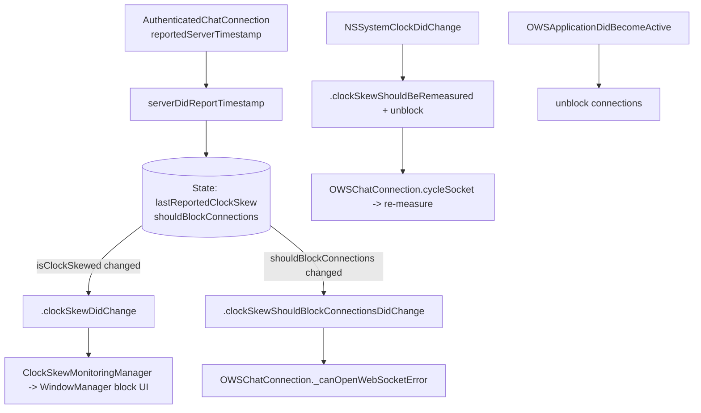

# Clock Skew

Covers `SignalServiceKit/ClockSkew/`:

- `ClockSkewManager.swift`

This folder is small: it tracks whether the **device's clock is too far skewed from the server's
clock**, and whether that skew should **block chat connections**. A skewed clock breaks
authenticated requests (timestamps are used in auth), so when the server reports its own time over
the authenticated chat connection the manager compares it to the local clock and, if the difference
exceeds a threshold, raises flags that the networking stack and the main-app UI observe.

The manager itself owns no connection logic and performs no network I/O. It is a small observable
state machine fed by a single input — `serverDidReportTimestamp(_:)` — and by two system
notifications (`NSSystemClockDidChange`, `OWSApplicationDidBecomeActive`). It communicates outward
purely via `NotificationCenter`.

---

## `ClockSkewManager` — `ClockSkewManager.swift:35`

Confidence: HIGH (read in full). The subsystem's sole type (plus a trivial error and three
notification names). A `final class` constructed with a `DateProvider` and a `NotificationCenter`
(`:67`), wired once in `AppSetup` (`SignalServiceKit/Environment/AppSetup.swift:536`, using
`.default`) and exposed app-wide as `DependenciesBridge.shared.clockSkewManager`
(`SignalServiceKit/Environment/DependenciesBridge.swift:97`).

### Threshold & "skewed" definition
- `maximumAllowedClockSkew: TimeInterval = .day` (`:39`). The clock is "skewed" when the absolute
  difference from the server exceeds **one day**.
- `isSkewed(_:)` (`:127`) — static helper: `nil` skew (unknown) is **not** skewed; otherwise
  `abs(skew) > maximumAllowedClockSkew`.

### State — `struct State` (`:45`)
Confidence: HIGH.
- `lastReportedClockSkew: TimeInterval?` — most recent device-minus-server delta (positive when the
  device is ahead), `nil` until the server first reports.
- `shouldBlockConnections: Bool` — whether `ChatConnection`s should be blocked.

Held in `AtomicValue(State(), lock: .init())` (`:53`), so reads/writes are lock-guarded.

### Public surface
| Member | Line | Behavior |
|--------|------|----------|
| `isClockSkewed` | 58 | Derived from `lastReportedClockSkew` via `isSkewed`. Read by the NSE and `ClockSkewMonitoringManager`. |
| `shouldBlockConnections` | 63 | Reads `State.shouldBlockConnections`. Read by `OWSChatConnection`. |
| `serverDidReportTimestamp(_:)` | 90 | The single input. Converts `serverTimestampMs` to a `Date`, computes `skew = now - serverDate`, stores it, and sets `shouldBlockConnections = isSkewed(skew)`. |

### Reacting to clock / lifecycle changes
Confidence: HIGH.
- `systemClockDidChange()` (`:101`, observes `.NSSystemClockDidChange`): the last-measured skew was
  against the *old* clock and is no longer trustworthy, so it **posts
  `.clockSkewShouldBeRemeasured` first, then unblocks**. The ordering is deliberate (`:104-109`
  comment): posting remeasure before unblocking makes connections cycle while still blocked;
  unblocking first would let them open only to be immediately torn down by the cycle.
- `applicationDidBecomeActive()` (`:113`, observes `.OWSApplicationDidBecomeActive`): does **not**
  force a re-measure, but unblocks so a connection that was blocked at suspend can reconnect and
  organically re-measure (the clock may have changed while suspended).
- `unblockConnections()` (`:121`) — sets `shouldBlockConnections = false`.

### Change detection & notification posting — `updateState(_:)` (`:134`)
Confidence: HIGH. Every mutation funnels through here. Under the atomic `update`, it snapshots the
old state, applies the mutation, and computes two "changed" booleans by comparing the *derived*
`isSkewed(...)` and the raw `shouldBlockConnections` before/after. If neither derived value changed,
it returns without posting. Otherwise it logs and posts:
- `.clockSkewDidChange` when `isClockSkewed` flipped.
- `.clockSkewShouldBlockConnectionsDidChange` when the block flag flipped.

Note the distinction: `lastReportedClockSkew` can change (e.g. 2h → 3h) without crossing the
one-day threshold, in which case **no** `.clockSkewDidChange` is posted because the *derived*
`isSkewed` value is unchanged.

`postNotification(_:)` (`:155`) logs and dispatches via `notificationCenter.postOnMainThread(...)`,
so all three notifications are delivered on the main thread (as the doc comments at `:9-19` state).

---

## Supporting declarations

### `ClockSkewError` — `ClockSkewManager.swift:26`
Confidence: HIGH. An empty `struct ClockSkewError: Error {}` representing "the client's clock is too
far skewed from the server's." Not thrown by the manager itself; it is produced by the networking
layer (below) and special-cased by UI.

### Notification names — `extension Notification.Name` (`:8`)
Confidence: HIGH.
- `.clockSkewDidChange` (`:11`) — `isClockSkewed` changed.
- `.clockSkewShouldBlockConnectionsDidChange` (`:15`) — `shouldBlockConnections` changed.
- `.clockSkewShouldBeRemeasured` (`:19`) — the device clock changed; the last measured skew is stale.

---

## Interactions with the rest of SignalServiceKit and the app

Confidence: HIGH (all sites read).

### Feeding the measurement (input)
`AuthenticatedChatConnection` reports the server's timestamp back to the manager via the delegate
callback `chatConnection(_:reportedServerTimestamp:)` →
`clockSkewManager.serverDidReportTimestamp(timestamp)`
(`SignalServiceKit/Network/OWSChatConnection.swift:1223`). This is the only producer of skew
measurements, and it only arrives on the **authenticated** connection — hence re-measuring requires
reopening that connection. See also
[Network / chat-websocket](../Network/02-chat-websocket.md) ("Server timestamp: forwarded to
`ClockSkewManager.serverDidReportTimestamp`").

### Blocking connections (output → networking)
`OWSChatConnection` holds the manager (`:59`), observes
`.clockSkewShouldBlockConnectionsDidChange` once the app is ready
(`:116`, handler `:398` → `updateCanOpenWebSocket()`), and consults
`clockSkewManager.shouldBlockConnections` in `_canOpenWebSocketError()` (`:250`): if the manager
says block, the connection's fatal "can't open" error becomes `ClockSkewError()` (`:251`), which
prevents the socket from opening and fails in-flight `makeRequest` calls.

`OWSChatConnection` also observes `.clockSkewShouldBeRemeasured` (`:964`, handler `:985`): because
skew is measured by opening an **auth** connection, it `cycleSocket()`s to force a reconnect so a
fresh server timestamp can be measured.

The manager is threaded through the connection stack via `ChatConnectionManager`
(`SignalServiceKit/Network/ChatConnectionManager.swift:114`).

### Blocking the main-app UI (output → app)
`ClockSkewMonitoringManager` (`Signal/ClockSkew/ClockSkewMonitoringManager.swift:9`) is the app-side
consumer: on `start()` it observes `.clockSkewDidChange` (`:27`) and sets
`windowManager.isClockSkewBlockActive = clockSkewManager.isClockSkewed` (`:45`,
`Signal/AppLaunch/WindowManager.swift:204`/`:272`), presenting a blocking window while skewed. Its
comment notes a user who corrects their clock gets unblocked without relaunching (because the skew
is re-measured on clock change / activation). It is wired in `AppEnvironment`
(`Signal/AppLaunch/AppEnvironment.swift:143`; see also `docs/Signal/app-environment.md:106`). The
blocking window's content is `ClockSkewAppBlockingViewController`
(`SignalUI/AppBlocking/ClockSkewAppBlockingViewController.swift:1`), presented by
`WindowManager.ensureClockSkewBlockWindowShown` (`Signal/AppLaunch/WindowManager.swift:365`,
instantiated at `:101`).

### NSE and Share Extension
- **NSE** (`SignalNSE/NotificationService.swift:248`): reads `clockSkewManager.isClockSkewed`; if
  skewed it couldn't fetch messages, so it posts a user-facing clock-skew warning notification
  (deduplicated by `hasShownClockSkewWarning`). See `docs/SignalServiceKit/Notifications/nse.md:195`.
- **Share Extension** (`SignalShareExtension/SharingThreadPickerViewController.swift:457`):
  special-cases `ClockSkewError` with a dismiss-only action sheet explaining the device's date/time
  is incorrect.

---

## Important data flows / state

Confidence: HIGH.
- **Steady state:** auth connection opens → server reports timestamp → `serverDidReportTimestamp`
  computes skew. If `|skew| > 1 day`, `shouldBlockConnections` becomes true and (if the threshold
  crossing is new) `.clockSkewShouldBlockConnectionsDidChange` + `.clockSkewDidChange` post; the
  socket then can't reopen (`ClockSkewError`) and the app window is blocked.
- **User corrects the clock:** `NSSystemClockDidChange` → post `.clockSkewShouldBeRemeasured`
  (connection cycles) then unblock → the reconnected auth connection reports a fresh timestamp →
  skew re-evaluated → if now within tolerance, flags clear and UI/connections unblock.
- **Resuming from background:** `OWSApplicationDidBecomeActive` → unblock (no forced re-measure) so a
  previously-blocked connection can reconnect and re-measure organically.
- **Threshold hysteresis of notifications:** `.clockSkewDidChange` is driven by the *derived*
  `isSkewed` boolean, not the raw delta — sub-threshold changes don't notify the UI, but
  `shouldBlockConnections` is recomputed on every report.

---

## Notable concurrency considerations

Confidence: HIGH.
- All state lives in a single `AtomicValue<State>` guarded by a lock (`:53`); reads
  (`isClockSkewed`, `shouldBlockConnections`) and the read-modify-write in `updateState` are
  serialized, so `serverDidReportTimestamp` (invoked from the connection's callback) and the
  main-thread system/lifecycle notification selectors can race safely.
- The old-vs-new "changed" computation happens **inside** the atomic `update` closure (`:135-142`),
  so change detection is consistent even under concurrent mutation.
- All three outgoing notifications are posted via `postOnMainThread` (`:161`), giving observers
  (`OWSChatConnection`, `ClockSkewMonitoringManager`) a main-thread guarantee — both assert
  `AssertIsOnMainThread()` in their handlers.
- The ordering in `systemClockDidChange` (post-remeasure-then-unblock, `:104-109`) is an intentional
  concurrency/ordering guard to avoid a connection briefly opening and being immediately cycled.

---

> Tests live in `SignalServiceKit/tests/ClockSkew/ClockSkewManagerTest.swift` (not part of this
> source folder).
