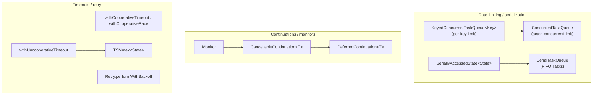

# SignalServiceKit — `Concurrency/` module

This documentation set covers the **concurrency primitives** in
[`SignalServiceKit/Concurrency/`](../../../SignalServiceKit/Concurrency/). The
module is a small, self-contained toolbox of low-level building blocks for
Swift structured concurrency: task-rate limiters, serial executors, timeout
races, cancellation-aware continuations, condition monitors, retry/backoff
helpers, a hand-rolled `os_unfair_lock` wrapper, thread-local storage, and a
pair of main-thread dispatch helpers (with a small Objective-C shim). These
types are consumed throughout `SignalServiceKit` wherever bounded concurrency,
ordering guarantees, or cooperative cancellation are needed.

The directory contains **18 files total: 16 Swift files + 1 Objective-C `.m`
(`Threading.m`) + 1 header `.h` (`Threading.h`)**. Each of those files is
enumerated in the [file index](#file-index) below (the 16 Swift rows plus the
single `Threading.h`/`Threading.m` row). Of the 16 Swift files, three are test
targets — `CancellableContinuationTest.swift`, `CooperativeTimeoutTest.swift`,
and `UncooperativeTimeoutTest.swift` — leaving 13 Swift files of production
code. **[High]** (`SignalServiceKit/Concurrency/CancellableContinuationTest.swift:10`,
`SignalServiceKit/Concurrency/CooperativeTimeoutTest.swift:10`,
`SignalServiceKit/Concurrency/UncooperativeTimeoutTest.swift:10`)

> **Confidence labels.** Each claim is tagged with a confidence level:
> - **[High]** — directly read from source; behavior is explicit in the code.
> - **[Medium]** — inferred from code with reasonable certainty, but depends on
>   collaborators defined outside `SignalServiceKit/Concurrency/`.
> - **[Low]** — inferred from naming/comments; not fully verified in-tree.
>
> Where the source gives no evidence for a design question, the text says
> **"intent undetermined — no evidence in source"** rather than guessing.
>
> **Citations** are given as `path:line` relative to the repository root,
> pointing at the definition being described. Line numbers reflect the state of
> the tree at authoring time and may drift as code changes; use the cited symbol
> name to re-locate code if lines have moved. Diagrams are
> [Mermaid](https://mermaid.js.org/).

## What this module is (and is not)

This folder is a **leaf utility layer**. It defines generic primitives and does
not know about Signal's domain model (messages, jobs, accounts). Higher layers
build on top of it:

- The durable job queue ([Jobs/](../Jobs/README.md)) and the networking stack
  ([Network/](../Network/README.md)) both need bounded concurrency, serialized
  execution, and cooperative timeouts; those are exactly the primitives defined
  here. **[Medium]** (cross-module usage is inferred from the generic,
  domain-agnostic shape of these types, e.g.
  `SignalServiceKit/Concurrency/ConcurrentTaskQueue.swift:35`)

Several types reference symbols defined **outside** this directory — most
notably `AtomicValue` (used by `DeferredContinuation`, `Monitor`, and
`SerialTaskQueue`), `OWSOperation.retryIntervalForExponentialBackoff`,
`ExponentialBackoff`, `owsFail`/`owsFailDebug`, and
`TimeInterval.clampedNanoseconds`. Claims about those collaborators are labeled
**[Medium]** or **[Low]** accordingly.

## File index

| File | Primary symbol(s) | Responsibility |
| --- | --- | --- |
| `ConcurrentTaskQueue.swift` | `ConcurrentTaskQueue` (`:35`) | Task-based replacement for `OperationQueue.maxConcurrentOperationCount`; caps concurrently-running blocks at `concurrentLimit`. **[High]** |
| `KeyedConcurrentTaskQueue.swift` | `KeyedConcurrentTaskQueue<KeyType>` (`:15`) | A `[Key: ConcurrentTaskQueue]` that prunes empty queues; limits concurrency per key. **[High]** |
| `SerialTaskQueue.swift` | `SerialTaskQueue` (`:14`) | Executes `Sendable` async closures serially in enqueue order; each closure wrapped in a `Task`. **[High]** |
| `SeriallyAccessedState.swift` | `SeriallyAccessedState<State>` (`:9`) | Serializes async access to mutable state via a `SerialTaskQueue`. **[High]** |
| `CancellableContinuation.swift` | `CancellableContinuation<T>` (`:13`) | A continuation that resumes immediately on cancellation. **[High]** |
| `DeferredContinuation.swift` | `DeferredContinuation<T>` (`:9`) | Stores a `Result` even before a continuation exists; resume/wait in either order. **[High]** |
| `Monitor.swift` | `Monitor` (`:9`) | Builds "wait until condition is satisfied" logic over `AtomicValue`/`DispatchQueue`-backed state. **[High]** |
| `CooperativeTimeout.swift` | `withCooperativeTimeout` (`:21`), `withCooperativeRace` (`:60`) | Runs an operation in a Task canceled after `seconds`; cooperative race over multiple operations. **[High]** |
| `UncooperativeTimeout.swift` | `withUncooperativeTimeout` (`:27`) | Timeout for legacy code that ignores cancellation; migratory bridge toward `withCooperativeTimeout`. **[High]** |
| `Retry.swift` | `Retry` (`:6`) | `performRepeatedly` and `performWithBackoff` retry helpers with exponential backoff. **[High]** |
| `TSMutex.swift` | `TSMutex<State>` (`:21`), `UnfairLock` (`:9`) | `os_unfair_lock` wrapper with a stable address; `withLock`/`lock`/`unlock`. **[High]** |
| `ThreadBacked.swift` | `ThreadBacked<Value>` (`:10`) | `@propertyWrapper` backed by `Thread.current.threadDictionary` (thread-local storage). **[High]** |
| `Threading.swift` | `DispatchMainThreadSafe` (`:9`), `DispatchSyncMainThreadSafe` (`:20`) | Main-thread dispatch helpers that run inline if already on the main thread. **[High]** |
| `Threading.h` / `Threading.m` | `DispatchQueueIsCurrentQueue`, `_CurrentStackUsage` | Objective-C shim: optimistic current-queue check and promise-only stack-usage probe. **[High]** |
| `CancellableContinuationTest.swift` | `CancellableContinuationTest` (`:10`) | XCTest coverage for `CancellableContinuation`. **[High]** |
| `CooperativeTimeoutTest.swift` | `CooperativeTimeoutTest` (`:10`) | XCTest coverage for `withCooperativeTimeout`. **[High]** |
| `UncooperativeTimeoutTest.swift` | `UncooperativeTimeoutTest` (`:10`) | Swift Testing coverage for `withUncooperativeTimeout`. **[High]** |

The three test files account for exactly the three Swift test targets noted in
the intro. **[High]**
(`SignalServiceKit/Concurrency/CancellableContinuationTest.swift:10`,
`SignalServiceKit/Concurrency/CooperativeTimeoutTest.swift:10`,
`SignalServiceKit/Concurrency/UncooperativeTimeoutTest.swift:10`)

## How the pieces relate

### Rate limiting and serialization

`ConcurrentTaskQueue` is a `public final actor` that caps the number of
simultaneously-running blocks at a `concurrentLimit` passed at init. When the
limit is reached, callers suspend on a `CheckedContinuation` stored in
`pendingContinuations`; a `defer` block releases the slot and resumes the next
waiter. It offers three entry points: `runWithoutTaskCancellationHandler`
(ignores cancellation while waiting), `runWithThrowingTask`, and `run` (both
throw `CancellationError` immediately — i.e. out of order — if canceled while
waiting). **[High]**
(`SignalServiceKit/Concurrency/ConcurrentTaskQueue.swift:35`,
`SignalServiceKit/Concurrency/ConcurrentTaskQueue.swift:49`,
`SignalServiceKit/Concurrency/ConcurrentTaskQueue.swift:74`,
`SignalServiceKit/Concurrency/ConcurrentTaskQueue.swift:79`)

The file's own doc comment contrasts a `concurrentLimit: 1` `ConcurrentTaskQueue`
("CTQ1") with a `SerialTaskQueue` ("STQ"): a CTQ1 reuses the current Task and
preserves the "chain of cancellation", whereas an STQ wraps each block in a
fresh Task (breaking cancellation chaining) but can bridge synchronous and
asynchronous contexts. **[High]**
(`SignalServiceKit/Concurrency/ConcurrentTaskQueue.swift:9-32`)

`KeyedConcurrentTaskQueue<KeyType: Hashable>` is a `public actor` holding a
`[KeyType: ReferenceCounted<ConcurrentTaskQueue>]`. It applies
`concurrentLimitPerKey` to each key and removes a key's queue once its reference
count returns to zero (via the private `ReferenceCounted` struct's
`increment()`/`decrement()`). Its three run methods forward to the matching
`ConcurrentTaskQueue` methods. **[High]**
(`SignalServiceKit/Concurrency/KeyedConcurrentTaskQueue.swift:15`,
`SignalServiceKit/Concurrency/KeyedConcurrentTaskQueue.swift:28`,
`SignalServiceKit/Concurrency/KeyedConcurrentTaskQueue.swift:35`,
`SignalServiceKit/Concurrency/KeyedConcurrentTaskQueue.swift:42`)

`SerialTaskQueue` is a `public final class` keyed on an
`AtomicValue<[AnyTask]>`. Each `enqueue` wraps the operation in a `Task` that
first awaits the previous task, checks for cancellation, runs the operation,
then removes itself from the queue. `enqueueCancellingPrevious` cancels all
pending tasks first; `cancelAll()` cancels in reverse order to avoid a race
where a later task starts before an earlier one is canceled, and `deinit`
cancels everything. **[High]**
(`SignalServiceKit/Concurrency/SerialTaskQueue.swift:14`,
`SignalServiceKit/Concurrency/SerialTaskQueue.swift:29`,
`SignalServiceKit/Concurrency/SerialTaskQueue.swift:47`,
`SignalServiceKit/Concurrency/SerialTaskQueue.swift:56`) The `AtomicValue` type
it relies on is defined outside this directory. **[Medium]**

`SeriallyAccessedState<State>` wraps arbitrary mutable `State` behind a private
`SerialTaskQueue`, exposing `enqueueUpdate` so callers can perform async work
while holding exclusive access to the state. **[High]**
(`SignalServiceKit/Concurrency/SeriallyAccessedState.swift:9`,
`SignalServiceKit/Concurrency/SeriallyAccessedState.swift:18`)

### Continuations and monitors

`CancellableContinuation<T>` is a `Sendable` struct that delegates to a
`DeferredContinuation<T>`. `wait()` installs a `withTaskCancellationHandler`
whose `onCancel` resumes the underlying continuation with a `CancellationError`;
`resume(with:)` may be called multiple times harmlessly. **[High]**
(`SignalServiceKit/Concurrency/CancellableContinuation.swift:13`,
`SignalServiceKit/Concurrency/CancellableContinuation.swift:27`,
`SignalServiceKit/Concurrency/CancellableContinuation.swift:32`)

`DeferredContinuation<T>` is the lower-level primitive: it stores a `Result`
*before* a continuation exists, using an `AtomicValue<State>` state machine
(`initial` → `waiting`/`completed` → `consumed`). This lets `resume` and `wait`
be called in either order; calling `wait()` more than once resumes with an
`OWSAssertionError`. **[High]**
(`SignalServiceKit/Concurrency/DeferredContinuation.swift:9`,
`SignalServiceKit/Concurrency/DeferredContinuation.swift:26`,
`SignalServiceKit/Concurrency/DeferredContinuation.swift:46`) `AtomicValue` and
`OWSAssertionError` are defined outside this directory. **[Medium]**

`Monitor` is a (non-`public`, internal) `enum` of static helpers for
"wait until a condition holds" logic. A `Monitor.Condition<State>` pairs an
`isSatisfied` predicate with a `WritableKeyPath` to a `[NSObject: Continuation]`
waiter dictionary. `waitForCondition` either returns immediately (if satisfied)
or parks a `CancellableContinuation` in the waiter dictionary; `updateAndNotify`
/ `notifyOnQueue` mutate state and resume any waiters whose condition is now
satisfied. Two backing stores are supported: `AtomicValue<State>` and an
`AnyObject` state updated on a `DispatchQueue`. **[High]**
(`SignalServiceKit/Concurrency/Monitor.swift:9`,
`SignalServiceKit/Concurrency/Monitor.swift:31-67`,
`SignalServiceKit/Concurrency/Monitor.swift:102-143`)

### Timeouts and retry

`withCooperativeTimeout(seconds:operation:)` runs `operation` and a `Task.sleep`
timer as a cooperative race via the private `_withCooperativeRace`, which uses a
`withThrowingTaskGroup`, takes the first result, cancels the rest, and still
drains the remaining (cooperative) results. A timeout throws
`CooperativeTimeoutError`. Because the race is cooperative, the method does not
return until `operation` itself returns. `withCooperativeRace` exposes the same
race publicly, requiring at least one operation (the signature separates the
first operation from a variadic tail to make the internal `.first!` safe).
**[High]** (`SignalServiceKit/Concurrency/CooperativeTimeout.swift:8`,
`SignalServiceKit/Concurrency/CooperativeTimeout.swift:21`,
`SignalServiceKit/Concurrency/CooperativeTimeout.swift:60`,
`SignalServiceKit/Concurrency/CooperativeTimeout.swift:71-99`)

`withUncooperativeTimeout(seconds:operation:)` is the escape hatch for legacy
code that does **not** respect cancellation. It runs the operation and the timer
in two detached `Task`s racing to resume a single `CheckedContinuation` guarded
by a `TSMutex<CheckedContinuation<T, any Error>?>`; whichever finishes first
"takes" the continuation. The doc comment flags that this leaves uncleaned-up
Tasks running and should be used only as a migratory bridge; a timeout throws
`UncooperativeTimeoutError`. **[High]**
(`SignalServiceKit/Concurrency/UncooperativeTimeout.swift:8`,
`SignalServiceKit/Concurrency/UncooperativeTimeout.swift:27`,
`SignalServiceKit/Concurrency/UncooperativeTimeout.swift:20-26`)

`Retry` is a `public enum` namespace. `performRepeatedly` loops `block` until
`onError` throws (or the task is canceled, checked each iteration).
`performWithBackoff` builds on it: it stops after `maxAttempts` or when
`isRetryable` returns false, otherwise sleeps for the larger of an exponential
backoff (`OWSOperation.retryIntervalForExponentialBackoff`) and an optional
error-specific `preferredBackoffBlock` (e.g. honoring a `Retry-After` header).
**[High]** (`SignalServiceKit/Concurrency/Retry.swift:6`,
`SignalServiceKit/Concurrency/Retry.swift:11-23`,
`SignalServiceKit/Concurrency/Retry.swift:40-74`) The default `isRetryable`
predicate (`!$0.isFatalError && $0.isRetryable`), `ExponentialBackoff.Defaults`,
`OWSOperation`, and `TimeInterval.clampedNanoseconds` are defined outside this
directory. **[Medium]**

### Locking, thread-local storage, and main-thread dispatch

`TSMutex<State: ~Copyable>` is a `public final class` wrapping `os_unfair_lock`.
It allocates the lock with a stable heap address (required because
`os_unfair_lock` must not be copied in Swift) and deallocates it in `deinit`.
`withLock` acquires the lock around a body that mutates `State`. For the
`State == Void` case there is a convenience `init()` plus a `UnfairLock`
typealias and raw `lock()`/`unlock()`/`assertOwner()`/`assertNotOwner()`
forwarders. The lock is non-reentrant and errors are fatal; the type is marked
`@available(iOS, obsoleted: 16.0, …)` to be replaced by `OSAllocatedUnfairLock`
once the minimum iOS version reaches 16. **[High]**
(`SignalServiceKit/Concurrency/TSMutex.swift:9`,
`SignalServiceKit/Concurrency/TSMutex.swift:21`,
`SignalServiceKit/Concurrency/TSMutex.swift:39`,
`SignalServiceKit/Concurrency/TSMutex.swift:52`,
`SignalServiceKit/Concurrency/TSMutex.swift:61`)

`ThreadBacked<Value>` is a `@propertyWrapper` whose storage is
`Thread.current.threadDictionary[key]`, falling back to `defaultValue` when the
key is absent or the stored value's type is unexpected (logging
`owsFailDebug`). **[High]**
(`SignalServiceKit/Concurrency/ThreadBacked.swift:10`,
`SignalServiceKit/Concurrency/ThreadBacked.swift:22-33`)

`Threading.swift` provides `DispatchMainThreadSafe` and
`DispatchSyncMainThreadSafe`: both run a `@MainActor` block inline via
`MainActor.assumeIsolated` when already on the main thread, otherwise dispatch
to `DispatchQueue.main` (async / sync respectively). **[High]**
(`SignalServiceKit/Concurrency/Threading.swift:9`,
`SignalServiceKit/Concurrency/Threading.swift:20`)

The Objective-C shim (`Threading.h` / `Threading.m`) exposes two C functions:
`DispatchQueueIsCurrentQueue`, an *optimistic* current-queue comparison the
header explicitly warns must never be used to reason about deadlock freedom; and
`_CurrentStackUsage`, which returns the fraction `[0.0, 1.0]` of the current
thread's stack in use (or `NaN` on error) and is documented as "Only for use in
SignalServiceKit's promise implementation. Please do not use." **[High]**
(`SignalServiceKit/Concurrency/Threading.h:12`,
`SignalServiceKit/Concurrency/Threading.h:17`,
`SignalServiceKit/Concurrency/Threading.m:11-20`,
`SignalServiceKit/Concurrency/Threading.m:22-51`)

## Cross-references

- **[Jobs/](../Jobs/README.md)** — the durable job queue needs bounded
  concurrency and serialized execution; the primitives here (`ConcurrentTaskQueue`,
  `SerialTaskQueue`, `Retry`) are the generic layer such runners build on.
  **[Medium]** (consumption inferred from the domain-agnostic shape of these
  types; the Jobs subsystem is documented separately.)
- **[Network/](../Network/README.md)** — the networking stack uses cooperative
  timeouts and backoff/retry when issuing requests; `withCooperativeTimeout` and
  `Retry.performWithBackoff` are the relevant primitives. **[Medium]**
- **`AtomicValue`** (used by `DeferredContinuation`, `Monitor`, `SerialTaskQueue`)
  and the assertion helpers (`owsFail`, `owsFailDebug`, `OWSAssertionError`,
  `OWSCFailDebug`) live elsewhere in `SignalServiceKit`; their behavior is
  outside the scope of this document. **[Low]**
