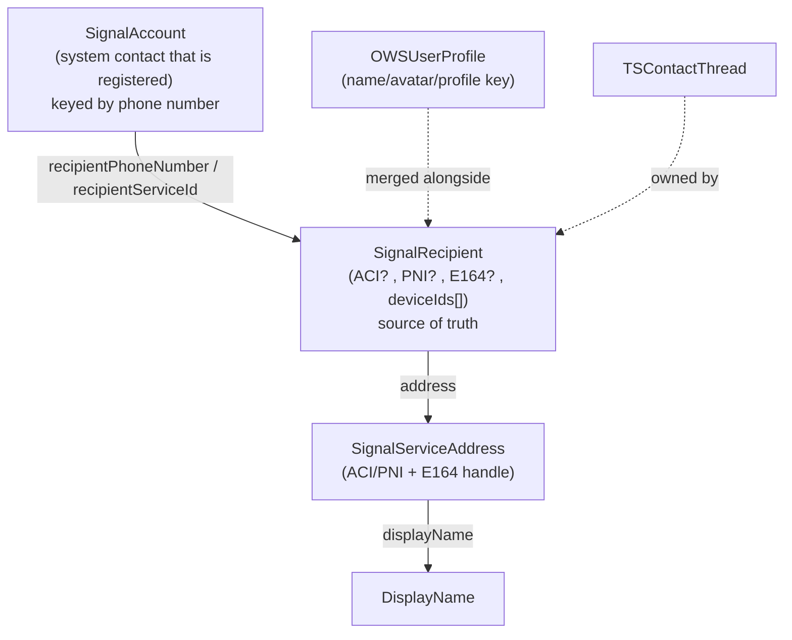
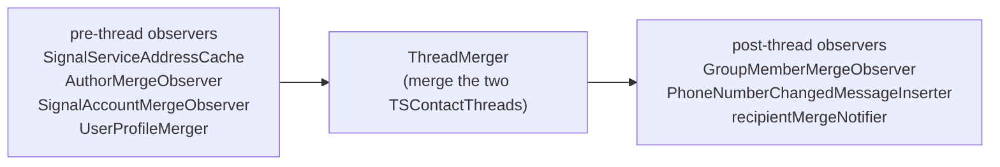
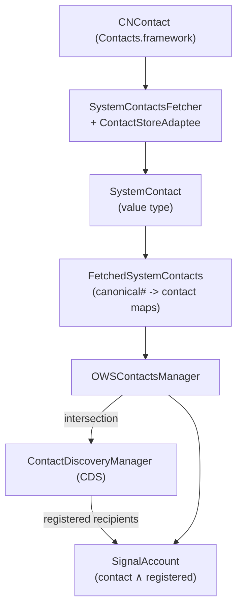

# Signal iOS — Contacts Subsystem

This document reconstructs Signal iOS's **Contacts** subsystem from the
first-party source in `SignalServiceKit/Contacts/`. Despite the directory name,
this is really the subsystem that answers the question *"who is this person, and
what do I call them?"* It owns:

- The **recipient identity model** (`SignalRecipient`) — the local source of
  truth that links an account's ACI, PNI, phone number, and device set.
- The **identifier-merging engine** (`RecipientMerger` + observers) that keeps
  the whole database consistent when a phone number moves between accounts or an
  ACI/PNI/E164 association is learned/broken.
- **System address-book integration** (`SystemContact`, `SystemContactsFetcher`,
  `OWSContactsManager`, `SignalAccount`) — reading `CNContact`s and projecting
  them onto Signal accounts.
- **Contact Discovery (CDS)** — looking up which phone numbers are registered.
- **Name resolution & display** (`DisplayName`, `OWSContactsManager`,
  `NameResolver`, nicknames) — the precedence rules that produce a user-visible
  name for any address.
- **Phone-number utilities** (`E164`, `CanonicalPhoneNumber`, `PhoneNumberUtil`).
- **Contact/configuration sync messages** (`OWSSyncManager`,
  `ContactSyncAttachmentBuilder`, `ContactOutputStream`).

> **Note on directory contents.** The `Contacts/` directory also contains a few
> types that are thematically "threads/config" rather than contacts
> (`TSThread.swift`, `TextAttachment.swift`,
> `DisappearingMessagesConfigurationRecord.swift`,
> `ThreadReplyInfo.swift`/`ThreadReplyInfoStore.swift`,
> `GroupMembershipNameCollisionFinderStore.swift`). They live here for historical
> reasons; this document focuses on the contact/recipient/name machinery and
> mentions the thread types only where the merge logic touches them. **[Medium]**

> **Confidence labels.** Each claim is tagged:
> - **[High]** — directly read from the cited source; behavior is explicit in code.
> - **[Medium]** — inferred from code with reasonable certainty, but depends on
>   collaborators defined outside `SignalServiceKit/Contacts/` (LibSignalClient,
>   Storage Service, the message pipeline, `OWSUserProfile`, `TSAccountManager`,
>   `SignalServiceAddressCache`, the searchable-name indexer).
> - **[Low]** — inferred from naming/comments; not fully verified in-tree.
>
> All file+line citations refer to the state of the tree at the time of writing.
> Line numbers are approximate anchors; use the cited symbol name to locate code
> if lines have drifted.

---

## The central concept: a recipient is defined by its identifiers

A Signal account is referenced by up to three identifiers:

- an **ACI** (Account Identity) — the *stable* identifier; once a
  `SignalRecipient` has an ACI it can never change,
- a **PNI** (Phone-Number Identity) — tied to the phone number,
- an **E164 phone number**.

`SignalRecipient` is the local record that stores *all three* identifiers plus
the account's device IDs; it is "the source of truth" for which identifiers
belong together. An account with at least one device is **registered**; an empty
device set means unregistered. **[High]** — `SignalRecipient/SignalRecipient.swift:16-31`
(doc comment), `:34-72` (fields), `:200-206` (`isRegistered`).



The crucial invariant: identifiers are *singly owned*. A given phone number
belongs to at most one `SignalRecipient` at a time; when it moves, the subsystem
must atomically rewrite every piece of state that referenced it. That rewrite is
the job of `RecipientMerger`. **[High]** — `RecipientMerger.swift` (whole file).

---

## File inventory

| File | Role | Confidence |
| --- | --- | --- |
| `SignalRecipient/SignalRecipient.swift` | The recipient record (GRDB `model_SignalRecipient`): identifiers, device IDs, registration/discoverability status, whitelist status. | [High] |
| `SignalRecipient/SignalRecipientManager.swift` | Mutating device-ID sets, mark registered/unregistered, phone-number visibility gate. | [High] |
| `RecipientDatabaseTable.swift` | All GRDB fetches of `SignalRecipient` (by ACI, PNI, phone number, rowId, uniqueId, contact thread). | [High] |
| `RecipientFetcher.swift` | `fetchOrCreate` by serviceId / phone number / address. | [High] |
| `RecipientMerger.swift` | The identifier-merging engine + observer protocol; ~1.5k LOC. | [High] |
| `UniqueObjectRecipientMerger.swift` | Generic helper to merge "one-per-recipient" objects (threads, profiles). | [High] |
| `AuthorMergeObserver.swift` / `AuthorMergeHelper.swift` | Backfill ACIs onto message/reaction/receipt rows when an E164 association breaks; non-blocking migration bookkeeping. | [High] |
| `SignalAccountMergeObserver.swift` | Keeps `SignalAccount` (phone-number-keyed) consistent across merges. | [High] |
| `UserProfileMerger.swift` | Merges `OWSUserProfile`s and refetches profile after merge. | [High] |
| `PhoneNumberChangedMessageInserter.swift` | Inserts "changed phone number" info messages. | [High] |
| `ThreadMerger.swift` | Merges two `TSContactThread`s (DM config, archive, mute, wallpaper, call records…). | [High] |
| `SignalAccount.swift` | A system contact that is registered on Signal (GRDB `model_SignalAccount`). | [High] |
| `SignalAccountStore.swift` / `SignalAccountFinder.swift` | Fetch `SignalAccount`s by rowId / phone number(s). | [High] |
| `SystemContact.swift` | Value type projecting a `CNContact` (names, phone numbers, emails, avatar). | [High] |
| `SystemContactsFetcher.swift` | `Contacts.framework` adaptee + fetch/observe/authorization machinery. | [High] |
| `FetchedSystemContacts.swift` | Parses system contacts into canonical-phone-number → contact maps. | [High] |
| `Contact.swift` | Legacy `NSSecureCoding` contact (decoded from old `SignalAccount` blobs). | [High] |
| `ContactManager.swift` / `ContactsManagerProtocol.swift` | Protocols the app consumes for names/accounts/avatars. | [High] |
| `OWSContactsManager.swift` | The concrete contacts manager (~1.9k LOC): system-contact caches, name resolution, avatar blur/trust, intersection, authorization. | [High] |
| `DisplayName.swift` | The user-visible-name model + comparison/collation. | [High] |
| `NameResolver.swift` | Transaction-scoped display-name cache. | [High] |
| `ProfileName.swift` | Validated given/family profile name. | [High] |
| `NicknameRecord/*` | Per-recipient user-authored nickname + note (GRDB `NicknameRecord`). | [High] |
| `E164.swift` / `CanonicalPhoneNumber.swift` / `PhoneNumber.swift` / `PhoneNumberUtil.swift` | Phone-number value types, canonicalization, libPhoneNumber wrapper. | [High] |
| `PhoneNumberVisibilityFetcher.swift` | Decides whether a recipient's phone number is "visible". | [High] |
| `Discovery/*` | Contact Discovery Service (CDSv2) client, task queue, rate limiting, persistent token. | [High] |
| `AccountChecker.swift` | Single-serviceId "does this account exist?" check. | [High] |
| `OWSSyncManager.swift` | Sends/receives contact, configuration, and keys **sync messages** to linked devices; ~800 LOC. | [High] |
| `ContactSyncAttachmentBuilder.swift` / `ContactOutputStream.swift` | Serialize all contacts into the `SSKProtoContactDetails` stream for a contacts sync. | [High] |
| `NewAccountDiscovery.swift` | Inserts a silent "X joined Signal" info message. | [High] |
| `UserProfileStore.swift` | `OWSUserProfile` fetch/update protocol (used by `UserProfileMerger`). | [High] |
| `MergePair.swift` | Tiny `(fromValue, intoValue)` pair used by `ThreadMerger`. | [High] |
| `ContactThreadFinder.swift` | Fetch `TSContactThread` by address. | [High] |
| `ContactTest.swift` | **Tests only** — stable-decoding tests for the legacy `Contact` archive. | [High] |

Thread/config types co-located here but out of scope for this doc:
`TSThread.swift`, `TextAttachment.swift`,
`DisappearingMessagesConfigurationRecord.swift`, `ThreadReplyInfo.swift`,
`ThreadReplyInfoStore.swift`, `GroupMembershipNameCollisionFinderStore.swift`.

---

## Identifiers & phone numbers

`SignalServiceAddress` is the *handle* passed around the app: an optional
`ServiceId` (ACI or PNI) plus an optional E164. It can be constructed with a
stale phone number and later normalized against the
`SignalServiceAddressCache` / `SignalRecipient` source of truth via
`withNormalizedPhoneNumber(…)` / `withNormalizedPhoneNumberAndServiceId(…)`.
**[High]** — `SignalServiceAddress.swift:11-90`.

`E164` wraps a structurally-valid `+…` string and is `Codable`/`Hashable`;
`E164ObjC` is the ObjC bridge. **[High]** — `E164.swift:8-98`.

`CanonicalPhoneNumber` encodes the fact that some numbers have *equivalent*
forms (Mexico `+521…`↔`+52…`, Argentina `+54…`↔`+549…`, Benin `+229…`). It
canonicalizes on construction and can expand to `alternatePhoneNumbers()` for
CDS lookups, so a lookup can match whichever variant is registered. **[High]** —
`CanonicalPhoneNumber.swift:16-52`.

`PhoneNumberUtil` is a wrapper around `libPhoneNumber-iOS` (`NBPhoneNumberUtil`),
with an `LRUCache` of parsed numbers and locale-aware parsing/formatting.
**[High]** — `PhoneNumberUtil.swift:10-40`.

`FetchedSystemContacts.parseContacts(…)` turns an ordered list of
`SystemContact`s into two maps — `CanonicalPhoneNumber → SystemContactRef` and
`cnContactId → SystemContact` — explicitly **dropping the local user's own
number** so the app never shows your self-entered address-book name/avatar.
**[High]** — `FetchedSystemContacts.swift:26-70`.

---

## The recipient-merging engine

`RecipientMerger` is the heart of the subsystem. Its public API is a set of
"apply merge from <source>" methods, one per place we learn about an identifier
association. **[High]** — `RecipientMerger.swift:11-72`:

| Method | Trigger |
| --- | --- |
| `applyMergeForLocalAccount` | Registering/linking/changing our own number (the only time we merge our own identifiers). |
| `applyMergeFromStorageService` | Learned an association from Storage Service. |
| `applyMergeFromContactSync` | Learned from a contacts sync message. |
| `applyMergeFromContactDiscovery` | Learned from CDS. |
| `applyMergeFromSealedSender` | Learned from a sealed-sender message (ACI, maybe E164). |
| `applyMergeFromPniSignature` | Learned an ACI↔PNI link from a PNI signature. |
| `splitUnregisteredRecipientIfNeeded` | An ACI went unregistered; may need to split the E164/PNI onto its own recipient. |

### Why primary vs. linked device matters

A **primary device trusts CDS** for E164↔PNI associations and will *not* change
them based on Storage Service; a linked device will accept Storage Service's
value when it has no better local information. This asymmetry is explicit in
`applyMergeFromStorageService`'s `updatedValues` closure. **[High]** —
`RecipientMerger.swift:226-266`.

### Observers run in a fixed order around the thread merge

When a merge actually learns/breaks an association, `RecipientMerger` notifies a
list of `RecipientMergeObserver`s via `willBreakAssociation(…)` (before) and
`didLearnAssociation(…)` (after). The observers are deliberately ordered
**pre-thread-merger → ThreadMerger → post-thread-merger**. **[High]** —
`RecipientMerger.swift:138-200` (`Observers`, `buildObservers`):



- **`SignalServiceAddressCache`** must be first so cached addresses reflect the
  new linkage before anyone else reads them. **[High]** — comment at
  `RecipientMerger.swift:187-189`.
- **`AuthorMergeObserver` / `AuthorMergeHelper`** backfill the author ACI onto
  rows that only had an E164 (`OWSReaction`, interactions, pending read/viewed
  receipts) *before* an association breaks — otherwise those messages would
  wrongly migrate to whoever claims the number next. The helper keeps a
  per-E164 "missing ACI" lookup table and a versioning scheme so the expensive
  table scan runs only when truly necessary; fresh installs effectively never
  run it. **[High]** — `AuthorMergeObserver.swift:16-70`,
  `AuthorMergeHelper.swift:7-55` (doc comment), `:57-170`.
- **`SignalAccountMergeObserver`** reconciles the phone-number-keyed
  `SignalAccount`s, which merge *differently* from everything else because their
  source of truth is the phone number, not the ACI. The extended comment at the
  top walks through the Alice/Bob number-swap scenario. **[High]** —
  `SignalAccountMergeObserver.swift:12-120`.
- **`UserProfileMerger`** collapses multiple `OWSUserProfile`s onto the surviving
  recipient (preferring an existing profile key) and schedules a profile refetch
  on sync completion; for the *local* recipient it instead deletes any profile
  that got orphaned by a self number change. **[High]** —
  `UserProfileMerger.swift:52-110`.
- **`ThreadMerger`** merges two `TSContactThread`s field-by-field with sensible
  rules (archive = AND, marked-unread = OR, mute = max, DM timer = shortest
  enabled, keep non-default playback rate), merges call records, delegates
  SDS-level merging, removes the losing thread, and optionally inserts a
  "threads merged" event. **[High]** — `ThreadMerger.swift:51-110`.
- **`GroupMemberMergeObserver`** (defined outside this directory) fixes group
  membership rows. **[Medium]**
- **`PhoneNumberChangedMessageInserter`** inserts a "changed their phone number"
  info message into visible, non-archived full-member group threads and an
  existing 1:1 thread — but never for your own number change. **[High]** —
  `PhoneNumberChangedMessageInserter.swift:25-80`.

### Generic one-per-recipient merging

Objects that have exactly one instance per recipient (threads, profiles) use
`UniqueRecipientObjectMerger.fetchAndExpunge(…)`: it gathers objects matching the
recipient's ACI/PNI/E164, **expunges stale identifiers** from objects that
actually belong to someone else (e.g. an object with a different ACI but this
recipient's phone number has its phone number cleared), and returns the set to
be merged into one. **[High]** — `UniqueObjectRecipientMerger.swift:8-108`.

---

## System contacts & SignalAccount



`SystemContactsFetcher` wraps `CNContactStore` through a `ContactStoreAdaptee`,
tracks `CNAuthorizationStatus`, observes `CNContactStoreDidChange` and sort-order
changes, and fetches contacts with a minimal set of keys (names + phone numbers;
emails only when sharing). **[High]** — `SystemContactsFetcher.swift:11-120`.

`SystemContact` projects a `CNContact` into plain values and provides a
`computeSystemContactHashValue()` used to **debounce** change notifications
(emails are intentionally excluded from the hash). **[High]** —
`SystemContact.swift:26-70`.

`SignalAccount` is "a system contact who is registered on Signal", keyed in the
database by `recipientPhoneNumber` and carrying the contact's name components,
`cnContactId`, avatar hash, and a `multipleAccountLabelText`. It transparently
decodes a **legacy** representation (an archived `Contact` blob) when present, so
the ObjC-era data keeps working. On insert/update it (re)indexes itself into the
searchable-name index. **[High]** — `SignalAccount.swift:28-220`,
`:234-246` (`anyDidInsert`/`anyDidUpdate`), `Contact.swift:8-45` (legacy coder).

`OWSContactsManager` is the concrete `ContactManager`/`ContactsManagerProtocol`.
It owns `CNContact`/system-contact caches, avatar blur/"low-trust" state, the
`intersectionQueue`, several `KeyValueStore`s, and the authorization enums
(`ContactAuthorizationForEditing`/`…Syncing`/`…Sharing`). Editing/syncing is only
allowed on a **primary device**. It observes profile-whitelist changes and posts
`OWSContactsManagerSignalAccountsDidChange` / `…ContactsDidChange`. **[High]** —
`OWSContactsManager.swift:11-230`.

---

## Name resolution & display

`DisplayName` is an enum capturing *which kind* of name an address resolves to,
in strict precedence order (first available wins): **nickname → system contact
name → profile name → username → phone number → deleted/unknown**. **[High]** —
`ContactsManagerProtocol.swift:16-33` (precedence doc), `DisplayName.swift:8-33`.

`DisplayName` knows how to:
- `resolvedValue(…)` — format the user-visible string (respecting the system
  "prefer nicknames"/short-name settings via `DisplayName.Config`), **[High]** —
  `DisplayName.swift:60-140`;
- `comparableValue(…)` / `ComparableDisplayName` / `CollatableComparableDisplayName`
  — produce sort/collation keys (names sort before phone numbers; ties break on
  a stable identifier). **[High]** — `DisplayName.swift:150-290`.

`OWSContactsManager.displayNames(for:tx:)` is the batch entry point;
`ContactManager`/`ContactsManagerProtocol` extensions provide the convenient
single-address wrappers (`displayName`, `displayNameString`,
`shortDisplayNameString`, `systemContactName(s)`), and `avatarData/avatarImage`
helpers for `CNContact` avatars. **[High]** — `ContactManager.swift:10-80`,
`ContactsManagerProtocol.swift:9-62`.

`NameResolverImpl` is a **transaction-scoped cache** over
`contactsManager.displayName(for:tx:)`; in debug builds it asserts it's only used
with a single transaction object, because names can change between transactions.
**[High]** — `NameResolver.swift:7-78`.

Nicknames (user-authored, highest precedence) live in `NicknameRecord` (GRDB
`NicknameRecord`, keyed by recipient rowId, with given/family/note).
`NicknameManagerImpl` writes them, (re)indexes the searchable name, posts
`…SignalAccountsDidChange`, and optionally records a pending **Storage Service**
update for the recipient's unique id. **[High]** —
`NicknameRecord/NicknameRecord.swift:8-37`, `NicknameRecord/NicknameManager.swift:9-120`.

`ProfileName` validates/truncates given+family components into profile names,
returning typed failures (`givenNameTooLong`/`familyNameTooLong`/`nameEmpty`).
**[High]** — `ProfileName.swift:8-80`.

---

## Phone-number visibility

A recipient's phone number is **hidden** only when there's an ACI (hiding is
driven by the encrypted profile, which only ACIs have) *and* the number isn't
yours, isn't shared by that ACI's profile, and isn't a system contact. The core
predicate is shared between a per-recipient fetcher and a bulk fetcher
(`BulkPhoneNumberVisibilityFetcher`) used to warm `SignalServiceAddressCache`.
**[High]** — `PhoneNumberVisibilityFetcher.swift:19-100`.

`SignalRecipientManagerImpl.fetchRecipientIfPhoneNumberVisible(…)` composes this
with a recipient fetch so callers never see a recipient via a number they
shouldn't. **[High]** — `SignalRecipient/SignalRecipientManager.swift:66-80`.

---

## Contact Discovery (CDS)

CDS answers "which of these phone numbers are registered, and what are their
PNI/ACI?" via LibSignalClient's `cdsiLookup` against the CDSI enclave.

```mermaid
graph TD
    CALLER["caller (intersection / send / find-by-number)"]
    MGR["ContactDiscoveryManagerImpl<br/>(serialize, rate-limit, undiscoverable cache)"]
    TQ["ContactDiscoveryTaskQueueImpl"]
    OP["ContactDiscoveryV2Operation"]
    NET["LibSignalClient.Net.cdsiLookup<br/>(enclave)"]
    MERGE["RecipientMerger.applyMergeFromContactDiscovery"]

    CALLER -->|"lookUp(phoneNumbers, mode)"| MGR
    MGR --> TQ --> OP --> NET
    OP -->|ContactDiscoveryResult{e164,pni,aci?}| TQ
    TQ --> MERGE
```

- **`ContactDiscoveryManagerImpl`** guarantees *at most one stateful request at a
  time* (concurrent requests could corrupt the quota token), enforces per-mode
  rate limits (a lower-priority mode's rate limit never blocks a higher-priority
  one), and caches recently-undiscoverable numbers for 6 hours. Modes, in
  rate-limit priority: `oneOffUserRequest` → `outgoingMessage` →
  `contactIntersection`. The one-off mode is **stateless** (no token), so it
  always consumes quota and is reserved for explicit user actions. **[High]** —
  `Discovery/ContactDiscoveryManager.swift:11-72` (protocol/modes),
  `:140-260` (serialization + rate limiting), `:270-360` (undiscoverable cache).
- **`ContactDiscoveryTaskQueueImpl.perform(…)`** runs the operation then, inside
  `TimeGatedBatch` write transactions, merges each result via
  `applyMergeFromContactDiscovery`, marks the recipient
  **registered + phone-number-discoverable**, and marks requested-but-missing
  numbers **unregistered** (only when they have no ACI/PNI, to avoid misjudging
  users who merely hid their number). **[High]** —
  `Discovery/ContactDiscoveryTask.swift:55-150`.
- **`ContactDiscoveryV2Operation`** builds the request (sending `prevE164s` + a
  token so only *new* numbers consume quota, except in the stateless one-off
  mode), fetches CDSI auth via `RemoteAttestationAuthFetcher`, persists the token
  **before** consuming the response (so an interrupted request can't corrupt the
  token), and maps LibSignal errors to `ContactDiscoveryError`
  (`rateLimit`/`invalidToken`/`retryableError`/`terminalError`). The persistent
  token + previous-E164 list live in GRDB (`CdsPreviousE164`) and a key-value
  store. **[High]** — `Discovery/ContactDiscoveryV2Operation.swift:40-120`
  (connection), `:150-260` (perform/buildRequest/handle), `:300-400`
  (persistent state).
- **`ContactDiscoveryError`** carries retryability and a generic user-facing
  description. **[High]** — `Discovery/ContactDiscoveryError.swift:9-40`.

`AccountChecker` is the single-serviceId analogue: it asks the unauthenticated
`profiles` chat service whether an account exists and marks the `SignalRecipient`
registered/unregistered accordingly (splitting the recipient if an ACI went
unregistered). Rate-limit (4xx) responses are surfaced as a non-retryable
`RateLimitError`. **[High]** — `AccountChecker.swift:48-110`.

---

## Sync messages (OWSSyncManager)

`OWSSyncManager` keeps linked devices consistent by sending/receiving **sync
messages**. On becoming ready it either (primary) syncs all contacts if needed or
(linked) requests the data it's missing. **[High]** — `OWSSyncManager.swift:25-45`.

- **Contact sync.** `syncAllContactsIfNecessary` / `…IfFullSyncRequested` run on
  the main actor, serialized through a `ConcurrentTaskQueue(concurrentLimit: 1)`
  (`contactSyncQueue`). It's triggered by `…SignalAccountsDidChange`,
  registration-state changes, and foregrounding. **[High]** —
  `OWSSyncManager.swift:19` (queue), `:49-80` (triggers/observers).
- The attachment is produced by `ContactSyncAttachmentBuilder.buildAttachmentFile`,
  which writes a synthetic local account plus every `SignalAccount` (and any
  remaining contact-sync threads) through `ContactOutputStream` as chunked
  `SSKProtoContactDetails` protos (E164, ACI binary, legacy name, inbox position,
  avatar JPEG, expire-timer). **[High]** —
  `ContactSyncAttachmentBuilder.swift:11-160`, `ContactOutputStream.swift:17-80`.
- **Configuration sync** (`sendConfigurationSyncMessage`) sends read-receipt,
  sealed-sender-indicator, typing-indicator, and link-preview settings. **[High]**
  — `OWSSyncManager.swift:90-120`.
- The manager also sends **keys** sync and the various
  `sendAllSyncRequestMessagesIfNecessary` request messages used by linked
  devices. **[High]** — `OWSSyncManager.swift:132-210`.

`NewAccountDiscovery.postNotification(…)` inserts a *silent*
`userJoinedSignal` info message (and a silent notification) when a contact newly
appears on Signal, skipping the local user and existing threads. **[High]** —
`NewAccountDiscovery.swift:7-30`.

---

## Interactions with the rest of SignalServiceKit & the app

- **Storage Service.** Many mutations call
  `storageServiceManager.recordPendingUpdates(updatedRecipientUniqueIds:)` to
  propagate recipient/nickname/registration changes to the account's social
  graph; conversely `applyMergeFromStorageService` is how incoming Storage
  Service records feed back into recipients. See
  [../StorageService/README.md](../StorageService/README.md). **[High]** —
  `SignalRecipient/SignalRecipient.swift:230-240`, `NicknameRecord/NicknameManager.swift:70-120`,
  `RecipientMerger.swift:226-266`.
- **Message pipeline.** `RecipientDatabaseTable.fetchAuthorRecipient(incomingMessage:)`
  and `applyMergeFromSealedSender` tie inbound messages to recipients;
  `AuthorMergeObserver` keeps historical author columns correct. **[High]** —
  `RecipientDatabaseTable.swift:70-78`, `RecipientMerger.swift` (sealed sender).
- **Profiles.** `UserProfileMerger`/`UserProfileStore` and
  `PhoneNumberVisibilityFetcher` depend on `OWSUserProfile` (defined elsewhere).
  **[Medium]**
- **Searchable name index.** `SignalAccount`, `SignalRecipient` (via
  `RecipientFetcher`), and nicknames insert/update a `SearchableNameIndexer` so
  conversation search finds them. **[High]** — `SignalAccount.swift:234-246`,
  `RecipientFetcher.swift:48-57`, `NicknameRecord/NicknameManager.swift:75-100`.
- **App layer.** The app consumes `ContactManager`/`ContactsManagerProtocol`
  (names, avatars, system-contact lookups) and reacts to the
  `OWSContactsManager*DidChange` notifications; CDS lookups are initiated for
  intersection, outgoing message resolution, and find-by-number. **[Medium]**

---

## Concurrency & networking considerations

- **CDS single-flight + rate limiting.** `ContactDiscoveryManagerImpl` protects
  its state with an `UnfairLock`, resolves requests via continuations, and
  enforces that only one stateful request runs at once. Rate-limit `Retry-After`
  dates cascade from higher- to lower-priority modes. **[High]** —
  `Discovery/ContactDiscoveryManager.swift:140-240`.
- **Token-before-result ordering.** CDS persists its token and new E164 set
  *before* reading the lookup response, specifically to avoid a corrupted token
  after an interrupted request. **[High]** —
  `Discovery/ContactDiscoveryV2Operation.swift:150-200`.
- **Serialized contact sync.** Contact syncs run one-at-a-time
  (`ConcurrentTaskQueue(concurrentLimit: 1)`) and hop to `@MainActor`. **[High]**
  — `OWSSyncManager.swift:19`, `:49-67`.
- **Merges happen inside write transactions.** All `applyMerge*` methods take a
  `DBWriteTransaction`; batch operations use `TimeGatedBatch` to avoid holding a
  single long write. `tx.addSyncCompletion { … }` is used to defer side effects
  (profile refetch, change notifications) until after the write commits.
  **[High]** — `Discovery/ContactDiscoveryTask.swift:66-150`,
  `UserProfileMerger.swift:27-45`, `NicknameRecord/NicknameManager.swift:39-43`.
- **Atomic caches in OWSContactsManager.** Avatar-download / low-trust bookkeeping
  uses `AtomicSet`/`LRUCache` so it can be touched off the main thread.
  **[High]** — `OWSContactsManager.swift:60-80`.
- **System-contact change observation.** `SystemContactsFetcher` observes
  `CNContactStoreDidChange` and app-active notifications and re-fetches on the
  ready queue; it uses two `CNContactStore`s (large vs. small requests).
  **[High]** — `SystemContactsFetcher.swift:62-120`.

---

## Persistence summary

| Table / store | Owner | Notes |
| --- | --- | --- |
| `model_SignalRecipient` | `RecipientDatabaseTable` | identifiers, device IDs, unregistered timestamp, status (whitelist), discoverability. **[High]** — `SignalRecipient/SignalRecipient.swift:22` |
| `model_SignalAccount` | `SignalAccountFinder`/`Store` | one row per registered system contact, keyed by phone number. **[High]** — `SignalAccount.swift:12` |
| `NicknameRecord` | `NicknameRecordStore` | per-recipient nickname + note. **[High]** — `NicknameRecord/NicknameRecord.swift:9` |
| `CdsPreviousE164` + `CdsMetadata` KV | CDS persistent state | token + previously-fetched E164s. **[High]** — `Discovery/ContactDiscoveryV2Operation.swift` |
| `AuthorMerge*` KV stores | `AuthorMergeHelper` | missing-ACI lookup table + version bookkeeping. **[High]** — `AuthorMergeHelper.swift:48-55` |
| `OWSContactsManagerCollection` + avatar-trust KV stores | `OWSContactsManager` | assorted flags, avatar-blur allow-lists. **[High]** — `OWSContactsManager.swift:68-72` |
