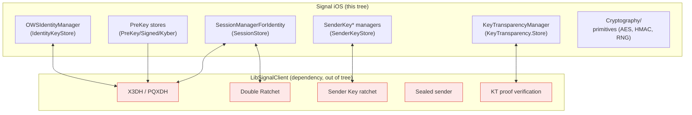
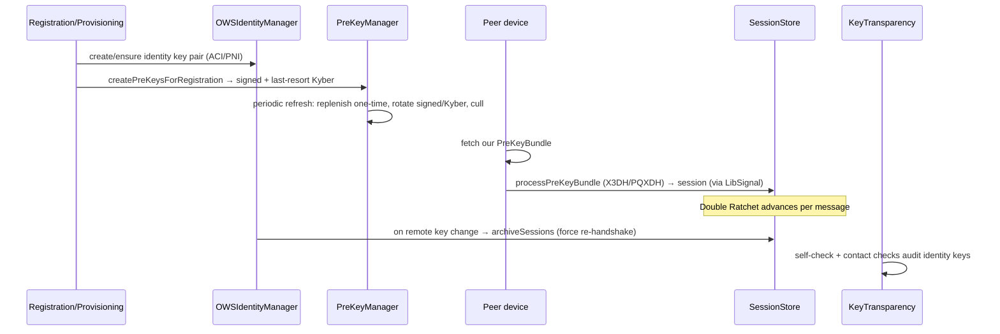

# Signal iOS — End-to-End Encryption (Cryptography) Subsystem

This documentation set reconstructs Signal iOS's **end-to-end encryption (E2EE)
model** from the first-party source in three directories of `SignalServiceKit/`:

- `SignalServiceKit/Cryptography/` — low-level primitives (keys, randomness,
  AES/HMAC wrappers, attachment encryption).
- `SignalServiceKit/Axolotl/` — the Signal Protocol integration: identity keys,
  pre-keys, sessions (X3DH/PQXDH + Double Ratchet), sender keys, and safety-number
  fingerprints.
- `SignalServiceKit/KeyTransparency/` — server-side auditing of identity keys.

It also references `SignalServiceKit/Messages/OWSIdentityManager.swift` and the
`SignalProtocolStore` mocks where they clarify the crypto model. **The message
pipeline itself is deliberately out of scope.**

> **Confidence labels.** Each claim is tagged with a confidence level:
> - **[High]** — directly read from source; behavior is explicit in code.
> - **[Medium]** — inferred from code with reasonable certainty, but depends on
>   collaborators defined outside these directories (notably **LibSignalClient**).
> - **[Low]** — inferred from naming/comments; not fully verified in-tree.
>
> All file+line citations refer to the state of the tree at the time of writing.
> Line numbers are approximate anchors; use the cited symbol name to locate code
> if lines have drifted.

---

## The central fact: this is an integration layer over LibSignalClient

The cryptographic *algorithms* that make Signal end-to-end encrypted —
Curve25519/Ed25519 operations, Kyber (post-quantum) KEM, the **X3DH/PQXDH** key
agreement, the **Double Ratchet**, Sender Key ratchets, sealed-sender envelopes,
and Key Transparency proof verification — all live inside **LibSignalClient**, the
Swift binding over the `libsignal` library. LibSignalClient is a **dependency and
is not present in this tree.** **[High]**

What *is* in this tree, and what these docs cover in depth, is the **integration
layer**: the Swift types that

1. **generate and persist** key material (identity keys, pre-keys),
2. **implement the store protocols** LibSignal calls back into
   (`IdentityKeyStore`, `SessionStore`, `PreKeyStore`, `SignedPreKeyStore`,
   `KyberPreKeyStore`, `SenderKeyStore`, `KeyTransparency.Store`),
3. **make trust decisions** (TOFU, verification, untrusted-key windows), and
4. **orchestrate lifecycle** (rotation, replenishment, culling, auditing).

Wherever a cryptographic transform happens inside LibSignal, the docs say so and
down-rank the confidence of claims about its internal mechanics.

---

## Document map

| Doc | Area covered | Primary source |
| --- | --- | --- |
| [identity-and-keys.md](identity-and-keys.md) | ACI/PNI identity key pairs, remote identity store, TOFU & verification trust, safety-number fingerprints, low-level primitives | `SignalServiceKit/Cryptography/*`, `SignalServiceKit/Axolotl/{Fingerprint,CombinedFingerprints,OWSRecipientIdentity}.swift`, `SignalServiceKit/Messages/OWSIdentityManager.swift` |
| [prekeys.md](prekeys.md) | One-time EC, signed EC, and Kyber/last-resort pre-keys: generation, persistence, upload, rotation, replenishment, culling | `SignalServiceKit/Axolotl/{PreKey*,Kyber*,SignedPreKey*}.swift` |
| [sessions-and-ratchet.md](sessions-and-ratchet.md) | X3DH/PQXDH session establishment, the Double Ratchet integration, session storage & lifecycle | `SignalServiceKit/Axolotl/{SignalProtocolStore,SessionStore,PreKeyBundle}.swift` |
| [sealed-sender.md](sealed-sender.md) | Sender Keys, SKDM distribution tracking, group fan-out, unidentified delivery touch-points | `SignalServiceKit/Axolotl/{SenderKey*,OldSenderKeyStore}.swift` |
| [key-transparency.md](key-transparency.md) | KT checks, self-check health machinery, opt-out, LibSignal KT store adapter | `SignalServiceKit/KeyTransparency/*.swift` |

---

## How the pieces fit together (lifecycle view)

1. **Identity**: each account holds independent ACI and PNI identity key pairs,
   stored by `OWSIdentityManager`; remote peers' keys are recorded on first use
   (TOFU) with verification state. See
   [identity-and-keys.md](identity-and-keys.md).
2. **Pre-keys**: the device publishes signed + Kyber + one-time pre-keys so peers
   can start sessions asynchronously; `PreKeyManagerImpl`/`PreKeyTaskManager`
   handle generation, rotation, and culling. See [prekeys.md](prekeys.md).
3. **Sessions**: a peer processes a pre-key bundle to run X3DH/PQXDH inside
   LibSignal, producing a Double Ratchet session persisted via `SessionStore`. A
   remote identity-key change archives sessions to force re-establishment. See
   [sessions-and-ratchet.md](sessions-and-ratchet.md).
4. **Groups**: Sender Keys batch group sends; the Swift layer tracks which devices
   have received the Sender Key (SKDM) and when to rotate it. See
   [sealed-sender.md](sealed-sender.md).
5. **Auditing**: Key Transparency validates that server-returned identity keys
   match an append-only log, with a self-check gate before checking contacts. See
   [key-transparency.md](key-transparency.md).

---

## Cross-cutting conventions observed in the code

- **ACI/PNI duality**: nearly every store is parameterized by `OWSIdentity`;
  `SignalProtocolStoreManager` holds a full `SignalProtocolStore` per identity
  (`SignalServiceKit/Axolotl/SignalProtocolStore.swift:30-43`). **[High]**
- **Opaque LibSignal blobs**: session records, sender-key records, pre-key
  records, and KT state are stored as serialized `Data` the Swift layer never
  interprets (e.g. `SignalServiceKit/Axolotl/SessionStore.swift:17-18`,
  `SignalServiceKit/Axolotl/PreKeyRecord.swift:35`). **[High]**
- **Constant-time comparisons** for key/MAC equality
  (`SignalServiceKit/Cryptography/Aes256Key.swift:60-66`,
  `SignalServiceKit/Cryptography/Sha256HmacSiv.swift:52-54`). **[High]**
- **Corruption tolerance**: undecodable session/sender-key records are treated as
  absent rather than fatal
  (`SignalServiceKit/Axolotl/SessionStore.swift:109-119`). **[High]**
- **Serial execution** of state-coordinating operations (pre-key task queue,
  per-ACI KT queue)
  (`SignalServiceKit/Axolotl/PreKeyManagerImpl.swift:39`,
  `SignalServiceKit/KeyTransparency/KeyTransparencyManager.swift:26`). **[High]**

See each area document for per-type purpose, validation/business rules, error
paths, edge cases, feature flags, and diagrams.
