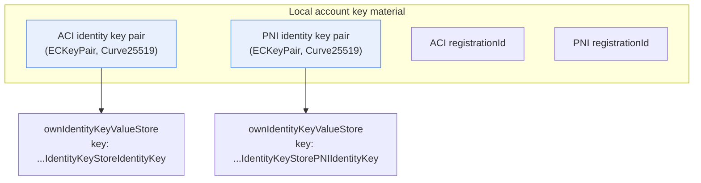
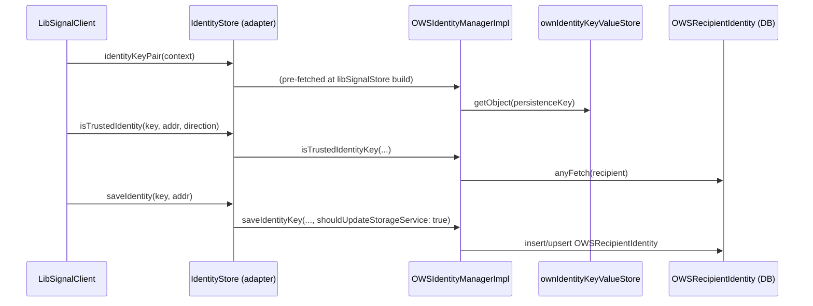
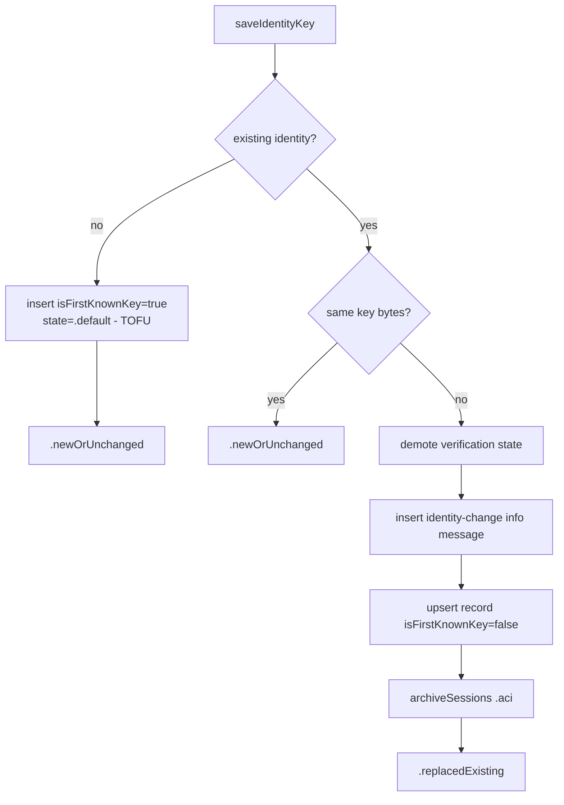
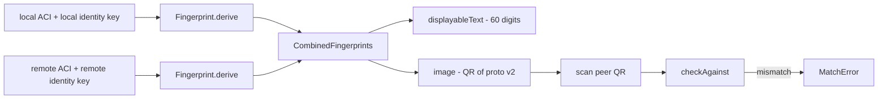

# Identity Keys & Low-Level Cryptographic Primitives

This document covers the **long-term identity key pairs** (ACI and PNI), the
**remote identity key store** (trust-on-first-use and verification), the
**safety-number fingerprint** construction, and the **low-level cryptographic
primitives** that `SignalServiceKit/Cryptography/` exposes to the rest of the
app.

> **Confidence labels.** Each claim is tagged with a confidence level:
> - **[High]** — directly read from source; behavior is explicit in code.
> - **[Medium]** — inferred from code with reasonable certainty, but depends on
>   collaborators defined outside the directories under review.
> - **[Low]** — inferred from naming/comments; not fully verified in-tree.
>
> All file+line citations refer to the state of the tree at the time of writing.
> Line numbers are approximate anchors; use the cited symbol name to locate code
> if lines have drifted.

> **Scope note.** The actual X25519/Ed25519/Kyber math, the Double Ratchet, X3DH
> key agreement, and session-record serialization all live in **LibSignalClient**
> (the Swift binding over `libsignal`), which is a dependency and **not** in this
> tree. The Swift code documented here is the *integration layer*: it generates
> and persists key material, implements the store protocols LibSignal calls back
> into, and makes trust decisions. Where cryptographic transforms happen inside
> LibSignal, that is called out explicitly. **[High]**

---

## 1. Two identities: ACI and PNI

As described in the top-level identity doc, a Signal account has two service
identifiers — **ACI** (stable account identity) and **PNI** (phone-number
identity) — modeled by `OWSIdentity`. The cryptography layer treats these as two
fully independent key domains: **each identity has its own identity key pair and
its own registration ID**, and nearly every store in `Axolotl/` is parameterized
by `OWSIdentity`. **[High]**
(`SignalServiceKit/Axolotl/SignalProtocolStore.swift:14-27`,
`SignalServiceKit/Axolotl/SignalProtocolStore.swift:36-43`)

---

## 2. The identity key pair: `ECKeyPair`

`ECKeyPair` (`SignalServiceKit/Cryptography/ECKeyPair.swift:10-82`) is a thin
`NSObject`/`NSSecureCoding` wrapper around LibSignal's `IdentityKeyPair`. **[High]**

- It stores a single `IdentityKeyPair` and exposes it as both `keyPair` and
  `identityKeyPair` (`ECKeyPair.swift:11-12`). **[High]**
- `generateKeyPair()` delegates entirely to `IdentityKeyPair.generate()` in
  LibSignal (`ECKeyPair.swift:67-69`) — key generation itself is **not**
  implemented in this tree. **[High]**
- `publicKey` returns `identityKeyPair.publicKey.keyBytes` and `privateKey`
  returns `identityKeyPair.privateKey.serialize()` (`ECKeyPair.swift:75-81`).
  **[High]**
- `sign(_:)` produces a signature via `privateKey.generateSignature(message:)`
  (`ECKeyPair.swift:71-73`). **[High]**
- Signing by the identity key is how pre-keys are authenticated; see
  [prekeys.md](prekeys.md). **[High]**

### 2.1 Serialization format for `NSSecureCoding`

`ECKeyPair` encodes two byte blobs under the keys `TSECKeyPairPublicKey` and
`TSECKeyPairPrivateKey` (`ECKeyPair.swift:28-29`, `ECKeyPair.swift:55-62`), and
can be rebuilt from existing key data via
`init(publicKeyData:privateKeyData:)`, which constructs a `PublicKey` and
`PrivateKey` and recombines them (`ECKeyPair.swift:21-26`). Decoding failures are
swallowed and surface as `nil` (`ECKeyPair.swift:31-53`). **[High]**

### 2.2 The DJB public-key wire format (`+0x05` prefix)

`PublicKey.init(keyData:)` (`SignalServiceKit/Cryptography/PublicKey.swift:10-15`)
is an extension on LibSignal's `PublicKey`. The *canonical* public key is **33
bytes**: a one-byte key-type prefix `0x05` (`keyTypeDJB`) followed by **32 bytes**
of Curve25519 public-key material (`keyLengthDJB`)
(`PublicKey.swift:18-21`). The initializer **validates the input is exactly 32
bytes** and then prepends `0x05` before handing to LibSignal; a wrong length
throws `SignalError.invalidKey` (`PublicKey.swift:11-14`). **[High]**

This 33-vs-32 distinction recurs throughout the identity layer:

| Context | Length | Citation |
| --- | --- | --- |
| Canonical identity key (with type byte) | 33 | `SignalServiceKit/Messages/OWSIdentityManager.swift:187` |
| Stored identity key (type byte stripped) | 32 | `SignalServiceKit/Messages/OWSIdentityManager.swift:191` |
| `PublicKey.init(keyData:)` input | 32 | `SignalServiceKit/Cryptography/PublicKey.swift:11` |
| Server pre-key-bundle identity key | 33 | `SignalServiceKit/Axolotl/PreKeyBundle.swift:22-24` |

**[High]**

> The comment at `OWSIdentityManager.swift:190-191` states that cryptographic
> operations do not use the type byte, so for legacy reasons only the 32-byte
> material is persisted for *remote* identities. **[High]**

---

## 3. Local identity key storage: `OWSIdentityManager`

Although `OWSIdentityManager` lives under `Messages/` (and the message pipeline
itself is out of scope), it is the owner of the local identity key pairs and the
remote identity trust store, so it is the hinge between the crypto layer and the
rest of the app. **[High]**

### 3.1 Where local key pairs live

- Local identity key pairs are stored in a single `KeyValueStore` with collection
  `TSStorageManagerIdentityKeyStoreCollection`
<<<<<<< ours
<<<<<<< ours
  (`SignalServiceKit/Messages/OWSIdentityManager.swift:248-249`; field declared at
  `OWSIdentityManager.swift:216`). **[High]**
=======
  (`SignalServiceKit/Messages/OWSIdentityManager.swift:171-173`). **[High]**
>>>>>>> theirs
=======
  (`SignalServiceKit/Messages/OWSIdentityManager.swift:248-249`; field declared at
  `OWSIdentityManager.swift:216`). **[High]**
>>>>>>> theirs
- They are keyed per-identity via `OWSIdentity.persistenceKey`:
  `TSStorageManagerIdentityKeyStoreIdentityKey` (ACI) and
  `TSStorageManagerIdentityKeyStorePNIIdentityKey` (PNI)
  (`OWSIdentityManager.swift:200-207`). **[High]**
- `generateNewIdentityKeyPair()` is just `ECKeyPair.generateKeyPair()`
  (`OWSIdentityManager.swift:324-326`); `ECKeyPair.generateAndPersistNewIdentityKey(for:)`
<<<<<<< ours
<<<<<<< ours
  (`OWSIdentityManager.swift:1084-1090`) is a convenience extension. **[High]**
=======
  (`OWSIdentityManager.swift:1082-1091`) is a convenience extension. **[High]**
>>>>>>> theirs
=======
  (`OWSIdentityManager.swift:1084-1090`) is a convenience extension. **[High]**
>>>>>>> theirs
- `identityKeyPair(for:tx:)` reads the `ECKeyPair` object back out
  (`OWSIdentityManager.swift:328-330`). **[High]**
- `setIdentityKeyPair(_:for:tx:)` has a hard precondition: **you may never clear
  the ACI identity key** (`owsPrecondition(keyPair != nil || identity != .aci)`)
  (`OWSIdentityManager.swift:332-336`). The PNI key *may* be cleared.
  `wipeIdentityKeysFromFailedProvisioning` removes both
  (`OWSIdentityManager.swift:338-341`). **[High]**

### 3.2 `IdentityStore`: the LibSignal `IdentityKeyStore` adapter

`IdentityStore` (`OWSIdentityManager.swift:124-177`) is the object LibSignal calls
into during session establishment and message decryption. It conforms to
`LibSignalClient.IdentityKeyStore` and bridges four callbacks: **[High]**

| LibSignal callback | Behavior | Citation |
| --- | --- | --- |
| `identityKeyPair(context:)` | returns the pre-fetched local `IdentityKeyPair` | `OWSIdentityManager.swift:139-141` |
| `localRegistrationId(context:)` | returns the per-identity registration ID | `OWSIdentityManager.swift:143-145` |
| `saveIdentity(_:for:context:)` | `saveIdentityKey(..., shouldUpdateStorageService: true)` | `OWSIdentityManager.swift:147-158` |
| `isTrustedIdentity(_:for:direction:context:)` | `isTrustedIdentityKey(...)` | `OWSIdentityManager.swift:160-172` |
| `identity(for:context:)` | returns the remote identity key, if known | `OWSIdentityManager.swift:174-176` |

`libSignalStore(for:tx:)` constructs an `IdentityStore`, failing if either the
identity key pair **or** the registration ID is missing
(`OWSIdentityManager.swift:268-285`). **[High]**

---

## 4. Remote identity keys & trust: `OWSRecipientIdentity`

Remote identity keys and the trust decisions attached to them are modeled by
`OWSRecipientIdentity`
(`SignalServiceKit/Axolotl/OWSRecipientIdentity.swift:60-120`), a GRDB-backed
`SDSCodableModel` persisted in table `model_OWSRecipientIdentity`
(`OWSRecipientIdentity.swift:61`). **[High]**

Fields that drive trust (`OWSRecipientIdentity.swift:63-67`): **[High]**

- `identityKey: Data` — the stored (32-byte) remote identity public key.
- `isFirstKnownKey: Bool` — true if this is the **first** key we ever saw for the
  recipient (the basis for trust-on-first-use).
- `createdAt: Date` — when we recorded this key (used for the "new key" grace
  window).
- `verificationState: OWSVerificationState`.

`identityKeyObject` reconstructs an `IdentityKey` by wrapping
`PublicKey(keyData:)`, i.e. it re-adds the `0x05` type byte
(`OWSRecipientIdentity.swift:146-150`). **[High]**

### 4.1 Verification states

The persisted `OWSVerificationState` is projected into a cleaner Swift enum,
`VerificationState` (`OWSRecipientIdentity.swift:23-57`): **[High]**

| `VerificationState` | Underlying `OWSVerificationState` |
| --- | --- |
| `.implicit(isAcknowledged: false)` | `.default` |
| `.implicit(isAcknowledged: true)` | `.defaultAcknowledged` |
| `.verified` | `.verified` |
| `.noLongerVerified` | `.noLongerVerified` |

`wasIdentityVerified` is true only for `.verified`/`.noLongerVerified`
(`OWSRecipientIdentity.swift:134-141`). **[High]**

### 4.2 Trust-on-first-use (TOFU) and key-change handling

The logic lives in `_saveIdentityKey`
(`SignalServiceKit/Messages/OWSIdentityManager.swift:386-441`). It asserts the
incoming key is the stored (32-byte) length
(`OWSIdentityManager.swift:392`). **[High]**

**First use** (no existing `OWSRecipientIdentity`): a record is inserted with
`isFirstKnownKey: true` and `verificationState: .default`; a state-change
notification fires; and the result is `.newOrUnchanged`
(`OWSIdentityManager.swift:396-414`). This is TOFU. **[High]**

**Same key**: no-op, returns `.newOrUnchanged` (`OWSIdentityManager.swift:416-418`).
**[High]**

**Changed key**: the new verification state is computed by *demoting* the old
one (`OWSIdentityManager.swift:420-427`): **[High]**

- `.implicit(_)` → `.implicit(isAcknowledged: false)` (re-arms the "new key"
  warning).
- `.verified` / `.noLongerVerified` → `.noLongerVerified`.

Then it (1) inserts an identity-change info message, (2) upserts the record with
`isFirstKnownKey: false`, and critically (3) **archives all ACI sessions** for the
recipient so the next message re-establishes a session, returning
`.replacedExisting`
(`OWSIdentityManager.swift:428-440`). **[High]** Session archival here is what
links a key change to a forced new X3DH handshake — see
[sessions-and-ratchet.md](sessions-and-ratchet.md).

### 4.3 Trust gates for sending/receiving

Two entry points decide trust: **[High]**

- `isIdentityKeyTrustedForSending` (`OWSIdentityManager.swift:523-540`): for the
  local address, defers to `isTrustedLocalKey`; otherwise `canSend`.
- `isTrustedIdentityKey` (`OWSIdentityManager.swift:542-571`), called by LibSignal
  via `IdentityStore.isTrustedIdentity`:
  - For the **local ACI**, compares against the local public key
    (`isTrustedLocalKey`, `OWSIdentityManager.swift:573-580`). **[High]**
  - For **incoming** messages, **always trusts** (returns `true`) — we accept and
    record whatever key arrives (`OWSIdentityManager.swift:555-556`). **[High]**
  - For **outgoing** messages, if the stored key differs from the presented key,
    it **throws** `IdentityManagerError.identityKeyMismatchForOutgoingMessage`;
    otherwise `canSend` (`OWSIdentityManager.swift:557-570`). **[High]**

`canSend` (`OWSIdentityManager.swift:582-616`) encodes the UX trust policy: **[High]**

- No recorded identity → trust (TOFU).
- `isFirstKnownKey` → trust.
- `.default` → trusted **only if** the key is older than the untrusted threshold.
  The default threshold is `now - defaultUntrustedInterval`, where
  `defaultUntrustedInterval = 5` seconds
  (`OWSIdentityManager.swift:195`, `OWSIdentityManager.swift:600-607`). This is the
  "a brand-new key is briefly untrusted so the user can react" window. **[High]**
- `.defaultAcknowledged` / `.verified` → trust.
- `.noLongerVerified` → **untrusted** until the user explicitly acknowledges the
  change (`OWSIdentityManager.swift:611-614`). **[High]**

> **Edge case — recipient merges.** `mergeRecipient`
> (`OWSIdentityManager.swift:486-504`) copies the source recipient's identity
> record onto the target only if the target has none, preserving
> `isFirstKnownKey`/`createdAt`/`verificationState`. **[High]**

---

## 5. Safety numbers: `Fingerprint` & `CombinedFingerprints`

Safety numbers (the digits/QR users compare to detect MITM) are derived in
`SignalServiceKit/Axolotl/Fingerprint.swift` and combined in
`CombinedFingerprints.swift`. **[High]**

### 5.1 Per-party fingerprint derivation

`Fingerprint.derive(forAci:identityKey:iterations:)`
(`SignalServiceKit/Axolotl/Fingerprint.swift:12-35`): **[High]**

1. Builds an initial hash buffer of `version (0, UInt16, big-endian)` ‖
   `identityKey.serialize()` ‖ `aci.serviceIdBinary`
   (`Fingerprint.swift:18-25`).
2. Iterates **`5200`** times (default), each round appending the identity key
   to the running buffer and replacing it with `SHA512(buffer)`
   (`Fingerprint.swift:16`, `Fingerprint.swift:27-32`).
3. `dataRepresentation()` is the first **32 bytes** of the final hash
   (`Fingerprint.swift:43-45`). **[High]**

The human-readable chunk encoding (`stringRepresentation`,
`Fingerprint.swift:47-60`) takes 6 non-overlapping 5-byte slices, interprets each
as a big-endian integer, and prints `value % 100000` as 5 zero-padded digits.
**[High]**

> **Why ACI + 5200 iterations?** The per-ACI binding and the deliberately slow
> iterated hash are standard Signal safety-number construction (brute-force
> resistance / channel binding). The *rationale* is **intent undetermined — no
> evidence in source** beyond the structure itself. **[Low]**

### 5.2 Combined fingerprint, comparison, and QR

`CombinedFingerprints` (`SignalServiceKit/Axolotl/CombinedFingerprints.swift:8-20`)
pairs the `local` and `remote` `Fingerprint`s. **[High]**

- `scannableFingerprintVersion` is `aciScannableFormatVersion = 2`
  (`CombinedFingerprints.swift:128-134`). **[High]**
- `checkAgainst(combinedFingerprints:)`
  (`CombinedFingerprints.swift:28-46`) compares a scanned
  `Textsecure_CombinedFingerprints` proto and throws a `MatchError`
  (`CombinedFingerprints.swift:22-27`): **[High]**
  - version lower than ours → `.theyHaveOldVersion`;
  - version higher → `.weHaveOldVersion`;
  - **their** local = **our** remote; a mismatch there → `.weHaveWrongKeyForThem`;
  - and the symmetric check → `.theyHaveWrongKeyForUs`.
- `displayableText()` formats the two string representations (sorted so the
  smaller lexical half comes first) into **3 lines of 4 groups of 5 digits**
  (`CombinedFingerprints.swift:50-78`). **[High]**
- `image()` serializes the proto and renders a `CIQRCodeGenerator` QR, converting
  through `CGImage` for crisp scaling
  (`CombinedFingerprints.swift:82-120`). **[High]**

---

## 6. Verification-state sync (brief)

Verification state is synced across a user's own linked devices.
`OWSRecipientIdentity.buildVerifiedProto`
(`SignalServiceKit/Axolotl/OWSRecipientIdentity.swift:243-271`) builds an
`SSKProtoVerified` carrying the destination ACI, the identity key, and the mapped
proto state. It asserts the key is `identityKeyLength` (33) and **never syncs the
`.noLongerVerified` state** (the sibling device recomputes conflicts itself)
(`OWSIdentityManager`-side flow at `OWSIdentityManager.swift:636-749`). It also
adds random padding (`Randomness.generateRandomBytes`) so the sync message is
size-indistinguishable from an ordinary transcript
(`OWSRecipientIdentity.swift:255-269`). **[High]** The transport/sync-message
pipeline is out of scope here.

---

## 7. Low-level primitives (`SignalServiceKit/Cryptography/`)

These primitives are **not** the Signal session protocol — that lives in
LibSignal. They are the symmetric/hashing building blocks the app uses for
attachments, local blobs, and ancillary encryption. They are documented here
because they are the only first-party cryptographic code in the tree. **[High]**

### 7.1 Randomness

`Randomness.generateRandomBytes(_:)`
(`SignalServiceKit/Cryptography/Randomness.swift:17-38`) is the single source of
CSPRNG bytes, backed by `SecRandomCopyBytes(kSecRandomDefault, ...)`. A zero-byte
request returns empty `Data`; any `SecRandomCopyBytes` failure is a hard
`owsFail` (process abort) rather than a recoverable error
(`Randomness.swift:32-36`). **[High]**

### 7.2 AES-256 key wrapper

`Aes256Key` (`SignalServiceKit/Cryptography/Aes256Key.swift:10-73`): **[High]**

- Fixed length `keyByteLength = 32` (`Aes256Key.swift:12`).
- `init()` / `generateRandom()` draw 32 CSPRNG bytes
  (`Aes256Key.swift:15-24`).
- `init?(data:)` returns `nil` on wrong length (`Aes256Key.swift:33-40`);
  the `NSSecureCoding` decoder likewise rejects wrong lengths
  (`Aes256Key.swift:46-53`).
- Equality is **constant-time** via `ows_constantTimeIsEqual`
  (`Aes256Key.swift:60-66`) — a deliberate timing-attack mitigation. **[High]**

### 7.3 CommonCrypto AES wrapper: `CipherContext`

`CipherContext` (`SignalServiceKit/Cryptography/CipherContext.swift:9-156`) is a
`~Copyable` RAII wrapper over `CCCryptor`: **[High]**

- Supports `encrypt`/`decrypt` operations, the `aes` algorithm, and the
  `pkcs7Padding` / `ecbMode` options (`CipherContext.swift:10-45`). **[High]**
- The initializer **requires a 32-byte key and a 16-byte IV**, throwing
  `OWSAssertionError` otherwise (`CipherContext.swift:48-56`). **[High]**
- `update`/`finalize` stream ciphertext/plaintext through `CCCryptorUpdate` /
  `CCCryptorFinal`, throwing on any non-`kCCSuccess` status
  (`CipherContext.swift:97-156`). **[High]**

### 7.4 One-shot AES & file encryption: `Cryptography`

<<<<<<< ours
<<<<<<< ours
=======
>>>>>>> theirs
The `Cryptography` enum (`SignalServiceKit/Cryptography/Cryptography.swift:11-69`)
provides `computeSHA256DigestOfFile` (`Cryptography.swift:13-25`) and a private
`_crypt` wrapper over `CCCrypt` (AES, PKCS7) used by `encrypt`/`decrypt`
(`Cryptography.swift:27-33`); `_crypt` **requires a 16-byte IV**
(`kCCBlockSizeAES128`, else `OWSGenericError`) and surfaces non-`kCCSuccess`
as `OWSGenericError` (`Cryptography.swift:35-68`, IV guard at `:37-39`). **[High]**

The large **attachment** encryption machinery (`AttachmentKey`,
`_encryptAttachment`, `EncryptedFileHandleImpl`, etc., spanning
`Cryptography.swift:73-790` within the 1225-line file) implements the Signal
attachment format `iv ‖ AES-CBC(ciphertext) ‖ HMAC-SHA256`, plus a SHA-256 digest
over `iv ‖ ciphertext ‖ hmac`, with an `encryptionKey ‖ authenticationKey` layout of
`32 + 32` bytes (`AttachmentKey` at `Cryptography.swift:73-92`, lengths at
`Cryptography.swift:86-87`; the shared encrypt core `_encryptAttachment` at
`Cryptography.swift:384-476`). HMAC, plaintext-hash, and digest comparisons on
decrypt are **constant-time** (`ows_constantTimeIsEqual`) at
`Cryptography.swift:759`, `Cryptography.swift:773`, and `Cryptography.swift:784`.
**[High]**
<<<<<<< ours
=======
The `Cryptography` enum (`SignalServiceKit/Cryptography/Cryptography.swift:10-69`)
provides `computeSHA256DigestOfFile` and a private `_crypt` wrapper over `CCCrypt`
(AES, PKCS7) used by `encrypt`/`decrypt`; `_crypt` requires a 16-byte IV
(`Cryptography.swift:34-67`). **[High]**

The large **attachment** encryption machinery (`AttachmentKey`,
`_encryptAttachment`, `EncryptedFileHandleImpl`, etc.,
`Cryptography.swift:72-480`+) implements the Signal attachment format
`iv ‖ AES-CBC(ciphertext) ‖ HMAC-SHA256`, plus a SHA-256 digest over
`iv ‖ ciphertext ‖ hmac`, with an `encryptionKey ‖ authenticationKey` layout of
`32 + 32` bytes (`Cryptography.swift:72-91`, `Cryptography.swift:~350-470`).
HMAC and digest comparisons on decrypt are **constant-time**
(`ows_constantTimeIsEqual`) (`Cryptography.swift:~455-478`). **[High]**
>>>>>>> theirs
=======
>>>>>>> theirs

> **Scope.** Attachment encryption is a transport/storage concern, not the 1:1
> session protocol. It is included here only to document the primitive surface;
> the end-to-end *message* ciphertext is produced inside LibSignal via the stores
> described in [sessions-and-ratchet.md](sessions-and-ratchet.md). **[High]**

### 7.5 SHA-256 HMAC-SIV

`Sha256HmacSiv` (`SignalServiceKit/Cryptography/Sha256HmacSiv.swift:10-67`) is a
deterministic authenticated-encryption construction over **exactly 32-byte** data
with a **32-byte** key, emitting a 16-byte synthetic IV and 32-byte ciphertext
(`Sha256HmacSiv.swift:11-33`). On decrypt it recomputes the synthetic IV and
rejects a mismatch in **constant time** (`Sha256HmacSiv.swift:52-54`). **[High]**
Its specific callers are outside the reviewed directories — **intent for its
usage is undetermined — no evidence in source** here. **[Low]**

---

## 8. Validation rules & error paths (identity layer)

| Rule / error | Where | Citation |
| --- | --- | --- |
| Public key input must be exactly 32 bytes (else `invalidKey`) | `PublicKey.init` | `SignalServiceKit/Cryptography/PublicKey.swift:11-14` |
| AES-256 key must be 32 bytes (else `nil`) | `Aes256Key.init?` | `SignalServiceKit/Cryptography/Aes256Key.swift:33-40` |
| `CipherContext` requires 32-byte key + 16-byte IV | `CipherContext.init` | `SignalServiceKit/Cryptography/CipherContext.swift:48-56` |
| HMAC-SIV requires 32-byte data/key, 16-byte IV | `Sha256HmacSiv` | `SignalServiceKit/Cryptography/Sha256HmacSiv.swift:19-45` |
| Never clear the ACI identity key | `setIdentityKeyPair` | `SignalServiceKit/Messages/OWSIdentityManager.swift:333` |
| Stored remote identity key asserted 32 bytes | `_saveIdentityKey` | `SignalServiceKit/Messages/OWSIdentityManager.swift:392` |
| Outgoing key mismatch throws `identityKeyMismatchForOutgoingMessage` | `isTrustedIdentityKey` | `SignalServiceKit/Messages/OWSIdentityManager.swift:563-566` |
| New `.default` key untrusted for `defaultUntrustedInterval` (5s) | `canSend` | `SignalServiceKit/Messages/OWSIdentityManager.swift:600-607` |
| `.noLongerVerified` untrusted until acknowledged | `canSend` | `SignalServiceKit/Messages/OWSIdentityManager.swift:611-614` |
| CSPRNG failure aborts the process | `Randomness` | `SignalServiceKit/Cryptography/Randomness.swift:34-36` |

---

### Related documents

- [prekeys.md](prekeys.md) — how identity keys sign pre-keys and how key material
  is generated, uploaded, rotated, and culled.
- [sessions-and-ratchet.md](sessions-and-ratchet.md) — how identity keys feed
  X3DH and how a key change forces session re-establishment.
- [key-transparency.md](key-transparency.md) — server-side auditing of identity
  keys.
