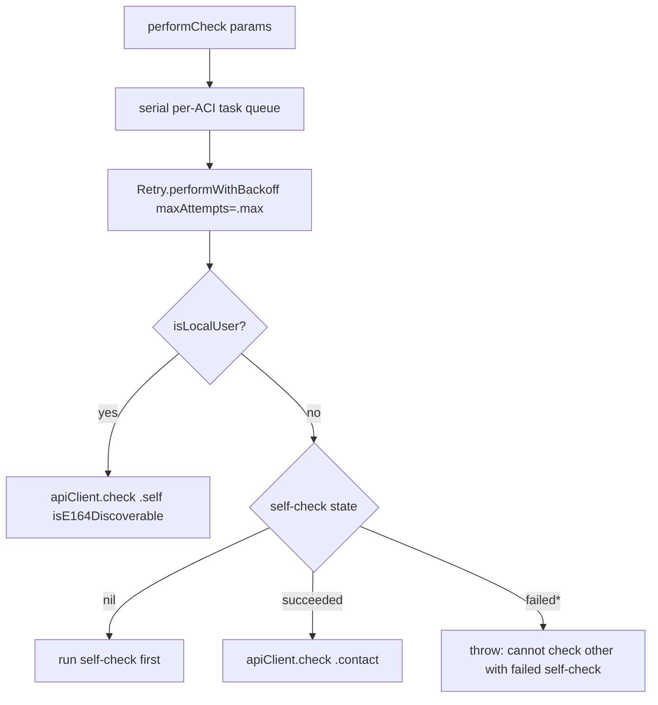
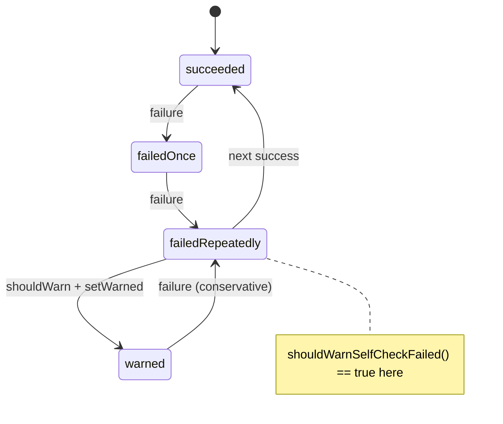
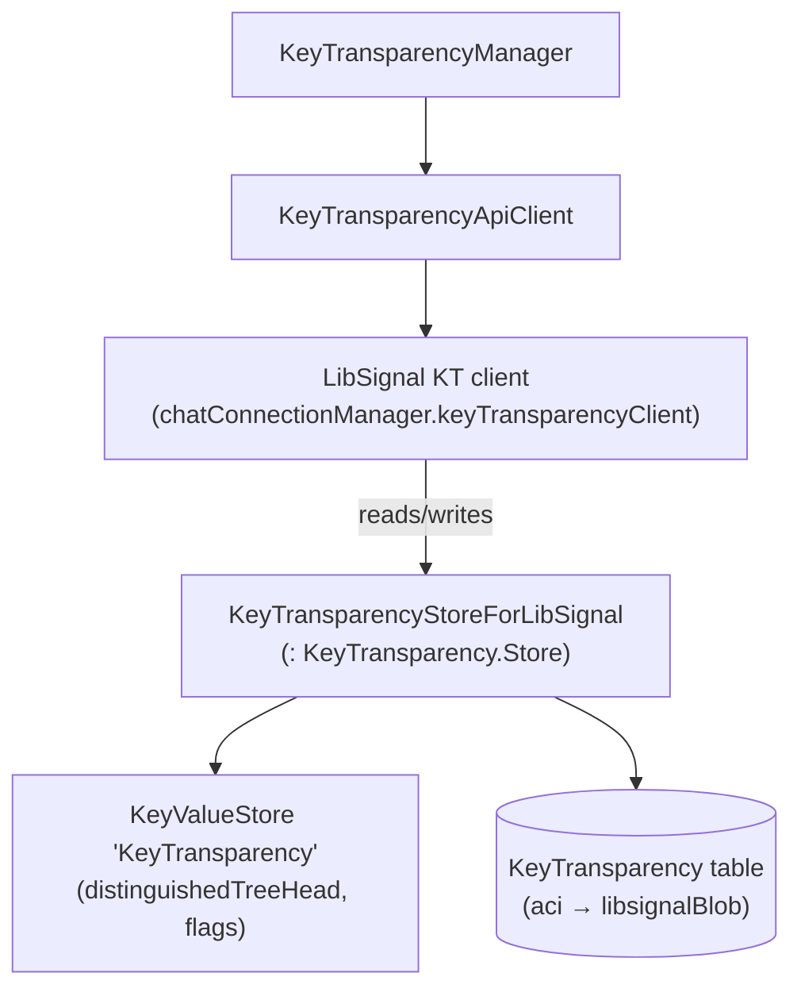

# Key Transparency

This document covers `SignalServiceKit/KeyTransparency/`
(`KeyTransparencyManager`, `KeyTransparencyApiClient`, and the embedded
`KeyTransparencyStore`). Key Transparency (KT) lets a client **audit** that the
identity key (and related account data) the server returns for an ACI matches a
cryptographically-verifiable, append-only transparency log — defending against a
malicious server silently substituting keys.

> **Confidence labels.** **[High]** = explicit in source; **[Medium]** = inferred
> but depends on out-of-tree collaborators; **[Low]** = inferred from
> naming/comments. Line numbers are approximate anchors.

> **Scope boundary.** The actual KT **cryptographic verification** (Merkle/VRF
> proofs, the "distinguished tree head", monitoring) is implemented inside
> **LibSignalClient**'s `KeyTransparency` module (out of tree) and reached through
> `chatConnectionManager.keyTransparencyClient()`
<<<<<<< ours
> (`SignalServiceKit/KeyTransparency/KeyTransparencyApiClient.swift:41-53`). The
=======
> (`SignalServiceKit/KeyTransparency/KeyTransparencyApiClient.swift:40-54`). The
>>>>>>> theirs
> Swift code here orchestrates **when** checks run, assembles their **inputs**,
> persists LibSignal's opaque **blobs**, and tracks **self-check** health. **[High]**

---

## 1. Inputs to a check

A KT check needs an ACI + its identity key, optionally an E164 + unidentified
access key, and optionally a username hash. These are bundled in `CheckParams`
<<<<<<< ours
(`SignalServiceKit/KeyTransparency/KeyTransparencyManager.swift:82-91`): **[High]**
=======
(`SignalServiceKit/KeyTransparency/KeyTransparencyManager.swift:79-91`): **[High]**
>>>>>>> theirs

- `aciInfo: KeyTransparency.AciInfo` — the ACI and its identity key.
- `e164Info: KeyTransparency.E164Info?` — phone number + unidentified access key.
- `username: Username?`.
- `localIdentifiers` + a derived `isLocalUser`
<<<<<<< ours
  (`KeyTransparencyManager.swift:88-90`). **[High]**
=======
  (`KeyTransparencyManager.swift:85-90`). **[High]**
>>>>>>> theirs

### 1.1 Preparing a contact check (`prepareCheck`)

`prepareCheck(aci:localIdentifiers:tx:)`
<<<<<<< ours
(`KeyTransparencyManager.swift:99-158`) returns `nil` (cannot check) when: **[High]**

- the ACI is the **local user** (`prepareAndPerformSelfCheck` must be used
  instead) (`KeyTransparencyManager.swift:107-110`); **[High]**
- KT is **opted out** (`!keyTransparencyStore.isEnabled`)
  (`KeyTransparencyManager.swift:112-115`); **[High]**
- the identity key is unknown (`identityManager.identityKey(for:tx:)`)
  (`KeyTransparencyManager.swift:117-125`); **[High]**
- the recipient lacks an E164 **or** an unidentified access key
  (`udManager.udAccessKey`) (`KeyTransparencyManager.swift:128-144`). **[High]**

The username is not used when checking other users
(`KeyTransparencyManager.swift:146-147`). **[High]**
=======
(`KeyTransparencyManager.swift:98-157`) returns `nil` (cannot check) when: **[High]**

- the ACI is the **local user** (`prepareAndPerformSelfCheck` must be used
  instead) (`KeyTransparencyManager.swift:104-107`); **[High]**
- KT is **opted out** (`!keyTransparencyStore.isEnabled`)
  (`KeyTransparencyManager.swift:109-112`); **[High]**
- the identity key is unknown (`identityManager.identityKey(for:tx:)`)
  (`KeyTransparencyManager.swift:114-124`); **[High]**
- the recipient lacks an E164 **or** an unidentified access key
  (`udManager.udAccessKey`) (`KeyTransparencyManager.swift:126-145`). **[High]**

The username is not used when checking other users
(`KeyTransparencyManager.swift:147-148`). **[High]**
>>>>>>> theirs

---

## 2. Running a check (`performCheck` / `_performCheck`)

- `performCheck` runs on a `KeyedConcurrentTaskQueue` with
  `concurrentLimitPerKey: 1`, so checks for the **same ACI** are serialized
<<<<<<< ours
  (`KeyTransparencyManager.swift:55`, `KeyTransparencyManager.swift:161-197`).
=======
  (`KeyTransparencyManager.swift:26`, `KeyTransparencyManager.swift:158-200`).
>>>>>>> theirs
  **[High]**
- Network/rate-limit errors are retried **indefinitely** (`maxAttempts: .max`),
  honoring `SignalError.rateLimitedError` retry-after; the comment explains
  transient failures must not look like a KT failure
<<<<<<< ours
  (`KeyTransparencyManager.swift:166-189`). **[High]**
- `_performCheck` (`KeyTransparencyManager.swift:199-238`): **[High]**
  - **Local user** → `apiClient.check(for: .self(isE164Discoverable:), ...)` using
    phone-number discoverability (`KeyTransparencyManager.swift:204-213`).
  - **Other user** → **requires** a prior successful self-check: if the self-check
    state is `nil`, it runs one first; if it's any failure state, it **throws**
    `"Cannot check other with failed self-check."`
    (`KeyTransparencyManager.swift:220-228`). **[High]**
=======
  (`KeyTransparencyManager.swift:166-193`). **[High]**
- `_performCheck` (`KeyTransparencyManager.swift:204-243`): **[High]**
  - **Local user** → `apiClient.check(for: .self(isE164Discoverable:), ...)` using
    phone-number discoverability (`KeyTransparencyManager.swift:206-218`).
  - **Other user** → **requires** a prior successful self-check: if the self-check
    state is `nil`, it runs one first; if it's any failure state, it **throws**
    `"Cannot check other with failed self-check."`
    (`KeyTransparencyManager.swift:220-242`). **[High]**
>>>>>>> theirs

> **Why gate others on self-check?** A failing self-check implies the client's own
> view of the KT log is stale/wrong, so checking others would be unreliable. This
> is a correctness guard, explicit in code. **[High]**

---

## 3. Self-check

The local user periodically re-validates its own account data against the KT log.

### 3.1 Triggers

- **Cron**: `registerSelfCheckForCron(cron:)` schedules a frequent, must-be-
  registered/connected job that runs a self-check when KT is enabled and it is time
<<<<<<< ours
  (`KeyTransparencyManager.swift:246-284`). **[High]**
- **On demand**: `performSelfCheckOnDemand()` (e.g. from Internal Settings)
  (`KeyTransparencyManager.swift:286-290`). **[High]**

### 3.2 Preparation (`prepareSelfCheck`)

`prepareSelfCheck` (`KeyTransparencyManager.swift:298-363`) assembles self
`CheckParams`: **[High]**

- Requires the local **ACI identity key** (`identityManager.identityKeyPair(for: .aci)`),
  else `.failure` (`KeyTransparencyManager.swift:304-311`). **[High]**
- Requires an unidentified access key; includes `E164Info` **only if the number is
  discoverable**, otherwise self-checks without E164
  (`KeyTransparencyManager.swift:313-329`). **[High]**
- Includes the **username** only if it is not corrupted *and* all devices are
  `isUsernameChangeSyncMessageCapable`; corrupted usernames yield
  `.selfCheckUnavailable` (defer) (`KeyTransparencyManager.swift:331-355`). **[High]**

### 3.3 Execution & outcomes (`prepareAndPerformSelfCheck`)

`prepareAndPerformSelfCheck` (`KeyTransparencyManager.swift:365-425`): **[High]**

1. Best-effort drains the message queue and waits for Storage Service restores
   (self-check depends on username state in Storage Service)
   (`KeyTransparencyManager.swift:371-375`). **[High]**
2. On `.selfCheckUnavailable`, defers via a 1-day Cron reschedule and returns
   (`KeyTransparencyManager.swift:388-397`). **[High]**
3. On success, records `SelfCheckState.succeeded` and a normal Cron completion
   (`KeyTransparencyManager.swift:408-416`). **[High]**
4. On error (not cancellation), calls `recordSelfCheckFailure`
   (`KeyTransparencyManager.swift:418-423`). **[High]**

### 3.4 Failure escalation (`recordSelfCheckFailure`)

`SelfCheckState` has four values (`KeyTransparencyManager.swift:596-601` —
`succeeded = 1` at `:597`, `failedOnce = 2`, `failedRepeatedly = 3`,
`failedRepeatedlyAndWarned = 4`). `recordSelfCheckFailure`
(`KeyTransparencyManager.swift:427-479`) escalates: **[High]**
=======
  (`KeyTransparencyManager.swift:249-287`). **[High]**
- **On demand**: `performSelfCheckOnDemand()` (e.g. from Internal Settings)
  (`KeyTransparencyManager.swift:291-295`). **[High]**

### 3.2 Preparation (`prepareSelfCheck`)

`prepareSelfCheck` (`KeyTransparencyManager.swift:305-370`) assembles self
`CheckParams`: **[High]**

- Requires the local **ACI identity key** (`identityManager.identityKeyPair(for: .aci)`),
  else `.failure` (`KeyTransparencyManager.swift:312-321`). **[High]**
- Requires an unidentified access key; includes `E164Info` **only if the number is
  discoverable**, otherwise self-checks without E164
  (`KeyTransparencyManager.swift:323-337`). **[High]**
- Includes the **username** only if it is not corrupted *and* all devices are
  `isUsernameChangeSyncMessageCapable`; corrupted usernames yield
  `.selfCheckUnavailable` (defer) (`KeyTransparencyManager.swift:339-368`). **[High]**

### 3.3 Execution & outcomes (`prepareAndPerformSelfCheck`)

`prepareAndPerformSelfCheck` (`KeyTransparencyManager.swift:372-440`): **[High]**

1. Best-effort drains the message queue and waits for Storage Service restores
   (self-check depends on username state in Storage Service)
   (`KeyTransparencyManager.swift:376-384`). **[High]**
2. On `.selfCheckUnavailable`, defers via a 1-day Cron reschedule and returns
   (`KeyTransparencyManager.swift:395-409`). **[High]**
3. On success, records `SelfCheckState.succeeded` and a normal Cron completion
   (`KeyTransparencyManager.swift:423-432`). **[High]**
4. On error (not cancellation), calls `recordSelfCheckFailure`
   (`KeyTransparencyManager.swift:434-440`). **[High]**

### 3.4 Failure escalation (`recordSelfCheckFailure`)

`SelfCheckState` has four values (`KeyTransparencyManager.swift:` enum
`succeeded = 1`, `failedOnce = 2`, `failedRepeatedly = 3`,
`failedRepeatedlyAndWarned = 4`). `recordSelfCheckFailure`
(`KeyTransparencyManager.swift:442-500`) escalates: **[High]**
>>>>>>> theirs

| Current state | New state | Next-Cron interval | Side effect |
| --- | --- | --- | --- |
| `nil` / `succeeded` | `failedOnce` | 1 day | kick Storage Service restore |
| `failedOnce` | `failedRepeatedly` | default | — |
| `failedRepeatedly` | `nil` (reset) | default | — |
| `failedRepeatedlyAndWarned` | `failedRepeatedly` if conservative else `nil` | default | — |

The first failure proactively kicks a Storage Service restore because a known
failure mode is a linked device having changed KT-relevant state (e.g. username)
that this device hasn't learned yet
<<<<<<< ours
(`KeyTransparencyManager.swift:437-446`). **[High]**
=======
(`KeyTransparencyManager.swift:456-468`). **[High]**
>>>>>>> theirs

`shouldWarnSelfCheckFailed` is true only in `failedRepeatedly`; calling
`setWarnedSelfCheckFailed` transitions it to `failedRepeatedlyAndWarned`
<<<<<<< ours
(`KeyTransparencyManager.swift:616-623` `shouldWarnSelfCheckFailed`,
`KeyTransparencyManager.swift:625-632` `setWarnedSelfCheckFailed`).
=======
(`KeyTransparencyManager.swift:` `shouldWarnSelfCheckFailed`/`setWarnedSelfCheckFailed`).
>>>>>>> theirs
**[High]**

---

## 4. Opt-out

- `isEnabled` defaults to **true** when unset
<<<<<<< ours
  (`KeyTransparencyManager.swift:555-557`, `KeyTransparencyStore.isEnabled`). **[High]**
- `setIsEnabled(_:updateStorageService:tx:)` persists the flag and, when
  **disabling**, wipes the distinguished tree head, the self-check state, resets the
  Cron, and deletes all `KeyTransparencyRecord`s
  (`KeyTransparencyManager.swift:559-570`, `KeyTransparencyStore.setIsEnabled`).
  Optionally records a pending Storage Service account update so the opt-out syncs
  across devices (`KeyTransparencyManager.swift:72-75`, manager `setIsEnabled` at
  `:64-76`). **[High]**
=======
  (`KeyTransparencyManager.swift:` `KeyTransparencyStore.isEnabled`). **[High]**
- `setIsEnabled(_:updateStorageService:tx:)` persists the flag and, when
  **disabling**, wipes the distinguished tree head, the self-check state, resets the
  Cron, and deletes all `KeyTransparencyRecord`s
  (`KeyTransparencyManager.swift:63-74`, `KeyTransparencyManager.swift:` `setIsEnabled`).
  Optionally records a pending Storage Service account update so the opt-out syncs
  across devices (`KeyTransparencyManager.swift:69-73`). **[High]**
>>>>>>> theirs

---

## 5. Persistence (`KeyTransparencyStore`)

Two storage surfaces: **[High]**

### 5.1 Key-value state (collection `KeyTransparency`)

<<<<<<< ours
`KeyTransparencyStore` (`KeyTransparencyManager.swift:511`) uses a
`NewKeyValueStore` with keys
(`KeyTransparencyManager.swift:517-532`, `KVStoreKeys`): `isEnabled`, `selfCheckState`,
`shouldShowFirstTimeEducation`, `isUsernameChangeSyncMessageCapable`,
`distinguishedTreeHead`. The `distinguishedTreeHead` is an **opaque LibSignal blob**
(`KeyTransparencyManager.swift:685-687` `getLastDistinguishedTreeHead`,
`KeyTransparencyManager.swift:689-691` `setLastDistinguishedTreeHead`).
=======
`KeyTransparencyStore` uses a `NewKeyValueStore` with keys
(`KeyTransparencyManager.swift:` `KVStoreKeys`): `isEnabled`, `selfCheckState`,
`shouldShowFirstTimeEducation`, `isUsernameChangeSyncMessageCapable`,
`distinguishedTreeHead`. The `distinguishedTreeHead` is an **opaque LibSignal blob**
(`KeyTransparencyManager.swift:` `getLastDistinguishedTreeHead`/`setLastDistinguishedTreeHead`).
>>>>>>> theirs
**[High]**

The self-check Cron interval is `.day` when
`BuildFlags.KeyTransparency.conservativeSelfCheck`, else `.week`
<<<<<<< ours
(`KeyTransparencyManager.swift:537-544`, `KeyTransparencyStore.init`). **[High]**

### 5.2 Per-ACI blobs (table `KeyTransparency`)

`KeyTransparencyRecord` (`KeyTransparencyManager.swift:763-780`) is
a GRDB row keyed by `aci: UUID` holding an opaque `libsignalBlob: Data`, with a
`.replace`/`.replace` conflict policy (overwrite on re-insert)
(`KeyTransparencyManager.swift:767-772`). **[High]**
=======
(`KeyTransparencyManager.swift:` `KeyTransparencyStore.init`). **[High]**

### 5.2 Per-ACI blobs (table `KeyTransparency`)

`KeyTransparencyRecord` (`KeyTransparencyManager.swift:` `KeyTransparencyRecord`) is
a GRDB row keyed by `aci: UUID` holding an opaque `libsignalBlob: Data`, with a
`.replace`/`.replace` conflict policy (overwrite on re-insert). **[High]**
>>>>>>> theirs

### 5.3 The LibSignal store adapter

`KeyTransparencyStoreForLibSignal` conforms to `KeyTransparency.Store` and is the
object passed into LibSignal's `check(...)`. It bridges
`get/setLastDistinguishedTreeHead` and `get/setAccountData(for: aci)` to the two
<<<<<<< ours
storage surfaces above (`KeyTransparencyManager.swift:724-760`). **[High]**
=======
storage surfaces above (`KeyTransparencyManager.swift:` `KeyTransparencyStoreForLibSignal`).
**[High]**
>>>>>>> theirs

---

## 6. Reacting to local identifier changes

`handleSelfCheckIdentifierChanged(accountDataField:localAci:...)`
<<<<<<< ours
(`KeyTransparencyManager.swift:483-506`, static `handleSelfCheckIdentifierChanged`)
informs LibSignal that a monitored `AccountDataField` changed by calling
`KeyTransparency.resetField(...)` with the `KeyTransparencyStoreForLibSignal`. A
failure here only occurs for malformed data and is logged via `owsFailDebug`
(`KeyTransparencyManager.swift:501-505`).
=======
(`KeyTransparencyManager.swift:` static `handleSelfCheckIdentifierChanged`) informs
LibSignal that a monitored `AccountDataField` changed by calling
`KeyTransparency.resetField(...)` with the `KeyTransparencyStoreForLibSignal`. A
failure here only occurs for malformed data and is logged via `owsFailDebug`.
>>>>>>> theirs
**[High]** The set of monitored fields and the reset semantics are defined in
LibSignal — **intent undetermined — no evidence in source** here beyond the call.
**[Low]**

---

## 7. The API client

`KeyTransparencyApiClient`
<<<<<<< ours
(`SignalServiceKit/KeyTransparency/KeyTransparencyApiClient.swift:8-16`) is a one-
method protocol: `check(for:aciInfo:e164Info:usernameHash:)`. The impl obtains the
LibSignal KT client from the chat connection and calls `ktClient.check(...)`,
passing the `KeyTransparencyStoreForLibSignal`
(`KeyTransparencyApiClient.swift:35-53`). The protocol exists so the network layer
can be mocked (`KeyTransparencyApiClient.swift:8`). **[High]**
=======
(`SignalServiceKit/KeyTransparency/KeyTransparencyApiClient.swift:8-15`) is a one-
method protocol: `check(for:aciInfo:e164Info:usernameHash:)`. The impl obtains the
LibSignal KT client from the chat connection and calls `ktClient.check(...)`,
passing the `KeyTransparencyStoreForLibSignal`
(`KeyTransparencyApiClient.swift:19-54`). The protocol exists so the network layer
can be mocked (`KeyTransparencyApiClient.swift:7`). **[High]**
>>>>>>> theirs

---

## 8. Validation rules, error paths & feature flags

| Rule / error | Where | Citation |
| --- | --- | --- |
<<<<<<< ours
| Cannot check the local user via `prepareCheck` | `prepareCheck` | `SignalServiceKit/KeyTransparency/KeyTransparencyManager.swift:107-110` |
| Opt-out blocks contact checks | `prepareCheck` | `SignalServiceKit/KeyTransparency/KeyTransparencyManager.swift:112-115` |
| Missing identity key / E164 / UAK → no check | `prepareCheck` | `SignalServiceKit/KeyTransparency/KeyTransparencyManager.swift:117-144` |
| Checking others requires a succeeded self-check | `_performCheck` | `SignalServiceKit/KeyTransparency/KeyTransparencyManager.swift:220-228` |
| Network/rate-limit errors retried indefinitely | `performCheck` | `SignalServiceKit/KeyTransparency/KeyTransparencyManager.swift:166-189` |
| Per-ACI serialization | `taskQueue` | `SignalServiceKit/KeyTransparency/KeyTransparencyManager.swift:55`, `:162` |
| Corrupted username → self-check unavailable (defer) | `prepareSelfCheck` | `SignalServiceKit/KeyTransparency/KeyTransparencyManager.swift:331-355` |
| Non-discoverable number → self-check without E164 | `prepareSelfCheck` | `SignalServiceKit/KeyTransparency/KeyTransparencyManager.swift:313-329` |
| Disabling KT wipes tree head + self-check + records | `setIsEnabled` | `SignalServiceKit/KeyTransparency/KeyTransparencyManager.swift:559-570` |
| `isEnabled` defaults true | `KeyTransparencyStore.isEnabled` | `SignalServiceKit/KeyTransparency/KeyTransparencyManager.swift:555-557` |
| `BuildFlags.KeyTransparency.conservativeSelfCheck` → daily vs weekly | `KeyTransparencyStore.init` | `SignalServiceKit/KeyTransparency/KeyTransparencyManager.swift:537-544` |
=======
| Cannot check the local user via `prepareCheck` | `prepareCheck` | `SignalServiceKit/KeyTransparency/KeyTransparencyManager.swift:104-107` |
| Opt-out blocks contact checks | `prepareCheck` | `SignalServiceKit/KeyTransparency/KeyTransparencyManager.swift:109-112` |
| Missing identity key / E164 / UAK → no check | `prepareCheck` | `SignalServiceKit/KeyTransparency/KeyTransparencyManager.swift:114-145` |
| Checking others requires a succeeded self-check | `_performCheck` | `SignalServiceKit/KeyTransparency/KeyTransparencyManager.swift:220-242` |
| Network/rate-limit errors retried indefinitely | `performCheck` | `SignalServiceKit/KeyTransparency/KeyTransparencyManager.swift:166-193` |
| Per-ACI serialization | `taskQueue` | `SignalServiceKit/KeyTransparency/KeyTransparencyManager.swift:26`, `:159` |
| Corrupted username → self-check unavailable (defer) | `prepareSelfCheck` | `SignalServiceKit/KeyTransparency/KeyTransparencyManager.swift:339-368` |
| Non-discoverable number → self-check without E164 | `prepareSelfCheck` | `SignalServiceKit/KeyTransparency/KeyTransparencyManager.swift:323-337` |
| Disabling KT wipes tree head + self-check + records | `setIsEnabled` | `SignalServiceKit/KeyTransparency/KeyTransparencyManager.swift` (`setIsEnabled`) |
| `isEnabled` defaults true | `KeyTransparencyStore.isEnabled` | `SignalServiceKit/KeyTransparency/KeyTransparencyManager.swift` (`isEnabled`) |
| `BuildFlags.KeyTransparency.conservativeSelfCheck` → daily vs weekly | `KeyTransparencyStore.init` | `SignalServiceKit/KeyTransparency/KeyTransparencyManager.swift` (`init`) |
>>>>>>> theirs

---

### Related documents

- [identity-and-keys.md](identity-and-keys.md) — the identity keys KT audits, and
  the local TOFU/verification model KT complements.
- [sealed-sender.md](sealed-sender.md) — the unidentified access key that KT reads
  into `E164Info`.
