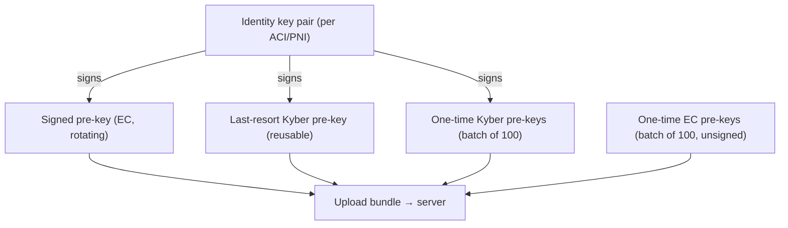
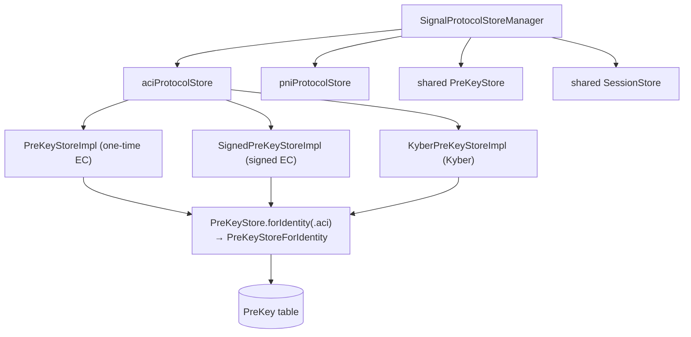
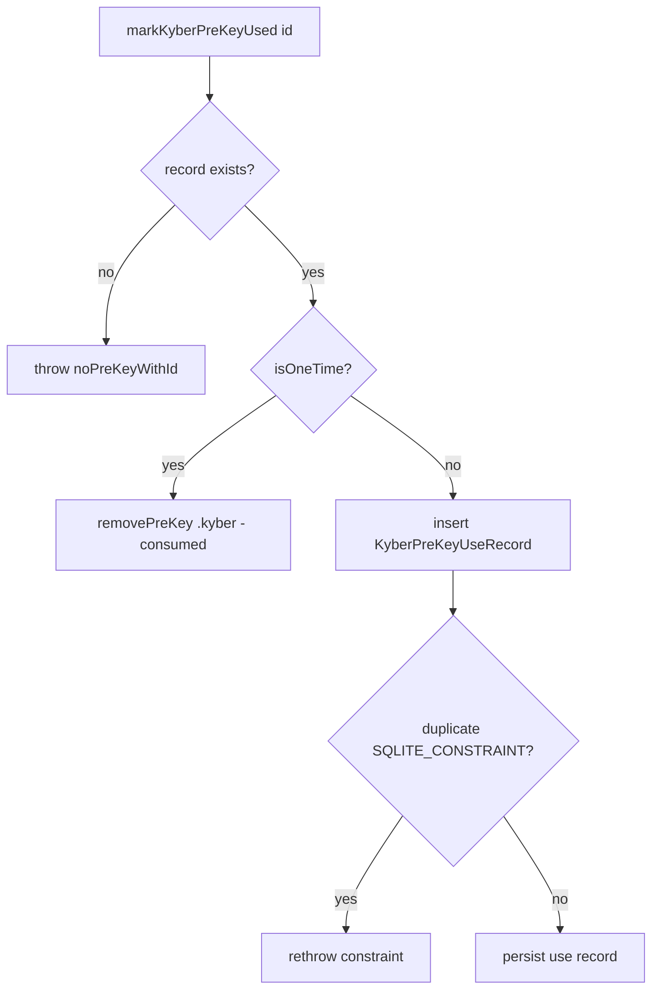
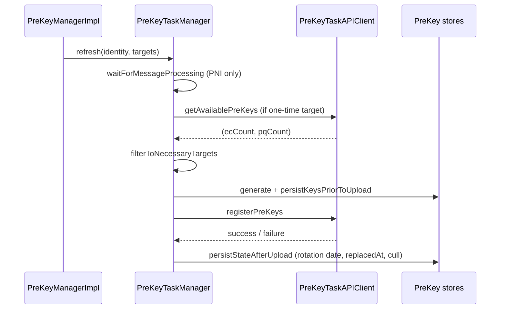

# Pre-Keys: One-Time, Signed, and Kyber/Last-Resort

This document covers the **pre-key subsystem** in `SignalServiceKit/Axolotl/`:
the three kinds of pre-keys Signal publishes to the server (one-time EC, signed
EC, and Kyber/PQ — including the "last-resort" Kyber key), how they are
generated, persisted, uploaded, rotated, replenished, and culled, and how
LibSignal consumes them during session establishment.

> **Confidence labels.** **[High]** = explicit in source; **[Medium]** = inferred
> but depends on out-of-tree collaborators; **[Low]** = inferred from
> naming/comments. Line numbers are approximate anchors — use the cited symbol
> name if lines have drifted. Key *generation math* (EC and Kyber) happens inside
> **LibSignalClient**, which is out of tree; this doc covers the first-party
> generation calls, persistence, and lifecycle.

---

## 1. Why pre-keys exist

Pre-keys are the key material a device **publishes to the server in advance** so
that *other* devices can start an encrypted session with it **asynchronously**
(while it is offline). A sender fetches a *pre-key bundle*, runs X3DH locally, and
can send immediately. Signal iOS publishes three key types, enumerated by
`PreKeyTarget` (`SignalServiceKit/Axolotl/PreKeyTarget.swift:8-13`): **[High]**

| `PreKeyTarget` | raw | Meaning |
| --- | --- | --- |
| `signedPreKey` | 1 | A single rotating EC pre-key, signed by the identity key. |
| `oneTimePreKey` | 2 | A batch of ephemeral EC pre-keys, each used at most once. |
| `oneTimePqPreKey` | 4 | A batch of ephemeral **Kyber** (post-quantum) pre-keys. |
| `lastResortPqPreKey` | 8 | A single reusable "last-resort" Kyber pre-key. |

`PreKeyTargets` is an `OptionSet` over these values so operations can target
multiple key classes at once (`PreKeyTarget.swift:21-61`). **[High]**

> **Note on PQXDH.** The presence of mandatory Kyber keys in every bundle means
> session establishment is the post-quantum **PQXDH** variant of X3DH, performed
> inside LibSignal. The Swift layer only supplies/validates the keys. **[Medium]**

---

## 2. On-disk model

### 2.1 `PreKeyRecord` (table `PreKey`)

All EC and Kyber pre-keys share one GRDB table, `PreKey`, modeled by
`PreKeyRecord` (`SignalServiceKit/Axolotl/PreKeyRecord.swift:9-54`): **[High]**

- `identity: OWSIdentity`, `namespace: Namespace`, `keyId: UInt32` — the **unique**
  triple; key IDs must not be reused within a (namespace, identity)
  (`PreKeyRecord.swift:13-21`). **[High]**
- `Namespace`: `oneTime = 0`, `signed = 2`, `kyber = 1`
  (`PreKeyRecord.swift:35-38`). **[High]**
- `isOneTime: Bool` — redundant for EC keys (they're namespaced), but
  **load-bearing for Kyber** because one-time and last-resort Kyber keys share the
  `kyber` namespace (`PreKeyRecord.swift:23-30`). **[High]**
- `replacedAt: Int64?` — Unix timestamp when the key became obsolete; drives
  culling (`PreKeyRecord.swift:32-33`). **[High]**
- `serializedRecord: Data?` — the LibSignal-serialized key record
  (`PreKeyRecord.swift:35`). **[High]**

### 2.2 `KyberPreKeyUseRecord` (table `KyberPreKeyUse`)

Because a **last-resort** Kyber key may be used by multiple senders, its reuse is
tracked in a separate table (`SignalServiceKit/Axolotl/KyberPreKeyUseRecord.swift:9-22`):
each row records `(kyberRowId, signedPreKeyIdentity, signedPreKeyId, baseKey)`.
**[High]** How this is populated is covered in §6.

### 2.3 Pre-key IDs

`PreKeyId` (`SignalServiceKit/Axolotl/PreKeyId.swift:7-33`): **[High]**

- IDs live in `1 ..< 0x1000000` (16,777,216) — **24 bits**
  (`PreKeyId.swift:9`). `random()` samples uniformly in that range
  (`PreKeyId.swift:12-14`). **[High]**
- `nextPreKeyIds(lastPreKeyId:count:)` returns a sequential closed range,
  continuing from the last ID when possible, wrapping back to 1 when a batch
  would overflow the upper bound (`PreKeyId.swift:16-31`). **[High]**
- The ID space is intentionally **not** large enough to avoid all random
  collisions; `upsertPreKeyRecord` uses `INSERT OR REPLACE` so a rare collision
  (e.g. from change-number) harmlessly keeps the latest key
  (`SignalServiceKit/Axolotl/PreKeyStore.swift:122-139`). **[High]**

---

## 3. The store topology

- `SignalProtocolStore` bundles the four stores for one identity
  (`SignalServiceKit/Axolotl/SignalProtocolStore.swift:8-27`); the comment states
  it "Wraps the stores for 1:1 sessions that use the Signal Protocol (Double
  Ratchet + X3DH)" (`SignalProtocolStore.swift:6`). **[High]**
- `SignalProtocolStoreManager` holds ACI + PNI `SignalProtocolStore`s plus a
  **shared** `PreKeyStore` and `SessionStore`
  (`SignalProtocolStore.swift:30-56`). **[High]**
- `PreKeyStore` owns one `PreKeyStoreForIdentity` per identity
  (`SignalServiceKit/Axolotl/PreKeyStore.swift:14-27`). `PreKeyStoreForIdentity`
  is the object that actually conforms to the three LibSignal store protocols
  (§5). **[High]**
- The three `*Impl` classes (`PreKeyStoreImpl`, `SignedPreKeyStoreImpl`,
  `KyberPreKeyStoreImpl`) are the *generation + metadata* front-ends; they persist
  through the shared `PreKeyStore`/`PreKeyStoreForIdentity`
  (`SignalServiceKit/Axolotl/PreKeyStoreImpl.swift:8-72`,
  `SignalServiceKit/Axolotl/SignedPreKeyStoreImpl.swift:10-82`,
  `SignalServiceKit/Axolotl/KyberPreKeyStoreImpl.swift:8-112`). **[High]**

Each `*Impl` and `PreKeyStoreForIdentity` keeps per-identity metadata in distinct
`KeyValueStore` collections (e.g. one-time EC uses
`TSStorageInternalSettingsCollection` for ACI,
`TSStorageManagerPNIPreKeyMetadataCollection` for PNI;
Kyber uses `SSKKyberPreKeyStoreACIMetadataStore` /
`...PNIMetadataStore`) (`PreKeyStoreImpl.swift:14-23`,
`SignedPreKeyStoreImpl.swift:18-25`, `KyberPreKeyStoreImpl.swift:26-33`). **[High]**

---

## 4. Key generation

| Key type | Generator | Mechanism | Signed? |
| --- | --- | --- | --- |
| One-time EC | `PreKeyStoreImpl.generatePreKeyRecords` | `PrivateKey.generate()` per key | No |
| Signed EC | `SignedPreKeyStoreImpl.generateSignedPreKey` | `PrivateKey.generate()`, signed | Yes |
| Kyber (one-time + last-resort) | `KyberPreKeyStoreImpl.generatePreKeyRecord` | `KEMKeyPair.generate()`, signed | Yes |

Details: **[High]**

- **One-time EC**: `PreKeyStoreImpl.generatePreKeyRecords(forPreKeyIds:)`
  generates one `LibSignalClient.PreKeyRecord` per ID using
  `PrivateKey.generate()` — **no identity signature**
  (`PreKeyStoreImpl.swift:35-45`). The default batch is **100**
  (`allocatePreKeyIds` uses `count: 100`, `PreKeyStoreImpl.swift:26-33`). **[High]**
- **Signed EC**: `SignedPreKeyStoreImpl.generateSignedPreKey(keyId:signedBy:)`
  generates a private key and signs its serialized public key with the identity
  key (`identityKey.generateSignature(...)`), stamping the current time in
  milliseconds (`SignedPreKeyStoreImpl.swift:60-72`). **[High]**
- **Kyber**: `KyberPreKeyStoreImpl.generatePreKeyRecord(keyId:now:signedBy:)`
  calls `KEMKeyPair.generate()` and signs the serialized Kyber public key with the
  identity key (`KyberPreKeyStoreImpl.swift:40-53`). One-time vs. last-resort is a
  *storage* distinction (`isLastResort` → `isOneTime = !isLastResort`), not a
  generation one (`KyberPreKeyStoreImpl.swift:70-82`). **[High]**

All three sign/generate with LibSignal types; the elliptic-curve and lattice math
is **not** in this tree. **[High]**

---

## 5. LibSignal store conformance (`PreKeyStoreForIdentity`)

`PreKeyStoreForIdentity` conforms to **three** LibSignal protocols, each mapping to
a namespace (`SignalServiceKit/Axolotl/PreKeyStore.swift:171-233`): **[High]**

| Protocol | Namespace | Load | Store |
| --- | --- | --- | --- |
| `LibSignalClient.PreKeyStore` | `.oneTime` | `loadPreKey(id:)` | `storePreKey` → `owsFail("Not supported.")` |
| `LibSignalClient.SignedPreKeyStore` | `.signed` | `loadSignedPreKey(id:)` | `storeSignedPreKey` → `owsFail` |
| `LibSignalClient.KyberPreKeyStore` | `.kyber` | `loadKyberPreKey(id:)` | `markKyberPreKeyUsed(...)` |

(`PreKeyStore.swift:172-233`) **[High]**

Key behaviors:

- **Loads** deserialize the stored bytes into the LibSignal record type; a missing
  key throws `PreKeyStore.Error.noPreKeyWithId` (`PreKeyStore.swift:106-112`,
  `PreKeyStore.swift:173-176`). **[High]**
- The `store*` write callbacks from LibSignal are deliberately **unsupported**
  (`owsFail("Not supported.")`) in production builds — iOS persists keys itself
  before upload rather than letting LibSignal write them, and the comments note
  these paths "need `replacedAt` support"
  (`PreKeyStore.swift:184-186`, `PreKeyStore.swift:197-199`,
  `PreKeyStore.swift:227-230`). Writable variants exist **only** under
  `#if TESTABLE_BUILD` (`PreKeyStore.swift:237-285`). **[High]**
- **One-time EC consumption**: `removePreKey(id:)` deletes the record so it is used
  at most once (`PreKeyStore.swift:179-181`). **[High]**

### 5.1 `markKyberPreKeyUsed` — one-time vs. last-resort

This is the most subtle callback (`PreKeyStore.swift:206-224`): **[High]**

- Fetch the Kyber record; missing → `noPreKeyWithId`.
- If `isOneTime`: **delete** it (used once, like EC one-times).
- Else (last-resort, reusable): insert a `KyberPreKeyUseRecord` capturing the
  signed-pre-key id and base key. A `SQLITE_CONSTRAINT` violation (duplicate
  use) is rethrown; other errors hard-fail
  (`PreKeyStore.swift:211-222`). **[High]**

> **Why track last-resort reuse?** A last-resort Kyber key can be handed to many
> senders; the `KyberPreKeyUse` table lets the client detect/limit reuse. The
> precise downstream consumer of these records is out of tree — **intent
> undetermined — no evidence in source** beyond the insertion. **[Low]**

---

## 6. Upload bundles

`PreKeyUploadBundle` (`SignalServiceKit/Axolotl/PreKeyUploadBundle.swift:8-14`) is
the accessor protocol LibSignal/network code reads during upload: `getSignedPreKey`,
`getPreKeyRecords`, `getLastResortPreKey`, `getPqPreKeyRecords`. `isEmpty()` is
true only when all four are `nil` (`PreKeyUploadBundle.swift:16-28`). **[High]**

Two concrete bundles: **[High]**

- `PartialPreKeyUploadBundle` (`PreKeyUploadBundle.swift:31-56`) — any subset of
  the four key classes; used by routine refreshes.
- `RegistrationPreKeyUploadBundle` (`PreKeyUploadBundle.swift:58-83`) — carries the
  **identity key pair**, a signed pre-key, and a last-resort Kyber key (no
  one-time keys); used at registration/provisioning.

The server-side bundle a *sender* fetches is modeled separately by `PreKeyBundle`
(`SignalServiceKit/Axolotl/PreKeyBundle.swift:8-120`); see
[sessions-and-ratchet.md](sessions-and-ratchet.md). **[High]**

---

## 7. Lifecycle: generation → persist → upload → finalize → cull

Scheduling lives in `PreKeyManagerImpl`; execution lives in `PreKeyTaskManager`.
`PreKeyTaskManager`'s header enumerates the 7-step pipeline
(`SignalServiceKit/Axolotl/PreKeyTaskManager.swift:9-18`): **[High]**

> 1. Fetch (or create) the identity key. 2. If registered & not creating, wait for
> message processing to be idle. 3. Check the server for remaining pre-key counts
> (skipped on create/force). 4. Decide which operations are actually needed.
> 5. Generate keys. 6. Upload (except for registration/provisioning). 7. Store the
> new keys and run cleanup.

### 7.1 Registration & provisioning

- `createForRegistration` generates keys **and may create a new identity key** if
  none exists (`getOrCreateIdentityKeyPair`,
  `PreKeyTaskManager.swift:239`, `createForRegistration` at
  `PreKeyTaskManager.swift:80-90`). **[High]**
- `createForProvisioning` uses the identity key pair handed down from the primary
  during linking — it **never** creates one
  (`PreKeyTaskManager.swift:92-99`, `generateKeysForProvisioning` at
  `PreKeyTaskManager.swift:209`). **[High]**
- Both generate a signed pre-key + one last-resort Kyber key and persist **before**
  returning (`persistKeysPriorToUpload`), so a crash between generation and upload
  doesn't lose the keys (call sites at `PreKeyTaskManager.swift:96` and
  `:390-407`). **[High]**
- `persistRegistrationBundle` finalizes: on success →
  `persistStateAfterUpload`; on failure → `wipeKeysAfterFailedRegistration`
  (removes the just-generated signed + last-resort keys)
  (`PreKeyTaskManager.swift:101-114`, `wipeKeysAfterFailedRegistration` at
  `PreKeyTaskManager.swift:455-462`). **[High]**

### 7.2 Routine refresh / rotation

`refresh(identity:targets:force:auth:)`
(`PreKeyTaskManager.swift:132-172`): **[High]**

1. `waitForMessageProcessing(identity:)` — ACI never waits (can't change via a
   message); PNI waits for the message queue to drain
   (`PreKeyTaskManager.swift:342-353`). **[High]**
2. Unless `force`, fetch server counts via `getAvailablePreKeys` **only** if a
   one-time target is requested (`PreKeyTaskManager.swift:143-154`). **[High]**
3. `filterToNecessaryTargets` prunes targets (§7.3).
4. If anything remains, `createAndPersistPartialBundle` generates + persists, then
   `uploadAndPersistBundle` uploads and finalizes
   (`PreKeyTaskManager.swift:160-172`). **[High]**

`createAndPersistPartialBundle` (`PreKeyTaskManager.swift:234-287`) maps each
target to a generator: one-time EC → 100 keys; signed EC → 1; one-time PQ → 100
Kyber; last-resort PQ → 1 Kyber (`PreKeyTaskManager.swift:255-273`). It persists
immediately via `persistKeysPriorToUpload` (`PreKeyTaskManager.swift:283`).
**[High]**

### 7.3 Replenishment thresholds & rotation ages

`filterToNecessaryTargets` (`PreKeyTaskManager.swift:291-340`) uses
`PreKeyTaskManager.Constants` (`PreKeyTaskManager.swift:56-66`): **[High]**

| Decision | Threshold | Constant |
| --- | --- | --- |
| Replenish one-time EC | server count `< 10` | `EphemeralPreKeysMinimumCount = 10` |
| Replenish one-time Kyber | server count `< 10` | `PqPreKeysMinimumCount = 10` |
| Rotate signed EC | last rotation older than 2 days | `SignedPreKeyRotationTime = 2 * .day` |
| Rotate last-resort Kyber | last rotation older than 2 days | `LastResortPqPreKeyRotationTime = 2 * .day` |

If the server counts weren't fetched (because no one-time target was requested),
the one-time branches **abort** that target (`PreKeyTaskManager.swift:308-322`).
**[High]**

### 7.4 Finalization & culling (`persistStateAfterUpload`)

After a successful upload (`PreKeyTaskManager.swift:356-383`): **[High]**

- For signed/last-resort keys, `setLastSuccessfulRotationDate(now)` resets the
  rotation clock, and `setReplacedAtToNowIfNil(exceptFor:)` marks the *previous*
  keys as replaced (`PreKeyTaskManager.swift:360-370`). **[High]**
- For one-time EC and Kyber, `setReplacedAtToNowIfNil` marks the superseded keys
  (`PreKeyTaskManager.swift:372-378`). **[High]**
- `cullPreKeys(gracePeriod:)` runs with a grace period derived from the remote
  config `messageQueueTime` clamped to `[1 day, 90 days]`
  (`PreKeyTaskManager.swift:380`, `PreKeyTaskManager.swift:396-401`). **[High]**

`PreKeyStore.cullPreKeys` (`PreKeyStore.swift:72-89`) deletes any key whose
`replacedAt` is outside the window `now ± (maxUnacknowledgedSessionAge +
gracePeriod)`, where `maxUnacknowledgedSessionAge = 30 days`
(`SignalServiceKit/Axolotl/PreKeyManagerImpl.swift:28-31`). After the message
queue drains, a follow-up cull runs with `gracePeriod: 0`
(`cullStateAfterMessageProcessing`, `PreKeyTaskManager.swift:405-407`,
`PreKeyTaskManager.swift:331-340` upload path). **[High]**

> **Why defer culling?** The comment at `PreKeyTaskManager.swift:385-394` explains
> that not-yet-received messages may reference obsolete pre-keys, so culling is
> deferred through the grace period until the queue drains. **[High]**

---

## 8. Scheduling, concurrency & gating (`PreKeyManagerImpl`)

`PreKeyManagerImpl` (`SignalServiceKit/Axolotl/PreKeyManagerImpl.swift:11-279`)
decides *when* operations run and serializes them. **[High]**

- **Serialization**: a `ConcurrentTaskQueue(concurrentLimit: 1)` forces all
  pre-key operations to run one at a time
  (`PreKeyManagerImpl.swift:37`). The comment at
  `PreKeyManagerImpl.swift:33-36` explains client+server state coordination
  requires serial execution. **[High]**
- **Throttling**: `checkPreKeysIfNecessary` → `checkPreKeys(shouldThrottle: true)`
  requires the main app to be active (else throws) and skips the one-time check if
  one ran within `oneTimePreKeyCheckFrequencySeconds = 12 hours`
  (`PreKeyManagerImpl.swift:20-21`, `PreKeyManagerImpl.swift:116-141`). **[High]**
- **Target selection**: `_checkPreKeys` always targets `signedPreKey` +
  `lastResortPqPreKey`, adding one-time EC/PQ only when due; it refreshes **ACI
  first, then PNI** (`PreKeyManagerImpl.swift:143-167`). **[High]**
- **"App locked" state**: `isAppLockedDueToPreKeyUpdateFailures` returns true if a
  signed **or** last-resort rotation is overdue for **either** identity
  (`PreKeyManagerImpl.swift:97-104`). "Overdue" means no recorded rotation date, or
  older than `SignedPreKeyMaxRotationDuration = 14 days` (4 days under test
  intervals) (`PreKeyManagerImpl.swift:23-26`,
  `PreKeyManagerImpl.swift:80-95`). **[High]**

### 8.1 Change-number gating

The PNI identity key is ambiguous while a number change is in flight, so PNI
pre-key rotations are deferred (`PreKeyManagerImpl.swift:230-267`): **[High]**

- `setIsChangingNumber(_:)` flips an atomic flag and notifies waiters via a
  `Monitor.Condition` (`PreKeyManagerImpl.swift:260-266`). **[High]**
- `waitUntilNotChangingNumberIfNeeded` blocks only when the targets include
  `signedPreKey`/`lastResortPqPreKey` (`PreKeyManagerImpl.swift:247-253`). **[High]**
- A throttled check also **skips** the PNI check entirely while changing number,
  assuming the change-number flow will refresh them
  (`PreKeyManagerImpl.swift:128-141`). **[High]**

---

## 9. Error paths, edge cases & feature flags

| Condition | Handling | Citation |
| --- | --- | --- |
| Missing identity key during refresh | throws `Error.noIdentityKey` | `SignalServiceKit/Axolotl/PreKeyTaskManager.swift:232-239` |
| `checkPreKeys` off the active main app | throws `OWSGenericError("must be the main app")` | `SignalServiceKit/Axolotl/PreKeyManagerImpl.swift:109-111` |
| Upload HTTP 422 (identity key mismatch) | `identityKeyMismatchManager.validateIdentityKey`, then rethrow | `SignalServiceKit/Axolotl/PreKeyTaskManager.swift:422-432` |
| Upload with nothing to send | `.skipped` (no network call) | `SignalServiceKit/Axolotl/PreKeyTaskManager.swift:446-451` |
| Failed registration upload | `wipeKeysAfterFailedRegistration` | `SignalServiceKit/Axolotl/PreKeyTaskManager.swift:114-123` |
| Last-resort Kyber reuse (duplicate) | `SQLITE_CONSTRAINT` rethrown | `SignalServiceKit/Axolotl/PreKeyStore.swift:216-221` |
| LibSignal asks to `store*` a pre-key (prod) | `owsFail("Not supported.")` | `SignalServiceKit/Axolotl/PreKeyStore.swift:184-186` |
| Pre-key ID batch overflow | wraps to 1 | `SignalServiceKit/Axolotl/PreKeyId.swift:27-30` |
| `BuildFlags.shouldUseTestIntervals` | shortens signed-key max rotation 14d→4d | `SignalServiceKit/Axolotl/PreKeyManagerImpl.swift:23-26` |

> **Server API surface.** `PreKeyTaskAPIClient`
> (`SignalServiceKit/Axolotl/PreKeyTaskAPIClient.swift:7-21`) exposes
> `getAvailablePreKeys` (reads `count`/`pqCount`,
> `PreKeyTaskAPIClient.swift:31-45`) and `registerPreKeys`
> (`PreKeyTaskAPIClient.swift:47-66`), both via `OWSRequestFactory`. The wire
> format is defined out of tree. **[High]**

---

### Related documents

- [identity-and-keys.md](identity-and-keys.md) — the identity key that **signs**
  signed and Kyber pre-keys.
- [sessions-and-ratchet.md](sessions-and-ratchet.md) — how a fetched pre-key
  bundle is consumed via X3DH/PQXDH to start a session.
