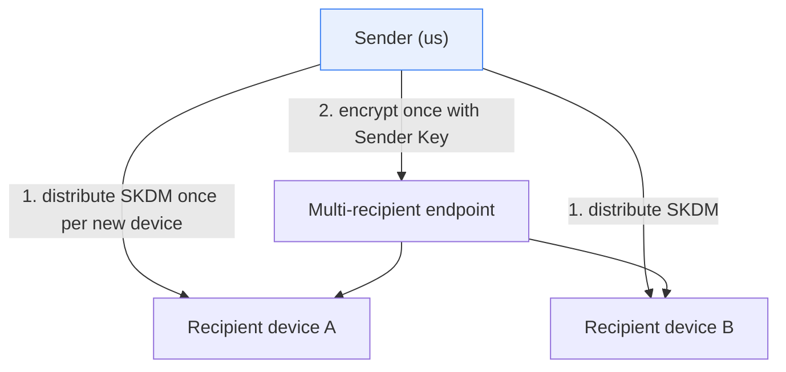
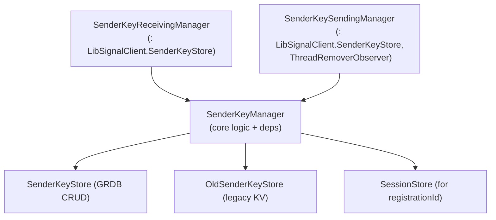
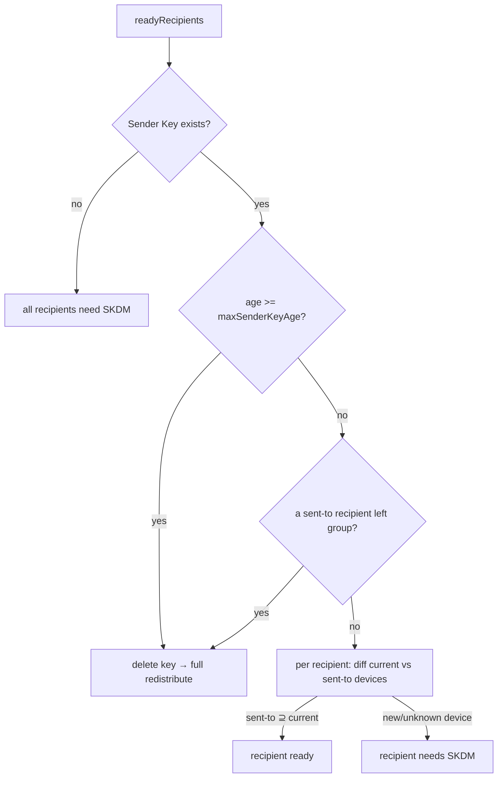

# Sealed Sender, Sender Keys & Unidentified Delivery

This document covers the **Sender Key** machinery in `SignalServiceKit/Axolotl/`
(`SenderKeyStore`, `SenderKeyManager`, `OldSenderKeyStore`) that enables efficient
**group** message fan-out, and how it intersects **sealed sender / unidentified
delivery**. It documents what the first-party code does; the Sender Key ratchet
and the sealed-sender envelope encryption themselves live inside LibSignal.

> **Confidence labels.** **[High]** = explicit in source; **[Medium]** = inferred
> but depends on out-of-tree collaborators; **[Low]** = inferred from
> naming/comments. Line numbers are approximate anchors.

> **Scope boundary.** The Sender Key *symmetric ratchet*, the
> `SenderKeyDistributionMessage` (SKDM) crypto, and the sealed-sender
> `UnidentifiedSenderMessage` encryption all live in **LibSignalClient** (out of
> tree). The Swift code here manages: (1) **which** Sender Key to use per group
> thread, (2) **who** has already received a copy of it (SKDM delivery tracking),
> (3) persistence of the opaque Sender Key records, and (4) migration from a
> legacy store. The **unidentified-access-key** material surfaces here only via
> `udManager` in Key Transparency; the sealed-sender *certificate* handling is not
> in these files — **intent/implementation undetermined — no evidence in source**
> for the certificate path. **[High]**

---

## 1. What a Sender Key is for

In a 1:1 session (see [sessions-and-ratchet.md](sessions-and-ratchet.md)), a sender
pairwise-encrypts to each recipient device. For large groups that is O(devices)
per message. A **Sender Key** lets a sender encrypt a message **once** and send the
same ciphertext to many recipients, after first distributing the Sender Key to each
recipient device via a **Sender Key Distribution Message (SKDM)**. **[Medium]**
(inferred from the SKDM-tracking comment at
`SignalServiceKit/Axolotl/SenderKeyStore.swift:95-107`)

---

## 2. On-disk model

### 2.1 `SenderKeyRecord` (table `SenderKey`)

`SenderKeyRecord` (`SignalServiceKit/Axolotl/SenderKeyStore.swift:11-105`) stores a
Sender Key — ours or someone else's: **[High]**

- `ownerRecipientId` + `ownerDeviceId` + `distributionId (UUID)` — the owning
  (device, distribution) tuple (`SenderKeyStore.swift:16-18`). **[High]**
- `deletionType: DeletionType` — `thisDevice = 0` (our own sending key, deletable at
  will) vs. `otherDevice = 1` (received from someone else)
  (`SenderKeyStore.swift:28-37`). **[High]**
- `insertedAt` / `insertedAtDate` — creation time, used for age-based expiry
  (`SenderKeyStore.swift:20-26`). **[High]**
- `serializedRecord: Data` — the opaque LibSignal `SenderKeyRecord` bytes
  (`SenderKeyStore.swift:22`). **[High]**

### 2.2 `SenderKeySentToDeviceRecord` (table `SenderKeySentToDevice`)

Tracks SKDM delivery with a 1:N relationship to `SenderKeyRecord`
(`SignalServiceKit/Axolotl/SenderKeyStore.swift:95-144`, struct declared at
`SenderKeyStore.swift:108`): one row per `(senderKeyId, recipientId, deviceId,
registrationId)` indicating that device has a copy of our Sender Key and can decrypt
(`SenderKeyStore.swift:118-129`). The stored `registrationId` lets the sender detect
a device re-install and re-distribute (`SenderKeyStore.swift:126-129`). Insert conflict
policy is `.replace` on insert (`SenderKeyStore.swift:111`). **[High]**

### 2.3 Distribution-id mapping

A per-thread `distributionId` (UUID) is kept in a `KeyValueStore` collection
`SenderKeyStore_SendingDistributionId`
(`SignalServiceKit/Axolotl/SenderKeyManager.swift:10`), via
`fetchOrCreateDistributionId(forThreadUniqueId:)`
(`SenderKeyManager.swift:203-211`, within `SenderKeySendingManager`;
`fetchDistributionId` at `SenderKeyManager.swift:199-201`). The id is removed when
the thread is removed (`didRemoveThread`,
`SenderKeyManager.swift:587-589`, via `removeDistributionId` at
`SenderKeyManager.swift:212-214`). **[High]**

---

## 3. The manager stack

`SenderKeyManager` (`SenderKeyManager.swift:8-141`) holds the stores and recipient
helpers. Two thin adapters conform to `LibSignalClient.SenderKeyStore` and differ
only in **context** (`SenderKeyReceivingManager` at `SenderKeyManager.swift:145-168`
and `SenderKeySendingManager` at `SenderKeyManager.swift:174-589`): **[High]**

- `SenderKeyReceivingManager.storeSenderKey` stores with
  `deletionType: .otherDevice` (keys arriving **from** other devices)
  (`SenderKeyManager.swift:154-164`). **[High]**
- `SenderKeySendingManager.storeSenderKey` stores with
  `deletionType: .thisDevice` and never updates the inserted-at date
  (`shouldUpdateInsertedAtDate: false`)
  (`SenderKeyManager.swift:183-193`). **[High]**

Both load via `senderKeyManager.loadSenderKey` (`SenderKeyManager.swift:75-96`),
which requires the sender's `ServiceId` to be an **ACI**
(`"must have ACI for sender keys"`, `SenderKeyManager.swift:82`), tries the new
store (`_loadSenderKey`, `SenderKeyManager.swift:99-119`) then falls back to the old
store (`_loadOldSenderKey`, `SenderKeyManager.swift:121-133`), and bypasses a
malformed record by returning `nil` (`SenderKeyManager.swift:91-95`).
**[High]**

---

## 4. SKDM: deciding who needs a copy (`readyRecipients`)

The heart of send-side correctness is `SenderKeySendingManager.readyRecipients`
(`SenderKeyManager.swift:236-332`). It computes, for each intended
recipient, whether every device already has our current Sender Key (and thus can
decrypt without a fresh SKDM). **[High]**

Steps: **[High]**

1. Precondition: `acceptableServiceIds` must be a superset of `attemptServiceIds`
   (`owsPrecondition`).
2. Fetch/create the thread's `distributionId` and migrate any legacy Sender Key
   (§6).
3. Load our `SenderKeyRecord` for `(localRecipient, localDeviceId, distributionId)`.
4. **Expiry**: if `now - insertedAtDate >= maxSenderKeyAge`, **delete** the Sender
   Key and start over (forces a brand-new key + SKDMs).
5. **Membership change**: if any `SenderKeySentToDevice` row references a recipient
   no longer in `acceptableRecipientIds`, delete the Sender Key (a member left →
   rotate).
6. For each attempt recipient, build its **current** device state
   (`recipientDeviceStates`) — each device's `registrationId` read from the **1:1
   session** via `session.remoteRegistrationId()`.
7. Compare current `(deviceId, registrationId)` devices against the recorded
   "sent-to" set (`sentToRecipientDevices`): a recipient is **ready** only if the
   recorded set is a superset of the current device set; any new device or any
   device lacking a registration ID forces an SKDM (returns `nil`).

Edge cases: **[High]**

- A **PNI** recipient whose ACI is known cannot use a Sender Key
  (`!recipient.canSendToPni()` → skipped,
  `SenderKeyManager.swift:308-311`). **[High]**
- `SignalError.sessionNotFound` while reading device state → that recipient is "not
  ready" (needs a 1:1 session first). Any other error → defensively "not ready"
  (`SenderKeyManager.swift:314-326`). **[High]**
- A device with **no** registration ID is assumed new and forces an SKDM
  (`sentToRecipientDevices` returns `nil`,
  `SenderKeyManager.swift:359-380`, specifically the guard at `:365-369`). **[High]**

---

## 5. Building & recording SKDMs

- `buildSenderKeyDistributionMessage(forThreadUniqueId:...)` creates a
  `LibSignalClient.SenderKeyDistributionMessage` from the thread's distribution id,
  using `self` as the LibSignal `SenderKeyStore`
  (`SenderKeyManager.swift:382-403`). It migrates any
  legacy key first (to cover resend-response flows) (`SenderKeyManager.swift:391-397`). **[High]**
- After sending SKDMs, `recordSentSenderKeys` upserts a `SenderKeySentToDevice` row
  per `(recipient, device)` via `upsertSentToRecord`; if the Sender Key was deleted
  in the meantime, the constraint failure is caught and logged (the record is simply
  not recorded) (`SenderKeyManager.swift:443-471`, catch at `:466-468`). **[High]**
- `resetDeliveryRecord` clears the sent-to rows for a `(senderKeyId, recipientId)`
  (`SenderKeyStore.swift:149-160`, `SenderKeyManager.swift:473-476`).
  **[High]**

---

## 6. Legacy migration (`OldSenderKeyStore`)

`OldSenderKeyStore` (`SignalServiceKit/Axolotl/OldSenderKeyStore.swift:13-81`) is a
`KeyValueStore` (collection `SenderKeyStore_KeyMetadata`,
`OldSenderKeyStore.swift:27`) keyed by
`"<ACI>.<distributionId>"` (`OldSenderKeyStore.swift:17-19`). Its `KeyMetadata`
Codable (`OldSenderKeyStore.swift:86-114`, Codable conformance at
`OldSenderKeyStore.swift:116-173`) supports **three historical layouts** (V1
UUID→devices, V2 address→recipient, V3 address→`SKDMSendInfo`) with best-effort
decode fallbacks (`OldSenderKeyStore.swift:153-172`). **[High]**

`SenderKeySendingManager.migrateSenderKeyIfNeeded`
(`SenderKeyManager.swift:480-583`): **[High]**

- Entirely **gated** behind `BuildFlags.decodeOldSenderKeys`; if off, no-op
  (`SenderKeyManager.swift:486`). **[High]**
- Reads/removes the old metadata (always deletes it once migration is attempted,
  even on error) (`SenderKeyManager.swift:493-509`).
- Validates ownership: must be `isForEncrypting`, owned by `localAci` +
  `localDeviceId`, and the matching `distributionId` (else `owsFailDebug` + abort)
  (`SenderKeyManager.swift:511-528`).
- Inserts the migrated `SenderKeyRecord` (deletion type `.thisDevice`,
  `shouldUpdateInsertedAtDate: true`, creation date from old metadata) and recreates
  the sent-to rows from `oldKeyMetadata.sentKeyInfo`
  (`SenderKeyManager.swift:538-582`).

`resetAll` (`SenderKeyManager.swift:32-42`) wipes the old KV store, the
distribution-id store, and (FK-ordered) `SenderKeySentToDevice` then `SenderKey`.
**[High]**

> **Feature flag.** `BuildFlags.decodeOldSenderKeys` also gates
> `_loadOldSenderKey` (`SenderKeyManager.swift:121-133`, guard at `:126-128`); when
> disabled, legacy keys are neither read nor migrated. **[High]**

---

## 7. Expiry & deletion

| Trigger | Effect | Citation |
| --- | --- | --- |
| `now - insertedAtDate >= maxSenderKeyAge` | delete Sender Key, full redistribute | `SignalServiceKit/Axolotl/SenderKeyManager.swift:279-283` (`readyRecipients`) |
| A sent-to recipient leaves the group | delete Sender Key | `SignalServiceKit/Axolotl/SenderKeyManager.swift:290-294` (`readyRecipients`) |
| Thread removed | remove thread's distribution id | `SignalServiceKit/Axolotl/SenderKeyManager.swift:587-589` (`didRemoveThread`) |
| `deleteSenderKey(forThreadUniqueId:...)` | delete our Sender Key for the thread | `SignalServiceKit/Axolotl/SenderKeyManager.swift:216-234` (`deleteSenderKey`) |
| `resetAll` | wipe all Sender Key state | `SignalServiceKit/Axolotl/SenderKeyManager.swift:32-42` (`resetAll`) |

`maxSenderKeyAge` is supplied by the caller (the message send path, out of scope);
the store itself only compares against it
(`SenderKeyManager.swift:279`, within `readyRecipients`). **[High]**

---

## 8. Relationship to sealed sender / unidentified delivery

- Sender Keys are the batching layer that the sealed-sender **multi-recipient**
  endpoint rides on: once recipients are "ready", a single ciphertext goes to the
  multi-recipient endpoint (SKDM-tracking comment,
  `SenderKeyStore.swift:95-107`; readiness computed by `readyRecipients`,
  `SenderKeyManager.swift:236-332`). **[High]** / endpoint invocation **[Medium]**
  (the send call is out of tree).
- The **unidentified access key** (the symmetric key gating sealed-sender delivery)
  appears in this tree via `OWSUDManager.udAccessKey(for:tx:)`, which Key
  Transparency reads to assemble `E164Info`
  (`SignalServiceKit/KeyTransparency/KeyTransparencyManager.swift:128-144`). The UD
  **manager** and sealed-sender **certificate** logic are defined outside the
  reviewed directories — **intent undetermined — no evidence in source** here for
  the full sealed-sender envelope path. **[Low]**

---

## 9. Validation rules & error paths

| Rule / error | Where | Citation |
| --- | --- | --- |
| Sender Keys require an ACI sender | `storeSenderKey`/`loadSenderKey` | `SignalServiceKit/Axolotl/SenderKeyManager.swift:56` and `:82` (`"must have ACI for sender keys"`) |
| Malformed Sender Key record → bypass (`nil`) | `loadSenderKey` | `SignalServiceKit/Axolotl/SenderKeyManager.swift:91-95` |
| PNI recipient with known ACI can't use Sender Key | `readyRecipients` | `SignalServiceKit/Axolotl/SenderKeyManager.swift:308-311` |
| Missing 1:1 session → recipient not ready | `readyRecipients` | `SignalServiceKit/Axolotl/SenderKeyManager.swift:315-317` |
| Device without registrationId → forces SKDM | `sentToRecipientDevices` | `SignalServiceKit/Axolotl/SenderKeyManager.swift:365-369` |
| Recording sent-to after key deletion | caught `ConstraintError`, logged | `SignalServiceKit/Axolotl/SenderKeyManager.swift:466-468` (`recordSentSenderKeys`) |
| Legacy migration disabled | `BuildFlags.decodeOldSenderKeys` | `SignalServiceKit/Axolotl/SenderKeyManager.swift:486` (`migrateSenderKeyIfNeeded`), `:126-128` (`_loadOldSenderKey`) |
| Unmigratable V1 legacy delivery data | reset to empty (resend SKDM) | `SignalServiceKit/Axolotl/OldSenderKeyStore.swift:167-171` |

---

### Related documents

- [sessions-and-ratchet.md](sessions-and-ratchet.md) — 1:1 sessions and the
  `remoteRegistrationId()` that Sender Key readiness depends on.
- [identity-and-keys.md](identity-and-keys.md) — identity keys & the UD access key
  context.
- [key-transparency.md](key-transparency.md) — where the unidentified access key is
  consumed.
