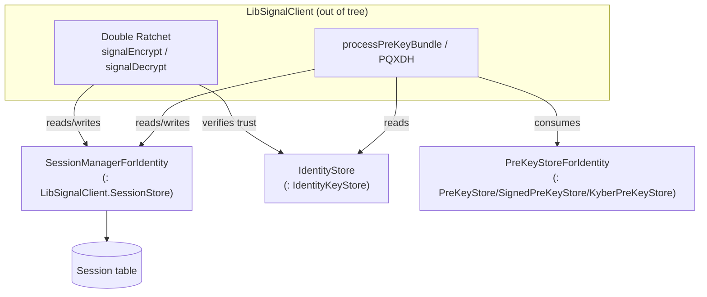
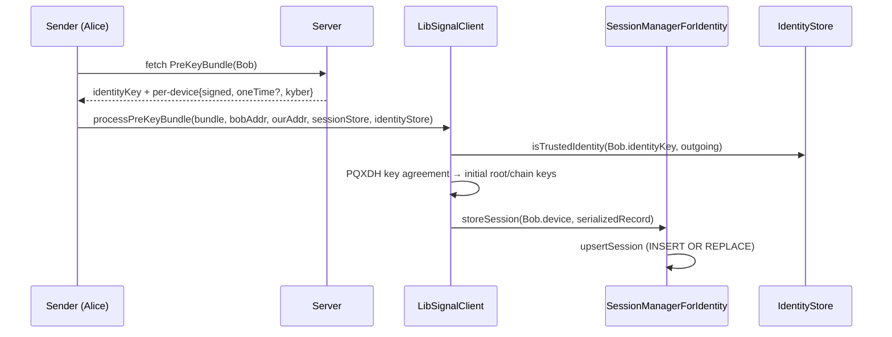
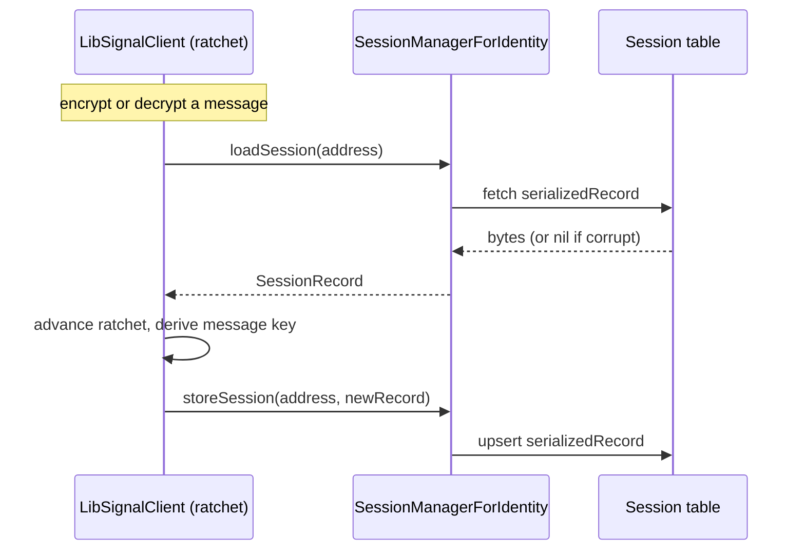
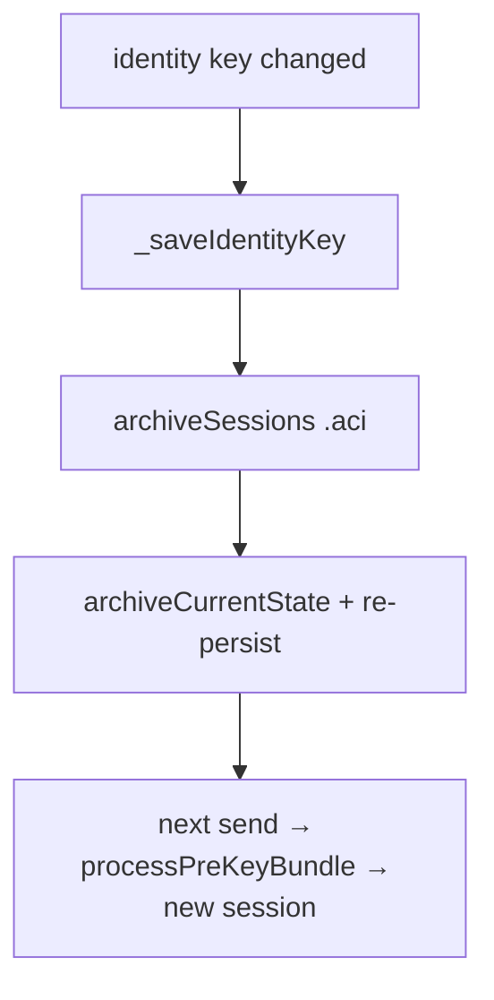

# Sessions, X3DH/PQXDH & the Double Ratchet

This document covers **1:1 session establishment** (X3DH / PQXDH) and the
**Double Ratchet**, as they are integrated in `SignalServiceKit/Axolotl/`. It
describes how the Swift session store (`SessionStore` /
`SessionManagerForIdentity`) backs LibSignal's ratchet state, how a fetched
pre-key bundle (`PreKeyBundle`) is turned into a session, and how encrypt/decrypt
flows reach these stores.

> **Confidence labels.** **[High]** = explicit in source; **[Medium]** = inferred
> but depends on out-of-tree collaborators; **[Low]** = inferred from
> naming/comments. Line numbers are approximate anchors.

> **Critical scope boundary.** The X3DH/PQXDH key-agreement math, the Double
> Ratchet (root/chain key derivation, message keys, header encryption), and the
> `SessionRecord` byte format all live inside **LibSignalClient** — a dependency
> **not present in this tree**. Signal iOS supplies LibSignal with **stores**
> (session, identity, pre-key) and **inputs** (pre-key bundles), and persists the
> opaque session state LibSignal hands back. This document is therefore about the
> **integration seam**, not the ratchet internals. Statements about X3DH/ratchet
> *mechanics* are labeled **[Medium]/[Low]** because they are inferred from the
> integration surface and comments, not from in-tree algorithm code. **[High]**

---

## 1. The store seam

LibSignal's session protocol needs three stores to operate: a session store, an
identity store, and (when processing a bundle) pre-key stores. Signal iOS supplies
all three from `SignalProtocolStore`
(`SignalServiceKit/Axolotl/SignalProtocolStore.swift:8-27`), whose header comment
states it "Wraps the stores for 1:1 sessions that use the Signal Protocol (Double
Ratchet + X3DH)" (`SignalProtocolStore.swift:6`). **[High]**

- `SessionManagerForIdentity` conforms to `LibSignalClient.SessionStore`
  (`SignalServiceKit/Axolotl/SessionStore.swift:203-315`). **[High]**
- `IdentityStore` conforms to `LibSignalClient.IdentityKeyStore` (see
  [identity-and-keys.md](identity-and-keys.md),
  `SignalServiceKit/Messages/OWSIdentityManager.swift:124-177`). **[High]**
- `PreKeyStoreForIdentity` conforms to the three pre-key store protocols (see
  [prekeys.md](prekeys.md), `SignalServiceKit/Axolotl/PreKeyStore.swift:171-233`).
  **[High]**

---

## 2. The session record on disk

`SessionRecord` (`SignalServiceKit/Axolotl/SessionStore.swift:9-33`) is a GRDB row
in table `Session`: **[High]**

- `recipientId: SignalRecipient.RowId` — *who* the session is with.
- `localIdentity: OWSIdentity` — *which of our identities* (ACI/PNI) owns it.
- `deviceId: DeviceId` — sessions are **per-device**, so one recipient has one
  session per device.
- `serializedRecord: Data?` — the **opaque LibSignal `SessionRecord` bytes**
  (ratchet state). Nullable to tolerate "legacy" rows
  (`SessionStore.swift:17-18`). **[High]**

The ratchet state (root key, sending/receiving chains, skipped message keys, etc.)
is entirely inside `serializedRecord`; the Swift layer never interprets it. **[High]**

---

## 3. `SessionStore` (storage) vs. `SessionManagerForIdentity` (adapter)

The lower-level `SessionStore` struct (`SessionStore.swift:35-201`) does raw CRUD
keyed by `(recipientId, localIdentity, deviceId)`
(`buildQuery`, `SessionStore.swift:72-82`). The higher-level
`SessionManagerForIdentity` (`SessionStore.swift:203-315`) is fixed to one
`OWSIdentity` and translates `ServiceId`→`recipientId` via a `RecipientIdFinder`,
then delegates to `SessionStore`. **[High]**

### 3.1 LibSignal `SessionStore` callbacks

| LibSignal callback | Implementation | Citation |
| --- | --- | --- |
| `loadSession(for:context:)` | `fetchSession` by serviceId→recipientId + deviceId | `SignalServiceKit/Axolotl/SessionStore.swift:287-295` |
| `loadExistingSessions(for:context:)` | maps each address; throws `sessionNotFound` if any missing | `SignalServiceKit/Axolotl/SessionStore.swift:297-306` |
| `storeSession(_:for:context:)` | `ensureRecipientId` then `upsertSession` | `SignalServiceKit/Axolotl/SessionStore.swift:308-331` |

### 3.2 Decode-tolerance & corruption handling

`fetchSession` deserializes `serializedRecord` into a
`LibSignalClient.SessionRecord`. If deserialization **throws** (likely DB
corruption), it logs and returns `nil`, deliberately behaving as if **no session
exists** so a fresh one is created
(`SessionStore.swift:99-120`). **[High]** This is a notable edge case: corruption
silently triggers re-establishment rather than a hard failure.

### 3.3 PNI/ACI exclusivity

Both `loadSession` and `storeSession` route through the `RecipientIdFinder`, which
can return `RecipientIdError.mustNotUsePniBecauseAciExists`. In that case the store
**throws** (store/load) or treats as "no sessions" (archive/delete)
(`SessionStore.swift:259-285`, `SessionStore.swift:308-331`). This enforces that
once a recipient's ACI is known, their PNI must not be used to key sessions.
**[High]**

---

## 4. Session establishment (X3DH / PQXDH)

A session is bootstrapped by **processing a pre-key bundle** fetched from the
server. The server bundle is modeled by `PreKeyBundle`
(`SignalServiceKit/Axolotl/PreKeyBundle.swift:8-120`): **[High]**

- A top-level `identityKey` (**33 bytes**) and a list of per-device bundles
  (`PreKeyBundle.swift:9-29`). **[High]**
- Each `PreKeyDeviceBundle` has `deviceId`, `registrationId`, a **signed** EC
  pre-key, an **optional** one-time EC pre-key, and a (mandatory) **Kyber** PQ
  pre-key — all public keys validated at **33 bytes**
  (`PreKeyBundle.swift:31-120`). **[High]**

> The *mandatory* `pqPreKey` on every device bundle (`PreKeyBundle.swift:36`) is
> what makes establishment PQXDH (post-quantum X3DH). The one-time EC pre-key is
> optional because the server may have exhausted the uploader's one-time keys.
> **[Medium]**

### 4.1 How the bundle becomes a session

The exact production call site that invokes `processPreKeyBundle` is in the message
send path (out of scope), but the **mechanism** is captured verbatim in the test
helper `MockSessionStore.processPreKeyBundle`
(`SignalServiceKit/Axolotl/SessionStore.swift:333-391`), which assembles a
`LibSignalClient.PreKeyBundle` from an EC pre-key, a signed EC pre-key (+signature),
a Kyber pre-key (+signature), and an identity key, then calls
`LibSignalClient.processPreKeyBundle(...)` passing **our** `sessionStore` and
`identityStore` (`SessionStore.swift:360-391`). **[High]** The resulting ratchet
state is written back through `storeSession`. **[High]**

### 4.2 Signature role of pre-keys

The signed EC pre-key and the Kyber pre-key each carry a signature by the
**identity key** (produced at generation time, see [prekeys.md](prekeys.md)
§4). The one-time EC pre-key is unsigned. Signature verification happens inside
LibSignal during `processPreKeyBundle`; it binds the ephemeral pre-keys to the
long-term identity. **[Medium]**

---

## 5. The Double Ratchet (integration view)

Once a session exists, LibSignal's `signalEncrypt`/`signalDecrypt` (invoked from
the out-of-scope message pipeline) advance the Double Ratchet, reading and writing
the `SessionRecord` through `SessionManagerForIdentity`. Every encrypt/decrypt that
mutates ratchet state results in a `storeSession` → `upsertSession` with the new
serialized record (`INSERT OR REPLACE`, `SessionStore.swift:170-199`). **[High]**

The chain-key/message-key derivation, out-of-order handling, and
forward-secrecy/post-compromise properties are entirely inside LibSignal and are
**not** verifiable from this tree. **[High]** / mechanics **[Low]**.

---

## 6. Session lifecycle events

### 6.1 Archival (soft reset)

`archiveSessions` loads each record, calls LibSignal's
`archiveCurrentState()`, and re-persists it
(`SessionStore.swift:122-160`). Archiving keeps the record but marks the current
ratchet state as archived, so the **next** outbound message starts a fresh session
while still being able to decrypt in-flight inbound messages keyed to the archived
state. A legacy record with `nil` bytes is left as-is
(`SessionStore.swift:143-146`). **[High]**

`SessionManagerForIdentity.archiveSessions(forServiceId:)` resolves the recipient
and, if `mustNotUsePniBecauseAciExists` or no recipient, no-ops (nothing to
archive) (`SessionStore.swift:234-252`). **[High]**

**Trigger from identity changes.** When a remote identity key changes,
`OWSIdentityManager._saveIdentityKey` calls
`sessionStore.archiveSessions(forRecipientId:localIdentity: .aci)`
(`SignalServiceKit/Messages/OWSIdentityManager.swift:433`). This is the concrete
link between a key change and a forced new X3DH handshake. **[High]**

### 6.2 Deletion (hard reset)

`deleteSessions` removes all session rows for a recipient+identity
(`SessionStore.swift:162-176`); `deleteAllSessions` wipes the whole table
(`SessionStore.swift:201-203`). `SignalProtocolStoreManager.removeAllKeys` deletes
all sessions and all pre-keys/metadata together
(`SignalServiceKit/Axolotl/SignalProtocolStore.swift:45-55`). **[High]**

### 6.3 Recipient merge

`mergeRecipientId` moves sessions from one recipient row to another **only when the
target has none**; if the target already has sessions, the source's are deleted
(the target's are preferred) (`SessionStore.swift:48-70`). **[High]**

---

## 7. Registration IDs

Each `OWSIdentity` has a registration ID that LibSignal embeds in sessions and
messages to distinguish device re-installs. `IdentityStore.localRegistrationId`
returns it (`SignalServiceKit/Messages/OWSIdentityManager.swift:143-145`), and
`libSignalStore(for:tx:)` refuses to build a store if the registration ID is
missing (`OWSIdentityManager.swift:268-285`). The **remote** registration ID of a
peer device is read from the session itself via `session.remoteRegistrationId()`
(used by sender-key readiness logic,
`SignalServiceKit/Axolotl/SenderKeyManager.swift` — see
[sealed-sender.md](sealed-sender.md)). **[High]**

---

## 8. Validation rules, error paths & edge cases

| Rule / error | Where | Citation |
| --- | --- | --- |
| Corrupt session bytes → treat as no session (re-establish) | `fetchSession` | `SignalServiceKit/Axolotl/SessionStore.swift:109-119` |
| Missing session in `loadExistingSessions` → `SignalError.sessionNotFound` | `loadExistingSessions` | `SignalServiceKit/Axolotl/SessionStore.swift:300-304` |
| PNI must not be used once ACI exists | load/store/archive/delete | `SignalServiceKit/Axolotl/SessionStore.swift:263-285`, `:321-329` |
| Legacy (nil) session record skipped on archive | `_archiveSessions` | `SignalServiceKit/Axolotl/SessionStore.swift:143-146` |
| Session upsert is `INSERT OR REPLACE` (idempotent) | `upsertSession` | `SignalServiceKit/Axolotl/SessionStore.swift:178-198` |
| Target recipient's sessions preferred on merge | `mergeRecipientId` | `SignalServiceKit/Axolotl/SessionStore.swift:55-69` |
| Pre-key bundle public keys must be 33 bytes | `PreKeyBundle` decode | `SignalServiceKit/Axolotl/PreKeyBundle.swift:46-54`, `:84-92` |
| Store cannot build without registrationId | `libSignalStore` | `SignalServiceKit/Messages/OWSIdentityManager.swift:272-274` |

---

### Related documents

- [identity-and-keys.md](identity-and-keys.md) — identity keys and the key-change
  → session-archive linkage.
- [prekeys.md](prekeys.md) — the pre-key bundle inputs to X3DH/PQXDH.
- [sealed-sender.md](sealed-sender.md) — group fan-out via Sender Keys, which build
  on 1:1 sessions.
