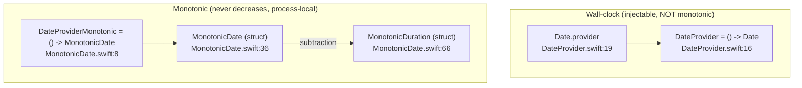

# SignalServiceKit — Dates module

This documentation set covers the **time abstractions** in
[`SignalServiceKit/Dates/`](../../../SignalServiceKit/Dates/) — a small (2 Swift
files, ~130 LOC total) but widely-depended-upon module that provides two kinds
of "now":

1. **Wall-clock time** (`DateProvider` → `Date`), which can jump backwards or
   forwards when the user changes their clock or the system corrects it. Its
   purpose is to make "the current `Date`" *injectable* so tests can stub it.
2. **Monotonic time** (`DateProviderMonotonic` → `MonotonicDate`, plus
   `MonotonicDuration`), which is guaranteed never to decrease and is used for
   measuring elapsed durations within a single process.

The module's single responsibility is to supply these injectable clocks and the
monotonic value types; it contains no scheduling, persistence, or formatting
logic of its own.

> **Confidence labels.** Each claim is tagged with a confidence level:
> - **[High]** — directly read from source; behavior is explicit in the code.
> - **[Medium]** — inferred from code with reasonable certainty, but depends on
>   collaborators defined outside `SignalServiceKit/Dates/`.
> - **[Low]** — inferred from naming/comments; not fully verified in-tree.
>
> Where the source gives no evidence for a design question, the text says
> **"intent undetermined — no evidence in source"** rather than guessing.
>
> **Citations** are given as `File.swift:line` relative to the repository root.
> Line numbers reflect the state of the tree at authoring time and may drift as
> code changes; use the cited symbol name to re-locate code if lines have moved.

## Where things live

| Area | Source | Symbol |
| --- | --- | --- |
| Wall-clock provider | `Dates/DateProvider.swift` | `DateProvider`, `Date.provider` |
| Monotonic provider | `Dates/MonotonicDate.swift` | `DateProviderMonotonic`, `MonotonicDate.provider` |
| Monotonic instant | `Dates/MonotonicDate.swift` | `MonotonicDate` |
| Monotonic span | `Dates/MonotonicDate.swift` | `MonotonicDuration` |

## Two clocks, by design



The two mechanisms are intentionally separate. The `DateProvider` doc-comment
explicitly steers callers who want to *measure durations* away from `Date` and
toward the monotonic type: "`Date` is not guaranteed to be monotonic. Callers
interested in using a `dateProvider` to compute durations should prefer instead
a monotonic type." **[High]** (`DateProvider.swift:10-14`)

## `DateProvider` — injectable wall-clock

`DateProvider` is a type alias for a zero-argument closure returning a `Date`:
`public typealias DateProvider = () -> Date`. **[High]**
(`DateProvider.swift:16`)

Its stated purpose is "Used to stub out dates in tests." **[High]**
(`DateProvider.swift:8`) The production implementation is exposed as a static
property on `Date` that simply returns a closure constructing `Date()`:

```swift
extension Date {
    public static var provider: DateProvider {
        return { Date() }
    }
}
```

**[High]** (`DateProvider.swift:18-22`)

By passing a `DateProvider` into a type rather than calling `Date()` directly,
tests can substitute a closure that returns a fixed or controllable date. This
injection pattern is used throughout the codebase; for example, the pre-key test
mocks alias their own `DateProvider` type. **[Medium]**
(`SignalServiceKit/tests/Account/PreKeys/PreKeyTaskTestMocks.swift:20`)

### `DurationProvider` cross-reference is dangling

The `DateProvider` doc-comment lists `- SeeAlso ``DurationProvider```. **[High]**
(`DateProvider.swift:15`) However, there is **no `DurationProvider` definition
anywhere in the tree** — the only occurrence of that identifier is this very
doc-comment. **[High]** (`DateProvider.swift:15`; a repository-wide search for
`DurationProvider` returns only this single line.) Whether `DurationProvider`
was renamed, removed, or never landed is **intent undetermined — no evidence in
source**. The sibling `- SeeAlso ``DateProviderMonotonic``` reference, by
contrast, does resolve (see below). **[High]** (`DateProvider.swift:14`,
`MonotonicDate.swift:8`)

## `DateProviderMonotonic` — injectable monotonic clock

The monotonic counterpart mirrors the wall-clock design. It is a closure alias
`public typealias DateProviderMonotonic = () -> MonotonicDate` **[High]**
(`MonotonicDate.swift:8`), with a production provider exposed on `MonotonicDate`:

```swift
extension MonotonicDate {
    public static var provider: DateProviderMonotonic {
        { MonotonicDate() }
    }
}
```

**[High]** (`MonotonicDate.swift:10-14`)

## `MonotonicDate` — a clock that cannot go backwards

`MonotonicDate` is a `Comparable` struct wrapping a single private
`rawValue: UInt64` of nanoseconds. **[High]** (`MonotonicDate.swift:36-37`)

Key properties, all per the source and its doc-comment:

- **Not affected by clock changes.** It is "A Date-esque type that's not
  impacted by changes to the user's clock" and "is … almost exclusively used
  for measuring durations." **[High]** (`MonotonicDate.swift:18-20`)
- **Never decreases.** "A MonotonicDate is guaranteed to never decrease (but may
  remain the same)," so subtracting an earlier instant from a later one never
  underflows (it may yield "0"). **[High]** (`MonotonicDate.swift:22-30`)
- **Process-local; never persist it.** "MonotonicDate is only valid within a
  single process. You should NEVER persist one of them to disk." The rationale:
  after relaunch the device may have rebooted, which is indistinguishable from
  the user changing their clock. **[High]** (`MonotonicDate.swift:31-35`)

### Construction

The public `init()` reads the system monotonic clock via
`clock_gettime_nsec_np(CLOCK_MONOTONIC_RAW)`. If that returns `0`, it is treated
as a fatal error: `owsFail("Couldn't get monotonic time: \(errno)")`. **[High]**
(`MonotonicDate.swift:43-49`) `owsFail` is defined outside this module, so the
exact crash/assert behavior is **[Medium]** here. The all-args
`init(rawValue:)` is `private`, so callers cannot fabricate an arbitrary
monotonic instant. **[High]** (`MonotonicDate.swift:39-41`)

### Operations

- `adding(_ timeInterval:)` returns a new `MonotonicDate` offset by the interval,
  converting via `TimeInterval.clampedNanoseconds`. **[High]**
  (`MonotonicDate.swift:51-53`) `clampedNanoseconds` clamps the interval to
  `[0, Int64.max]` nanoseconds (NaN → 0), defined in
  `SignalServiceKit/Util/TimeInterval+SSK.swift:48-54`. **[High]**
- `<` compares the underlying `rawValue`s, satisfying `Comparable`. **[High]**
  (`MonotonicDate.swift:55-57`)
- `-` (subtraction) returns a `MonotonicDuration` from the nanosecond
  difference, with the documented precondition "The given date must not be after
  this date!" Because `rawValue` is `UInt64`, violating this precondition would
  underflow. **[High]** (`MonotonicDate.swift:59-63`)

## `MonotonicDuration` — the result of subtracting instants

`MonotonicDuration` is a `Comparable`, `CustomDebugStringConvertible` struct
wrapping a public `nanoseconds: UInt64`. **[High]** (`MonotonicDate.swift:66-67`)

Initializers:

- `init(nanoseconds:)` — stores the raw count. **[High]**
  (`MonotonicDate.swift:69-71`)
- `init(milliseconds:)` — multiplies by `NSEC_PER_MSEC`. **[High]**
  (`MonotonicDate.swift:73-75`)
- `init(clampingSeconds:)` — converts a `TimeInterval` via `clampedNanoseconds`.
  **[High]** (`MonotonicDate.swift:77-79`)

Accessors:

- `milliseconds` — integer-divides nanoseconds by `NSEC_PER_MSEC`, **rounding
  down**. The doc warns this means `a != b` is possible while
  `(a - b).milliseconds == 0`. **[High]** (`MonotonicDate.swift:81-88`)
- `seconds` — returns `nanoseconds / NSEC_PER_SEC` as a `TimeInterval`. **[High]**
  (`MonotonicDate.swift:90-93`)

Protocol conformances:

- `<` compares `nanoseconds`. **[High]** (`MonotonicDate.swift:95-97`)
- `debugDescription` prints `"<n>ns"` for sub-millisecond durations and
  `"<n>ms"` otherwise. **[High]** (`MonotonicDate.swift:99-104`)

## Worked example (from the source doc-comment)

```swift
let a = MonotonicDate()
let b = MonotonicDate()
print(b - a)   // a MonotonicDuration; never negative
```

This snippet is reproduced from the `MonotonicDate` doc-comment and illustrates
the no-underflow guarantee. **[High]** (`MonotonicDate.swift:26-30`)

## Related modules

- **`SignalServiceKit/Util/TimeInterval+SSK.swift`** — supplies the
  `TimeInterval.clampedNanoseconds` conversion used by `MonotonicDate.adding`
  and `MonotonicDuration.init(clampingSeconds:)`, plus the approximate
  `.second`/`.minute`/`.hour`/`.day`/`.week`/`.month`/`.year` constants.
  **[High]** (`SignalServiceKit/Util/TimeInterval+SSK.swift:10-54`)
- **`SignalServiceKit/Jobs/`** — the durable job queue and the `Cron` scheduler
  consume injected clocks and `clampedNanoseconds`-based delays (e.g.
  `JobQueueRunner.swift:360`). See
  [../Jobs/README.md](../Jobs/README.md). **[Medium]**
- **`SignalServiceKit/Network/`** — the chat connection's keepalive/timeout
  logic uses `clampedNanoseconds` sleeps and time measurement
  (`Network/OWSChatConnection.swift:182`, `:1150`, `:1174`). See
  [../Network/README.md](../Network/README.md). **[Medium]**
- **`owsFail`** — the fatal-error primitive invoked by `MonotonicDate.init()`;
  defined outside this module. **[Medium]** (`MonotonicDate.swift:46`)

## File index

| File | Lines | Contents |
| --- | --- | --- |
| `SignalServiceKit/Dates/DateProvider.swift` | 22 | `DateProvider` type alias (`DateProvider.swift:16`), `Date.provider` (`DateProvider.swift:18-22`). **[High]** |
| `SignalServiceKit/Dates/MonotonicDate.swift` | 105 | `DateProviderMonotonic` (`:8`), `MonotonicDate.provider` (`:10-14`), `MonotonicDate` (`:36-64`), `MonotonicDuration` (`:66-105`). **[High]** |
