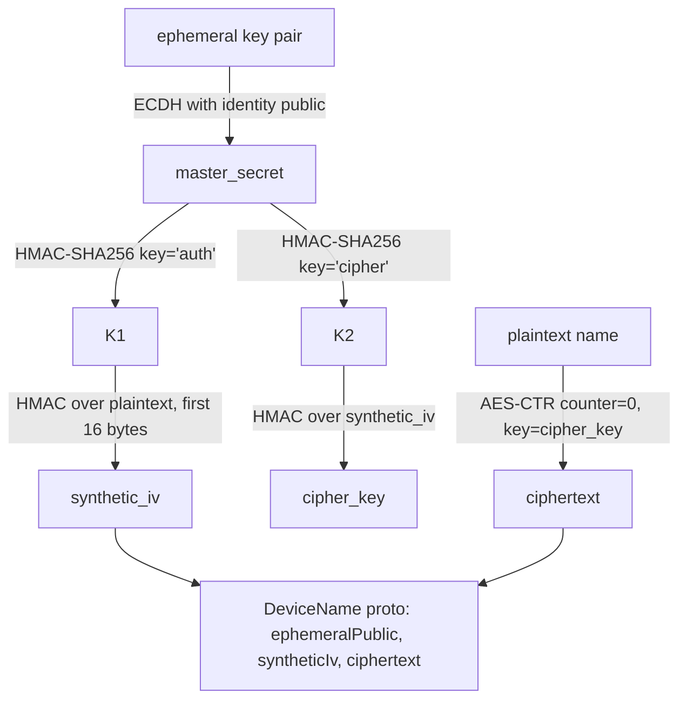
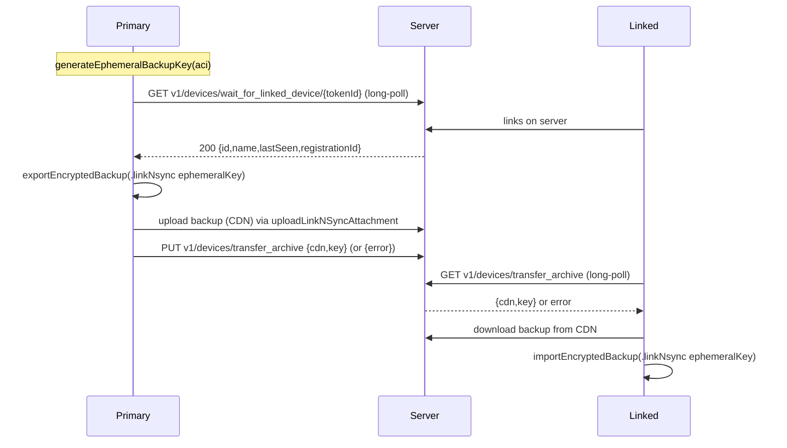

# `SignalServiceKit/Devices/` — Device Linking, Provisioning & Sync

This directory implements **multi-device** support: provisioning/linking a new
linked device, the "Link'n'Sync" fast-restore flow, the local list of linked
devices, device-name encryption, and the family of **sync messages** (and
received transcripts) that keep a primary and its linked devices consistent.

- [1. Device model & list management](#1-device-model--list-management)
- [2. Device-name encryption](#2-device-name-encryption)
- [3. Provisioning (linking a new device)](#3-provisioning-linking-a-new-device)
- [4. Link'n'Sync](#4-linknsync)
- [5. Inactive-device detection](#5-inactive-device-detection)
- [6. Sync messages](#6-sync-messages)
- [7. Sent-message transcript receiver](#7-sent-message-transcript-receiver)
- [8. ConversationSync input streams](#8-conversationsync-input-streams)
- [9. File reference checklist](#9-file-reference-checklist)

---

## 1. Device model & list management

### `OWSDevice.swift`
GRDB record for table **`Device`** (`OWSDevice.swift:9-45`): `deviceId: DeviceId`,
`createdAt: Date`, `lastSeenAt: Date`, `name: String?`. Dates encode as
`timeIntervalSince1970`. `displayName` falls back to localized "This device" for
the primary or "Unnamed device" otherwise (`:28-45`). **[High]**

### `OWSDeviceStore.swift`
`struct OWSDeviceStore` wraps `OWSDevice` CRUD plus a KV store
(`DeviceStore` collection) (`OWSDeviceStore.swift:17-139`): **[High]**
- `fetchAll(tx:)`, `hasLinkedDevices(tx:)` (any non-primary).
- `replaceAll(with:tx:)` — deletes all existing rows and inserts the new set
  (dedup by `deviceId`), returning whether the set changed.
- `remove(_:tx:)`, `setName(_:for:tx:)`.
- `MostRecentlyLinkedDeviceDetails { linkedTime; notificationDelay;
  shouldRemindUserAfter }` plus get/set/clear helpers (used to remind the user to
  name/verify a freshly linked device) (`:7-15`, `:109-139`).

### `OWSDeviceManager.swift`
Tracks whether a sync message has been received recently:
`setHasReceivedSyncMessage(lastReceivedAt:)` and
`hasReceivedSyncMessage(inLastSeconds:)` backed by a KV store
(`OWSDeviceManager.swift:7-78`). **[High]**

### `OWSDeviceService.swift` — server device operations
`protocol OWSDeviceService` (`OWSDeviceService.swift:7-26`): `refreshDevices()`,
`unlinkDevice(deviceId:)`, `renameDevice(device:newName:)`. **[High]**

`OWSDeviceServiceImpl`: **[High]**
- **`refreshDevices()`** (`:112-150`): `GET v1/devices`
  (`TSRequest.getDevices()` `:264-270`), decodes each device, replaces the local
  set, and reconciles the local recipient's device IDs (add/remove). Returns
  whether the set changed.
- **Decrypting device fields** (`parseOWSDevice`, `:166-233`):
  - **Name**: decrypted via `OWSDeviceNames.decryptDeviceName(base64String:
    identityKeyPair:)` using the **ACI identity key pair**; `emptyName` ⇒ nil;
    other decrypt failures ⇒ nil (treated as a legacy name).
  - **createdAt**: an `Int64` sealed with the ACI identity *private key* using
    `info: "deviceCreatedAt"` and `associatedData = deviceId(bigEndian) ||
    registrationId(bigEndian)`. The server is big-endian; iOS defaults to
    little-endian, hence the explicit `bigEndianData` (`:200-227`). **[High]**
- **`unlinkDevice(deviceId:)`** (`:236-238`): `DELETE v1/devices/{id}`
  (`TSRequest.deleteDevice` `:272-280`).
- **`renameDevice(device:newName:)`** (`:240-283`): encrypts the new name with
  the ACI identity key, `PUT v1/accounts/name?deviceId={id}` with body
  `{deviceName}`; expects **204**; on success updates the local store and
  enqueues an `OutgoingDeviceNameChangeSyncMessage` (`:282-320`). **[High]**

---

## 2. Device-name encryption — `OWSDeviceNames.swift`

Device names are encrypted so only devices holding the ACI identity key can read
them. The scheme (`OWSDeviceNames.swift:21-76` encrypt, `:88-168` decrypt): **[High]**

- `master_secret = ECDH(ephemeral_private, identity_public)`.
- `synthetic_iv = HMAC(HMAC(master_secret, "auth"), plaintext)[0:16]`.
- `cipher_key = HMAC(HMAC(master_secret, "cipher"), synthetic_iv)`.
- `ciphertext = AES-CTR(cipher_key, plaintext, counter=0)`.
- Decrypt reverses this and **constant-time-compares** the recomputed synthetic
  IV, throwing `cryptError` on mismatch (`:159-162`). **[High]**
- `enum OWSDeviceNameError { assertionFailure, invalidInput, emptyName,
  cryptError }` (`:9-14`); `invalidInput`/parse failures may indicate a legacy
  (unencrypted) name (`:92-99`, `:109-116`). **[High]**

---

## 3. Provisioning (linking a new device)

Two provisioning-message flavors share one cipher.

### `ProvisioningCipher.swift`
`ProvisioningCipher` (version `1`) performs the asymmetric handshake used to
encrypt a provision message from the primary to the new device
(`ProvisioningCipher.swift:9-130`): **[High]**
- `encrypt`: `sharedSecret = ECDH(our_private, their_public)`; HKDF with
  `info = "TextSecure Provisioning Message"` → 32-byte cipher key + 32-byte MAC
  key; `AES-CBC` encrypt; message = `version(1) || iv || ciphertext || HMAC-SHA256`
  (`:28-73`).
- `decrypt`: validates version, length, splits off the MAC, verifies it
  **constant-time**, then AES-CBC-decrypts (`:75-130`).

### `LinkingProvisioningMessage.swift` — standard linking
`struct LinkingProvisioningMessage` (`LinkingProvisioningMessage.swift:8-200`)
carries everything a new linked device needs to come online with full identity: **[High]**
- `aci`, `aciIdentityKeyPair`, `aep` (AccountEntropyPool), `profileKey`, `mrbk`
  (MediaRootBackupKey), optional `ephemeralBackupKey` (for Link'n'Sync),
  `areReadReceiptsEnabled`, `provisioningCode`, `provisioningUserAgent` ("OWI"),
  `provisioningVersion` (1).
- Nested `PhoneNumberState { phoneNumber: LocalIdentifiers.PhoneNumber;
  pniIdentityKeyPair }` — the **PNI identity key pair** is distributed here so a
  linked device immediately holds correct PNI state (`:14-28`). **[High]**
- `init(_ proto:)` parses `ProvisioningProtos_ProvisionMessage`, validating the
  profile key length, E164, PNI UUID, AEP, and MRBK; it currently **requires a
  phone number** (`TODO` to allow accounts without one) (`:95-152`). **[High]**
- `buildEncryptedMessageBody(theirPublicKey:)` serializes the proto, generates a
  **one-time** cipher key pair, encrypts via `ProvisioningCipher`, and wraps the
  result in a `ProvisioningProtos_ProvisionEnvelope` (`:154-200`). **[High]**

### `RegistrationProvisioningMessage.swift` — quick-restore / registration provisioning
`struct RegistrationProvisioningMessage` (`RegistrationProvisioningMessage.swift:17-...`)
is the richer message used in the "quick restore"/registration-provisioning flow.
In addition to ACI + PNI identity key pairs, AEP, and E164, it carries `pin`,
backup `tier`/`version`/`timestamp`/`sizeBytes`, `restoreMethodToken`,
`lastBackupForwardSecrecyToken`, `nextBackupSecretData`, and a `capabilities` list
(`Capability.wifiaware`) (`:30-130`). It also defines a
`RegistrationProvisioningEnvelope` for parsing (`:9-22`), and
`buildEncryptedMessageBody` mirrors the linking variant (one-time key pair →
`ProvisioningCipher` → envelope) (`:177-...`). **[High]**

---

## 4. Link'n'Sync — `LinkAndSyncManager.swift`

"Link'n'Sync" lets a newly-linked device restore recent message history fast by
having the **primary export an encrypted backup**, upload it to the CDN, and the
**linked device download and import it**, keyed by an *ephemeral* backup key
shared in the provisioning message.

### Protocol (`LinkAndSyncManager.swift:98-137`) **[High]**
- `generateEphemeralBackupKey(aci:)` → `MessageRootBackupKey` (primary only).
- `waitForLinkingAndUploadBackup(ephemeralBackupKey:tokenId:progress:)` (primary).
- `waitForBackupAndRestore(localIdentifiers:auth:ephemeralBackupKey:progress:)`
  (secondary).

### Progress & errors **[High]**
- `PrimaryLinkNSyncProgressPhase` (`:38-56`): `waitingForLinking`(5),
  `exportingBackup`(50), `uploadingBackup`(40), `finishing`(5).
- `SecondaryLinkNSyncProgressPhase` (`:66-79`): `waitingForBackup`(5),
  `downloadingBackup`(30), `importingBackup`(65).
- `PrimaryLinkNSyncError` (`:9-36`): `cancelled(linkedDeviceId:)`,
  `errorWaitingForLinkedDevice`, `errorGeneratingBackup`,
  `errorUploadingBackup(RetryHandler)`, `errorMarkingBackupUploaded(RetryHandler)`.
  The `RetryHandler` lets the UI tell the linked device to reset-and-relink or
  continue without syncing.
- `SecondaryLinkNSyncError` (`:59-62`): `primaryFailedBackupExport(continueWithoutSyncing:)`,
  `errorRestoringBackup`.

### Primary flow (`waitForLinkingAndUploadBackup`, `:160-290`) **[High]**
Blocks device sleep; repeatedly checks cancellation / app-backgrounding
(`checkCancelledOrAppBackgrounded` throws `CancellationError` if backgrounded,
`:620-626`); suspends message processing during export; on any backup/upload
error it reports `continueWithoutUpload`/`relinkRequested` to the server so the
linked device isn't left hanging. The long-poll
`waitForDeviceToLink` handles **200/204(timeout)/400/429** and retries on
timeout/rate-limit and up to 3 network errors (`:292-375`).

### Secondary flow (`waitForBackupAndRestore`, `:292-...` `@MainActor`) **[High]**
Handles the case where a prior Link'n'Sync was interrupted (`unfinalized`
restore state ⇒ finalize), then long-polls `GET v1/devices/transfer_archive`
(`_waitForPrimaryToUploadBackup`, retry w/ backoff, 200/204 timeout), downloads
the transient attachment, and imports it; `BackupImportError.unsupportedVersion`
is re-thrown, other failures become `errorRestoringBackup`.

### Server requests (`Requests` enum, `:...`) **[High]**
- `GET v1/devices/wait_for_linked_device/{tokenId}?timeout=300` (URL redacted).
- `PUT v1/devices/transfer_archive` with destination device id/regId and either
  `{cdn,key}` or `{error: RELINK_REQUESTED|CONTINUE_WITHOUT_UPLOAD}`.
- `GET v1/devices/transfer_archive?timeout=300` (identified auth).
- Long-poll server timeout is **300s**; local timeout adds 10s wiggle room.

---

## 5. Inactive-device detection

### `InactivePrimaryDeviceStore.swift`
A tiny KV store flag (`InactivePrimaryDeviceStore` collection) recording whether
to show the "your primary device is inactive" alert on a linked device
(`InactivePrimaryDeviceStore.swift:5-37`). **[High]**

### `InactiveLinkedDeviceFinder.swift`
Finds linked devices at risk of expiring (being unlinked for inactivity)
(`InactiveLinkedDeviceFinder.swift:7-...`): **[High]**
- `InactiveLinkedDevice { displayName; expirationDate }` (`:8-11`).
- `refreshLinkedDeviceStateIfNecessary()` — at most once/day, **primary only**,
  refreshes the device list via `OWSDeviceService` (`:98-130`).
- `findLeastActiveLinkedDevice(tx:)` — **primary only**; among non-primary
  devices whose `lastSeenAt + inactivityInterval` has passed, returns the one
  seen longest ago, with an `expirationDate = lastSeenAt + messageQueueTime`
  (`:132-166`). The inactivity window is `messageQueueTime − 1 week` (remote
  config) (`:68-80`). **[High]**
- `permanentlyDisableFinders(tx:)` — irreversible kill switch (`:168-170`).

---

## 6. Sync messages

All are subclasses of `OutgoingSyncMessage` (defined outside this directory) and
mark themselves `isUrgent = false`. They build an `SSKProtoSyncMessage`. **[High]**

| Type (`@objc` name) | Purpose | Proto field | Citation |
| --- | --- | --- | --- |
| `OutgoingDeviceNameChangeSyncMessage` (`OutgoingDeviceNameChangeSyncMessage`) | Tell other platforms a linked device was renamed so they refresh their list. | `deviceNameChange(deviceId)` | `OutgoingDeviceNameChangeSyncMessage.swift:8-61` |
| `OutgoingBlockedSyncMessage` (`OWSBlockedPhoneNumbersMessage`) | Sync the blocklist: phone numbers, ACIs (binary), group IDs. | `blocked` | `OutgoingBlockedSyncMessage.swift:9-82` |
| `StickerPackSyncMessage` (`OWSStickerPackSyncMessage`) | Install/remove sticker packs across devices. `contentHint = .implicit`. | `stickerPackOperation` | `StickerPackSyncMessage.swift:8-108` |
| `OutgoingReadReceiptsSyncMessage` (`OWSReadReceiptsForLinkedDevicesMessage`) | Propagate read receipts (per sender ACI + message timestamp). | `read` | `OutgoingReadReceiptsSyncMessage.swift:9-80` |
| `OutgoingViewedReceiptsSyncMessage` (`OWSViewedReceiptsForLinkedDevicesMessage`) | Propagate viewed receipts. | `viewed` | `OutgoingViewedReceiptsSyncMessage.swift:9-82` |
| `OutgoingViewOnceOpenSyncMessage` (`OWSViewOnceMessageReadSyncMessage`) | Tell other devices a view-once message was opened. | `viewOnceOpen` | `OutgoingViewOnceOpenSyncMessage.swift:9-...` |
| `OutgoingVerificationStateSyncMessage` (`OWSVerificationStateSyncMessage`) | Sync a safety-number verify/unverify. **Does not serialize**; adds random **1–512 byte** padding to obscure a paired NullMessage. Never syncs `noLongerVerified`/conflicted state. | `verified` | `OutgoingVerificationStateSyncMessage.swift:9-...` |

Supporting value types (both `NSSecureCoding`, with schema-migration-aware
decoders): **[High]**
- `LinkedDeviceReadReceipt` (`OWSLinkedDeviceReadReceipt`) —
  `senderAci?/senderPhoneNumber?`, `messageUniqueId?`, `messageIdTimestamp`,
  `readTimestamp` (legacy objects fall back to the message timestamp)
  (`LinkedDeviceReadReceipt.swift:9-...`).
- `LinkedDeviceViewedReceipt` (`OWSLinkedDeviceViewedReceipt`) — analogous with
  `viewedTimestamp` (`LinkedDeviceViewedReceipt.swift:9-...`).

---

## 7. Sent-message transcript receiver

When a **linked device** sends a message, the primary (and other linked devices)
receive a *sent transcript* sync message and must reconstruct the local
`TSOutgoingMessage`. This is the inverse direction of §6.

### Protocol & types
- `SentMessageTranscriptReceiver.process(_:registeredState:tx:)` →
  `Result<TSOutgoingMessage?, Error>` — may return nil when the transcript
  doesn't create a visible message (e.g. an end-session update)
  (`SentMessageTranscriptReceiver.swift:9-30`). **[High]**
- `SentMessageTranscript` protocol: `type`, `timestamp`,
  `requiredProtocolVersion?`, `recipientStates`
  (`SentMessageTranscript.swift:57-80`). **[High]**
- `SentMessageTranscriptType` (`SentMessageTranscript.swift:21-55`):
  `.message(Message)`, `.recipientUpdate(TSGroupThread)`,
  `.expirationTimerUpdate(target)`, `.paymentNotification(…)`. `Message` carries
  validated body/attachments/contact-share/quote/link-preview/sticker/poll/gift,
  view-once flag, expiration, and story metadata. `SentMessageTranscriptTarget`
  is `.group` or `.contact(_, VersionedDisappearingMessageToken)`. **[High]**

### `SentMessageTranscriptReceiverImpl.swift`
`process` validates the timestamp (`fitsInInt64`, `>= 1`) and protocol version,
then dispatches by type (`SentMessageTranscriptReceiverImpl.swift:57-...`):
`recipientUpdate` is handled separately to avoid resurrecting threads/messages;
`paymentNotification` records a payment; `expirationTimerUpdate` updates the DM
token; `message` creates/updates the outgoing message. It has many collaborators
(attachments, group manager shim, view-once shim, early-message manager shim,
etc.) (`:9-55`). **[High]**

- `SentMessageTranscriptReceiver+Shims.swift` defines the EarlyMessageManager /
  GroupManager / ViewOnceMessages shims + wrappers (`:1-130`). **[High]**
- `SentMessageTranscriptReceiverMock.swift` — a no-op returning `.success(nil)`
  (`:9-24`). **[High]**

---

## 8. ConversationSync input streams

Used to parse the legacy **contact sync** stream (a length-prefixed sequence of
`ContactDetails` protos). **[High]**
- `ContactsInputStream.swift`: `decodeContact()` reads a varint length, then that
  many bytes as a `SignalServiceProtos_ContactDetails`, discards any inline
  avatar bytes, and returns `ContactDetails { aci?; phoneNumber?; expireTimer;
  expireTimerVersion; inboxSortOrder? }` (`ContactsInputStream.swift:9-62`).
- `ChunkedInputStream.swift`: a minimal cursor over `Data` with
  `decodeData(count:)` and `decodeSingularUInt32Field()` (protobuf varint),
  throwing `.truncated`/`.malformed` (`ChunkedInputStream.swift:9-62`).

---

## 9. File reference checklist

- `OWSDevice.swift` — §1
- `OWSDeviceStore.swift` — §1
- `OWSDeviceManager.swift` — §1
- `OWSDeviceService.swift` — §1
- `OWSDeviceNames.swift` — §2
- `ProvisioningCipher.swift` — §3
- `LinkingProvisioningMessage.swift` — §3
- `RegistrationProvisioningMessage.swift` — §3
- `LinkAndSyncManager.swift` — §4
- `InactivePrimaryDeviceStore.swift` — §5
- `InactiveLinkedDeviceFinder.swift` — §5
- `SyncMessages/OutgoingDeviceNameChangeSyncMessage.swift` — §6
- `SyncMessages/OutgoingBlockedSyncMessage.swift` — §6
- `SyncMessages/StickerPackSyncMessage.swift` — §6
- `SyncMessages/OutgoingReadReceiptsSyncMessage.swift` — §6
- `SyncMessages/OutgoingViewedReceiptsSyncMessage.swift` — §6
- `SyncMessages/OutgoingViewOnceOpenSyncMessage.swift` — §6
- `SyncMessages/OutgoingVerificationStateSyncMessage.swift` — §6
- `SyncMessages/LinkedDeviceReadReceipt.swift` — §6
- `SyncMessages/LinkedDeviceViewedReceipt.swift` — §6
- `SentMessageTranscriptReceiver/SentMessageTranscriptReceiver.swift` — §7
- `SentMessageTranscriptReceiver/SentMessageTranscript.swift` — §7
- `SentMessageTranscriptReceiver/SentMessageTranscriptReceiverImpl.swift` — §7
- `SentMessageTranscriptReceiver/SentMessageTranscriptReceiver+Shims.swift` — §7
- `SentMessageTranscriptReceiver/SentMessageTranscriptReceiverMock.swift` — §7
- `ConversationSync/ContactsInputStream.swift` — §8
- `ConversationSync/ChunkedInputStream.swift` — §8
