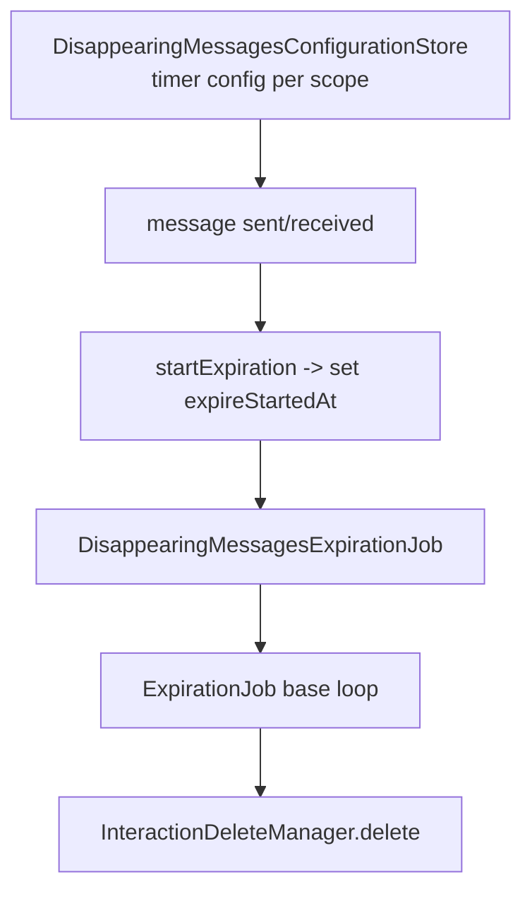
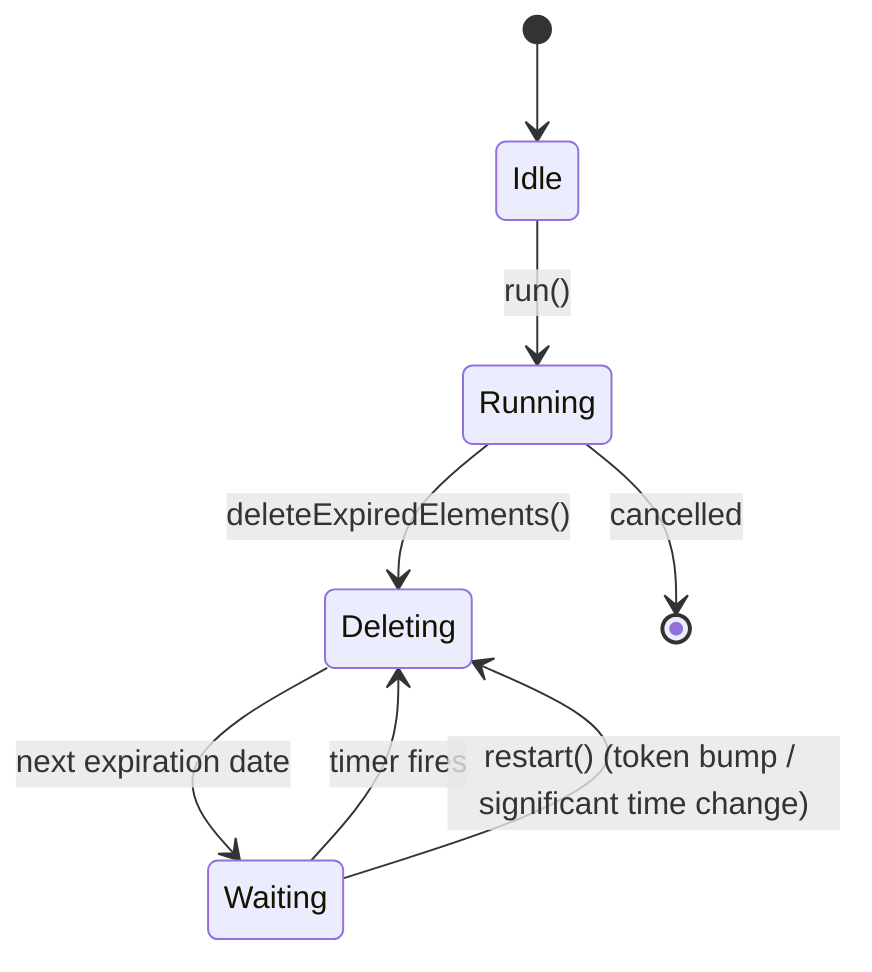

# Disappearing Messages & Expiration

Covers:

- `SignalServiceKit/DisappearingMessages/DisappearingMessagesConfigurationStore.swift`
- `SignalServiceKit/DisappearingMessages/DisappearingMessagesExpirationJob.swift`
- `SignalServiceKit/DisappearingMessages/ExpiringInteraction.swift`
- `SignalServiceKit/DisappearingMessages/VersionedDisappearingMessageToken.swift`
- `SignalServiceKit/Expiration/ExpirationJob.swift`

There are three concerns:

1. **Configuration** — the per-thread (or universal) disappearing-message timer setting.
2. **Timer-start triggers** — when an individual message's expiration countdown begins.
3. **The expiry job** — a generic background runner that deletes elements as they expire.

---

## Configuration

### `DisappearingMessagesConfigurationScope` — `DisappearingMessagesConfigurationStore.swift:69`
Confidence: HIGH. `.universal` (global default for new chats, persistence key
`kUniversalTimerThreadId`) or `.thread(TSThread)` (keyed by `thread.uniqueId`).

### `DisappearingMessagesConfigurationStore` protocol — `:9`
Confidence: HIGH (read in full).
- `fetch(for:tx:)` (`:17`) — the config record for a scope (nil if none).
- `remove(for thread:tx:)` (`:19`).
- `set(token:for:tx:)` (`:22`) — set from a `VersionedDisappearingMessageToken`, returns old+new.
- `resetAllDMTimerVersions(tx:)` (`:35`) — reset every timer's version to `1`. Needed to re-sync
  with other devices (e.g. after de-linking, or when a new primary registers from an empty DB and
  its versions reset to 0 and must override ours).

Convenience extensions:
- `set(token:for groupThread:tx:)` (`:42`) and `setUniversalTimer(token:tx:)` (`:59`) wrap an
  unversioned `DisappearingMessageToken` into a versioned one (version `0`).
- `fetchOrBuildDefault(for:tx:)` (`:93`) returns a disabled default (duration 0, version 1) if none
  exists.
- `durationSeconds(for thread:tx:)` (`:103`).

### Versioning rules (contact threads) — `DisappearingMessagesConfigurationStoreImpl.set` `:120`
Confidence: HIGH. 1:1 (`TSContactThread`) timers are versioned to resolve races:
- A `version == 0` update for a contact thread is **dropped** with an error log (`:131`).
- A `version < current` update is **dropped** (outdated) (`:136`).
- Group threads and the universal timer are unversioned (version `0` is fine); their `set` just
  overwrites (`:140`).
- On apply, if `version != 0` the stored `timerVersion` is updated; `isEnabled`/`durationSeconds`
  are set; row is inserted or updated only if the versioned token changed.

Normalization (`fetch`, `:112`): if `isEnabled == false`, `durationSeconds` is forced to `0` on
read, regardless of what's stored.

A `MockDisappearingMessagesConfigurationStore` exists under `TESTABLE_BUILD` (`:197`).
Confidence: HIGH.

### `VersionedDisappearingMessageToken` — `VersionedDisappearingMessageToken.swift:14`
Confidence: HIGH. `durationSeconds` + `version`. `isEnabled` is derived (`durationSeconds > 0`); the
`init(isEnabled:...)` form zeroes the duration when disabled. Factories: `forGroupThread(...)` and
`forUniversalTimer(...)` use `version = 0` (unversioned); `token(forProtoExpireTimerSeconds:version:)`
builds from a proto. `unversioned` (`:71`) projects to a plain `DisappearingMessageToken`.

---

## Timer-start triggers

### `ExpiringInteraction` protocol — `ExpiringInteraction.swift:7`
Confidence: HIGH. The contract an interaction must satisfy to expire:
`expiresAt`, `expiresInSeconds`, `expireStartedAt`, `shouldStartExpireTimer()`,
`updateWithExpireStarted(at:transaction:)`. **`TSMessage` conforms** (`:51`).

`ExpiringCallInteraction` (`:16`, internal) refines this for call interactions (also
`OWSReadTracking`): `shouldStartExpireTimer()` returns true if expiration already started **or** the
item has an expiration and `wasRead` (`:23`). `startExpirationIfNecessary` /
`startOrUpdateExpiration(readTimestamp:)` (`:38`/`:48`) call into the job.

### `DisappearingMessagesExpirationJob.startExpiration(...)` — `DisappearingMessagesExpirationJob.swift:45`
Confidence: HIGH. The trigger that begins a message's countdown:
- No-op if `shouldStartExpireTimer()` is false.
- Sets `expireStartedAt` **without clobbering** an earlier start — only writes if the current value
  is `0` or greater than the new timestamp (`:52`).
- Schedules `restart()` on `tx.addSyncCompletion` so the running job re-evaluates the
  next-expiring element.

`DisappearingMessagesExpirationJobObjcBridge` (`:62`) exposes `startExpiration(forMessage:...)` to
Objective-C.

---

## The expiry job

### `DisappearingMessagesExpirationJob` — `DisappearingMessagesExpirationJob.swift:7`
Confidence: HIGH. A concrete `ExpirationJob<ExpiringInteraction>`.
- `nextExpiringElement(tx:)` (`:25`) → `InteractionFinder.nextExpiringInteraction`.
- `expirationDate(ofElement:)` (`:29`) → `Date(millisecondsSince1970: expiresAt)`.
- `deleteExpiredElement(_:tx:)` (`:33`) → `InteractionDeleteManager.delete(..., associatedCallDelete:
  .localDeleteOnly)`.

### `ExpirationJob<ExpiringElement>` base — `Expiration/ExpirationJob.swift:14`
Confidence: HIGH (read in full). Abstract runner that deletes elements as they expire while the app
runs.
- Overridables: `nextExpiringElement(tx:)` (`:46`), `expirationDate(ofElement:)` (`:51`),
  `deleteExpiredElement(_:tx:)` (`:56`) — base impls `owsFail`.
- `minIntervalBetweenDeletes = 1s` default (`:36`).
- `restart()` (`:71`): bumps a `delayValidityToken` and cancels the pending delay task — callers
  invoke it whenever the underlying store changes so the "next-expiring" computation is re-run.
- `run()` (`:78`): single-flight (`owsPrecondition(!isRunning)`); subscribes to
  `UIApplication.significantTimeChangeNotification` → `restart()` (handles clock changes); then
  loops:
  1. `deleteExpiredElements()` returns the next expiration date.
  2. Compute the delay; if the `delayValidityToken` changed meanwhile, collapse the delay to 0.
  3. Always wait at least `minIntervalBetweenDeletes`.
  4. Wait for the next expiration (cancellable); distinguish `run()` cancellation from `restart()`
     via `Task.checkCancellation()`.
- `deleteExpiredElements()` (`:142`): uses `TimeGatedBatch.processAll`; for each `tx`, if the next
  element is expired it deletes and continues (`.more`), else stops and returns that element's
  expiration date (`.done`).

Edge cases (confidence: HIGH): clock jumps trigger a re-evaluation; `restart()` during a wait
shortens it; the single-flight precondition prevents overlapping runs; batching bounds the time
held in any one write transaction.
