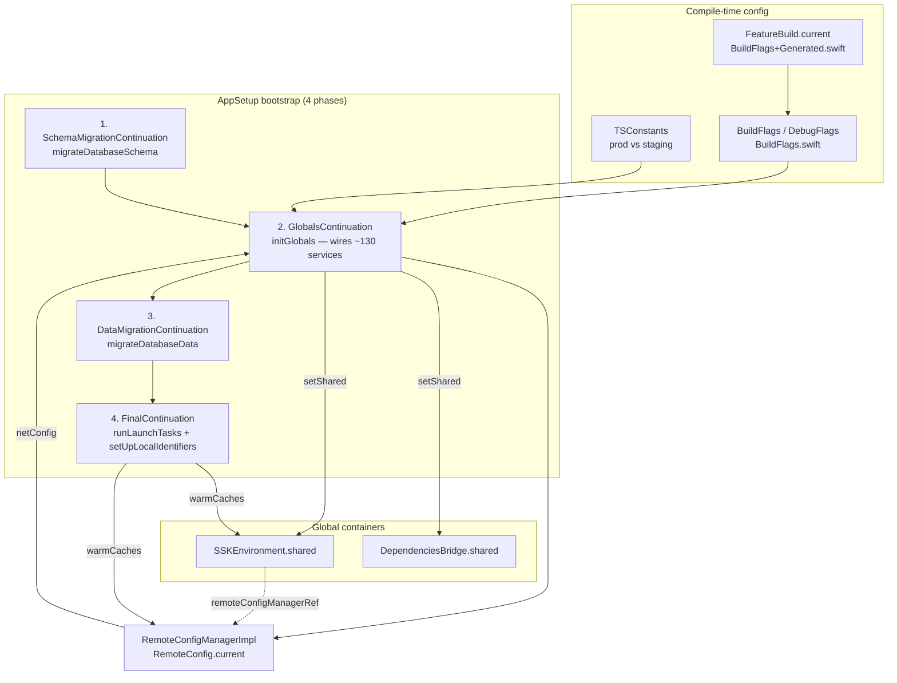

# `SignalServiceKit/Environment/` — Bootstrap, Service Containers, Config & Constants

This documentation set covers the first-party source in
`SignalServiceKit/Environment/` (~5.3k LOC) that together implement Signal
iOS's **process bootstrap** (`AppSetup`), the two **global service containers**
(`SSKEnvironment` and `DependenciesBridge`), the **remote config / feature flag**
system (`RemoteConfigManager`), the **compile-time build flags** (`BuildFlags` /
`BuildFlags+Generated`), and the **environment constants** that select the
production vs. staging server endpoints and crypto parameters (`TSConstants`).

> **Confidence labels.** Each claim is tagged with a confidence level:
> - **[High]** — directly read from source; behavior is explicit in code.
> - **[Medium]** — inferred from code with reasonable certainty, but depends on
>   collaborators defined outside this directory.
> - **[Low]** — inferred from naming/comments; not fully verified in-tree.
>
> Where a design question cannot be answered from the source in this directory,
> the text says **"intent undetermined — no evidence in source"** rather than
> guessing.
>
> All file+line citations refer to the state of the tree at the time of
> writing. Line numbers are approximate anchors; use the cited symbol name to
> locate code if lines have drifted.

## Document map

| Doc | Source file(s) covered |
| --- | --- |
| [bootstrap-appsetup.md](bootstrap-appsetup.md) | `AppSetup.swift` — the 4-phase bootstrap state machine and the ~130-service wiring block |
| [service-containers.md](service-containers.md) | `SSKEnvironment.swift`, `DependenciesBridge.swift` — the two global containers, cache warming, repair logic |
| [remote-config.md](remote-config.md) | `RemoteConfigManager.swift` — remote config fetch/merge/cache, hot-swap semantics, and the full feature-flag enumeration |
| [build-flags.md](build-flags.md) | `BuildFlags.swift`, `BuildFlags+Generated.swift` — `FeatureBuild` tiers, `BuildFlags`, `DebugFlags`, `TestableFlag` |
| [constants.md](constants.md) | `TSConstants.swift` — prod/staging endpoints, SVR2 enclaves, server public params, censorship-circumvention hosts |

## The central idea: two containers, one bootstrap

Signal iOS has **two** global dependency containers, plus a compile-time
constants/flags layer:

- **`SSKEnvironment`** (`SSKEnvironment.swift:8`) — the **legacy** container.
  Holds ObjC-visible "singletons" exposed via `…Ref` properties and the
  `SSKEnvironment.shared` global. **[High]**
- **`DependenciesBridge`** (`DependenciesBridge.swift:26`) — the **preferred**
  Swift-only container. Explicitly documented as a "temporary bridge" to be
  used **instead of** `Dependencies`/`SSKEnvironment`, but ideally *not* at all
  (prefer init injection) (`DependenciesBridge.swift:8-25`). **[High]**
- **`TSConstants` / `BuildFlags` / `RemoteConfig`** — compile-time and
  server-driven configuration consumed during wiring and at runtime.

`AppSetup` is the single place that constructs every service, wires them
together in dependency order, and installs both containers as process globals.

## Where things live

| Area | Source | Doc |
| --- | --- | --- |
| Bootstrap state machine | `AppSetup.swift` | [bootstrap-appsetup.md](bootstrap-appsetup.md) |
| Service wiring graph | `AppSetup.swift:172` (`initGlobals`) | [bootstrap-appsetup.md](bootstrap-appsetup.md) |
| Legacy container | `SSKEnvironment.swift` | [service-containers.md](service-containers.md) |
| Modern container | `DependenciesBridge.swift` | [service-containers.md](service-containers.md) |
| Cache warming / self-repair | `SSKEnvironment.swift:231-331` | [service-containers.md](service-containers.md) |
| Remote config fetch/cache | `RemoteConfigManager.swift` | [remote-config.md](remote-config.md) |
| Feature-flag enumeration | `RemoteConfigManager.swift:706-900` | [remote-config.md](remote-config.md) |
| Compile-time flags | `BuildFlags.swift`, `BuildFlags+Generated.swift` | [build-flags.md](build-flags.md) |
| Prod/staging endpoints | `TSConstants.swift` | [constants.md](constants.md) |
| SVR2 enclaves / server params | `TSConstants.swift:208-250`, `:290-330` | [constants.md](constants.md) |
