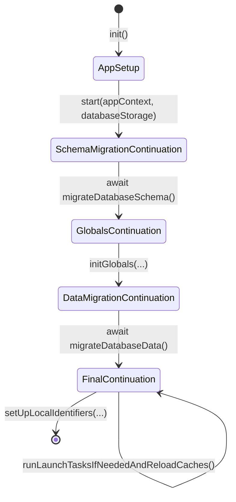
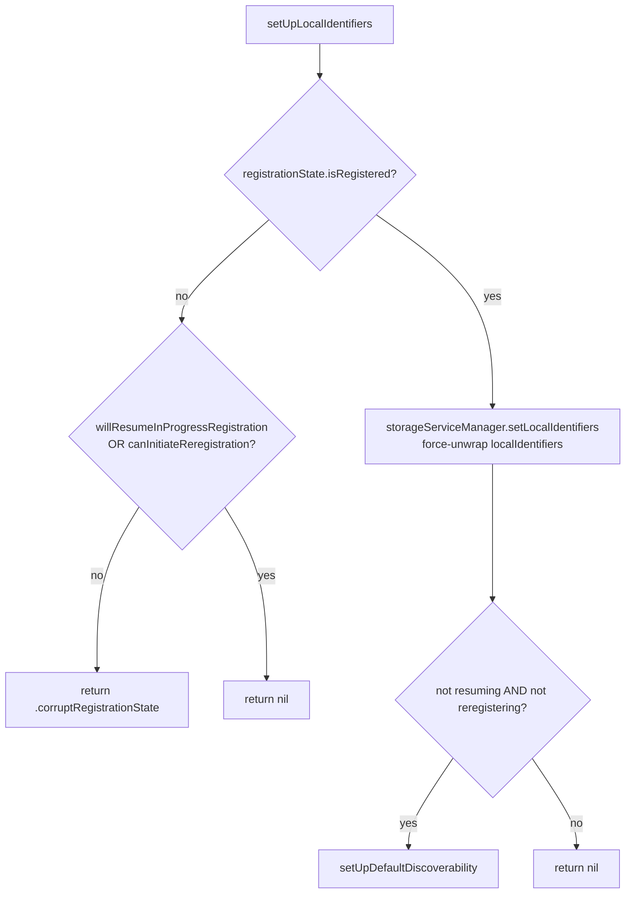
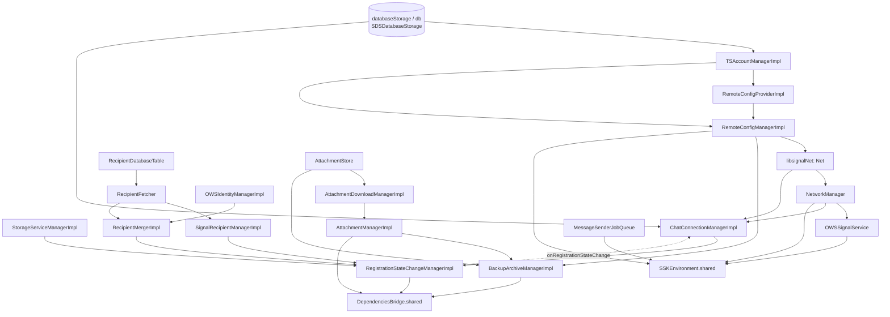

# `AppSetup.swift` — The Bootstrap State Machine & Service Wiring

`AppSetup` is the single entry point that migrates the database, constructs
**every** SignalServiceKit service, wires them together in dependency order, and
installs the two global service containers (`SSKEnvironment.shared` and
`DependenciesBridge.shared`). At ~2140 lines it is the largest file in the
subsystem and effectively *is* the application's composition root.

- [1. The four-phase continuation chain](#1-the-four-phase-continuation-chain)
- [2. Phase 1 — SchemaMigrationContinuation](#2-phase-1--schemamigrationcontinuation)
- [3. Phase 2 — GlobalsContinuation / `initGlobals`](#3-phase-2--globalscontinuation--initglobals)
- [4. Phase 3 — DataMigrationContinuation](#4-phase-3--datamigrationcontinuation)
- [5. Phase 4 — FinalContinuation](#5-phase-4--finalcontinuation)
- [6. The wiring graph](#6-the-wiring-graph)
- [7. TestDependencies — mock injection](#7-testdependencies--mock-injection)
- [8. Error paths & edge cases](#8-error-paths--edge-cases)
- [9. File reference checklist](#9-file-reference-checklist)

---

## 1. The four-phase continuation chain

`AppSetup` is a `class` holding a single `OWSBackgroundTask` created in `init()`
(`AppSetup.swift:11-15`). The bootstrap is modeled as a **chain of continuation
objects**, each phase returning the next. This forces the caller (the app
delegate / NSE, outside this directory) to perform the phases in the correct
order, and lets the compiler enforce "you can't warm caches before migrating the
schema". **[High]**

| Phase | Type | Entry method | Citation |
| --- | --- | --- | --- |
| 0 | `AppSetup` | `start(appContext:databaseStorage:)` | `AppSetup.swift:19-27` |
| 1 | `SchemaMigrationContinuation` | `migrateDatabaseSchema()` async | `AppSetup.swift:30-73` |
| 2 | `GlobalsContinuation` | `initGlobals(...)` `@MainActor` | `AppSetup.swift:153-172` |
| 3 | `DataMigrationContinuation` | `migrateDatabaseData()` async | `AppSetup.swift:2111-2175` |
| 4 | `FinalContinuation` | `runLaunchTasksIfNeededAndReloadCaches()` / `setUpLocalIdentifiers(...)` | `AppSetup.swift:2178-end` |

Each continuation is a `fileprivate init` class carrying forward the context
threaded through the chain (`appContext`, `backgroundTask`, `databaseStorage`,
and later `appReadiness`, `dependenciesBridge`, `sskEnvironment`,
`authCredentialStore`, `libsignalNet`, `authCredentialManager`,
`callLinkPublicParams`, `remoteConfigManager`). **[High]**

---

## 2. Phase 1 — SchemaMigrationContinuation

`migrateDatabaseSchema()` (`AppSetup.swift:50-67`): **[High]**

1. **Optionally truncates the GRDB WAL** *before any readers/writers are active*
   — only when `appContext.isMainApp` **and** the app did not launch into the
   background (`shouldTruncateGrdbWal()`, `:69-72`). It logs file sizes, calls
   `grdbStorage.syncTruncatingCheckpoint()`, and logs sizes again. A failure is
   swallowed with `owsFailDebug` (non-fatal). **[High]**
2. Runs `databaseStorage.runGrdbSchemaMigrations()`.
3. Marks the schema latest via `SSKPreferences.markGRDBSchemaAsLatest()`.
4. Returns a `GlobalsContinuation`.

> **Edge case.** WAL truncation is deliberately skipped in the NSE / share
> extension and on background launch, because other processes may hold the DB
> open. Truncating then would be unsafe. **[High]**

---

## 3. Phase 2 — GlobalsContinuation / `initGlobals`

`initGlobals(...)` (`AppSetup.swift:172-...`) is `@MainActor` and is the heart
of the file. It takes the externally-provided collaborators that SSK cannot
build itself (`appReadiness`, `deviceBatteryLevelManager?`, `deviceSleepManager?`,
`paymentsEvents`, `mobileCoinHelper`, `callMessageHandler`, `currentCallProvider`,
`notificationPresenter`) plus an injectable `TestDependencies` bundle, and
returns a `DataMigrationContinuation`. **[High]**

### 3.1 Ordering is load-bearing

The method opens with the comment *"Order matters here. All of these
'singletons' should have any dependencies used in their initializers injected."*
(`AppSetup.swift:...`, immediately after `configureUnsatisfiableConstraintLogging()`).
Services are declared as `let` locals and passed by reference into later
constructors, so the file is effectively a **topologically-sorted dependency
graph written out by hand**. **[High]**

### 3.2 The earliest services (foundation layer)

In order (`AppSetup.swift:~189-240`): **[High]**

| Service | Notes | Citation |
| --- | --- | --- |
| `OWSBackgroundTaskManager.shared.observeNotifications()` | first side effect | `:~190` |
| `AppVersionImpl.shared` → `appVersion` | | `:~192` |
| `webSocketFactory` | `WebSocketFactoryNative()` unless test-injected | `:~193` |
| temp dir protection | `ensureDirectoryExists` + `protectFileOrFolder(…completeUntilFirstUserAuthentication)`; both `owsPrecondition` | `:~198-200` |
| `tsConstants = TSConstants.shared` | selects prod/staging (see [constants.md](constants.md)) | `:~202` |
| `dateProvider` | `Date.provider` unless test-injected | `:~203` |
| `tsAccountManager = TSAccountManagerImpl(...)` | durable registration state | `:~205-210` |
| `remoteConfigProvider = RemoteConfigProviderImpl(...)` | | `:~212` |
| `remoteConfig = db.read { tsAccountManager.warmCaches(tx:); remoteConfigProvider.warmCaches(tx:) }` | **warms account + remote config in one read tx** | `:~213-216` |
| `libsignalNet = Net(env:…, buildVariant: BuildFlags.netBuildVariant, remoteConfig: remoteConfig.netConfig())` | LibSignal networking seeded with remote config | `:~218-223` |

> **[High]** The remote config is read from the DB **before** `libsignalNet` is
> built, and its `netConfig()` is passed into LibSignal's `Net`. This couples
> the three config layers at bootstrap: `TSConstants` picks the environment,
> `BuildFlags.netBuildVariant` picks beta vs production transport, and the
> persisted `RemoteConfig` seeds LibSignal. See [remote-config.md](remote-config.md)
> §netConfig and [constants.md](constants.md).

### 3.3 The dual SignalProtocolStores

A single `preKeyStore`/`sessionStore` pair is shared by two
`SignalProtocolStore.build(...)` calls — one for `.aci`, one for `.pni`
(`AppSetup.swift:~250-285`). Both are later bundled into a
`SignalProtocolStoreManager` and also passed individually into `SSKEnvironment`
(`aciSignalProtocolStore` / `pniSignalProtocolStore`). **[High]**

### 3.4 Container installation (the two `setShared` calls)

After all services are constructed:

1. `DependenciesBridge(...)` is built with ~130 named arguments
   (`AppSetup.swift:1804`) and installed via
   `DependenciesBridge.setShared(dependenciesBridge, isRunningTests: appContext.isRunningTests)`
   (`AppSetup.swift:1956`). **[High]**
2. `SSKEnvironment(...)` is built (`AppSetup.swift:2022`) and installed via
   `SSKEnvironment.setShared(sskEnvironment, isRunningTests:)`
   (`AppSetup.swift:2081`). **[High]**

> **[High]** `DependenciesBridge` is installed **before** `SSKEnvironment`.
> This matters because some `SSKEnvironment`-held services and the subsequent
> `warmCaches` path reach for `DependenciesBridge.shared`.

### 3.5 Post-install registrations

Immediately after installing `SSKEnvironment` (`AppSetup.swift:2082-2088`): **[High]**

- `NSKeyedUnarchiver.setClass(...)` for three renamed classes
  (`OWSUserProfile`, `TSGroupModelV2`, and the moved
  `SignalMessaging.PendingProfileUpdate`) — backwards-compatible unarchiving of
  persisted blobs.
- `Sounds.performStartupTasks(appReadiness:)`.

### 3.6 A notable late-wired callback

`chatConnectionManager.onRegistrationStateChange` is set to a closure that
weakly captures `registrationStateChangeManager` and calls
`setIsDeregisteredOrDelinked(_, notify: true, tx:)` (`AppSetup.swift:~1098-1105`).
This closes a dependency cycle: the connection manager is built first, then the
registration state manager, then the former is given a callback into the latter.
**[High]**

---

## 4. Phase 3 — DataMigrationContinuation

`migrateDatabaseData()` (`AppSetup.swift:2158-2175`): **[High]**

1. Runs `databaseStorage.runGrdbDataMigrations()` (data migrations, as opposed
   to the schema migrations in Phase 1).
2. Sets up the change observer: `grdbStorage.setupDatabaseChangeObserver()`.
   **A failure here is fatal** — `owsFail("Couldn't set up change observer: …")`.
   **[High]**
3. Ends the `OWSBackgroundTask` started back in `AppSetup.init()`.
4. Returns a `FinalContinuation`.

> **Edge case / failure path.** Schema migrations (Phase 1) and data migrations
> (Phase 3) are deliberately split so that the globals (Phase 2) are available
> to data migrations if needed, while the schema is already current. The change
> observer setup is the one unrecoverable step in this phase. **[High]**

---

## 5. Phase 4 — FinalContinuation

`FinalContinuation` carries a `@MainActor private var didRunLaunchTasks = false`
guard so its work is idempotent across repeated launches within one process
(important for the NSE re-entering) (`AppSetup.swift:2210-...`). **[High]**

### 5.1 `runLaunchTasksIfNeededAndReloadCaches()` (`@MainActor`)

Behavior (`AppSetup.swift:...`): **[High]**

- **First run only:** registers SDWebImage WebP coders (`SDImageWebPCoder`,
  then `SDImageAWebPCoder` last, so the native ImageIO coder is consulted first).
- **Subsequent runs only (`didRunLaunchTasks == true`):** re-warms
  `tsAccountManager` + `remoteConfigManager` caches in a read tx and re-pushes
  `remoteConfig.netConfig()` into `libsignalNet.setRemoteConfig(…, buildVariant:
  BuildFlags.netBuildVariant)` — *"Important to do here so the NSE picks up
  changes made in the main app."* **[High]**
- **Always:** `sskEnvironment.warmCaches(appReadiness:dependenciesBridge:)`
  (see [service-containers.md](service-containers.md) §warmCaches).
- **Always:** reconfigures the debug-log encryption key from the account
  entropy pool's master key (`DebugLogger.shared.setLoggingKey(…deriveLoggingKey())`).
- Schedules `chatConnectionManager.updateCanOpenWebSocket()` for
  `runNowOrWhenAppWillBecomeReady`, and `appExpiry.refreshExpirationTimer()` for
  `runNowOrWhenAppDidBecomeReadySync`.
- **First run only (after setting `didRunLaunchTasks = true`):**
  - `signalServiceAddressCacheRef.prepareCache()`
  - runs `ZkParamsMigrator(...).migrateIfNeeded()`
  - on `runNowOrWhenAppDidBecomeReadyAsync`, starts six job queues:
    `localUserLeaveGroupJobQueue`, `callRecordDeleteAllJobQueue`,
    `bulkDeleteInteractionJobQueue`, `donationReceiptCredentialRedemptionJobQueue`,
    and the `smJobQueues` `incomingContactSyncJobQueue` + `sendGiftBadgeJobQueue`.

### 5.2 `setUpLocalIdentifiers(willResumeInProgressRegistration:canInitiateRegistration:)`

Returns an optional `SetupError` (`AppSetup.swift:...`). Logic: **[High]**

- `canInitiateReregistration = registrationState.isDeregistered && canInitiateRegistration`.
- If registered: the invariant "registered ⇒ `LocalIdentifiers`" is enforced with
  a **force-unwrap** (`localIdentifiersWithMaybeSneakyTransaction!`) — commented
  as a TODO to make the compiler enforce it. **[High]**
- If **not** registered and **not** resuming/reregistering → returns
  `.corruptRegistrationState` (the only `SetupError` case,
  `AppSetup.swift:...` `enum SetupError { case corruptRegistrationState }`).
  **[High]**
- `setUpDefaultDiscoverability()` writes the default discoverability only when it
  has never been set (`phoneNumberDiscoverability(tx:) == nil`), using
  `PhoneNumberDiscoverabilityManager.Constants.discoverabilityDefault` with
  `authedAccount: .implicit`. **[High]**

---

## 6. The wiring graph

The full graph is ~130 nodes; the diagram below shows the **structural
backbone** — the hub services that most others depend on, as evidenced by how
frequently they appear as constructor arguments in `initGlobals`. **[Medium]**
(Medium because the exact edge set is inferred from reading each initializer's
argument list, not from a tool-generated graph.)

Legend: solid arrows are "A is injected into B's initializer"; the dashed
`onRegistrationStateChange` edge is the late-wired callback (§3.6).

### Notable sub-trees

- **Backups** is the single largest cluster: `BackupArchiveManagerImpl`
  (`AppSetup.swift:...`) alone takes dozens of archiver sub-objects
  (`BackupArchiveChatArchiver`, `BackupArchiveContactRecipientArchiver`,
  `BackupArchiveAccountDataArchiver`, etc.), each constructed inline. **[High]**
- **Call records** form a tight cluster around `CallRecordStoreImpl`,
  `DeletedCallRecordStore`, the sync-message managers, and the
  `CallRecordDeleteAllJobQueue`. **[High]**
- **Attachments** chain: `AttachmentStore` → `AttachmentContentValidatorImpl`
  → `AttachmentDownloadManagerImpl` → `AttachmentManagerImpl` →
  `AttachmentUploadManagerImpl` → `BackupAttachmentCoordinatorImpl`. **[High]**

---

## 7. TestDependencies — mock injection

`AppSetup.TestDependencies` (`AppSetup.swift:88-152`) is a struct of ~19
optional collaborators. Each is consumed with the `testDependencies.x ?? Real(...)`
idiom inside `initGlobals`, letting tests substitute mocks for components that
"cannot be isolated in tests" (legacy tests reach the globals transitively).
**[High]**

Injectable members (`AppSetup.swift:89-108`): `backupAttachmentCoordinator`,
`contactManager`, `dateProvider`, `groupV2Updates`, `groupsV2`, `messageSender`,
`networkManager`, `paymentsCurrencies`, `paymentsHelper`, `pendingReceiptRecorder`,
`profileManager`, `reachabilityManager`, `remoteConfigManager`, `signalService`,
`storageServiceManager`, `syncManager`, `systemStoryManager`, `versionedProfiles`,
`webSocketFactory`. **[High]**

> **[Medium]** Only these ~19 services are mockable via this path; the other
> ~110 services are always the real implementations. The selection appears to
> be exactly the set that touches the network, the clock, or external SDKs
> (MobileCoin/payments), i.e. the non-deterministic edges — intent is a
> reasonable inference but not stated in source, so: *intent of the exact
> membership is undetermined — no explicit evidence in source.*

---

## 8. Error paths & edge cases

| Situation | Handling | Severity | Citation |
| --- | --- | --- | --- |
| Temp dir can't be created / protected | `owsPrecondition` → crash | fatal | `AppSetup.swift:~199-200` |
| WAL truncation fails | `owsFailDebug`, continue | non-fatal | `AppSetup.swift:57-60` |
| `callLinkPublicParams` parse fails | `try!` force-unwrap → crash | fatal (should never happen; constant) | `AppSetup.swift:~306` |
| Change observer setup fails | `owsFail` → crash | fatal | `AppSetup.swift:2165-2167` |
| Not registered & not (re)registering | returns `.corruptRegistrationState` | recoverable by caller | `setUpLocalIdentifiers` |
| Registered but no `LocalIdentifiers` | `!` force-unwrap → crash | fatal (invariant) | `setUpLocalIdentifiers` |
| Repeated launch in same process | `didRunLaunchTasks` guard makes launch tasks idempotent | n/a | `FinalContinuation` |
| `setShared` called twice | `owsPrecondition((_shared == nil && env != nil) \|\| isRunningTests)` — second non-test set crashes | fatal outside tests | `SSKEnvironment.swift:17-19`, `DependenciesBridge.swift:44-47` |

> **[High]** The `isRunningTests` escape hatch in both `setShared` precondition
> expressions is what lets the test harness replace the globals repeatedly.

---

## 9. File reference checklist

| Symbol | Role | Citation |
| --- | --- | --- |
| `AppSetup` | bootstrap owner; holds `backgroundTask` | `AppSetup.swift:10-16` |
| `start(appContext:databaseStorage:)` | phase 0 → 1 | `:19-27` |
| `SchemaMigrationContinuation` | phase 1 | `:30-73` |
| `migrateDatabaseSchema()` | WAL truncate + schema migrations | `:50-67` |
| `TestDependencies` | mock injection bundle | `:88-152` |
| `GlobalsContinuation` | phase 2 | `:153-170` |
| `initGlobals(...)` | wires all services, installs globals | `:172-...` |
| `DependenciesBridge(...)` construction | | `:1804` |
| `DependenciesBridge.setShared(...)` | install modern container | `:1956` |
| `SSKEnvironment(...)` construction | | `:2022` |
| `SSKEnvironment.setShared(...)` | install legacy container | `:2081` |
| `DataMigrationContinuation` | phase 3 | `:2111-2175` |
| `migrateDatabaseData()` | data migrations + change observer | `:2158-2175` |
| `FinalContinuation` | phase 4 | `:2178-...` |
| `SetupError.corruptRegistrationState` | only setup error | (FinalContinuation) |
| `runLaunchTasksIfNeededAndReloadCaches()` | idempotent launch tasks | (FinalContinuation) |
| `setUpLocalIdentifiers(...)` | registration-state gate | (FinalContinuation) |
| `configureUnsatisfiableConstraintLogging()` | sets a UIKit debug default | (end of file) |
