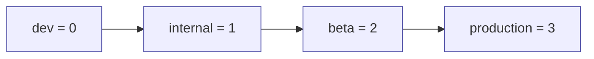

# `BuildFlags.swift` & `BuildFlags+Generated.swift` — Compile-Time Flags

These two files define the **compile-time** feature-gating layer. Unlike remote
config (server-driven, runtime) these flags are fixed at build time by the
`FeatureBuild` tier the binary was compiled for. The `+Generated` file is a tiny
companion that selects the tier.

- [1. `FeatureBuild` tiers](#1-featurebuild-tiers)
- [2. `BuildFlags+Generated.swift` — selecting the tier](#2-buildflagsgeneratedswift--selecting-the-tier)
- [3. `BuildFlags` — the gating constants](#3-buildflags--the-gating-constants)
- [4. `DebugFlags` and `TestableFlag`](#4-debugflags-and-testableflag)
- [5. Interaction with remote config & environment](#5-interaction-with-remote-config--environment)
- [6. File reference checklist](#6-file-reference-checklist)

---

## 1. `FeatureBuild` tiers

`enum FeatureBuild: Int, Comparable { case dev; case internal; case beta; case
production }` (`BuildFlags.swift:10-23`). It is `Comparable` by raw value, so
`dev < internal < beta < production`. **[High]**

The idiom throughout the file is `build <= .someTier`, which reads as **"this
tier *or earlier/less-public*"**. For example `build <= .beta` is true for dev,
internal, and beta builds but **false** for production. `private let build =
FeatureBuild.current` is captured once at file scope (`BuildFlags.swift:25`).
**[High]**



---

## 2. `BuildFlags+Generated.swift` — selecting the tier

The entire file (`BuildFlags+Generated.swift:1-14`): **[High]**

```swift
extension FeatureBuild {
#if DEBUG
    static let current: FeatureBuild = .dev
#else
    static let current: FeatureBuild = .internal
#endif
}
```

> **[High]** As checked into this tree, non-DEBUG builds default to
> **`.internal`**, not `.production`. The filename and the "Generated" suffix
> strongly suggest the real release pipeline overwrites this file to stamp
> `.beta` / `.production` for store builds. *The exact code-generation / build
> step that rewrites this value is undetermined — no evidence in this
> directory's source.* The practical consequence of the checked-in default:
> internal-tier flags (verbose logging, internal settings) are on for any
> locally-built RELEASE binary.

---

## 3. `BuildFlags` — the gating constants

`public enum BuildFlags` (`BuildFlags.swift:27-88`). Each flag is a `static let`
computed from `build <= tier` or hard-coded. **[High]**

### 3.1 Tier-gated flags

| Flag | Expression | True for |
| --- | --- | --- |
| `failDebug` | `build <= .internal` | dev, internal |
| `isPrerelease` | `build <= .beta` | dev, internal, beta |
| `shouldUseTestIntervals` | `build <= .beta` | dev, internal, beta |
| `Backups.showOptimizeMedia` | `build <= .dev` | dev |
| `Backups.restoreFailOnAnyError` | `build <= .beta` | ≤ beta |
| `Backups.detailedBenchLogging` | `build <= .internal` | ≤ internal |
| `Backups.archiveErrorDisplay` | `build <= .internal` | ≤ internal |
| `Backups.avoidAppAttestForDevs` | `build <= .dev` | dev |
| `Backups.avoidStoreKitForTesters` | `build <= .beta` | ≤ beta |
| `Backups.mediaErrorDisplay` | `build <= .beta` | ≤ beta |
| `Backups.useLowerDefaultListMediaRefreshInterval` | `build <= .beta` | ≤ beta |
| `netBuildVariant` | `build <= .beta ? .beta : .production` | transport variant |
| `KeyTransparency.conservativeSelfCheck` | `build <= .internal` | ≤ internal |
| `ReleaseNotesChannel.ignoreFetchDelay` | `build <= .internal` | ≤ internal |
| `improvedNotifications` | `build <= .dev` | dev ("Don't enable until Storage Service is integrated") |

(`BuildFlags.swift:29-84`). **[High]**

### 3.2 Hard-coded migration / permanent flags

These are plain booleans, several with rollout-expiry comments explaining when
the dead code behind them can be deleted: **[High]**

| Flag | Value | Note | Citation |
| --- | --- | --- | --- |
| `migrateHasPaymentAddress` | `true` | turn off ~210 days after last release w/o change | `:55-58` |
| `decodeOldSenderKeys` | `true` | turn off 14 days after last release expires | `:60-62` |
| `migrateGroupRefreshedAt` | `true` | turn off 7 days after last release expires | `:64-66` |
| `wifiAwareDeviceTransfer` | `true` | also gated at runtime by `wifiAwareDeviceTransferKillSwitch` | `:70` |
| `LocalFileBackups.archive` / `.restore` / `.settingsUI` | `true` | | `:72-76` |
| `hardDeleteGroupThreadsDuringRefresh` | `true` | | `:78` |
| `accountIdentifierSharing` | `false` | "ability to share account identifiers when sharing contacts" | `:85-87` |

### 3.3 `buildVariantString`

`BuildFlags.buildVariantString` (`BuildFlags.swift:92-130`) returns a
human-readable string like `"Internal — Debug"` for the debug UI, but **only**
when `DebugFlags.internalSettings` is on (else `owsFailDebug` + nil, with a note
that it needs localization). Production builds return nil for the tier portion
("inferred from the lack of flag"). The configuration suffix is `#if DEBUG` /
`#elseif TESTABLE_BUILD` / else nil. **[High]**

---

## 4. `DebugFlags` and `TestableFlag`

### 4.1 `DebugFlags` — permanent dev conveniences

`public enum DebugFlags` (`BuildFlags.swift:136-...`). The comment distinguishes
these from `BuildFlags`: flags "we'll leave in the code base indefinitely that
are helpful for development." **[High]**

Tier-gated booleans (`build <= .internal` unless noted): `internalLogging`,
`betaLogging` (`<= .beta`), `testPopulationErrorAlerts` (`<= .beta`),
`internalSettings`, `internalMegaphoneEligible`, `verboseNotificationLogging`,
`deviceTransferVerboseProgressLogging`, `messageDetailsExtraInfo`,
`exposeCensorshipCircumvention`, `extraDebugLogs`. **[High]**

### 4.2 `TestableFlag<Value>` — runtime-settable dev toggles

`public class TestableFlag<Value>: AnyTestableFlag` (`BuildFlags.swift:...`). A
thread-safe (`AtomicValue`) mutable flag with `title`/`details` for the internal
settings UI, an `onSet` callback, and auto-reset via the
`.resetAllTestableFlags` notification (`Notification.Name` at `:...`). **[High]**

> **[High] Key gating behavior.** `TestableFlag.get()` returns the mutable value
> **only when `build <= .internal`**; otherwise it always returns the
> `defaultValue`. So testable overrides are inert in beta/production even if
> somehow set.

`MenuTestableFlag<Value: CaseIterable & Equatable>` (`BuildFlags.swift:...`)
subclasses it to present discrete options (plus an "unset" nil option) in a
menu. **[High]**

### 4.3 The grouped testable flags

| Group | Members | Citation |
| --- | --- | --- |
| Calling | `callingSvcMaxBitrateBps`, `callingStatsIntervalSecs`, `callingUseTestSFU`, `callingNeverRelay`, `callingOverrideCodecs`, `callingEnableVp9Encode`, `callingEnableVp9Decode`, `callingEnableSvc` (collected in `callingTestableFlags`) | `BuildFlags.swift:...` |
| Messaging | `delayedMessageResend`, `fastPlaceholderExpiration` (its `onSet` restarts `DependenciesBridge.shared.decryptionPlaceholderExpirationJob`), `messageSendsFail` (`messagingTestableFlags`) | `BuildFlags.swift:...` |
| Voice Messages | `voiceMessageBitRate` (32000), `voiceMessageSampleRate` (44100), `voiceMessageAudioQuality` (`MenuTestableFlag<VoiceMessageAudioQuality>`) (`voiceMessageTestableFlags`) | `BuildFlags.swift:...` |

Note `fastPlaceholderExpiration.onSet` reaches into `DependenciesBridge.shared`
— a rare case of this file depending on the container (see
[service-containers.md](service-containers.md)). **[High]**

`VoiceMessageAudioQuality` maps `min/low/medium/high/max` → `AVAudioQuality`
(`BuildFlags.swift:...`). **[High]**

---

## 5. Interaction with remote config & environment

- `BuildFlags.netBuildVariant` is passed to **both** `libsignalNet`'s init and
  every `net.setRemoteConfig(_, buildVariant:)` call (see
  [bootstrap-appsetup.md](bootstrap-appsetup.md) §3.2 and
  [remote-config.md](remote-config.md) §4). **[High]**
- `BuildFlags.wifiAwareDeviceTransfer` AND-gates the runtime
  `wifiAwareDeviceTransferKillSwitch` remote flag
  (`RemoteConfig.wifiAwareDeviceTransferEnabled`). **[High]**
- `BuildFlags.Backups.useLowerDefaultListMediaRefreshInterval` picks the
  **default** for the `backupListMediaDefaultRefreshIntervalMs` remote flag.
  **[High]**
- `BuildFlags.KeyTransparency.conservativeSelfCheck` is injected into
  `KeyTransparencyManager` during bootstrap. **[High]**
- `DebugFlags.internalLogging` seeds the UIKit
  `_UIConstraintBasedLayoutLogUnsatisfiable` default in
  `configureUnsatisfiableConstraintLogging()`. **[High]**

---

## 6. File reference checklist

| Symbol | File:line |
| --- | --- |
| `FeatureBuild` enum | `BuildFlags.swift:10-23` |
| `build` file-scope constant | `BuildFlags.swift:25` |
| `BuildFlags` enum | `BuildFlags.swift:27-88` |
| `BuildFlags.Backups` | `BuildFlags.swift:35-47` |
| `netBuildVariant` | `BuildFlags.swift:49` |
| hard-coded migration flags | `BuildFlags.swift:55-78` |
| `accountIdentifierSharing` | `BuildFlags.swift:85-87` |
| `buildVariantString` | `BuildFlags.swift:92-130` |
| `DebugFlags` | `BuildFlags.swift:136-...` |
| `TestableFlag` class | `BuildFlags.swift:...` |
| `MenuTestableFlag` class | `BuildFlags.swift:...` |
| `AnyTestableFlag` / `AnyMenuTestableFlag` | `BuildFlags.swift:...` |
| `resetAllTestableFlags` notification | `BuildFlags.swift:...` |
| `FeatureBuild.current` | `BuildFlags+Generated.swift:7-13` |
