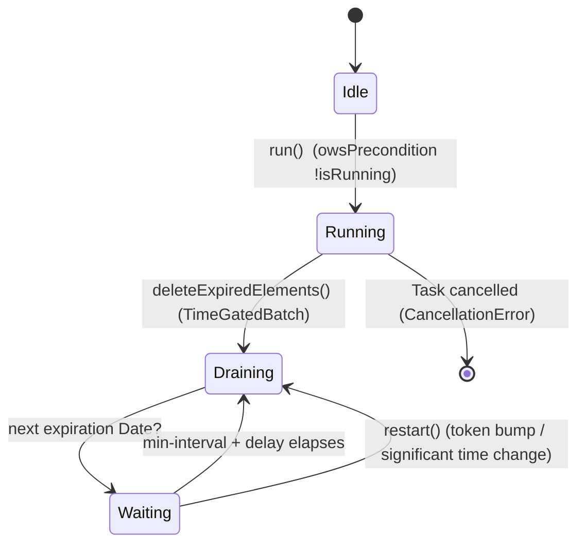

# Expiration

Covers `SignalServiceKit/Expiration/`:

- `ExpirationJob.swift`

This folder is a single file: it defines **one generic, abstract base class**, `ExpirationJob`,
that drives the "delete elements as they expire while the app is running" pattern. It owns no
schema and no concrete expiring type of its own — concrete behavior (what expires, when, and how to
delete it) lives entirely in subclasses scattered across SignalServiceKit and the app target. Think
of this as the shared scheduling/looping engine behind disappearing messages, story expiry, pinned
message expiry, deleted-call-record cleanup, and several cryptographic-key expiry jobs.

> The [DisappearingMessages](../DisappearingMessages/README.md) README already documents this file
> from the disappearing-messages perspective. This doc covers the `Expiration/` folder on its own
> terms: the base class as a reusable mechanism and its relationship to **all** of its subclasses.

---

## Responsibility

`ExpirationJob<ExpiringElement>` — `ExpirationJob.swift:16`
Confidence: HIGH (read in full).

An abstract generic class whose single job is to run an async loop that repeatedly:

1. finds the next element that will expire,
2. deletes everything already expired,
3. sleeps until the next expiration (or until something tells it the picture changed),

and repeats until cancelled. It deliberately knows nothing about *what* is expiring — the element
type is the generic parameter `ExpiringElement`, and the three domain operations are `open` methods
subclasses must override.

### Construction — `ExpirationJob.swift:31`
Dependencies are injected: a `DateProvider` (`:17`), a `DB` (`:18`), a `PrefixedLogger` (`:21`), and
`minIntervalBetweenDeletes` (`:19`, default `1` second, `:35`). The `DateProvider` is the single
source of "now" for all expiration comparisons, which is what makes the loop testable (see
[Testing](#testing)).

### Overridable contract (base impls `owsFail`)
Confidence: HIGH.

| Method | Line | Meaning |
|--------|------|---------|
| `nextExpiringElement(tx:)` | 47 | Return the next element that *will* expire (whether or not it already has). Read-only. |
| `expirationDate(ofElement:)` | 52 | The `Date` at which a given element expires. |
| `deleteExpiredElement(_:tx:)` | 58 | Delete an element that is *guaranteed* already expired. Write transaction. |

The design assumes `nextExpiringElement` is cheap and backed by an indexed "soonest-expiring" query
in the subclass's store, so the loop can poll a single element rather than scanning.

---

## Internal state & concurrency

Confidence: HIGH.

State is held in an `AtomicValue<State>` guarded by a lock (`:29`). `State` (`:23`) carries:

- `isRunning` — enforces single-flight: `run()` opens with `owsPrecondition(!isRunning)` (`:80`) and
  clears it in a `defer` (`:83`). Only one `run()` loop may be live per job instance.
- `delayValidityToken: UInt` — a monotonically increasing generation counter. Bumped by
  `restart()`; used to invalidate an in-flight "sleep until next expiration" computation.
- `nextExpirationDelayTask` — the current sleep task, cancellable from `restart()`.

### `restart()` — `ExpirationJob.swift:70`
`public final`. Bumps `delayValidityToken` and cancels the pending delay task. Callers invoke this
**whenever the underlying store changes** such that the next-expiring element may differ (a new
timer started, a record saved, a config changed). Crucially, `restart()` is distinct from
cancelling `run()`: it only shortens/invalidates the current wait so the loop re-evaluates, it does
not stop the job (the loop distinguishes the two via `Task.checkCancellation()` at `:132`).

---

## The run loop

`run() async throws` — `ExpirationJob.swift:77`
Confidence: HIGH.

1. Marks `isRunning` (single-flight) and arranges to clear it on exit (`:79`–`:87`).
2. Subscribes to `UIApplication.significantTimeChangeNotification` → `restart()` (`:91`), so wall-clock
   jumps (timezone change, day rollover, manual clock edits) force re-evaluation; unsubscribes on
   exit (`:96`–`:98`).
3. Loops forever (`:100`):
   - Snapshot `delayValidityToken` (`:103`), then call `deleteExpiredElements()` (`:104`) which
     returns the next expiration `Date?`.
   - Compute `nextExpirationDelay` from now (`:107`); `nil`/no-next-element collapses to
     `.distantFuture`.
   - Under the lock (`:109`): if the token changed while we were deleting, the computed delay can't
     be trusted, so collapse the delay to `0` (`:113`); build the sleep `Task` and store it.
   - Always sleep at least `minIntervalBetweenDeletes` (`:124`) — a floor that throttles delete
     bursts.
   - Then await the next-expiration sleep via `withTaskCancellationHandler` (`:127`) so `restart()`'s
     cancellation wakes it.
   - `Task.checkCancellation()` (`:132`) — if `run()` itself was cancelled this throws
     `CancellationError` and the loop exits; if only `restart()` fired, the inner sleep task was
     cancelled but the loop continues.

`deleteExpiredElements() -> Date?` — `ExpirationJob.swift:136`
Confidence: HIGH. Wraps work in `TimeGatedBatch.processAll(db:)` (`:144`) so no single write
transaction is held too long. Per batch iteration: fetch `nextExpiringElement`; if it exists and
`dateProvider() >= expirationDate(...)`, delete it and return `.more` to keep draining (`:151`);
otherwise return `.done` with that element's expiration date (or `nil`) (`:154`). Deletions are
counted and logged once at the end if non-zero (`:140`).



---

## Who drives it: lifecycle & subclasses

Confidence: HIGH.

The base class does not start itself. The **app target** owns the lifecycle:
`AppLifecycleManager.runExpirationJobs()` (`Signal/AppLaunch/AppLifecycleManager.swift:1694`) spins
up all jobs in a `withThrowingTaskGroup` on app activation and cancels them on background. The jobs
started there (`:1698`–`:1704`, beginning with `deletedCallRecordExpirationJob.run()` at `:1698`):

- `deletedCallRecordExpirationJob`
- `disappearingMessagesExpirationJob`
- `decryptionPlaceholderExpirationJob`
- `storyMessageExpirationJob`
- `pinnedMessageExpirationJob`
- `groupSendEndorsementExpirationJob`
- `senderKeyExpirationJob`

The task group is restarted on each foregrounding: a prior task is cancelled
(`oldExpirationJobTask?.cancel()` at `AppLifecycleManager.swift:1632`) and awaited before a new one
starts (`runExpirationJobs()` call at `:1635`), and backgrounding cancels it
(`expirationJobTask?.cancel()` at `:1677`). Cancellation is expected to surface as
`CancellationError`; anything else is an `owsFailDebug` (`:1710`). This is why every `run()` loop is
written to exit cleanly on cancellation.

### Concrete subclasses of `ExpirationJob`
Confidence: HIGH (located via symbol search; each is a direct subclass).

| Subclass | File | Element type |
|----------|------|--------------|
| `DisappearingMessagesExpirationJob` | `SignalServiceKit/DisappearingMessages/DisappearingMessagesExpirationJob.swift:6` | `ExpiringInteraction` |
| `DeletedCallRecordExpirationJob` | `SignalServiceKit/Calls/DeletedCallRecord/DeletedCallRecordExpirationJob.swift:21` | `DeletedCallRecord` |
| `OWSDecryptionPlaceholderExpirationJob` | `SignalServiceKit/Messages/OWSDecryptionPlaceholderExpirationJob.swift:6` | `OWSRecoverableDecryptionPlaceholder` |
| `StoryMessageExpirationJob` | `SignalServiceKit/Stories/StoryMessageExpirationJob.swift:6` | `StoryMessage` |
| `PinnedMessageExpirationJob` | `SignalServiceKit/Messages/Interactions/PinnedMessages/PinnedMessageExpirationJob.swift:8` | `PinnedMessageRecord` |
| `GroupSendEndorsementExpirationJob` | `Signal/Groups/GroupSendEndorsementExpirationJob.swift:9` | `CombinedGroupSendEndorsementRecord` |
| `SenderKeyExpirationJob` | `Signal/Axolotl/SenderKeyExpirationJob.swift:9` | `SenderKeyRecord` |

The first five are owned by `DependenciesBridge` (`SignalServiceKit/Environment/DependenciesBridge.swift:103`,
`:104`, `:113`, `:158`, `:185`) and constructed in `AppSetup` (`SignalServiceKit/Environment/AppSetup.swift:816`,
`:890`, `:895`, `:1013`). The last two are app-target jobs owned by `AppEnvironment`
(`Signal/AppLaunch/AppEnvironment.swift:43`, `:52`, built at `:168`/`:230`).

---

## Interactions with the rest of the app

Confidence: HIGH.

The signature interaction pattern is: a store that owns an expiring element calls
`someJob.restart()` after a write so the running loop re-evaluates its next-expiring element. This
is almost always deferred to transaction completion so the loop reads committed state. Observed
call sites:

- `PinnedMessageManager` restarts `pinnedMessageExpirationJob` from `transaction.addSyncCompletion`
  (`SignalServiceKit/Messages/Interactions/PinnedMessages/PinnedMessageManager.swift:183`–`:184`).
- `CallRecordDeleteManager` restarts `deletedCallRecordExpirationJob` from `tx.addSyncCompletion`
  (`SignalServiceKit/Calls/CallRecord/CallRecordDeleteManager.swift:150`–`:151`, the `restart()`
  call at `:151`); see also the `- SeeAlso` at `:15`.
- `StoryManager` restarts `storyMessageExpirationJob` when stories change
  (`SignalServiceKit/Messages/Stories/StoryManager.swift:128`, `:168`).
- `OWSMessageDecrypter` (`SignalServiceKit/Messages/OWSMessageDecrypter.swift:231`) and
  `BuildFlags` (`SignalServiceKit/Environment/BuildFlags.swift:231`) restart
  `decryptionPlaceholderExpirationJob`.
- `SentMessageTranscriptReceiverImpl` and `BackupArchiveManagerImpl` drive the disappearing-messages
  job (`SignalServiceKit/Devices/SentMessageTranscriptReceiver/SentMessageTranscriptReceiverImpl.swift:356`,
  `SignalServiceKit/Backups/Archiving/BackupArchiveManagerImpl.swift:1386`).

```mermaid
flowchart TD
    store[subclass's store writes/deletes an expiring element] -->|tx.addSyncCompletion| restart[job.restart]
    restart --> token[bump delayValidityToken + cancel sleep]
    token --> loop[running run() loop re-evaluates]
    lifecycle[AppLifecycleManager.runExpirationJobs<br/>on foreground] --> loop
    loop --> next[nextExpiringElement]
    next --> del[deleteExpiredElement when now >= expirationDate]
```

---

## Testing

Confidence: HIGH. `SignalServiceKit/tests/Expiration/ExpirationJobTest.swift` exercises the base
loop with a `TestJob: ExpirationJob<Date>` (`:11`) backed by an `InMemoryDB` and a fixed
`dateProvider`. It verifies:

- `testRestarting` — inserting an earlier element and calling `restart()` makes the loop pick up the
  newly-soonest element and delete it, leaving the far-future (`.year`) element intact.
- `testCancel` — repeatedly starting and immediately cancelling `run()` never deletes the
  far-future element (`deleteCount <= 1`), confirming cancellation safety and that the min-interval
  floor prevents eager deletes.

---

## Edge cases & invariants

Confidence: HIGH.

- **Single-flight.** `owsPrecondition(!isRunning)` (`:80`) forbids two concurrent `run()` calls on
  one instance; the app relies on this by cancelling+awaiting the old task before starting a new one.
- **Clock jumps.** `significantTimeChangeNotification` → `restart()` (`:91`) re-evaluates when wall
  time moves, so an element whose absolute expiration date passed during a clock change isn't missed.
- **Token invalidation.** If the store changes mid-delete, the just-computed delay is discarded
  (collapsed to `0`, `:113`) so the loop immediately re-reads rather than sleeping on stale data.
- **Throttling.** `minIntervalBetweenDeletes` (default 1s) bounds delete frequency even when many
  elements expire at once.
- **Bounded transactions.** `TimeGatedBatch` keeps each write transaction short while draining a
  backlog of already-expired elements.
- **Cancellation contract.** Jobs must exit via `CancellationError`; the app logs any other thrown
  error as a programming mistake (`AppLifecycleManager.swift:1710`).
