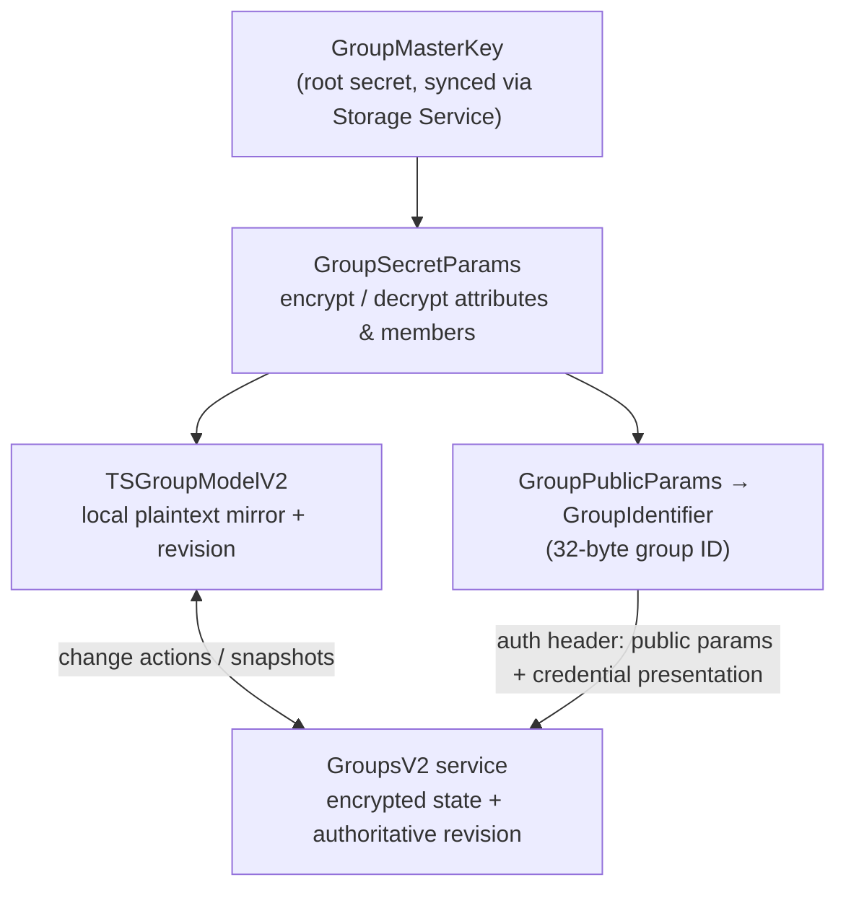
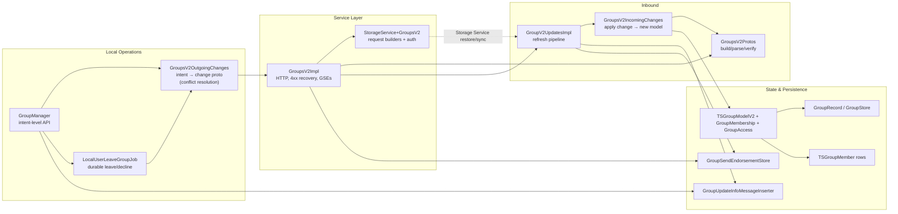

# Signal iOS — GroupsV2 Subsystem

This documentation set covers the first-party source in
`SignalServiceKit/Groups/` (plus `SignalServiceKit/Jobs/LocalUserLeaveGroupJob.swift`)
that implements Signal iOS's **GroupsV2 (GV2)** feature: the cryptographic group
state model, the operations that create and mutate groups, the inbound pipeline
that receives and applies remote changes, group message fan-out, **group send
endorsements**, and group synchronization/restore via Storage Service.

> **Confidence labels.** Each claim in these documents is tagged with a confidence
> level:
> - **[High]** — directly read from source; behavior is explicit in code.
> - **[Medium]** — inferred from code with reasonable certainty, but depends on
>   collaborators defined outside `SignalServiceKit/Groups/` (the message pipeline,
>   the LibSignal crypto layer, Storage Service record updaters, profile manager).
> - **[Low]** — inferred from naming/comments; not fully verified in-tree.
>
> All file+line citations refer to the state of the tree at the time of writing.
> Line numbers are approximate anchors; use the cited symbol name to locate code
> if lines have drifted.

## Document map

| Doc | Scope |
| --- | --- |
| [group-state-model.md](group-state-model.md) | `TSGroupModel`/`TSGroupModelV2`, `GroupMembership`, roles & labels, `GroupAccess`, identifiers, `GroupV2Params` (crypto), `GroupV2Snapshot`, `GroupRecord`/`GroupStore`, `TSGroupMember`, builders. |
| [gv2-operations.md](gv2-operations.md) | Create/update/membership/invites/access, `GroupManager`, `GroupsV2OutgoingChanges` (conflict resolution), `GroupsV2IncomingChanges`, `GroupsV2Protos`, invite links, info messages, service requests & error paths. |
| [send-receive-and-sync.md](send-receive-and-sync.md) | `GroupV2UpdatesImpl` refresh pipeline, change-log fetching, avatar download/blur, message fan-out, group send endorsements, profile-key updater, Storage Service sync & restore, leave-group job. |

## The central concept: a server-authoritative, cryptographic group

A GroupsV2 group is defined by a **`GroupMasterKey`**, from which the client
derives `GroupSecretParams` (encrypt/decrypt) and `GroupPublicParams` (the group's
public identity, whose `GroupIdentifier` is the 32-byte group ID). The server
stores an **encrypted** copy of group state and the authoritative **revision**; it
can validate membership and apply changes without learning the plaintext. The
client mirrors this with a `TSGroupModelV2` and keeps itself aligned by applying
incremental **change actions** (and, when necessary, full **snapshots**). **[High]**

Three properties recur throughout the subsystem:

- **Server-authoritative revision.** Every change bumps the revision by exactly 1.
  The client never reverts to an older revision and prefers contiguous change
  actions (which carry the author) over snapshots (anonymous).
- **The ACI/PNI identity split shapes membership.** Full and requesting members are
  always ACIs; a PNI can only be an *invited* member (PNIs have no profile key).
  Accepting a PNI invite is a distinct change action, and the inbound side maps
  PNI-authored changes back to their ACI. (See the identity doc in the parent
  [SignalServiceKit README](../README.md).)
- **Zero-knowledge credentials gate everything.** Profile-key credentials gate
  adding members; auth-credential presentations authorize service requests; group
  send endorsements authorize sealed-sender fan-out — all without the server
  learning identities.

## How the pieces fit together

- **`GroupManager`** is the public, intent-level surface for local actions.
- **`GroupsV2OutgoingChanges`** turns intent into a conflict-resolved change proto.
- **`GroupsV2Impl`** performs HTTP requests, handles 4xx recovery, and bridges to
  the inbound apply path; it also receives and stores group send endorsements.
- **`GroupV2UpdatesImpl`** is the inbound engine: fetch → apply → persist, with
  change-actions-first / snapshot-fallback and auto-refresh.
- **`GroupsV2IncomingChanges`** mirrors the server's logic to derive the next model
  from a change proto.
- **`GroupsV2Protos`** builds and parses the wire protos and verifies server
  signatures.
- The **state types** (`TSGroupModelV2`, `GroupMembership`, `GroupAccess`,
  `GroupRecord`, `TSGroupMember`) hold the local mirror; **info messages** and
  **endorsement records** are the user-visible and send-time byproducts.

See each document for the detailed design, per-type purpose, validation/business
rules, error paths, edge cases, feature flags, and server interactions.

## Feature flags, epochs, and tunables (quick reference)

| Name | Value / meaning | Source |
| --- | --- | --- |
| `changeProtoEpoch` | `7` (links, description, announcements, banned, promote-PNI, member-labels, terminate) | `GroupManager.swift` |
| `BuildFlags.hardDeleteGroupThreadsDuringRefresh` | gates hard-deletion of obsolete group threads during auto-refresh | `GroupV2UpdatesImpl.swift` |
| `groupUpdateTimeoutDuration` | `30` s | `GroupManager.swift` |
| refresh throttle | 5 minutes (with `.throttle`) | `GroupV2UpdatesImpl.swift` |
| auto-refresh interval / jitter | 1 week / ±(week/7) | `GroupRecord.swift` |
| GSE "expire soon" | < 2 hours | `GroupSendEndorsements.swift` |
| name/description limits | 32 glyphs / 1024 bytes; 480 glyphs / 8192 bytes | `GroupManager.swift` |
| avatar limits | 3 MiB encrypted; 1024 px | `TSGroupModel.m` / `TSGroupModel.swift` |
| group-size limits | `RemoteConfig.maxGroupSizeHardLimit`, `maxGroupSizeBannedMembers` | `GroupsV2OutgoingChangesImpl.swift` |
| leave-job retries | `110`, non-concurrent | `LocalUserLeaveGroupJob.swift` |
