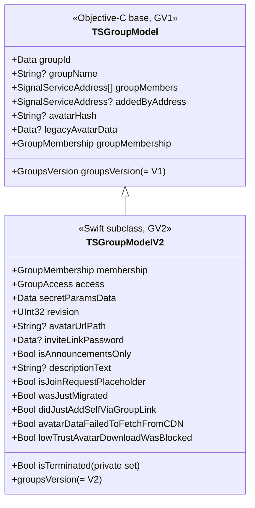
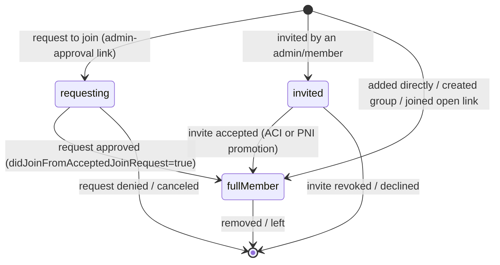
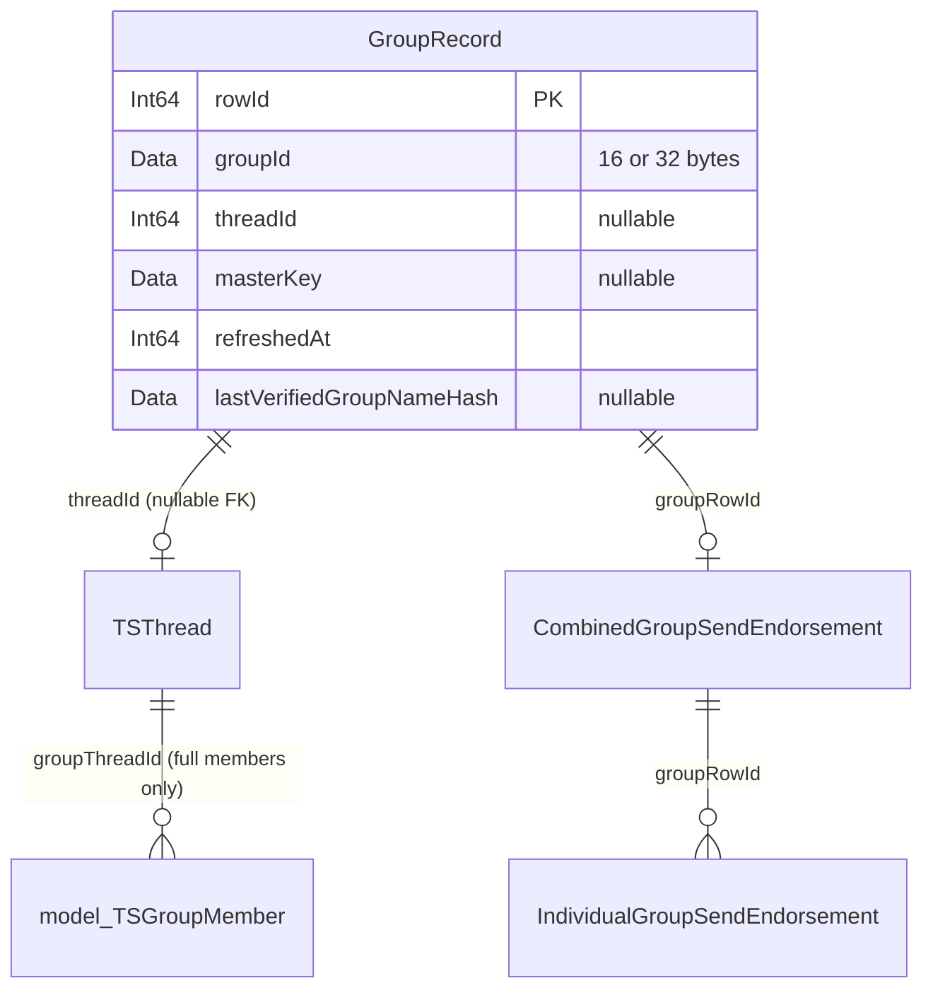
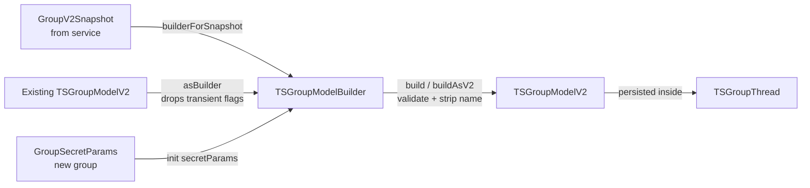

# GroupsV2 — The Group State Model

This document covers the **in-memory and on-disk representation** of a group in
Signal iOS: the `TSGroupModel` hierarchy, its membership model, the access-control
model, the identifiers and key material, the per-group database records, and the
encryption parameters that bind the local model to the server's view of the group.

> **Confidence labels.** Each claim is tagged:
> - **[High]** — directly read from source; behavior is explicit in code.
> - **[Medium]** — inferred from code with reasonable certainty, but depends on
>   collaborators defined outside `SignalServiceKit/Groups/`.
> - **[Low]** — inferred from naming/comments; not fully verified in-tree.
>
> File+line citations refer to the tree at the time of writing. Line numbers are
> approximate anchors; use the cited symbol name to locate code if lines drift.

See also:
- [gv2-operations.md](gv2-operations.md) — how this model is mutated (create / update / membership / invites / access).
- [send-receive-and-sync.md](send-receive-and-sync.md) — endorsements, message fan-out, and Storage Service sync.

---

## 1. The two group generations

Signal has two generations of groups, distinguished by the `GroupsVersion`
enum (`SignalServiceKit/Groups/TSGroupModel.h:17-20`): **[High]**

- `GroupsVersionV1 = 0` — legacy groups, 16-byte group IDs
  (`kGroupIdLengthV1 = 16`, `SignalServiceKit/Groups/TSGroupModel.m:30`). **[High]**
- `GroupsVersionV2` — cryptographic groups, 32-byte group IDs
  (`kGroupIdLengthV2 = 32`, `SignalServiceKit/Groups/TSGroupModel.m:31`). **[High]**

The entire GroupsV2 subsystem treats V1 as a vestige: mutating a V1 group is
considered impossible, and the code `owsFail`s if it ever happens
(`SignalServiceKit/Groups/GroupManager.swift` — e.g. `updateGroupAttributes`
asserts `"[GV1] Mutations on V1 groups should be impossible!"`, and
`sendDurableNewGroupMessage` asserts `"[GV1] Should be impossible to send V1
group messages!"`). **[High]** This documentation set therefore focuses on V2,
but the base-class state and the V1 fallbacks are described where they shape V2.



---

## 2. `TSGroupModel` — the base model

`TSGroupModel` is an Objective-C `NSObject` conforming to `NSSecureCoding` and
`NSCopying` (`SignalServiceKit/Groups/TSGroupModel.h:29`). It is the serialized
form stored inside a `TSGroupThread`. **[High]** Its base properties
(`SignalServiceKit/Groups/TSGroupModel.h:33-43`): **[High]**

- `groupMembers` — all members (admins + normal); for V2 this is overridden.
- `groupName` — accessed through a `filterStringForDisplay` getter
  (`SignalServiceKit/Groups/TSGroupModel.m:201-204`) so persisted names are
  always sanitized at read time. `groupNameOrDefault` falls back to
  `TSGroupThread.defaultGroupName` when empty
  (`SignalServiceKit/Groups/TSGroupModel.m:206-210`). **[High]**
- `groupId`, `addedByAddress`, `avatarHash`, `legacyAvatarData`.

### 2.1 Schema versioning and secure coding

`TSGroupModelSchemaVersion = 2` (`SignalServiceKit/Groups/TSGroupModel.m:34`).
`initWithCoder:` performs legacy upgrades: **[High]**

- schema `< 1`: migrates `groupMemberIds` (E.164 strings) into
  `SignalServiceAddress` legacy addresses
  (`SignalServiceKit/Groups/TSGroupModel.m:140-156`). **[High]**
- schema `< 2`: migrates `groupAvatarData` into `legacyAvatarData`
  (`SignalServiceKit/Groups/TSGroupModel.m:158-160`). **[High]**

Notably, when encoding, the base class **skips** `groupMembers` if the object is
a `TSGroupModelV2` (`SignalServiceKit/Groups/TSGroupModel.m:88-93`) — V2 stores
membership in its own `GroupMembership` object, not the base array. **[High]**

### 2.2 Avatar storage

Avatars are not stored inline in the model; they are persisted to disk keyed by
content hash: **[High]**

- Directory: `GroupAvatars/` under the app-shared data directory
  (`SignalServiceKit/Groups/TSGroupModel.swift` — `avatarsDirectory`). **[High]**
- Filename: `<SHA256-hex>.png`
  (`avatarFilePath(forHash:)`; `hash(forAvatarData:)` returns the hex SHA-256).
  Despite the `.png` suffix, group avatar data is encoded as JPEG by
  `dataForGroupAvatar(_:)` (quality ratcheted down from 0.6). **[High]**
- In-memory LRU cache of size 16 (`avatarsCache = LRUCache(maxSize: 16, nseMaxSize: 0)`). **[High]**
- `persistAvatarData(_:)` validates, writes if not already present, and sets
  `avatarHash`. Old avatars are **deliberately not deleted** — multiple model
  instances may reference different avatar versions; cleanup is deferred to the
  orphan-data cleaner (see the comment in `persistAvatarData`). **[High]**

Avatar size limits (`SignalServiceKit/Groups/TSGroupModel.m:12-28`,
`SignalServiceKit/Groups/TSGroupModel.swift`): **[High]**

- `kMaxEncryptedAvatarSize = 3 * 1024 * 1024` (3 MiB) — the ciphertext ceiling. **[High]**
- `kMaxAvatarSize` — derived from `kMaxEncryptedAvatarSize` by subtracting the
  LibSignal padding/overhead (4-byte padding length, 1-byte proto tag + 4-byte
  length, 16-byte auth tag, 12-byte nonce, 1 reserved byte). This computed value
  is the plaintext ceiling (`isValidGroupAvatarData` enforces it). **[High]**
- `kMaxAvatarDimension = 1024` px (width and height)
  (`SignalServiceKit/Groups/TSGroupModel.swift`). **[High]**

### 2.3 `AvatarDataState`

The avatar's state is a richer enum than "present/absent"
(`TSGroupModel.AvatarDataState`, `SignalServiceKit/Groups/TSGroupModel.swift`): **[High]**

| Case | Meaning |
| --- | --- |
| `.available(Data)` | Decrypted avatar bytes are on disk. |
| `.missing` | No avatar, or not yet downloaded. |
| `.failedToFetchFromCDN` | Download attempted, CDN failed (persisted as `avatarDataFailedToFetchFromCDN`). |
| `.lowTrustDownloadWasBlocked` | Download suppressed because the group is low-trust/blocked (persisted as `lowTrustAvatarDownloadWasBlocked`). |
| `.skipped` | Download deferred (e.g. the thread doesn't exist yet to decide trust). |

`avatarDataState` on `TSGroupModel` reads these persisted V2 flags first, then
falls back to reading bytes from disk (`readAvatarDataFromDisk`). **[High]** The
distinction between `failedToFetchFromCDN` and `lowTrustDownloadWasBlocked` is
load-bearing for info messages: unblurring (going from `lowTrustDownloadWasBlocked`
to available) does **not** generate an info message (see §3.4). **[High]**

---

## 3. `TSGroupModelV2` — the V2 model

`TSGroupModelV2` (`SignalServiceKit/Groups/TSGroupModel.swift:10`) extends the
base with everything the GV2 protocol needs. **[High]**

### 3.1 Fields

| Field | Type | Purpose |
| --- | --- | --- |
| `membership` | `GroupMembership` | Full/invited/requesting/banned members + labels (§4). |
| `access` | `GroupAccess` | Who may edit members/attributes/invite-link/labels (§6). |
| `secretParamsData` | `Data` | Serialized `GroupSecretParams`; the root of all crypto (§7). |
| `revision` | `UInt32` | Monotonic server revision; central to conflict handling. |
| `avatarUrlPath` | `String?` | CDN path for the encrypted avatar. |
| `inviteLinkPassword` | `Data?` | 16-byte password gating invite-link joins (§8 of gv2-operations). |
| `isAnnouncementsOnly` | `Bool` | Only admins may send messages. |
| `descriptionText` | `String?` | Group description. |
| `isTerminated` | `Bool` (private set) | Group was terminated (epoch 7). |
| `isJoinRequestPlaceholder` | `Bool` | Model is a stub for a group we requested to join but can't see yet. |
| `wasJustMigrated` | `Bool` | Transient: just migrated from V1. |
| `didJustAddSelfViaGroupLink` | `Bool` | Transient: we just joined via invite link. |
| `avatarDataFailedToFetchFromCDN` | `Bool` | See §2.3. |
| `lowTrustAvatarDownloadWasBlocked` | `Bool` | See §2.3. |

Citations: all the above are declared and encoded in
`SignalServiceKit/Groups/TSGroupModel.swift:124-141` (declarations) and
`:33-57` (`encode(with:)`) / `:12-32` (`init(coder:)`). **[High]**

`isTerminated` has a **private setter** (`SignalServiceKit/Groups/TSGroupModel.swift:131`);
it can only be set through the builder/initializer path, never mutated in place. **[High]**

### 3.2 Transient vs. durable fields

Three fields are explicitly treated as **transient** and are *not* copied when a
model is round-tripped through its builder
(`SignalServiceKit/Groups/TSGroupModelBuilder.swift:55-62`): **[High]**

- `isJoinRequestPlaceholder`
- `wasJustMigrated`
- `didJustAddSelfViaGroupLink`

The comment states these values are deliberately discarded "when updating group
models". They *are* persisted via `NSSecureCoding` (they appear in `encode`/`init(coder:)`),
but they are reset whenever a new model is derived from an old one through
`asBuilder`. **[High]** This matters: `didJustAddSelfViaGroupLink` is a one-shot
signal consumed by the UI/info-message layer right after a link-join, then dropped.

### 3.3 Key accessors

- `secretParams() -> GroupSecretParams` reconstructs params from
  `secretParamsData`; `masterKey() -> GroupMasterKey` derives the master key
  from them (`SignalServiceKit/Groups/TSGroupModel.swift:184-190`). **[High]**
- `groupMembership` is overridden to return the V2 `membership`
  (`SignalServiceKit/Groups/TSGroupModel.swift:198-201`), and `groupMembers`
  returns `Array(membership.fullMembers)`
  (`SignalServiceKit/Groups/TSGroupModel.swift:203-206`). **[High]**
- `inviteLinkConfiguration()` maps `access.addFromInviteLink` to a
  `GroupInviteLinkConfiguration`: `.unsatisfiable/.unknown/.member → .disabled`,
  `.any → enabled(requireAdminApproval: false)`, `.administrator → enabled(requireAdminApproval: true)`
  (`SignalServiceKit/Groups/TSGroupModel.swift:287-301`). **[High]**

### 3.4 `showInfoMessageForChangeComparedTo(to:)` — when a change is user-visible

`SignalServiceKit/Groups/TSGroupModel.swift:208-247` decides whether a model
delta warrants an info message in the chat. It returns `false` (no message) only
if **all** of the following are unchanged: `groupName`, avatar (with special
handling below), `addedByAddress`, `descriptionText`, membership (via
`GroupMembership.showInfoMessageForChangeComparedTo`), `access`,
`isAnnouncementsOnly`, `inviteLinkPassword`, and `isTerminated`. **[High]**

Avatar special-casing (`SignalServiceKit/Groups/TSGroupModel.swift:216-228`): **[High]**
- Same `avatarHash` → no info message.
- Transition **out of** `lowTrustAvatarDownloadWasBlocked` (i.e. unblurring once
  trust is established) → no info message.
- Otherwise an avatar change → info message.

Edge case: comparing a model to itself (`self === otherGroupModel`) returns
`false` immediately (`:212-214`). **[High]**

---

## 4. `GroupMembership` — the membership model

`GroupMembership` (`SignalServiceKit/Groups/GroupMembership.swift:130`) is an
`NSSecureCoding` class holding four maps: **[High]**

- `memberStates: [SignalServiceAddress: GroupMemberState]`
- `bannedMembers: [Aci: UInt64]` (ACI → banned-at timestamp in ms)
- `invalidInviteMap: [Data: InvalidInviteModel]` (userId → invite that couldn't be parsed)
- `memberLabels: [Aci: MemberLabel]`

### 4.1 `GroupMemberState` — the three membership kinds

`GroupMemberState` (`SignalServiceKit/Groups/GroupMembership.swift:11-18`) is a
private enum with three cases: **[High]**



| Case | Associated data | Role | Profile key exposed to group? | Can view others' profile keys? |
| --- | --- | --- | --- | --- |
| `.fullMember` | `role`, `didJoinFromInviteLink`, `didJoinFromAcceptedJoinRequest` | that role | **Yes** | **Yes** |
| `.invited` | `role`, `addedByAci` | that role | No | Yes |
| `.requesting` | — | always `.normal` | **Yes** | No |

The profile-key visibility matrix is implemented in
`hasProfileKeyInGroup(serviceId:)` and `canViewProfileKeys(serviceId:)`
(`SignalServiceKit/Groups/GroupMembership.swift:…` — the `switch memberState`
blocks). **[High]** Rationale: invited members haven't shared a profile key yet
(so it's not in the group), but they can see the group's keys; requesting members
expose their key (to be addable) but can't yet see the group's keys. **[High]**

### 4.2 Equality ignores join-provenance flags

`memberStates(_:areEqualTo:)` (`SignalServiceKit/Groups/GroupMembership.swift`)
compares full-member states **after hardcoding `didJoinFromInviteLink` and
`didJoinFromAcceptedJoinRequest` to `false`**. **[High]** The documented reason:
these flags are *not* present in server snapshots and are computed only locally
when a member joins; if local state differs from a snapshot only in these flags,
the two are treated as equal to avoid clobbering local provenance. **[High]**
Note that `isEqual` (used for `NSObject` equality) additionally requires
`memberLabels` and `bannedMembers` to match
(`SignalServiceKit/Groups/GroupMembership.swift:…`), whereas
`showInfoMessageForChangeComparedTo` only compares `memberStates`, `bannedMembers`,
and `invalidInviteUserIds` (not labels). **[High]**

### 4.3 Serialization and legacy migration

`memberStates` is JSON-encoded (via `JSONEncoder`/`JSONDecoder`) and stored under
key `"memberStates"` (`SignalServiceKit/Groups/GroupMembership.swift` —
`encode(with:)` / `init?(coder:)`). **[High]** On decode, if the modern key is
absent, it falls back to decoding a `LegacyMemberStateMap` keyed `"memberStateMap"`
and converts it via `convertLegacyMemberStateMap` (pending → `.invited`,
otherwise `.fullMember`). **[High]** The legacy `MemberState` ObjC class is
preserved under the mangled name `_TtCC16SignalServiceKit15GroupMembership11MemberState`
for backward-compatible unarchiving (`SignalServiceKit/Groups/GroupMembership.swift`). **[High]**
`bannedMembers` is stored as `[UUID: NSNumber]` and remapped to `[Aci: UInt64]`;
member labels use key `"memberLabelsMapV3"`. **[High]**

A `addedByUuid`/`addedByAci` detail: the `GroupMemberState.CodingKeys` map
`addedByAci` to the JSON key `"addedByUuid"` for backward compatibility
(`SignalServiceKit/Groups/GroupMembership.swift:61-67`). **[High]**

### 4.4 Local-user accessors and the PNI-invite nuance

`GroupMembership` exposes a family of local-user accessors
(`isLocalUserFullMember`, `isLocalUserInvitedMember`, `isLocalUserRequestingMember`,
`isLocalUserFullMemberAndAdministrator`, etc.). **[High]** The subtle one is
invited-member resolution: a user can be invited **by PNI** (because PNIs have no
profile key, PNIs can *only* be invited members, never full/requesting —
`localPniAsInvitedMember`). **[High]** `localUserInvitedAtServiceId(localIdentifiers:)`
checks the ACI first; only if the ACI is not a member of any kind does it fall
back to the PNI (`SignalServiceKit/Groups/GroupMembership.swift`). **[High]**
This asymmetry drives the "accept invite" and "decline invite" change-proto logic
(see [gv2-operations.md §5](gv2-operations.md)).

### 4.5 Leaving without choosing a new admin

`canLocalUserLeaveGroupWithoutChoosingNewAdmin(localAci:)` delegates to the
static rule (`SignalServiceKit/Groups/GroupMembership.swift`): **[High]**

```
return Set([localAci]) != admins || Set([localAci]) == fullMembers
```

In words: you can leave freely **unless** you are the *only* admin, *and* there
are other members. If you're the sole member, or there's another admin, no
replacement is required. **[High]** The leave flow uses this to decide whether a
`replacementAdminAci` must be supplied (see [gv2-operations.md §6](gv2-operations.md)).

### 4.6 `canTryToAddToGroup` / addability

`canTryToAddToGroup(serviceId:)` returns `AddableResult`
(`SignalServiceKit/Groups/GroupMembership.swift`): **[High]**
- already a full member → `.alreadyInGroup`
- a requesting member → `.addableOrInvitable`
- an invited member → `.addableWithProfileKeyCredential` (we can promote them if we have a credential)
- otherwise → `.addableOrInvitable`

`canTryToAddWithProfileKeyCredential` additionally checks whether we hold (or can
fetch) a profile-key credential for the ACI, which decides *add* vs *invite*. **[High]**

### 4.7 The `Builder` and local-profile stripping

`GroupMembership.Builder` is the only way to mutate membership (the live object is
effectively immutable through `asBuilder`/`build`). **[High]** Two defensive
behaviors in `build()` (`SignalServiceKit/Groups/GroupMembership.swift`): **[High]**
- Asserts (debug) that banned ACIs are disjoint from member addresses.
- **Filters out** any member whose phone number equals
  `OWSUserProfile.Constants.localProfilePhoneNumber` (a legacy "local profile"
  sentinel) — the `// TODO: Why is this here? Uggh.` comment flags this as
  defensive cruft. **[High]**

`addMembers` fails (debug) on duplicates unless `failOnDupe: false` is passed; the
full-member add path passes `failOnDupe: false` because another member may know a
UUID mapping we don't (`SignalServiceKit/Groups/GroupMembership.swift`). **[High]**

---

## 5. Roles, labels, and member records

### 5.1 `TSGroupMemberRole`

`SignalServiceKit/Groups/TSGroupMemberRole.swift:8-11`: `normal = 0`,
`administrator = 1`. Maps to/from `GroupsProtoMemberRole` (`.default`↔`.normal`,
`.administrator`↔`.administrator`; unknown proto roles log and return nil). **[High]**

### 5.2 `MemberLabel`

`MemberLabel` (`SignalServiceKit/Groups/MemberLabel.swift:17-32`) is a `Codable`,
`Equatable` struct with `label: String` and `labelEmoji: String?`.
`labelForRendering()` prepends `"<emoji> "` when an emoji is present.
`MemberLabelForRendering` adds a `groupNameColor` for UI. **[High]** Member-label
plaintext is sanitized/trimmed during decryption (24 glyphs / 96 UTF-8 bytes for
the label, ≤48 bytes for the emoji) — see §7.3. **[High]**

### 5.3 `TSGroupMember` — the full-member database row

`TSGroupMember` (`SignalServiceKit/Groups/TSGroupMember.swift:…`) is a GRDB
`SDSCodableModel` persisted to table `model_TSGroupMember`. **[High]** Key design
notes from the file's own doc comment: **[High]**

- It represents **only full members** — not invited or requesting members.
- For V2 groups the `serviceId` is expected to be an **ACI** (full members are
  always ACIs). Phone-number-only members of legacy V1 groups may later gain a PNI.
- There is a `UNIQUE INDEX` on `(phoneNumber, groupThreadId)`. This is safe
  *because* a single account can't be two different full members — but the comment
  warns that the same account *can* be both an invited member (by PNI) and a full
  member (by ACI), so care is needed if the model is extended. **[High]**

`TSGroupThread` extensions build on this table to answer "which group threads
share a full member" (`groupThreadUniqueIds(withFullMember:)`), filtered into
`activeGroupThreads` (non-terminated), `mutualGroupThreads` (local user is a full
member), and `mutualVisibleGroupThreads`
(`SignalServiceKit/Groups/TSGroupMember.swift`). **[High]**

### 5.4 Keeping `TSGroupMember` rows in sync

`GroupMemberStore` / `GroupMemberStoreImpl`
(`SignalServiceKit/Groups/GroupMemberStore.swift`) wrap insert/update/remove and
the "which threads contain member X" queries. **[High]**

`GroupMemberUpdaterImpl.updateRecords` (`SignalServiceKit/Groups/GroupMemberUpdater.swift`)
reconciles the on-disk `TSGroupMember` rows with the source-of-truth
`groupMembership.fullMembers`. The ordering is the interesting part
(documented in the method's long comment): because of the `UNIQUE` constraint, it
issues **all DELETEs first**, and implements UPDATEs as **DELETE-then-INSERT**, so
a phone number can be reclaimed from one member and given to another without a
constraint violation. After a merge there may be duplicate rows for a recipient;
sorting by most-recent interaction keeps the preferred one. **[High]** On
completion it posts `TSGroupThread.membershipDidChange` on the main thread
(`GroupMemberUpdaterTemporaryShimsImpl.didUpdateRecords`). **[High]**

### 5.5 Recipient merges

`GroupMemberMergeObserverImpl` (`SignalServiceKit/Groups/GroupMemberMergeObserver.swift`)
is a `RecipientMergeObserver`. On `didLearnAssociation`, it collects all group
threads containing the merged recipient's ACI, phone number, or PNI, then calls
`updateRecords` to re-resolve them. **[High]** `mergeV1GroupMembersIfNeeded` only
acts on **V1** groups (V2 full members are always ACIs so never need merging);
it rebuilds the model (pruning dupes) and updates the thread if membership
changed. **[High]**

---

## 6. `GroupAccess` — the access-control model

### 6.1 `GroupV2Access`

`GroupV2Access` (`SignalServiceKit/Groups/GroupAccess.swift:8-13`) is the access
level enum: `unknown = 0`, `any`, `member`, `administrator`, `unsatisfiable`,
with bidirectional mapping to `GroupsProtoAccessControlAccessRequired`
(`access(forProtoAccess:)` / `protoAccess`). **[High]**

### 6.2 `GroupAccess`

`GroupAccess` (`SignalServiceKit/Groups/GroupAccess.swift:76`) is an **immutable**
`NSSecureCoding` class with four access dimensions
(`SignalServiceKit/Groups/GroupAccess.swift:…`): **[High]**

| Dimension | Governs | Valid values (via `filter`) |
| --- | --- | --- |
| `members` | Who may add members | `.member`, `.administrator` |
| `attributes` | Who may edit name/avatar/description/timer | `.member`, `.administrator` |
| `addFromInviteLink` | Invite-link join behavior | `.unknown`, `.unsatisfiable`, `.administrator`, `.any` |
| `memberLabels` | Who may set member labels | `.member`, `.administrator` (`.unknown`→default) |

The `init` runs each incoming value through a `filter(for…:)` function that
rejects invalid values (logging `owsFailDebug` and returning `.unknown`), so the
object always holds valid access levels. **[High]** `addFromInviteLink` keeps
`.unknown` as valid for groups created before invite links existed; `memberLabels`
maps `.unknown` to the default (because member labels are a newer feature). **[High]**

### 6.3 Defaults

`defaultForV2` (`SignalServiceKit/Groups/GroupAccess.swift:…`): **[High]**
```
members: .member, attributes: .member, addFromInviteLink: .unsatisfiable, memberLabels: .member
```
A newly created group thus has no invite link (`.unsatisfiable`), and any member
may add members and edit attributes. **[High]** (`allAccess`, used only in
`TESTABLE_BUILD`, enables `.any` invite links.) **[High]**

---

## 7. Identifiers and cryptographic parameters

### 7.1 `AnyGroupIdentifier` and `NewGroupSeed`

`AnyGroupIdentifier` (`SignalServiceKit/Groups/AnyGroupIdentifier.swift:9-25`)
discriminates V1 vs V2 by length: `parseFrom` treats 16-byte data as
`GroupIdentifierV1` and everything else as LibSignal's `GroupIdentifier` (V2).
`GroupIdentifierV1` validates the 16-byte length on init. **[High]**

`NewGroupSeed` (`SignalServiceKit/Groups/NewGroupSeed.swift:14-22`) pre-generates
a `GroupSecretParams` so the "new group" UI can preview conversation color etc.
before the group is created on the service. **[High]**

### 7.2 `GroupV2Params` — the crypto workhorse

`GroupV2Params` (`SignalServiceKit/Groups/GroupV2Params.swift:9-24`) bundles the
`GroupSecretParams`, its serialized form, the derived `GroupPublicParams`, and
that serialized form. **[High]** It is the single place that encrypts/decrypts
everything exchanged with the server, via LibSignal's `ClientZkGroupCipher`: **[High]**

- **Blobs**: `encryptBlob`/`decryptBlob` with an LRU cache of size 16 for items
  ≤ 4 KiB (`decryptedBlobCache`, `decryptedBlobCacheMaxItemSize = 4 * 1024`). **[High]**
- **Service IDs**: `serviceId(for:)` / `userId(for:)` convert between a
  `ServiceId` and its `UuidCiphertext`, cached in `decryptedServiceIdCache`
  (sized to `maxGroupSizeHardLimit`). `aci(for:)` enforces the ciphertext decrypts
  to an ACI. **[High]**
- **Profile keys**: `profileKey(forProfileKeyCiphertext:aci:)` decrypts a profile
  key, cached in `decryptedProfileKeyCache` (also sized to `maxGroupSizeHardLimit`). **[High]**

### 7.3 Attribute (de)serialization

`GroupV2Params` wraps the typed group attributes in `GroupsProtoGroupAttributeBlob`
protos (`SignalServiceKit/Groups/GroupV2Params.swift`): **[High]**

- **Disappearing timer**: `decryptDisappearingMessagesTimer` treats a nil
  ciphertext as `.disabledToken`; a zero/absent duration also disables. **[High]**
- **Group name / description / avatar**: encrypt/decrypt via `.title` /
  `.descriptionText` / `.avatar` blob content. **[High]**
- **Member label**: `decryptMemberLabel` sanitizes with `filterStringForDisplay`
  then trims to **24 glyphs / 96 UTF-8 bytes**; `decryptMemberLabelEmoji` asserts
  "contains only emoji" and rejects emoji longer than **48 bytes**. **[High]**

### 7.4 `GroupV2Snapshot`

`GroupV2Snapshot` (`SignalServiceKit/Groups/GroupV2Snapshot.swift:14-29`) is the
fully-decrypted view of a group at a revision: secret params, revision, title,
description, avatar URL + `AvatarDataState`, membership, access, invite-link
password, disappearing timer, `isAnnouncementsOnly`, a `[Aci: Data]` profile-key
map learned while parsing, and `isTerminated`. **[High]**
`GroupV2SnapshotResponse` pairs a snapshot with an optional
`GroupSendEndorsementsResponse` (`SignalServiceKit/Groups/GroupV2Snapshot.swift:9-12`),
tying crypto state to the send-endorsement machinery (see
[send-receive-and-sync.md](send-receive-and-sync.md)). **[High]**

---

## 8. Per-group database records

### 8.1 `GroupRecord`

`GroupRecord` (`SignalServiceKit/Groups/GroupRecord.swift:11`) is a GRDB record in
table **`GroupRecord`** (the suffix avoids the SQL keyword `GROUP`). **[High]**
Columns: `rowId`, `groupId` (16 or 32 bytes), `threadId?`, `masterKey?`,
`refreshedAt`, `lastVerifiedGroupNameHash?`
(`SignalServiceKit/Groups/GroupRecord.swift:…`). **[High]**

Notable semantics:
- `threadId` may be absent (group not yet restored, or thread deleted);
  `masterKey` is absent for V1 groups and may be absent for V2 groups you've left
  (`SignalServiceKit/Groups/GroupRecord.swift:38-45`). **[High]**
- `setMasterKey` precondition-checks the derived group ID matches `groupId` — the
  group ID can never change for a record (`SignalServiceKit/Groups/GroupRecord.swift`). **[High]**
- Auto-refresh cadence: `refreshInterval = .week`, `refreshJitter = week/7`
  (`SignalServiceKit/Groups/GroupRecord.swift:18-21`). `addingRefreshJitter`
  randomizes within ±jitter to avoid thundering-herd refreshes. **[High]**
- **Name verification**: `groupNameVerificationHash` is a SHA-256 of the UTF-8
  name; `isGroupNameVerified` compares against `lastVerifiedGroupNameHash`. This
  records "the local user set this name" so spoofed names can be flagged
  (`SignalServiceKit/Groups/GroupRecord.swift`). **[High]**

### 8.2 `GroupStore`

`GroupStore` (`SignalServiceKit/Groups/GroupStore.swift:9`) provides the record
queries: **[High]**
- `fetchGroup(forGroupId:)` / `fetchGroup(forGroupIdData:)`.
- `fetchGroupOrInsert(groupId:)` inserts with `masterKey: nil` (set later);
  `fetchGroupOrInsert(secretParams:)` back-fills the master key if the existing
  record lacks one, else inserts a record *with* the master key. **[High]**
- `fetchRowId` / `fetchThreadId`.
- `fetchMostStaleGroup(now:)` returns the group with the oldest `refreshedAt`
  older than `now - refreshInterval`, driving `autoRefreshGroups` (see
  [send-receive-and-sync.md](send-receive-and-sync.md)). **[High]**



---

## 9. `TSGroupModelBuilder` — constructing and deriving models

`TSGroupModelBuilder` (`SignalServiceKit/Groups/TSGroupModelBuilder.swift:9`) is
the single constructor path for group models. It carries a private
`GroupVersion` enum (`.V1(groupId:)` / `.V2(secretParamsData:)`) plus all the
mutable fields. **[High]**

Construction entry points: **[High]**
- `init(secretParams:)` — fresh V2 group.
- `init(groupModel:)` (via `TSGroupModel.asBuilder`) — derive from an existing
  model, **dropping the transient fields** (§3.2).
- `builderForSnapshot(groupV2Snapshot:transaction:)` — build from a server
  snapshot; explicitly resets the transient flags to `false` and copies
  `isTerminated` from the snapshot
  (`SignalServiceKit/Groups/TSGroupModelBuilder.swift:…`). **[High]**

`build()` validation (`SignalServiceKit/Groups/TSGroupModelBuilder.swift:…`): **[High]**
- All members (`allMembersOfAnyKind`) must have `isValid` addresses, else
  `OWSAssertionError`.
- The name is stripped and nil-if-empty before building.
- V1 path validates the 16-byte group ID; V2 path derives the group ID from the
  secret params' public params, defaults `groupAccess` to `.defaultForV2`, and
  constructs the `TSGroupModelV2`.
- `buildAsV2()` throws if a V1 model would result ("Should be impossible to create
  a V1 group"). **[High]**

`TSGroupModelOptions` (`SignalServiceKit/Groups/TSGroupModelBuilder.swift:…`) is an
`OptionSet`: `didJustAddSelfViaGroupLink`, `throttle`, `leavingGroup`. **[High]**
`apply(options:)` currently only honors `didJustAddSelfViaGroupLink` (sets the
transient flag). The `throttle` and `leavingGroup` options are consumed by the
update/refresh layer (see [send-receive-and-sync.md](send-receive-and-sync.md)),
not by the model builder. **[High]**



---

## 10. Invariants worth remembering

- **Revision never goes backwards.** The persistence path drops any update whose
  revision is lower than the stored one (enforced in `GroupManager`, see
  [gv2-operations.md](gv2-operations.md)); the model itself just carries the number. **[High]**
- **Full members are always ACIs (V2); PNIs can only be invited.** This underlies
  the membership model (§4.1, §4.4) and `TSGroupMember` (§5.3). **[High]**
- **The model is encryption-agnostic but secret-param-rooted.** Every field that
  touches the server is derived from `secretParamsData` through `GroupV2Params`;
  the model stores plaintext but can always re-encrypt. **[High]**
- **Transient flags are deliberately lossy.** `isJoinRequestPlaceholder`,
  `wasJustMigrated`, and `didJustAddSelfViaGroupLink` do not survive a builder
  round-trip (§3.2). **[High]**
