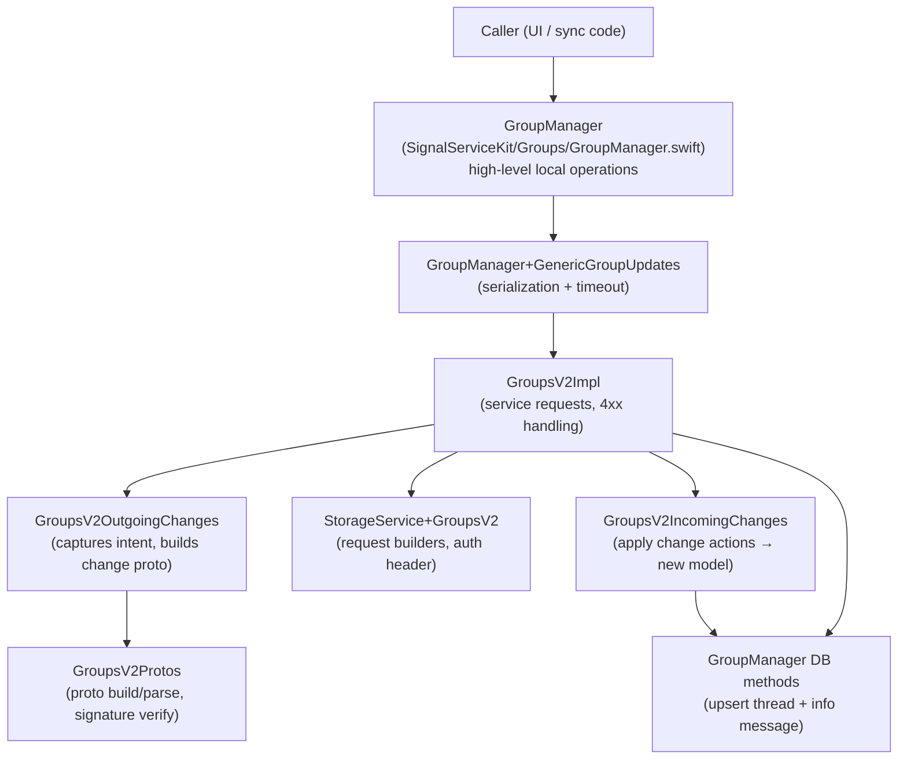
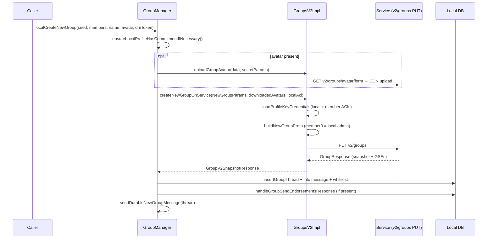
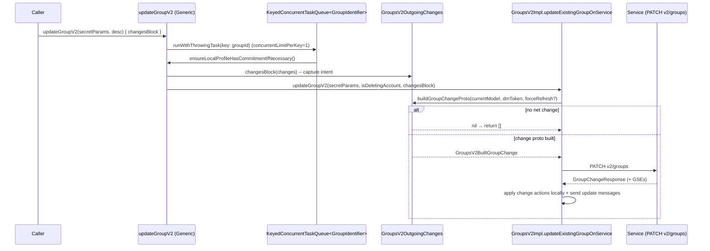
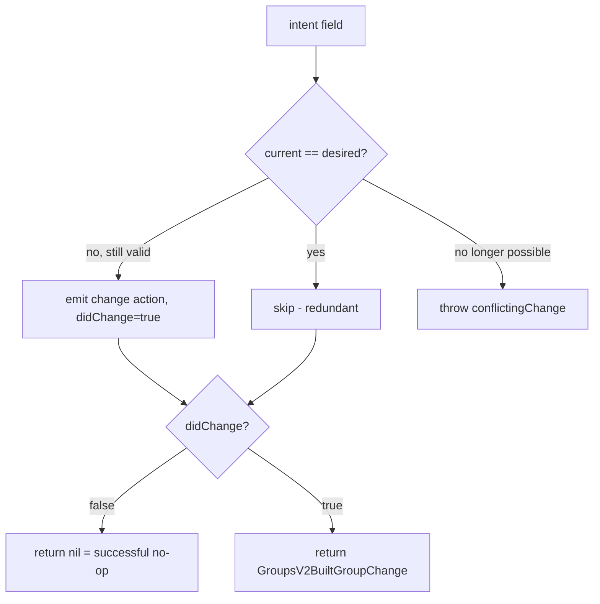
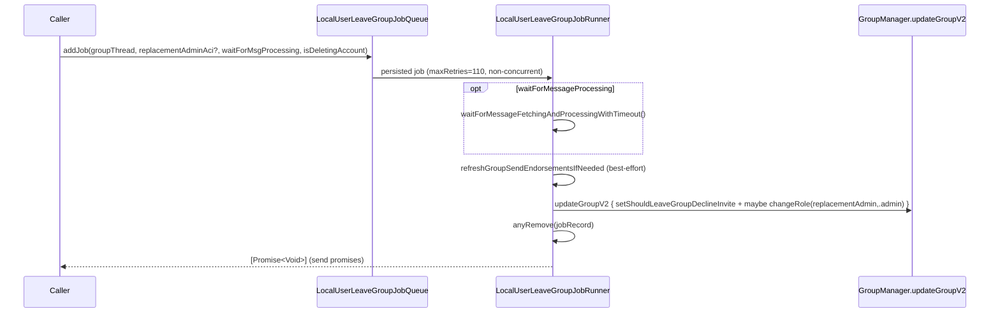
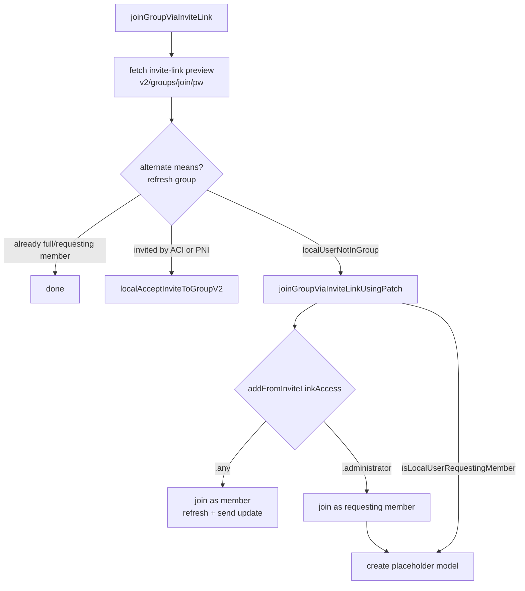
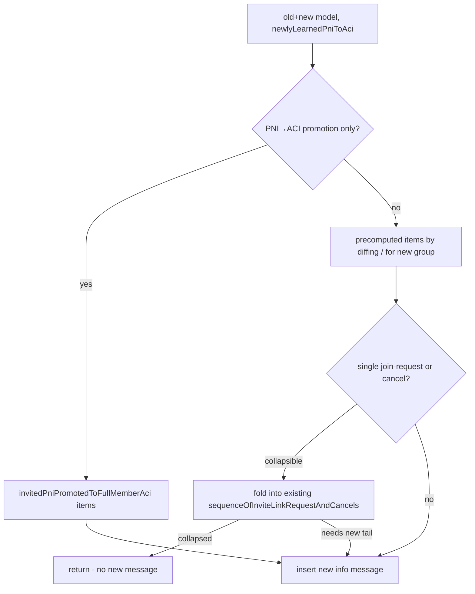
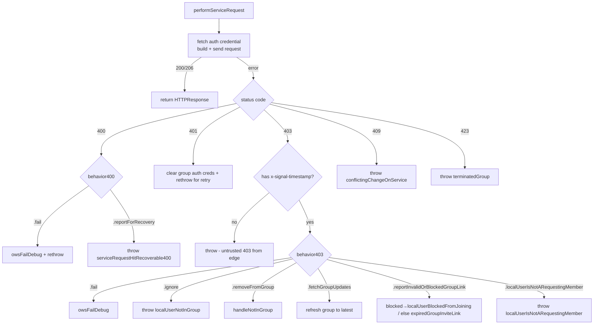

# GroupsV2 — Operations: Create, Update, Membership, Invites, Access Control

This document covers **how group state is mutated**: creating a group, applying
local edits, membership changes (add/remove/invite/request/ban), roles, labels,
access control, invite links, and group termination. It traces the full
round-trip from a local intent, through conflict-resolving change-proto
construction, to the server, and back into the local database with info messages.

> **Confidence labels:** **[High]** = explicit in source; **[Medium]** = inferred,
> depends on out-of-directory collaborators; **[Low]** = inferred from naming/comments.
> Line numbers are approximate anchors; locate by symbol name if they drift.

See also:
- [group-state-model.md](group-state-model.md) — the data types mutated here.
- [send-receive-and-sync.md](send-receive-and-sync.md) — receiving remote changes, message fan-out, Storage Service.

---

## 1. The actors

- **`GroupManager`** is the public, intent-level API (`localCreateNewGroup`,
  `addOrInvite`, `changeMemberRoleV2`, `updateGroupAttributes`, `terminateGroup`, …).
- **`GroupsV2OutgoingChanges`** captures *what the user wants changed* and later
  compiles that into a `GroupsProtoGroupChangeActions` against *current* state,
  resolving conflicts.
- **`GroupsV2Impl`** performs the HTTP request, handles 4xx recovery, then applies
  the returned change locally.
- **`GroupsV2IncomingChanges`** mirrors the server's logic to derive the next
  model from a change proto.
- The **`GroupManager` DB methods** persist the model and insert info messages.

---

## 2. Creating a new group

`GroupManager.localCreateNewGroup(seed:members:name:avatarData:disappearingMessageToken:)`
(`SignalServiceKit/Groups/GroupManager.swift`) orchestrates creation: **[High]**

Key steps and rules: **[High]**

1. **Local identifiers**: fetches the registered state; removes the local ACI
   from the "other members" list (it is added separately as member 0).
2. **Profile commitment**: `ensureLocalProfileHasCommitmentIfNecessary()` must run
   first — other clients can't fetch *our* profile-key credential (needed for GV2
   ops) until we've uploaded a profile-key commitment (§9). **[High]**
3. **Avatar upload** (optional): uploads via the CDN0 form fetched from
   `v2/groups/avatar/form`, encrypting with `GroupV2Params.encryptGroupAvatar`,
   and records the resulting state in `downloadedAvatars` to avoid a re-download
   (`GroupsV2Impl.uploadGroupAvatar`). **[High]**
4. **Proto construction** (`GroupsV2Protos.buildNewGroupProto`): the local user is
   **member 0 and the only admin**; everyone else is added as a full member if we
   have their profile-key credential, otherwise as a pending (invited) member.
   The group starts with `GroupAccess.defaultForV2` and the given disappearing
   timer. Title length is validated (≤32 glyphs, ≤1024 encrypted bytes). **[High]**
5. **Service call**: `createNewGroupOnService` issues `PUT v2/groups`
   (`behavior400: .reportForRecovery` on the first attempt, `behavior403: .fail`).
   On a recoverable 400 (likely an expired profile-key credential) it retries
   **exactly once** forcing a credential refresh (`_createNewGroupOnService(..., isRetryingAfterRecoverable400:)`). **[High]**
6. **Local persistence**: builds the model from the returned snapshot, computes a
   `lastVerifiedGroupNameHash` (the creator trivially "verified" the name),
   inserts the thread + info message, whitelists the group, stores the GSEs, and
   enqueues a durable "new group" update message to members. **[High]**

---

## 3. The generic update pipeline

Almost every mutation funnels through `GroupManager.updateGroupV2(secretParams:description:isDeletingAccount:changesBlock:)`
in `GroupManager+GenericGroupUpdates.swift`. **[High]**

Concurrency and timeouts: **[High]**
- Updates are **serialized per group** via a `KeyedConcurrentTaskQueue<GroupIdentifier>`
  with `concurrentLimitPerKey: 1`
  (`SignalServiceKit/Groups/GroupManager+GenericGroupUpdates.swift`). **[High]**
- Each `_run` is wrapped in a `.timeout(seconds: groupUpdateTimeoutDuration)`
  (30 s) that maps to `GroupsV2Error.timeout`. **[High]**
- `ensureLocalProfileHasCommitmentIfNecessary()` runs before every update. **[High]**

`GroupsV2Impl.updateGroupV2` constructs a `GroupsV2OutgoingChanges`, runs the
caller's `changesBlock`, and calls `updateExistingGroupOnService`
(`SignalServiceKit/Groups/GroupsV2Impl.swift`). **[High]**

The intent-level `GroupManager` wrappers that all funnel into this pipeline
(`SignalServiceKit/Groups/GroupManager.swift`): **[High]**

| Public method | Change(s) captured |
| --- | --- |
| `addOrInvite(secretParams:serviceIds:)` | `addMember` for each |
| `removeFromGroupOrRevokeInviteV2(secretParams:serviceIds:)` | `removeMember` for each |
| `revokeInvalidInvites(secretParams:)` | `revokeInvalidInvites()` |
| `changeMemberRoleV2(secretParams:aci:role:)` | `changeRoleForMember` |
| `changeGroupAttributesAccessV2` / `changeGroupMembershipAccessV2` / `changeGroupMemberLabelsAccessV2` | `setAccessForAttributes/Members/MemberLabels` |
| `updateLinkModeV2(secretParams:linkMode:)` | `setLinkMode` |
| `resetLinkV2(secretParams:)` | `rotateInviteLinkPassword()` |
| `acceptOrDenyMemberRequestsV2(secretParams:aci:shouldAccept:)` | `addMember` or `removeMember` |
| `setIsAnnouncementsOnly(secretParams:isAnnouncementsOnly:)` | `setIsAnnouncementsOnly` |
| `updateLocalProfileKey(secretParams:)` | `setShouldUpdateLocalProfileKey()` |
| `changeMemberLabel(secretParams:aci:label:)` | `changeLabelForMember` |
| `terminateGroup(groupModel:)` | `setShouldTerminateGroup()` (after refreshing GSEs) |
| `updateGroupAttributes(title:description:avatarData:…)` | `setTitle`/`setDescriptionText`/`setAvatar` |
| `localAcceptInviteToGroupV2(secretParams:)` | `setLocalShouldAcceptInvite()` |
| leave/decline (via job) | `setShouldLeaveGroupDeclineInvite()` (+ optional role change) |

---

## 4. `GroupsV2OutgoingChanges` — intent capture + conflict resolution

`GroupsV2OutgoingChanges` (`SignalServiceKit/Groups/GroupsV2OutgoingChangesImpl.swift:19`)
holds *only the changed aspects* of the desired state, not the full target state.
Its own doc comment frames the strategy: capture intent, then **rebase** that
intent onto the latest known state when building the proto, "applying any changes
that still make sense"; if nothing does, return `nil` (treated by callers as a
successful no-op). **[High]**

### 4.1 Captured intents

Setter methods (each `owsAssertDebug`s it isn't set twice) record:
`newTitle`, `newDescriptionText`, avatar (`newAvatarData`/`newAvatarUrlPath` +
`shouldUpdateAvatar`), `membersToAdd`, `membersToRemove`, `membersToChangeRole`,
`membersToChangeLabel`, access for members/attributes/addFromInviteLink/memberLabels,
`inviteLinkPasswordMode`, `shouldAcceptInvite`, `shouldLeaveGroupDeclineInvite`,
`shouldRevokeInvalidInvites`, `isAnnouncementsOnly`, `shouldUpdateLocalProfileKey`,
`newLinkMode`, `newDisappearingMessageToken`, `shouldTerminateGroup`
(`SignalServiceKit/Groups/GroupsV2OutgoingChangesImpl.swift:35-110`). **[High]**

`setLinkMode` composes two underlying changes: `.disabled` sets
`accessForAddFromInviteLink = .unsatisfiable` and `inviteLinkPasswordMode = .ignore`;
`.enabled(requireAdminApproval:)` sets access to `.administrator` or `.any` and
`inviteLinkPasswordMode = .ensureValid`
(`SignalServiceKit/Groups/GroupsV2OutgoingChangesImpl.swift`). **[High]**

### 4.2 `buildGroupChangeProto` — the conflict-resolution core

Signature: `buildGroupChangeProto(currentGroupModel:currentDisappearingMessageToken:forceRefreshProfileKeyCredentials:)`
first loads profile-key credentials for all `membersToAdd` ACIs **plus the local
ACI** (always included because non-add operations like profile-key updates need
the local credential), then delegates to the private builder
(`SignalServiceKit/Groups/GroupsV2OutgoingChangesImpl.swift`). **[High]**

The private builder sets `newRevision = oldRevision + 1` and walks each intent,
emitting change actions **only where current state differs** from the desired
state. The documented conflict-resolution guidelines
(`SignalServiceKit/Groups/GroupsV2OutgoingChangesImpl.swift`): **[High]**

- Orthogonal changes → just retry (no conflict).
- Many conflicts → "last writer wins" (name, avatar).
- Identical change already applied → **skip** (redundant, not a conflict).
- Overlapping adds → **partial** (add only the members not already added).
- Similar-but-different (e.g. you add Alice as admin, someone already added her as
  normal) → treat as redundant (don't fight over role).
- **Obsolete** change (e.g. change a role for a member someone already kicked) →
  throw `GroupsV2Error.cannotBuildGroupChangeProto_conflictingChange`. **[High]**

### 4.3 Validation rules enforced while building

| Field | Rule | Source |
| --- | --- | --- |
| Title | `glyphCount ≤ maxGroupNameGlyphCount` (32) **and** encrypted bytes ≤ `maxGroupNameEncryptedByteCount` (1024) | `GroupsV2OutgoingChangesImpl.swift` |
| Description | `glyphCount ≤ maxGroupDescriptionGlyphCount` (480) **and** encrypted bytes ≤ `maxGroupDescriptionEncryptedByteCount` (8192) | `GroupsV2OutgoingChangesImpl.swift` |
| Member count | full+invited ≤ `RemoteConfig.current.maxGroupSizeHardLimit`, else `cannotBuildGroupChangeProto_tooManyMembers` | `GroupsV2OutgoingChangesImpl.swift` |
| Banned members | ≤ `RemoteConfig.current.maxGroupSizeBannedMembers`; if overrun, **unban least-recently-banned** first | `GroupsV2OutgoingChangesImpl.swift` |
| Role change / label change | target must still be a full member, else `cannotBuildGroupChangeProto_conflictingChange` | `GroupsV2OutgoingChangesImpl.swift` |

Constants from `GroupManager`
(`SignalServiceKit/Groups/GroupManager.swift:…`): `maxGroupNameEncryptedByteCount = 1024`,
`maxGroupNameGlyphCount = 32`, `maxGroupDescriptionEncryptedByteCount = 8192`,
`maxGroupDescriptionGlyphCount = 480`. **[High]**

### 4.4 Add-member resolution (the four-way branch)

For each ACI/ServiceId in `membersToAdd`
(`SignalServiceKit/Groups/GroupsV2OutgoingChangesImpl.swift`): **[High]**

1. Already a full member → skip (someone added them, maybe with a different role; not a conflict).
2. A requesting member (ACI) → emit **PromoteRequestingMember** (role `.default`), mark for unban.
3. We hold a profile-key credential (ACI) → emit **AddMember** (role `.default`), mark for unban.
4. Already invited → skip.
5. Otherwise → emit **AddPendingMember** (invite); if it's an ACI, mark for unban.

Adds also implicitly **unban** the added ACI; removals **ban** the removed ACI
(except invited members are never banned). The ban/unban reconciliation respects
`maxGroupSizeBannedMembers`, unbanning the oldest when necessary. **[High]**

### 4.5 Accept invite — ACI vs PNI

When `shouldAcceptInvite` is set, the builder determines whether the local user is
invited by ACI or PNI
(`SignalServiceKit/Groups/GroupsV2OutgoingChangesImpl.swift`): **[High]**
- Invited by **ACI** → `PromotePendingMember` action (presentation of local credential).
- Invited by **PNI** → `PromoteMemberPendingPniAciProfileKey` action.
- If both are present, prefer the ACI path (and log a warning).
- Already a full member → warn, no change.
- Neither → `owsFailDebug` + `cannotBuildGroupChangeProto_conflictingChange`.

### 4.6 Leave / decline — and the PNI anti-leak rule

When `shouldLeaveGroupDeclineInvite` is set
(`SignalServiceKit/Groups/GroupsV2OutgoingChangesImpl.swift`): **[High]**
- If locally invited (ACI or PNI) → `DeletePendingMember` (decline).
  - **If declining a PNI invite, `groupUpdateMessageBehavior` becomes `.sendNothing`** —
    messages can't come from a PNI, so sending one would leak the ACI. **[High]**
- Else if a full member → `DeleteMember` (leave).
- Else → redundant, no change.

Additionally, if the local admin is the **last member** and is leaving, the
builder forces `accessForAddFromInviteLink = .unsatisfiable` to disable the invite
link on the way out (`SignalServiceKit/Groups/GroupsV2OutgoingChangesImpl.swift`). **[High]**

### 4.7 Member-label access escalation side effect

Setting `accessForMemberLabels` to `.administrator` additionally emits a
`ModifyMemberLabel` (clearing) action for every non-admin full member — because
raising the access level means non-admins may no longer *have* labels
(`SignalServiceKit/Groups/GroupsV2OutgoingChangesImpl.swift`). Similarly, when a
role change drops someone below admin and labels are admin-only, their label is
cleared. **[High]**

The output is a `GroupsV2BuiltGroupChange` carrying the proto and the
`GroupUpdateMessageBehavior` (`SignalServiceKit/Groups/GroupsV2.swift`). **[High]**

---

## 5. `GroupsV2IncomingChanges` — applying a change proto to a model

`GroupsV2IncomingChanges.applyChangesToGroupModel(...)`
(`SignalServiceKit/Groups/GroupsV2IncomingChanges.swift:…`) derives the next model
from a change proto. Its explicit goal: **exactly mimic the service's behavior**,
so the client can update without re-fetching and stay aligned with the server. **[High]**

Preconditions and setup: **[High]**
- The old model must be `TSGroupModelV2` and **not** an `isJoinRequestPlaceholder`
  (else `GroupsV2Error.cantApplyChangesToPlaceholder`).
- `newRevision` must equal `oldRevision + 1` (else `OWSAssertionError`).
- The change author is derived via `changeActionsProto.updateSource(...)`
  (see [send-receive-and-sync.md §4](send-receive-and-sync.md)); a missing author is fatal.

### 5.1 Permission computation (mirroring the server)

From the old access + the author's role, it computes
(`SignalServiceKit/Groups/GroupsV2IncomingChanges.swift`): **[High]**

| Permission | Derivation |
| --- | --- |
| `canAddMembers` | `members` access: `.member`→author is member; `.administrator`→author is admin; `.any`/`.unsatisfiable`/`.unknown`→false |
| `canRemoveMembers` | author is admin |
| `canModifyRoles` | author is admin |
| `canEditAttributes` | `attributes` access, same shape as `canAddMembers` |
| `canEditAccess` | author is admin |
| `canEditInviteLinks` | author is admin |
| `canEditIsAnnouncementsOnly` | author is admin |

Important: **`.any` is no longer honored** (both `canAddMembers` and
`canEditAttributes` return `false` for `.any`), reflecting a server-side policy
change (`SignalServiceKit/Groups/GroupsV2IncomingChanges.swift`). Permission
violations here are `owsFailDebug` warnings rather than hard throws (the service
is the authority; the client is just reconstructing). **[High]**

### 5.2 Actions processed

The method processes every change-action array in order
(`SignalServiceKit/Groups/GroupsV2IncomingChanges.swift`): **[High]**
`addMembers`, `deleteMembers`, `modifyMemberRoles`, `modifyMemberLabel`,
`modifyMemberProfileKeys`, `addPendingMembers`, `deletePendingMembers`,
`promotePendingMembers`, `promotePniPendingMembers`, `addRequestingMembers`,
`deleteRequestingMembers`, `promoteRequestingMembers`, `addBannedMembers`,
`deleteBannedMembers`, plus the attribute/access actions (`modifyTitle`,
`modifyDescription`, `modifyAvatar`, `modifyDisappearingMessagesTimer`,
`modifyAttributesAccess`, `modifyMemberAccess`, `modifyMemberLabelAccess`,
`modifyAddFromInviteLinkAccess`, `modifyInviteLinkPassword`,
`modifyAnnouncementsOnly`, `terminateGroup`). **[High]**

Side effects worth noting: **[High]**
- **Profile keys learned**: adds/promotes/requests/profile-key-modifications
  populate a `[Aci: Data]` map returned to the caller.
- **PNI→ACI associations learned**: `promotePniPendingMembers` records
  `newlyLearnedPniToAciAssociations[pni] = aci` (used later for the one-off
  PNI-promotion info message, §8).
- **`didJustAddSelfViaGroupLink`**: set true if an `addMembers` action's author is
  the local ACI and the added member is the local ACI (join via open link).
- **`shouldUpdateLastVerifiedGroupNameHash`**: set when the local ACI authored a
  `modifyTitle` (we verified the new name).
- Invalid pending-member ciphertexts are stored as *invalid invites* rather than
  throwing (the service can't validate those ciphertexts). **[High]**

### 5.3 Old-history fallback: presentation data

`modifyMemberProfileKeys` and `promotePendingMembers` conform to
`HasAciAndProfileKey`; `promotePniPendingMembers` to `HasPniAndAciAndProfileKey`
(`SignalServiceKit/Groups/GroupsV2IncomingChanges.swift`). `getAciProperties`
prefers the explicit `userID` + `profileKey` fields but **falls back to parsing a
`ProfileKeyCredentialPresentation`** when those are absent — a path only hit when
parsing *old* group history, since the server has long written the explicit
fields. **[High]**

The method returns a `ChangedGroupModel` (old model, new model, DM token if
changed, update source, learned profile keys, PNI→ACI associations, and the
name-hash flag) (`SignalServiceKit/Groups/GroupsV2IncomingChanges.swift:9-50`). **[High]**

---

## 6. Leaving a group / declining an invite

Leaving is **durable** via a job queue, not a direct update
(`GroupManager.localLeaveGroupOrDeclineInvite` → `LocalUserLeaveGroupJobQueue.addJob`,
`SignalServiceKit/Jobs/LocalUserLeaveGroupJob.swift`). **[High]**

Details (`SignalServiceKit/Jobs/LocalUserLeaveGroupJob.swift`): **[High]**
- The runner is **non-concurrent** (`canExecuteJobsConcurrently: false`) with
  `maxRetries = 110`. **[High]**
- It refreshes group-send endorsements before leaving (best-effort; continues even
  if the refresh fails for non-network reasons) because the leave message fan-out
  may need them (§[send doc](send-receive-and-sync.md)). **[High]**
- If a `replacementAdminAci` is supplied, the same change set promotes them to
  admin — this is how the "choose a new admin before you can leave" rule (model
  §4.5) is satisfied. **[High]**
- The outer `Promise<[Promise<Void>]>` resolves to the per-recipient send promises.

---

## 7. Invite links

### 7.1 The link format

`GroupInviteLink` (`SignalServiceKit/Groups/GroupInviteLink.swift:9-66`) wraps a
`GroupMasterKey` + a non-empty `inviteLinkPassword`. **[High]**
- Password length: **16 bytes** (`generateInviteLinkPassword`). **[High]**
- URL: `https://signal.group/#<base64url(GroupsProtoGroupInviteLink)>`
  (`url()`); `PossibleGroupInviteLinkUrl.parseFrom` accepts `https://signal.group`
  and the `sgnl://signal.group` / `sgnl://joingroup` schemes. **[High]**
- Equality uses **constant-time comparison** of master key and password
  (`ows_constantTimeIsEqual`) to avoid timing side channels. **[High]**

`GroupInviteLinkConfiguration` (`SignalServiceKit/Groups/GroupInviteLinkConfiguration.swift`)
is `.enabled(inviteLink:requireAdminApproval:)` or `.disabled`; the model derives
it from `access.addFromInviteLink` (model §3.3). **[High]**

### 7.2 Joining via a link

`GroupManager.joinGroupViaInviteLink` → `GroupsV2Impl.joinGroupViaInviteLink`
(`SignalServiceKit/Groups/GroupsV2Impl.swift`). The whole operation is retried on
HTTP 409 conflicts (up to 5 attempts) because concurrent joins race, and a 409
means the group state changed (possibly adding us by another mechanism). **[High]**

- **Preview first** (`fetchGroupInviteLinkPreview`): the comment explains fetching
  the preview *before* refreshing avoids an HTTP 400 (vs 409) if someone adds us
  mid-join (`SignalServiceKit/Groups/GroupsV2Impl.swift`). **[High]**
- **Alternate means** (`joinGroupViaInviteLinkUsingAlternateMeans`): refresh the
  group; if we're already a full/requesting member, done; if invited (ACI or PNI),
  accept the invite (which makes us a *full* member rather than a *requesting*
  one); otherwise throw `localUserNotInGroup` to fall through to the patch path. **[High]**
- **Patch** (`joinGroupViaInviteLinkUsingPatch`): choose join mode from
  `addFromInviteLinkAccess` — `.any → .asMember`, `.administrator → .asRequestingMember`
  (any other value is an error). `.asMember` PATCHes an AddMember action, then
  refreshes with `.didJustAddSelfViaGroupLink` and sends an update message.
  `.asRequestingMember` PATCHes an AddRequestingMember action and creates a
  **placeholder** model. **[High]**
- **403 handling** here uses `behavior403: .reportInvalidOrBlockedGroupLink`,
  which maps to `localUserBlockedFromJoining` (if the ban header is present) or
  `expiredGroupInviteLink` (§10). **[High]**

### 7.3 Placeholder models

A placeholder (`isJoinRequestPlaceholder = true`) represents a group we've
requested to join but can't yet see. `createPlaceholderGroupForJoinRequest` either
updates an existing thread (ensuring we're a requesting member) or inserts a new
thread built from the invite-link preview (title/description/avatar/access), with
only the local ACI as a requesting member
(`SignalServiceKit/Groups/GroupsV2Impl.swift`). **[High]**

`fetchGroupInviteLinkPreviewAndRefreshGroup` and
`updatePlaceholderGroupModelUsingInviteLinkPreview` keep a placeholder's
requesting-member status in sync with the latest preview; if we learn we are no
longer a requesting member (`localUserIsNotARequestingMember`), the placeholder is
updated to drop us (`SignalServiceKit/Groups/GroupsV2Impl.swift`). **[High]**

### 7.4 Canceling a join request

`GroupManager.cancelRequestToJoin` → `GroupsV2Impl.cancelRequestToJoin`
PATCHes a `DeleteRequestingMember` action for the local ACI (re-fetching the
preview first for the latest revision), then updates the local placeholder to
remove the request. `localUserIsNotARequestingMember` is treated as "already
removed" and still proceeds to update the model
(`SignalServiceKit/Groups/GroupsV2Impl.swift`). **[High]**

### 7.5 Handling 403 "not in group" (`handleNotInGroup`)

When a group fetch/update returns 403 with `behavior403: .removeFromGroup`,
`GroupManager.handleNotInGroup(groupId:)` removes the local user from the group
**without bumping the revision** — the comment explains this is inferred from the
403 rather than from a real change, so the revision stays put; if we're re-added,
the GV2 machinery recovers. For a requesting-member placeholder it first confirms
loss of access by attempting an invite-link preview
(`SignalServiceKit/Groups/GroupManager.swift`). **[High]**

---

## 8. Persisting changes + info messages

Both local and remote changes converge on
`GroupManager.updateExistingGroupThreadInDatabaseAndCreateInfoMessage(...)`
(`SignalServiceKit/Groups/GroupManager.swift`). **[High]**

Steps (in order): **[High]**
1. Update the disappearing-messages configuration if a new token was provided.
2. Insert `SignalRecipient`s for newly-added members (`insertRecipients`).
3. **Sender-key reset**: if any member *other than the local user* was removed,
   delete the sender-key session for the thread (so the departing member can't
   decrypt future sender-key messages). **[High]**
4. **Profile-key rotation**: if our profile key is no longer exposed to the group
   (e.g. we left) *and* the group contained a blocked/hidden user who could see
   our key, and this was our **last mutual group** with that user, schedule a
   profile-key rotation (`setNeedsProfileKeyRotation`). **[High]**
5. **Revision guard**: `guard newGroupModel.revision >= oldGroupModel.revision` —
   never revert to an older revision; redundant updates are dropped. **[High]**
6. Auto-whitelist the group if the local user was just added (§9).
7. Decide `showInfoMessageForChange` (model §3.4, plus DM-token change) and persist
   the model via `groupThread.update(with:)`.
8. If a `lastVerifiedGroupNameHash` update is present, store it and record a
   pending Storage Service update (with a `// TODO` noting it shouldn't update
   Storage Service unless the change originated on this device). **[High]**
9. Insert the info message if appropriate (`infoMessagePolicy == .insert`).

`tryToUpsertExistingGroupThreadInDatabaseAndCreateInfoMessage` is the insert-or-update
dispatcher: it attributes the update author only if the local user was *just*
added (otherwise `.unknown`, to avoid blaming the latest editor for all historical
state) (`SignalServiceKit/Groups/GroupManager.swift`). **[High]**

### 8.1 The info-message inserter

`GroupUpdateInfoMessageInserterImpl` (`SignalServiceKit/Groups/GroupUpdateInfoMessageInserter.swift`)
builds persistable update items either from a model diff
(`precomputedUpdateItemsByDiffingModels`) or for a new group
(`precomputedUpdateItemsForNewGroup`). **[High]** Special handling: **[High]**

- **PNI→ACI promotion one-off**: because a model diff can't tell "someone declined
  a PNI invite and an unrelated ACI joined" from "a PNI invite was promoted to its
  ACI", `InvitedPnisPromotionToFullMemberAcis.from(...)` uses the
  `newlyLearnedPniToAciAssociations` to detect genuine promotions and emit a
  single `invitedPniPromotedToFullMemberAci` item. **[High]**
- **Join-request collapsing** (`GroupUpdateInfoMessageInserter+FoldIntoExistingMessage.swift`):
  repeated invite-link request/cancel churn by a single non-local user is collapsed
  into a `sequenceOfInviteLinkRequestAndCancels(requester, count, isTail)` item,
  incrementing a counter instead of flooding the history. This explicitly thwarts a
  user who could otherwise spam the group by requesting and canceling repeatedly. **[High]**
- **Read + notify**: if the update was local (or the local user just became a
  requesting member), the inserted messages are marked read; otherwise the user is
  notified on local-user join/invite and on group termination. Terminated groups
  also have their intents removed. **[High]**

---

## 9. Profile-key commitment and whitelisting

`ensureLocalProfileHasCommitmentIfNecessary()`
(`SignalServiceKit/Groups/GroupManager.swift`) runs on a serial task queue
(limit 1). It checks for a local profile-key credential; if missing, it fetches
the local profile (which may renew an expired credential); if still missing and we
are a registered primary in the main app, it re-uploads the local profile to
publish a profile-key commitment — a prerequisite for *other* clients to fetch our
credential for GV2 operations. **[High]**

`autoWhitelistGroupIfNecessary` adds a group to the profile whitelist when the
**local user was just added** (`wasLocalUserJustAddedToTheGroup`), gated on the
update source: `.localUser` always whitelists; `.aci(author)` whitelists only if
that author is already in our profile whitelist; `.unknown`/`.legacyE164`/
`.rejectedInviteToPni` never whitelist (`SignalServiceKit/Groups/GroupManager.swift`). **[High]**

`storeProfileKeysFromGroupProtos` distinguishes **authoritative** profile keys
(key owner == change author; treated as source of truth) from **non-authoritative**
ones (used only if we have nothing else). The local ACI's key is always removed
from the authoritative set — our locally stored key is more trusted than the
server's view (`SignalServiceKit/Groups/GroupManager.swift`). **[High]**

---

## 10. Change-proto epochs, embedding, and the server contract

`GroupManager.changeProtoEpoch = 7` (`SignalServiceKit/Groups/GroupManager.swift`)
is the highest change-action epoch this client understands. The epochs
(from the source comment): **[High]**

| Epoch | Feature |
| --- | --- |
| 1 | Group Links |
| 2 | Group Description |
| 3 | Announcement-Only Groups |
| 4 | Banned Members |
| 5 | Promote pending PNI members |
| 6 | Member Labels |
| 7 | Group Terminate |

- The client advertises `maxSupportedChangeEpoch = changeProtoEpoch` when fetching
  change logs (§[send doc](send-receive-and-sync.md)), and **rejects embedded
  change protos with a higher epoch** (`handleGroupUpdatedOnService` throws if
  `changeProto.changeEpoch > changeProtoEpoch`). **[High]**
- Change protos may be **embedded** in outgoing data messages up to
  `maxEmbeddedChangeProtoLength` (= `OWSMediaUtils.kOversizeTextMessageSizeThresholdBytes`);
  larger protos are dropped (`GroupsV2Protos.buildGroupContextProto`). **[High]**

### 10.1 Proto build/parse responsibilities (`GroupsV2Protos`)

`SignalServiceKit/Groups/GroupsV2Protos.swift`: **[High]**
- `buildMemberProto` / `buildPendingMemberProto` / `buildRequestingMemberProto` /
  `buildBannedMemberProto` — member protos; full/requesting members embed a
  `ProfileKeyCredentialPresentation` via `presentationData`
  (`ClientZkProfileOperations.createProfileKeyCredentialPresentation`). **[High]**
- `buildNewGroupProto` — the create-group proto (member 0 = local admin). **[High]**
- `parseGroupChangeProto` — parses a change proto, verifying the server's
  `NotarySignature` unless `.alreadyTrusted`, and checks the group ID matches. **[High]**
- `parse(groupProto:...)` — decrypts a snapshot into a `GroupV2Snapshot`,
  reconstructing membership, labels, access, and the learned profile keys; uses an
  optional alongside-fetched change-actions proto to recover `didJoinFromInviteLink`
  provenance that a snapshot alone can't convey. **[High]**
- `parseGroupInviteLinkPreview`, `parseChangesFromService`, `collectAvatarUrlPaths`. **[High]**

---

## 11. Service requests and 4xx handling (`GroupsV2Impl.performServiceRequest`)

All GV2 HTTP goes through `performServiceRequest(requestBuilder:groupId:behavior400:behavior403:)`
(`SignalServiceKit/Groups/GroupsV2Impl.swift`), retried up to **3 attempts** for
network failures / HTTP 401 (`Retry.performWithBackoff`). **[High]**

Critical safety detail: a **403 without an `x-signal-timestamp` header is dropped**
(`OWSAssertionError`) — Signal's edge infrastructure can short-circuit requests
with spurious 403s before they reach a Signal server, and the client must not take
destructive local action (like removing itself from the group) on an untrusted
403. Genuine Signal-server 403s always carry that header
(`SignalServiceKit/Groups/GroupsV2Impl.swift`). **[High]**

### 11.1 Update retry recovery (`updateExistingGroupOnService`)

`SignalServiceKit/Groups/GroupsV2Impl.swift`: **[High]**
- **409 conflict** → refresh the group (with a timeout; `isLeavingGroup` passed so
  the refresh isn't blocked by a group-block check), then rebuild the proto against
  the fresh state and retry once.
- **Recoverable 400** (proto contained profile-key credentials, likely expired) →
  rebuild forcing a credential refresh and `forceFailOn400: true` (so a second 400
  is fatal). The `behavior400` is set to `.reportForRecovery` only when the proto
  actually `containsProfileKeyCredentials`. **[High]**

### 11.2 Error taxonomy (`GroupsV2Error`)

`SignalServiceKit/Groups/GroupsV2.swift:9-50` and the retryability mapping in
`SignalServiceKit/Groups/GroupV2UpdatesImpl.swift`: **[High]**

| Error | Meaning | Retryable? |
| --- | --- | --- |
| `conflictingChangeOnService` | 409; our change raced | **Yes** |
| `timeout` | op exceeded 30 s | **Yes** |
| `localUserNotInGroup` | 403 / removed | No |
| `cannotBuildGroupChangeProto_conflictingChange` | obsolete intent | No |
| `cannotBuildGroupChangeProto_tooManyMembers` | over size limit | No |
| `localUserIsNotARequestingMember` | request already gone | No |
| `cantApplyChangesToPlaceholder` | can't diff a placeholder | No |
| `expiredGroupInviteLink` / `localUserBlockedFromJoining` | link invalid / banned | No |
| `terminatedGroup` | 423 | No |
| `groupBlocked` | group blocked locally | No |
| `groupChangeProtoForIncompatibleRevision` | non-contiguous revision | No |
| `serviceRequestHitRecoverable400` | retry with fresh credentials | No (handled inline) |
| `skipRestoringTerminatedGroup` | skip during restore | No |

---

## 12. Operation cross-reference

| Operation | Entry point | Change action(s) | Notable rules |
| --- | --- | --- | --- |
| Create group | `localCreateNewGroup` | `PUT v2/groups` (full proto) | member 0 = admin; retry on expired PKC |
| Add / invite | `addOrInvite` | AddMember / AddPendingMember / PromoteRequestingMember | add vs invite by credential availability |
| Remove / revoke | `removeFromGroupOrRevokeInviteV2` | DeleteMember / DeletePendingMember / DeleteRequestingMember | removing a member bans their ACI |
| Change role | `changeMemberRoleV2` | ModifyMemberRole | target must still be full member |
| Attributes | `updateGroupAttributes` | ModifyTitle/Description/Avatar | glyph + byte limits |
| Access | `changeGroup*AccessV2` | ModifyMembers/Attributes/MemberLabel AccessControl | `.any` not honored on apply |
| Invite link mode | `updateLinkModeV2` | ModifyAddFromInviteLinkAccess + password | enable→password ensured; disable→unsatisfiable |
| Reset link | `resetLinkV2` | ModifyInviteLinkPassword | rotates 16-byte password |
| Join via link | `joinGroupViaInviteLink` | AddMember / AddRequestingMember | preview-first; 409 retry; placeholder if admin-approval |
| Accept invite | `localAcceptInviteToGroupV2` | PromotePendingMember / PromoteMemberPendingPniAci | ACI vs PNI path |
| Cancel request | `cancelRequestToJoin` | DeleteRequestingMember (local) | re-fetch preview for revision |
| Leave / decline | `localLeaveGroupOrDeclineInvite` (job) | DeleteMember / DeletePendingMember | PNI decline → sendNothing; optional replacement admin |
| Announcements | `setIsAnnouncementsOnly` | ModifyAnnouncementsOnly | admin only |
| Member label | `changeMemberLabel` | ModifyMemberLabel | admin-labels mode clears non-admin labels |
| Terminate | `terminateGroup` | TerminateGroup | refresh GSEs first; admin only; 423 afterward |
