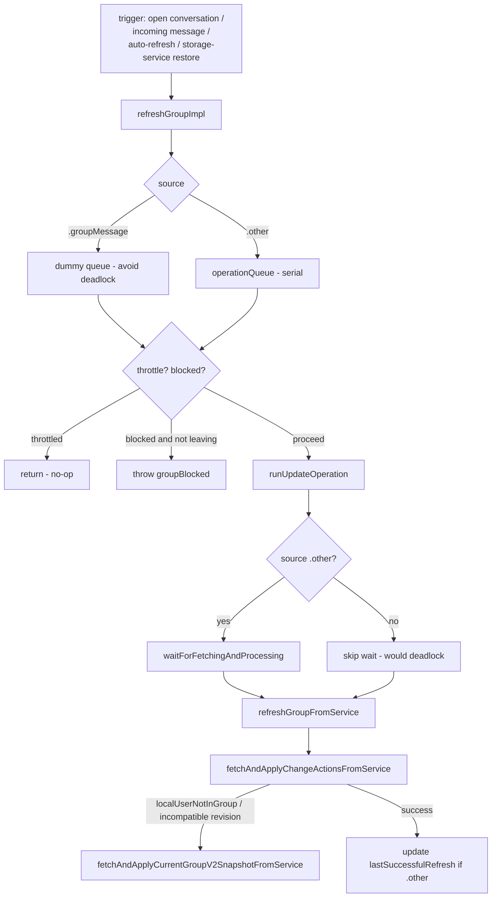
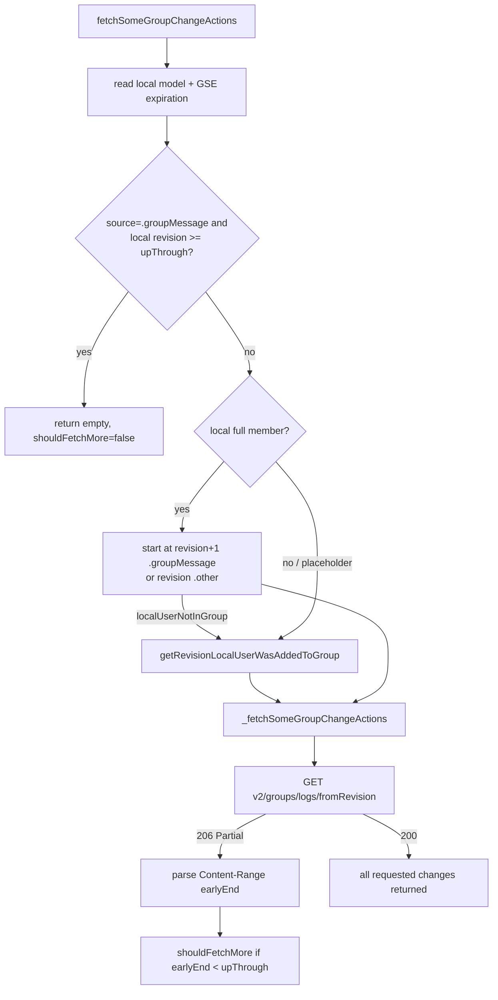
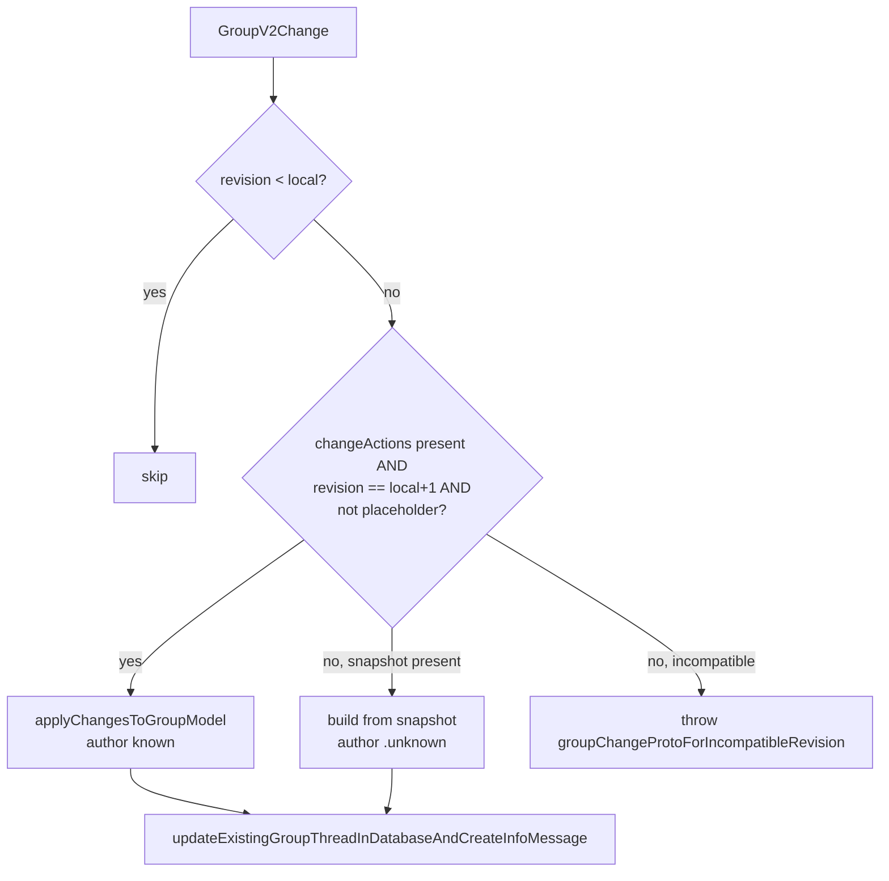
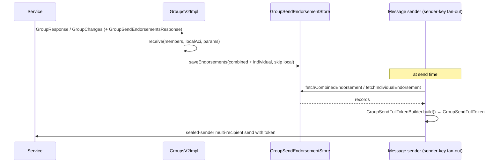
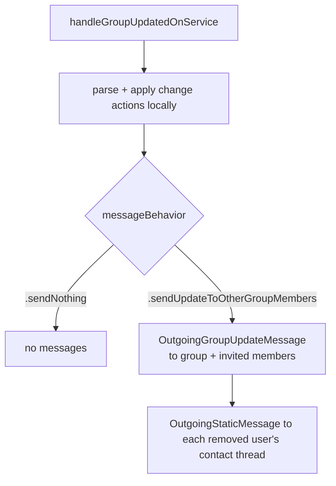
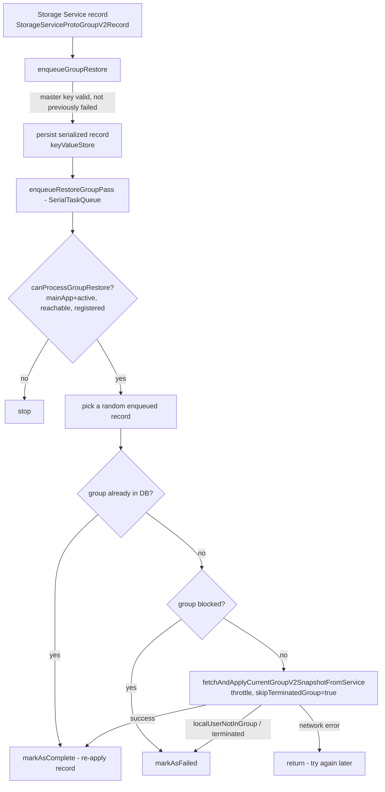
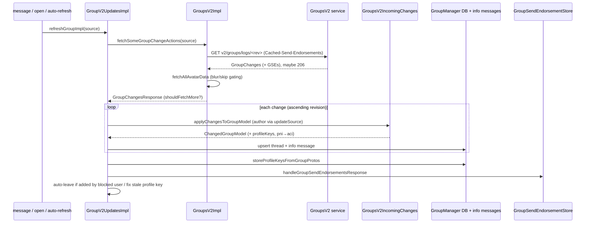

# GroupsV2 — Receiving Changes, Message Fan-out, Endorsements & Storage Service Sync

This document covers the **inbound and sync side** of GroupsV2: how the client
learns about and applies remote group changes, how it fetches change logs and
snapshots, how it downloads (or blurs) avatars, how group update messages fan out
to members and removed users, how **group send endorsements (GSEs)** enable
efficient sender-key fan-out, how the local profile key is kept fresh in groups,
and how groups are synchronized and restored via **Storage Service**.

> **Confidence labels:** **[High]** = explicit in source; **[Medium]** = inferred,
> depends on out-of-directory collaborators (message pipeline, crypto, Storage
> Service record updaters); **[Low]** = inferred from naming/comments.
> Line numbers are approximate anchors; locate by symbol name if they drift.

The message pipeline and the LibSignal crypto layer are referenced only where they
clarify group behavior; they are documented elsewhere.

See also:
- [group-state-model.md](group-state-model.md) — the model and `GroupRecord`.
- [gv2-operations.md](gv2-operations.md) — building and committing *outgoing* changes.

---

## 1. The refresh pipeline at a glance

`GroupV2UpdatesImpl` (`SignalServiceKit/Groups/GroupV2UpdatesImpl.swift:9`) owns
the inbound side. It keeps an in-memory `lastSuccessfulRefreshMap`
(`LRUCache<GroupIdentifier, Date>`, size 256) for throttling and a serial
`operationQueue` (`ConcurrentTaskQueue(concurrentLimit: 1)`). **[High]**

### 1.1 Fetch sources (`GroupChangeActionFetchSource`)

`SignalServiceKit/Groups/GroupsV2.swift`: **[High]**
- `.groupMessage(revision:)` — we're processing an incoming message that references
  a revision. We want to catch up **to that revision** and then stop (further
  revisions will arrive via other messages we haven't processed yet).
- `.other` — we want the latest state but must first finish processing queued
  messages so our view is consistent.

### 1.2 Concurrency and the deadlock avoidance

`refreshGroupImpl` (`SignalServiceKit/Groups/GroupV2UpdatesImpl.swift`): **[High]**
- `.groupMessage` uses a **fresh dummy** `ConcurrentTaskQueue` so it runs
  immediately — the upstream message processor already serializes these, and using
  the shared `operationQueue` could deadlock if a group refresh is itself waiting
  on message processing.
- `.other` uses the shared serial `operationQueue`.
- **Throttle**: with `.throttle` option set, refreshes are suppressed if the last
  successful refresh was within **5 minutes** (`refreshFrequency = .minute * 5`).
- **Block check**: unless `.leavingGroup` is set, a locally-blocked group throws
  `GroupsV2Error.groupBlocked` immediately (you can still leave a blocked group). **[High]**
- On success with `.other`, `lastSuccessfulRefreshMap` is updated; with
  `.groupMessage` it is not (we may not have reached the very latest state). **[High]**

### 1.3 Change-actions-first, snapshot-fallback

`refreshGroupFromService` (`SignalServiceKit/Groups/GroupV2UpdatesImpl.swift`)
prefers incremental change actions (they carry the author), and **fails over to a
full snapshot** only for recoverable cases: `localUserNotInGroup` (e.g. joining via
invite link, can't read change logs yet) and `groupChangeProtoForIncompatibleRevision`.
Network failures do **not** trigger snapshot fallback. **[High]**

---

## 2. Fetching change actions (`fetchSomeGroupChangeActions`)

`GroupsV2Impl.fetchSomeGroupChangeActions(secretParams:source:)`
(`SignalServiceKit/Groups/GroupsV2Impl.swift`) decides *where to start* and *how
far to go*. **[High]**

Starting point logic (`SignalServiceKit/Groups/GroupsV2Impl.swift`): **[High]**
- If `.groupMessage` and the local revision already meets `upThroughRevision`,
  return empty immediately.
- If a **full member**: `.groupMessage` starts at `revision + 1`
  (`includeFirstState: false`); `.other` starts at `revision`
  (`includeFirstState: true`). If this fails with `localUserNotInGroup` (we may
  have been removed and re-added), fall through to the joined-at logic.
- Otherwise, call `getRevisionLocalUserWasAddedToGroup` (via
  `GET v2/groups/joined_at_version`) to find where we gained read access, then
  fetch from there with `includeFirstState: true`. **[High]**

### 2.1 Pagination: 206 + Content-Range

`_fetchSomeGroupChangeActions` (`SignalServiceKit/Groups/GroupsV2Impl.swift`): **[High]**
- Computes `limit` from `upThroughRevision - startingAtRevision + 1`, guarding
  against overflow from peer-supplied revisions (fuzzed values clamp to `.max`;
  `startingAtRevision > upThroughRevision` yields limit 1). **[High]**
- Issues `GET v2/groups/logs/<fromRevision>` with `behavior400: .fail`,
  `behavior403: .ignore` (meaning "throw the error" rather than remove-from-group). **[High]**
- On HTTP **206 Partial Content**, parses the `Content-Range` header via the regex
  `^versions (\d+)-(\d+)/(\d+)$` to extract the `earlyEnd` revision
  (`parseEarlyEnd`). `shouldFetchMore` is `true` when `earlyEnd != nil` and we
  haven't reached `upThroughRevision`. The caller loops until `shouldFetchMore`
  is false (`fetchAndApplyChangeActionsFromService`). **[High]**

### 2.2 The GSE expiration header

Every change-log fetch sends a `Cached-Send-Endorsements: <gseExpiration>` header
(`StorageService.buildFetchGroupChangeActionsRequest`,
`SignalServiceKit/Groups/StorageService+GroupsV2.swift`). The value is the
expiration timestamp of the locally-cached combined endorsement (0 if none). This
lets the server **omit** re-sending endorsements the client already has and still
holds valid, and send fresh ones only when needed (§5). **[High]**

---

## 3. Applying fetched changes

`tryToApplyGroupChangesFromService` (`SignalServiceKit/Groups/GroupV2UpdatesImpl.swift`)
applies a batch within a single write transaction. **[High]**

Flow: **[High]**
1. If the thread doesn't exist yet, `insertThreadForGroupChanges` builds it from the
   **first change's snapshot** and attributes authorship only if the local user was
   added by that change. For a brand-new thread it also computes
   `lastVerifiedGroupNameHash` by inspecting revision 0's author
   (`lastVerifiedHashIfLocalUserCreatedGroup`) — if the local user created the
   group, the current name is "verified". **[High]**
2. For each `GroupV2Change`, call `tryToApplySingleChangeFromService`.
3. Store learned profile keys (authoritative vs non-authoritative, §4.3 of
   [gv2-operations.md](gv2-operations.md)).
4. **Auto-leave if added by a blocked user**: if the author who added us is blocked,
   enqueue a leave job (`localLeaveGroupOrDeclineInvite(waitForMessageProcessing: true)`). **[High]**
5. Otherwise, if the final state has a **stale local profile key**, schedule a
   profile-key update (`updateLocalProfileKeyInGroup`, §6). **[High]**
6. Handle any `GroupSendEndorsementsResponse` (§5).

### 3.1 Single-change: change-actions vs snapshot

`tryToApplySingleChangeFromService` (`SignalServiceKit/Groups/GroupV2UpdatesImpl.swift`): **[High]**
- Skips changes with `revision < oldModel.revision` (nothing to do; equal revision
  likely means a snapshot to re-apply).
- **Prefers change actions** when the proto is present, is exactly `oldRevision + 1`,
  and the model is not a placeholder — because change actions carry the author
  (`groupUpdateSource`). Otherwise falls back to the snapshot (author `.unknown`).
- If neither applies and we have a non-contiguous change proto → throws
  `groupChangeProtoForIncompatibleRevision` (which triggers the snapshot fallback
  up in `refreshGroupFromService`). **[High]**
- Authoritative profile keys are those whose owner matches the change author
  (`authoritativeProfileKeysByAci`); all learned keys merge into `profileKeysByAci`
  taking the latest. **[High]**

### 3.2 Full snapshot application

`fetchAndApplyCurrentGroupV2SnapshotFromService` (`SignalServiceKit/Groups/GroupV2UpdatesImpl.swift`): **[High]**
- Fetches the latest snapshot; if `skipTerminatedGroup` and the snapshot is
  terminated, throws `skipRestoringTerminatedGroup`.
- Builds the model from the snapshot (author `.unknown` because snapshots have no
  single author). If overwriting a model at the **same revision**, it preserves the
  transient `didJustAddSelfViaGroupLink` flag. **[High]**
- Stores profile keys, fixes a stale local profile key if present, handles GSEs,
  and (after the transaction) retries any avatar downloads that were skipped before
  the thread existed (`downloadAndApplyGroupAvatarIfSkipped`). **[High]**

---

## 4. Attributing authorship — the PNI→ACI mapping (`updateSource`)

`GroupsProtoGroupChangeActions.updateSource(groupV2Params:localIdentifiers:)`
(`SignalServiceKit/Groups/GroupV2UpdatesImpl.swift`) resolves the `GroupUpdateSource`
(and the raw `ServiceId`) from the change's `sourceUserID`. **[High]**

- An **ACI** author maps straight to `.aci(aci)` (wrapped in `.localUser` if it's us). **[High]**
- A **PNI** author is special — "at the time of writing, the only change actions
  with a PNI author are accepting or declining a PNI invite." It inspects the
  action to recover the real ACI: **[High]**

| PNI-authored shape | Resulting source |
| --- | --- |
| single `deletePendingMembers` matching the PNI | `.rejectedInviteToPni(pni)` |
| single `promotePniPendingMembers` | `.aci(associatedAci)` (we now address them by ACI) |
| single `addMembers` with `joinFromInviteLink` (legacy) | `.aci(associatedAci)` + `owsFailDebug` canary |
| single `addRequestingMembers` (legacy) | `.aci(associatedAci)` + `owsFailDebug` canary |
| anything else PNI-authored | `.unknown` + canary |

Each branch cross-checks that the PNI in the action matches the author PNI, logging
a canary `owsFailDebug` on mismatch. **[High]** This is why the inbound side can
confidently say "Alice (ACI) accepted her PNI invite" even though the server
reported a PNI as the author. The `rejectedInviteToPni` source is explicitly
excluded from profile whitelisting and never used to attribute added membership
(see [gv2-operations.md §9](gv2-operations.md)). **[High]**

---

## 5. Group Send Endorsements (GSEs) and sender-key fan-out

### 5.1 What a GSE is and why it exists

A **group send endorsement** is a cryptographic token, issued by the server, that
proves to the server you are allowed to send to a particular group member (or the
whole group) **without the server learning who you are** — enabling sealed-sender,
sender-key fan-out to a group without a per-recipient access check at send time. **[Medium]**
The GroupsV2 directory handles *receiving, storing, and tokenizing* endorsements;
the actual message fan-out that consumes them lives in the message-sending
subsystem. **[Medium]**

### 5.2 Receiving endorsements

`GroupsV2Impl.handleGroupSendEndorsementsResponse(...)`
(`SignalServiceKit/Groups/GroupsV2Impl.swift`) is called whenever a group response
(snapshot, change log, or change commit) carries a `GroupSendEndorsementsResponse`. **[High]**
It: **[High]**
1. `receive`s the endorsements against the full-member list, local ACI, group
   params, and server public params (LibSignal `GroupSendEndorsementsResponse.receive`).
2. Extracts the **combined** endorsement and the **individual** per-member
   endorsements, **skipping the local user's own endorsement** ("we should never
   use it").
3. Saves them via `GroupSendEndorsementStore.saveEndorsements`, keyed by the
   group's row id, with individual endorsements keyed by recipient row id.

### 5.3 Storage model

`SignalServiceKit/Groups/GroupSendEndorsementRecord.swift`,
`SignalServiceKit/Groups/GroupSendEndorsementStore.swift`: **[High]**

| Table | Key | Columns |
| --- | --- | --- |
| `CombinedGroupSendEndorsement` | `groupRowId` | `endorsement` (serialized), `expiration` (Date, stored as Int64 seconds) |
| `IndividualGroupSendEndorsement` | `(groupRowId, recipientId)` | `endorsement` (serialized) |

`saveEndorsements` deletes any existing endorsements for the group first (so the
set is always coherent for a single expiration). `fetchNextExpiringCombinedEndorsement`
orders by expiration ascending (used to proactively refresh soon-to-expire
endorsements). **[High]**

### 5.4 Tokens and expiration

- `GroupSendEndorsements` (`SignalServiceKit/Groups/GroupSendEndorsements.swift`)
  is the in-memory bundle (secret params, expiration, combined + per-serviceId
  individual endorsements). `tokenBuilder(forServiceId:)` yields a
  `GroupSendFullTokenBuilder` for a given member. **[High]**
- `GroupSendFullTokenBuilder` (`SignalServiceKit/Groups/GroupSendFullTokenBuilder.swift`)
  calls `endorsement.toFullToken(groupParams:expiration:)` to mint the
  `GroupSendFullToken` presented to the server at send time. **[High]**
- `GroupSendEndorsements.willExpireSoon(expirationDate:)` returns `true` if the
  expiration is nil or **less than 2 hours** away. This drives proactive refresh
  (e.g. `GroupManager.refreshGroupSendEndorsementsIfNeeded` before leaving/terminating). **[High]**

### 5.5 Relationship to sender-key fan-out

When sending to a group, the sender-key mechanism distributes the message to many
recipients with a single ciphertext; the server still gates delivery per recipient.
GSEs replace the older per-recipient access-credential presentation: the client
presents a combined/individual endorsement proving group membership without
revealing identity, so sealed-sender sender-key sends work efficiently. **[Medium]**
Because of this, the leave/terminate flows **refresh GSEs first**
(`GroupManager.refreshGroupSendEndorsementsIfNeeded`,
`SignalServiceKit/Groups/GroupManager.swift`; and in `LocalUserLeaveGroupJob`) — the
leave *message* must be deliverable to the members we're about to lose visibility of. **[High]**

---

## 6. Message fan-out for group updates

When a local change commits, `GroupsV2Impl.handleGroupUpdatedOnService`
(`SignalServiceKit/Groups/GroupsV2Impl.swift`) applies the change locally, then —
unless the behavior is `.sendNothing` (e.g. a PNI-invite decline, §4.6 of
[gv2-operations.md](gv2-operations.md)) — produces send promises for two audiences: **[High]**

1. **Remaining group members**: `GroupManager.sendGroupUpdateMessage(groupId:...)`
   builds an `OutgoingGroupUpdateMessage` with the embedded `groupChangeProtoData`.
   Its `additionalRecipients` are the group's **invited members**
   (`GroupManager.invitedMembers`) — invited members aren't full members (so not in
   the normal fan-out) but still need to learn about the change. **[High]**
2. **Removed users**: `sendGroupUpdateMessageToRemovedUsers` builds, for each
   removed service ID (from `deleteMembers` / `deletePendingMembers` /
   `deleteRequestingMembers`), an `OutgoingStaticMessage` to that user's **contact
   thread** carrying a `GroupContextV2` (master key + revision + change proto).
   This tells the removed user they were removed, since they can no longer receive
   group fan-out. **[High]**

`shouldMessageHaveAdditionalRecipients` restricts the invited-member augmentation
to V2 `OutgoingGroupUpdateMessage`s (`SignalServiceKit/Groups/GroupManager.swift`). **[High]**

The embedded change proto is only attached if ≤ `maxEmbeddedChangeProtoLength`
(oversize protos are dropped — see [gv2-operations.md §10](gv2-operations.md)).
Change epoch is validated ≤ `changeProtoEpoch` before applying. **[High]**

---

## 7. Avatar download and blurring

Before applying snapshots/changes, referenced avatars must be fetched and
decrypted. `GroupsV2Impl.fetchAllAvatarData` + `fetchAvatarDataIfNotBlurred`
(`SignalServiceKit/Groups/GroupsV2Impl.swift`) handle this. **[High]**

Skip optimizations: avatars we **just uploaded** (`justUploadedAvatars`) and the
current model's avatar are merged in to avoid re-downloading. **[High]**

Blur/trust gating (`fetchAvatarDataIfNotBlurred`): **[High]**

| Requirement | How determined | Result for undownloaded URLs |
| --- | --- | --- |
| `blurNotRequired` | thread exists and `shouldBlockAvatarDownload == false` | download them |
| `blurRequired` | thread exists and download should be blocked (blocked/low-trust) | mark `.lowTrustDownloadWasBlocked` |
| `unknown` | thread doesn't exist yet (can't judge trust) | mark `.skipped`, retry later |

The `.skipped` state is why `downloadAndApplyGroupAvatarIfSkipped` runs after the
thread is created — it re-attempts any avatar left `.missing`/skipped
(`SignalServiceKit/Groups/GroupsV2Impl.swift`). **[High]**

Download mechanics (`fetchAvatarData` / `GroupsV2AvatarDownloadOperation`): **[High]**
- Concurrency-limited to 3 (`avatarDownloadQueue`), with up to 4 retry attempts
  per download (`GroupsV2AvatarDownloadOperation.run`,
  `SignalServiceKit/Groups/GroupsV2AvatarDownloadOperation.swift`). **[High]**
- Max encrypted download size is `kMaxEncryptedAvatarSize` (3 MiB).
- A **404** or **response-too-large** resolves to empty data (so the group isn't
  stuck in an unrecoverable state over a bad CDN object), yielding
  `.failedToFetchFromCDN`. **[High]**
- Downloaded bytes are decrypted via `GroupV2Params.decryptGroupAvatar`; invalid
  results also become `.failedToFetchFromCDN`. **[High]**

`fetchGroupInviteLinkAvatar` skips the blur check entirely (previews are
user-initiated or shown in already-accepted conversations)
(`SignalServiceKit/Groups/GroupsV2Impl.swift`). **[High]**

---

## 8. Periodic auto-refresh

`GroupV2UpdatesImpl.autoRefreshGroups` (`SignalServiceKit/Groups/GroupV2UpdatesImpl.swift`)
loops over stale groups: **[High]**
- Waits for message processing, then `GroupStore.fetchMostStaleGroup` returns the
  group whose `refreshedAt` is oldest beyond `refreshInterval` (1 week). Loop ends
  when none remain. **[High]**
- Between refreshes it applies **exponential backoff**
  (`OWSOperation.retryIntervalForExponentialBackoff`, min 0.01 s, max 1 minute) to
  space out network requests. **[High]**

`autoRefreshGroup` also performs **garbage collection** before refreshing
(`SignalServiceKit/Groups/GroupV2UpdatesImpl.swift`): **[High]**
- `deleteThreadIfNecessary` deletes a non-visible, deletable group thread —
  **gated on the `BuildFlags.hardDeleteGroupThreadsDuringRefresh` feature flag**
  (otherwise it only logs that the thread *would* be deleted). **[High]**
- `deleteGroupIfNecessary` deletes the `GroupRecord` itself when it has no thread,
  isn't blocked, we have no linked devices, and it isn't enqueued for Storage
  Service restore; it also records a pending Storage Service deletion for the
  master key. **[High]**
- Only non-terminated groups where the local user is a full or invited member are
  actually refreshed; others are just marked refreshed to re-schedule. **[High]**

---

## 9. Keeping the local profile key fresh in groups

`GroupsV2ProfileKeyUpdater` (`SignalServiceKit/Groups/GroupsV2ProfileKeyUpdater.swift`)
ensures that after a profile-key rotation, all groups learn the new key. **[High]**

- `scheduleAllGroupsV2ForProfileKeyUpdate` enumerates threads and schedules each V2
  group where the local user is a **full member**, the group is **not terminated**,
  and we are a **registered primary**. It persists group IDs in a key-value store
  (`collection: "GroupsV2ProfileKeyUpdater"`) so the work is durable, but
  deliberately **does not kick off updates immediately** — it waits so the profile
  key is committed to the server first. **[High]**
- `updateIfNeeded` drains the queue with a `ConcurrentTaskQueue(concurrentLimit: 16)`,
  guarded by a serial outer queue (limit 1). **[High]**
- `tryToUpdate(groupId:)`: waits for message processing, fetches the latest
  snapshot, verifies we're **still a full member** and the group's stored profile
  key **actually differs** from ours, then calls `GroupManager.updateLocalProfileKey`
  (which issues a `ModifyMemberProfileKey` change). Groups where we're no longer a
  full member or already current are skipped. **[High]**
- Errors are classified: `localUserNotInGroup`, non-recoverable 4xx,
  `NotRegistered`, and unexpected errors mark the group complete (don't retry);
  cancellation, network/timeout, and `GroupsV2Error.timeout` re-throw for retry. **[High]**
- A group is marked complete *before* awaiting its send promises, so an interruption
  doesn't re-process it. **[High]**

---

## 10. Storage Service sync

### 10.1 Request construction and auth (`StorageService+GroupsV2`)

`SignalServiceKit/Groups/StorageService+GroupsV2.swift` builds every GV2 request as
a `GroupsV2Request` (url, method, body, headers). **[High]**

| Builder | Endpoint | Method | Notes |
| --- | --- | --- | --- |
| `buildNewGroupRequest` | `v2/groups` | PUT | create group |
| `buildUpdateGroupRequest` | `v2/groups[?inviteLinkPassword=…]` | PATCH | commit change actions; invite-link password as base64url query |
| `buildFetchCurrentGroupV2SnapshotRequest` | `v2/groups` | GET | latest snapshot |
| `buildFetchGroupChangeActionsRequest` | `v2/groups/logs/<rev>` | GET | query `includeFirstState`, `maxSupportedChangeEpoch`, optional `limit`; header `Cached-Send-Endorsements` |
| `buildGetJoinedAtRevisionRequest` | `/v2/groups/joined_at_version/` | GET | where we joined |
| `buildGroupAvatarUploadFormRequest` | `/v2/groups/avatar/form` | GET | CDN upload form |
| `buildFetchGroupInviteLinkPreviewRequest` | `/v2/groups/join/[pw]` | GET | invite-link preview |
| `buildFetchGroupExternalCredentials` | `/v2/groups/token` | GET | external credential |

**Authorization**: `addAuthorizationHeader` creates an
`AuthCredentialPresentation` via `ClientZkAuthOperations` bound to the group secret
params, then sets HTTP Basic auth where **username = group public params (hex)** and
**password = presentation (hex)**. A `Content-Type: application/x-protobuf` header is
always added (even for empty bodies) for censorship-circumvention reflectors.
`maxSupportedChangeEpoch` is `GroupManager.changeProtoEpoch` (7). **[High]**

> Note: "Storage Service" here plays two roles. These request builders hang off the
> `StorageService` type and target the **GroupsV2 service** (`v2/groups*`). The
> *account-level* Storage Service (the encrypted key-value sync of records across a
> user's devices) is what §10.2 restores *from*. **[Medium]**

### 10.2 Restoring groups from account Storage Service

`GroupsV2Impl+RestoreGroups` (`SignalServiceKit/Groups/GroupsV2Impl+RestoreGroups.swift`)
drives restoration of groups referenced by Storage Service records. **[High]**

Mechanics (`SignalServiceKit/Groups/GroupsV2Impl+RestoreGroups.swift`): **[High]**
- Three key-value stores: the current restore queue
  (`…EnqueuedRecordForRestore`), a deprecated legacy master-key-only queue
  (`…EnqueuedForRestore`), and a permanent-failure set (`…Failed`). **[High]**
- `enqueueGroupRestore` validates the master key, skips groups that previously
  failed unrecoverably, persists the serialized record, and schedules a pass. **[High]**
- `canProcessGroupRestore` requires main-app-active, network reachable, and
  registered. The pass is driven by a `SerialTaskQueue`; app-active / reachability /
  registration-state notifications all re-enqueue a pass
  (`GroupsV2Impl.observeNotifications`). **[High]**
- On completion for a still-pending record, it re-applies the Storage Service record
  via `StorageServiceGroupV2RecordUpdater.mergeRecord` (now that the thread exists). **[High]**
- Terminated groups are skipped (`skipTerminatedGroup: true` →
  `skipRestoringTerminatedGroup` → `markAsFailed`). **[High]**

### 10.3 Writing group changes back to Storage Service

Group inserts/updates record pending Storage Service mutations: **[High]**
- On thread insert, `notifyStorageServiceOfInsertedGroup` records a pending
  insertion for the group master key (`SignalServiceKit/Groups/GroupManager.swift`). **[High]**
- When the verified group-name hash is updated,
  `updateExistingGroupThreadInDatabaseAndCreateInfoMessage` records pending Storage
  Service updates for the group model (with a `// TODO` acknowledging this should be
  gated on the change originating on this device). **[High]**
- During auto-refresh GC, deleting a `GroupRecord` records a pending Storage Service
  deletion for its master key (`SignalServiceKit/Groups/GroupV2UpdatesImpl.swift`). **[High]**

---

## 11. End-to-end: an inbound change

---

## 12. Invariants and safety properties recap

- **Change actions are preferred over snapshots** because they carry the author;
  snapshots apply with `.unknown` source (§3.1). **[High]**
- **Revision is contiguous for change actions** (`N → N+1`); gaps force a snapshot
  (§3.1, §1.3). **[High]**
- **A 403 is only trusted with `x-signal-timestamp`** before taking destructive
  local action (see [gv2-operations.md §11](gv2-operations.md)). **[High]**
- **Removed users are messaged on their contact thread**, not via group fan-out,
  because they can no longer receive group messages (§6). **[High]**
- **GSEs power sealed-sender sender-key fan-out** and are refreshed before
  leaving/terminating so the exit message is deliverable (§5.5). **[High]**
- **Avatar downloads are blur-gated by trust** and deferred (`.skipped`) until the
  thread exists to judge trust (§7). **[High]**
- **Group restore is durable and idempotent**, skipping blocked and terminated
  groups and groups already present (§10.2). **[High]**
