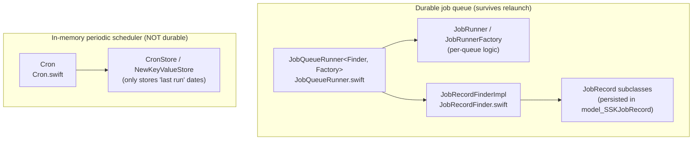

# SignalServiceKit — Jobs subsystem

This documentation set covers the **durable job queue** subsystem in
`SignalServiceKit/Jobs/` (~5k LOC). The subsystem provides a persistent,
restart-surviving mechanism for work that must *eventually* complete even if
the app is backgrounded, killed, or relaunched — sending messages, redeeming
donation receipt credentials, bulk-deleting interactions, leaving groups, etc.

It also covers the **Cron** scheduler (`Cron.swift`), an *in-memory*, non-durable
periodic/"frequent" task runner that lives in the same directory but is a
distinct mechanism from the durable job queue.

> **Confidence labels.** Each claim is tagged with a confidence level:
> - **[High]** — directly read from source; behavior is explicit in the code.
> - **[Medium]** — inferred from code with reasonable certainty, but depends on
>   collaborators defined outside `SignalServiceKit/Jobs/`.
> - **[Low]** — inferred from naming/comments; not fully verified in-tree.
>
> Where the source gives no evidence for a design question, the text says
> **"intent undetermined — no evidence in source"** rather than guessing.
>
> **Citations** are given as `File.swift:line`, pointing at the definition being
> described. Line numbers reflect the state of the tree at authoring time and may
> drift as code changes; use the cited symbol name to re-locate code if lines
> have moved. Diagrams are [Mermaid](https://mermaid.js.org/).

## Document map

| Doc | Covers |
| --- | --- |
| [runner-model.md](runner-model.md) | `JobQueueRunner`, `JobRunner`, `JobRunnerFactory`, scheduling modes, concurrency, reachability-triggered retries, the per-attempt lifecycle |
| [job-records.md](job-records.md) | `JobRecord` base class, `JobRecordColumns`, the shared SDS table, inheritance/`recordType` dispatch, per-queue `JobRecord` subclasses |
| [persistence-and-finder.md](persistence-and-finder.md) | `JobRecordFinder`, batched loading, pruning of unrunnable jobs, `status` lifecycle, deprecated columns |
| [retry-and-backoff.md](retry-and-backoff.md) | `JobAttemptResult`, exponential backoff, retry limits, early-retry triggers (Reachability / chat-connection) |
| [cron.md](cron.md) | `Cron` scheduler: `schedulePeriodically`/`scheduleFrequently`, `UniqueKey`s, app-upgrade reset, `mustBe…` preconditions, jitter |
| [concrete-queues.md](concrete-queues.md) | Survey of every concrete queue: MessageSender, SendGiftBadge, DonationReceiptCredentialRedemption, IncomingContactSync, CallRecordDeleteAll, BulkDeleteInteraction, LocalUserLeaveGroup |

## Two distinct mechanisms in one folder

Both live in `SignalServiceKit/Jobs/`, but they are **independent**:

- The **durable job queue** persists a full `JobRecord` row per unit of work.
  Work is guaranteed (barring crashes) to run to a terminal state, retrying
  across relaunches. **[High]** (`JobQueueRunner.swift:116-247`)
- **Cron** persists only a *timestamp* per `UniqueKey` indicating when a job last
  completed. The job *bodies* are registered in memory at launch and are **not**
  persisted; a relaunch re-registers them. **[High]**
  (`Cron.swift:29-57`, `Cron.swift:239-266`)

There is a *third*, related mechanism — `MessageSenderJobQueue` — which, despite
living in this folder and persisting `MessageSenderJobRecord`s, does **not** use
`JobQueueRunner`; it implements its own bespoke queueing/concurrency machinery.
See [concrete-queues.md](concrete-queues.md#messagesenderjobqueue). **[High]**
(`MessageSenderJobQueue.swift:30-39`)

## Where things live

| Area | Source | Doc |
| --- | --- | --- |
| Generic runner & attempt loop | `Jobs/JobQueueRunner.swift` | [runner-model.md](runner-model.md) |
| Record base + columns | `Jobs/JobRecords/JobRecord.swift`, `JobRecord+Columns.swift` | [job-records.md](job-records.md) |
| Finder / batched load / prune | `Jobs/JobRecordFinder.swift` | [persistence-and-finder.md](persistence-and-finder.md) |
| Retry primitives | `Jobs/JobQueueRunner.swift` (`JobAttemptResult`) | [retry-and-backoff.md](retry-and-backoff.md) |
| Periodic scheduler | `Jobs/Cron.swift` | [cron.md](cron.md) |
| `SignalMessagingJobQueues` container | `Jobs/SignalMessagingJobQueues.swift` | [concrete-queues.md](concrete-queues.md#container) |
| Concrete queues | `Jobs/*JobQueue.swift`, `Jobs/LocalUserLeaveGroupJob.swift` | [concrete-queues.md](concrete-queues.md) |

## Catalog of job types

The persisted `recordType` enum (`JobRecord.JobRecordType`) enumerates every
durable job type that uses the shared table. **[High]**
(`JobRecord.swift:112-122`)

| `JobRecordType` | raw | persisted `label` | Record file |
| --- | --- | --- | --- |
| `incomingContactSync` | 61 | `IncomingContactSync` | `IncomingContactSyncJobRecord.swift` |
| `localUserLeaveGroup` | 74 | `LocalUserLeaveGroup` | `LocalUserLeaveGroupJobRecord.swift` |
| `messageSender` | 35 | `MessageSender` | `MessageSenderJobRecord.swift` |
| `donationReceiptCredentialRedemption` | 71 | `SubscriptionReceiptCredentailRedemption` (sic) | `DonationReceiptCredentialRedemptionJobRecord.swift` |
| `sendGiftBadge` | 73 | `SendGiftBadge` | `SendGiftBadgeJobRecord.swift` |
| `sessionReset` | 52 | `SessionReset` | `SessionResetJobRecord.swift` |
| `callRecordDeleteAll` | 100 | `CallRecordDeleteAll` | `CallRecordDeleteAllJobRecord.swift` |
| `bulkDeleteInteractionJobRecord` | 101 | `BulkDeleteInteraction` | `BulkDeleteInteractionJobRecord.swift` |

The misspelled `SubscriptionReceiptCredentailRedemption` label and the raw
values ≥ 61 that match legacy `SDSRecordType` values are **intentionally frozen**
for on-disk compatibility. **[High]** (`JobRecord.swift:9-30`, `JobRecord.swift:102-109`)

> Note: `SessionResetJobRecord` has a record type and label here, but there is no
> `SessionResetJobQueue.swift` in this directory. The queue that consumes it (if
> any) lives elsewhere — **intent undetermined — no evidence in source** within
> `SignalServiceKit/Jobs/`.
