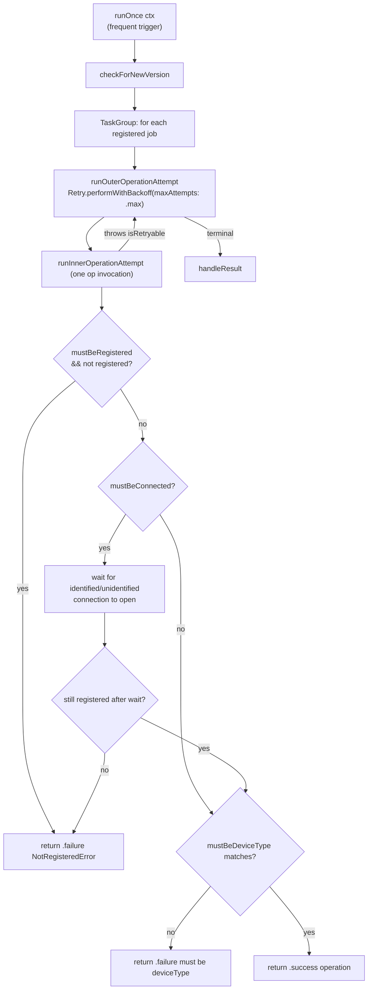

# The Cron scheduler

Source: `SignalServiceKit/Jobs/Cron.swift`

`Cron` is an **in-memory** periodic/"frequent" task runner. Unlike the durable job
queue, it persists only a *timestamp* per task; the task bodies are registered in
memory each launch. It is the mechanism behind recurring maintenance work
(cleanups, profile/badge fetches, storage-service fetch, SVR credential refresh,
etc.).

> **Not durable.** If the app never runs, Cron jobs never run. Only "when did this
> last complete?" is persisted. **[High]** (`Cron.swift:21`, `Cron.swift:29-57`)

## Pieces

| Type | Role | Citation |
| --- | --- | --- |
| `CronContext` | Dependencies passed to each run: `chatConnectionManager`, `tsAccountManager`. | `Cron.swift:8-19` |
| `CronStore` | Reads/writes the per-`UniqueKey` "most recent completion date" in the `"Cron"` key-value collection. | `Cron.swift:21-50` |
| `Cron` | Registers jobs, resets on upgrade, and runs all jobs on a "frequent" trigger. | `Cron.swift:52-406` |

The completion-date store is a module-level `NewKeyValueStore(collection: "Cron")`;
a separate `"CronM"` metadata store holds the last-seen app version. **[High]**
(`Cron.swift:21`, `Cron.swift:59-66`)

## `CronStore` — timestamp bookkeeping

- `mostRecentDate(tx:)` → stored `Date` or `.distantPast`. **[High]**
  (`Cron.swift:30-37`)
- `setMostRecentDate(_:jitter:tx:)` writes `now ± random(jitter)` to "distribute
  load / avoid spikes." **[High]** (`Cron.swift:39-49`)

## `UniqueKey` — the task catalog

A string enum identifies each periodic task; raw values are the storage keys.
**[High]** (`Cron.swift:68-90`)

```
checkUsername, cleanUpCallingAssets, cleanUpMessageSendLog,
cleanUpObsoleteKeyValueStores, cleanUpOrphanedAttachments, cleanUpOrphanedData,
cleanUpViewOnceMessages, fetchCallingAssets, fetchDevices, fetchDonationBadgeAssets,
fetchEmojiSearch, fetchLocalProfile, fetchMegaphones, fetchSenderCertificates,
fetchStaleProfiles, fetchStorageService, fetchSubscriptionConfig,
keyTransparencySelfCheck, refreshBackup, refreshSVRCredentials, updateAttributes
```

- Keys "can be removed without writing GRDB migrations." **[High]**
  (`Cron.swift:62-66`)
- `shouldRunOnAppUpgrade` is `true` for all keys **except** `keyTransparencySelfCheck`.
  **[High]** (`Cron.swift:92-97`)

> The *bodies* for these keys are registered elsewhere (where `Cron` is
> constructed and `schedulePeriodically` is called). Those call sites are outside
> `SignalServiceKit/Jobs/` — **intent/behaviour of each specific job: undetermined
> — no evidence in source** within this folder. **[High]**

## Scheduling APIs

### `schedulePeriodically(...)`

The common entry point: run `operation` roughly every `approximateInterval`.
**[High]** (`Cron.swift:150-220` region).

Behaviour:

- Wraps `scheduleFrequently` with an inner guard: it reads the stored
  `mostRecentDate`, computes `earliestNextDate = mostRecent + approximateInterval`,
  and **returns `false` (no-op)** if `Date() < earliestNextDate`. **[High]**
- If it does run, it logs start, runs `operation`, rethrows retryable errors (to be
  retried by the outer backoff), and returns `true`. **[High]**
- `handleResult`:
  - `.success(false)` (too early) or `.failure(CancellationError)` (cancelled, e.g.
    background time expired or waiting for connection) → **do not** record a date,
    so it retries at the next opportunity. **[High]**
  - `.success(true)` or any other `.failure` → record `setMostRecentDate(now,
    jitter: approximateInterval / jitterFactor)`, so the next run waits
    ~`approximateInterval`. **[High]**

`jitterFactor` is `20`, i.e. jitter is ±5% of the interval. **[High]**
(`Cron.swift:59`, and the "±5%" doc-comment)

### `scheduleFrequently(...)`

The lower-level primitive. Appends an async closure to `self.jobs`. Each closure,
when invoked, runs `runOuterOperationAttempt` and then `handleResult`. **[High]**

> **Warning (from source):** operations scheduled via `scheduleFrequently` run
> "extremely frequently" and **must be self-guarding no-ops** most of the time.
> "Frequently" = every app launch, every foreground, every NSE trigger, and every
> registration (and possibly future background refresh / content-available pushes).
> Most callers should prefer `schedulePeriodically`. **[High]** (doc-comment on
> `scheduleFrequently`)

## Outer / inner attempt model



**[High]** (`Cron.swift:239-266` for `runOnce`; `runOuterOperationAttempt` and
`runInnerOperationAttempt` just above it).

- **Outer attempt** = `Retry.performWithBackoff(maxAttempts: .max, …)`; it reruns
  the inner attempt until it succeeds or throws a non-`isRetryable` error, then
  returns `.failure(error)` for terminal failures. **[High]**
- **Inner attempt** = one invocation of `operation`, gated by the `mustBe…`
  preconditions. **[High]**

### `mustBe…` preconditions

| Parameter | Effect | Citation |
| --- | --- | --- |
| `mustBeRegistered` | if not registered, fail immediately with `NotRegisteredError` (no waiting). Cron re-triggers after registration. | inner attempt, early return |
| `mustBeConnected` | wait for the identified (if registered) or unidentified connection to open; re-check registration after an identified wait. | inner attempt |
| `mustBeDeviceType` | fail if the (current or former) registered device type doesn't match. | inner attempt |

**[High]** (`runInnerOperationAttempt`).

> There is a `TODO: Don't open the connection until we're registered.` noting the
> connection may open mid-registration, which is why registration is re-checked
> after waiting. **[High]**

## App-upgrade behavior

`runOnce` first calls `checkForNewVersion`: it compares the stored `"AppVersion"`
(in `"CronM"`) against the current `appVersion`. On change it calls
`_resetMostRecentDates(isAppUpgrade: true)` and records the new version. **[High]**
(`checkForNewVersion`, `Cron.swift` near end)

`_resetMostRecentDates` deletes stored dates so jobs run again, **except** keys with
`shouldRunOnAppUpgrade == false` when `isAppUpgrade` (i.e. `keyTransparencySelfCheck`
is preserved across upgrades). `resetMostRecentDates(tx:)` is the public,
non-upgrade variant that clears everything. **[High]**

Rationale (from source): rerunning on every version bump ensures bug fixes — even
unintentional ones — propagate immediately to updated users. **[High]**
(`schedulePeriodically` doc-comment)

## Background-task integration

Operations are "integrated with the UIBackgroundTask infrastructure; a background
task assertion will be held whenever `operation` is executing, and `operation` will
be canceled when background execution time expires." The cancellation surfaces as a
`CancellationError`, which `handleResult` treats as "didn't finish; try again
later." **[High]** (`schedulePeriodically`/`scheduleFrequently` doc-comments; the
`handleResult` branch on `.failure(is CancellationError)`)

> The code enforcing the background-task assertion is not in `Cron.swift` itself
> (the doc-comments describe it); the wiring lives at the `runOnce` call site —
> **intent/location: undetermined — no evidence in source** within this file.
> **[Medium]**

## Error paths & edge cases

- **Retryable error** → rethrown from the inner op, caught by
  `Retry.performWithBackoff`, retried with backoff bounded by
  `maxAverageBackoff` (= `approximateInterval` for `schedulePeriodically`). **[High]**
- **Non-retryable error** → terminal `.failure`; `schedulePeriodically` still
  records the completion date (so it waits a full interval before retrying). **[High]**
- **Cancellation** (background time) → no date recorded; retried on next trigger.
  **[High]**
- **Not registered / wrong device type** → `.failure`; for `schedulePeriodically`
  this records a date (terminal), so it won't retry until the next interval **or**
  the next frequent trigger. **[High]**
- **Jitter** can push the next run slightly earlier or later than
  `approximateInterval`. **[High]**
- `runOnce` runs all registered jobs concurrently in a `TaskGroup` and awaits all.
  **[High]** (`Cron.swift:239-266`)

## Relationship to the durable queue

Cron and `JobQueueRunner` share a folder and both wrap `Retry`/exponential-backoff
primitives, but they do **not** interact: Cron never writes a `JobRecord`, and the
durable queue never consults `CronStore`. The misleading proximity is purely
organizational. **[High]**
