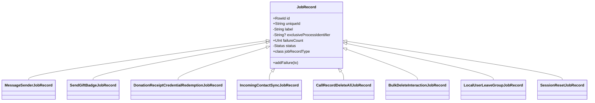

# Job records & persistence model

Sources: `SignalServiceKit/Jobs/JobRecords/JobRecord.swift`,
`JobRecord+Columns.swift`, and the per-queue subclasses in `Jobs/JobRecords/`.

## One table, many record types

All durable job records share a **single SQLite table**:

```swift
public static let databaseTableName: String = "model_SSKJobRecord"
```

**[High]** (`JobRecord.swift:42`). `JobRecord` conforms to `SDSCodableModel` and
`InheritableRecord`; subclasses add their own columns to the same table. The
columns are therefore the **set-union** of every job type's fields — most are used
by exactly one job type, a few are shared. **[High]**
(`JobRecord.swift:32`, `JobRecord+Columns.swift:11-18`)



## Base fields

| Field | Type | Notes |
| --- | --- | --- |
| `id` | `RowId?` | SQLite rowid; `nil` until inserted. **[High]** (`JobRecord.swift:50`) |
| `uniqueId` | `String` | `UUID().uuidString`, assigned at init. **[High]** (`JobRecord.swift:51,65`) |
| `label` | `String` | Frozen per-type string key; used by the finder's `WHERE label = ?`. **[High]** (`JobRecord.swift:53,67`) |
| `exclusiveProcessIdentifier` | `String?` | **Deprecated.** If non-nil, the job belonged to a prior process and is pruned on load. Mutable only in `TESTABLE_BUILD`. **[High]** (`JobRecord.swift:54-58`, `JobRecordFinder.swift:106-110`) |
| `failureCount` | `UInt` | Incremented by `addFailure`. **[High]** (`JobRecord.swift:59`, `JobRecord.swift:141-143`) |
| `status` | `Status` (private(set)) | Lifecycle state (below). **[High]** (`JobRecord.swift:60`) |

### `Status` enum

```swift
public enum Status: Int {
    case unknown = 0
    case ready
    case running
    case permanentlyFailed
    case obsolete
}
```

**[High]** (`JobRecord.swift:33-39`). Note from the finder: `.ready` and
`.running` are now treated **identically** when restarting jobs; the distinction
is effectively vestigial. `.unknown`, `.permanentlyFailed`, and `.obsolete` are
pruned. See [persistence-and-finder.md](persistence-and-finder.md). **[High]**
(`JobRecordFinder.swift:120-127`)

> The decoder maps any unrecognized raw `status` value to `.unknown`
> (`Status(rawValue:) ?? .unknown`), which the finder then prunes. **[High]**
> (`JobRecord.swift:85`)

## `recordType` / inheritance dispatch

`JobRecord` is persisted polymorphically. The `recordType` column stores
`jobRecordType.rawValue`; `concreteType(forRecordType:)` maps it back to the Swift
subclass for decoding. **[High]** (`JobRecord.swift:97-99`, `JobRecord.swift:123-136`)

```swift
public enum JobRecordType: UInt, CaseIterable {
    case incomingContactSync = 61
    case localUserLeaveGroup = 74
    case messageSender = 35
    case donationReceiptCredentialRedemption = 71
    case sendGiftBadge = 73
    case sessionReset = 52
    case callRecordDeleteAll = 100
    case bulkDeleteInteractionJobRecord = 101
}
```

**[High]** (`JobRecord.swift:112-122`). Design notes from source:

- Values **61, 74, 35, 71, 73, 52** are derived from legacy `SDSRecordType`
  values (these records predate the migration to `SDSCodableModel`). **[High]**
  (`JobRecord.swift:102-109`)
- Values **100, 101** are "post-migration" types that pick their own unique raw
  values. **[High]** (`JobRecord.swift:102-109`)
- `jobRecordLabel` strings "are persisted and must not change, even if they're
  misspelled" — hence `SubscriptionReceiptCredentailRedemption`. **[High]**
  (`JobRecord.swift:9-30`)

## Encoding / decoding (the "inheritance hack")

Each subclass:

1. declares its own `CodingKeys` (a subset/aliases of `JobRecordColumns`),
2. overrides `init(inheritableDecoder:)` to decode its own fields then calls
   `super.init(inheritableDecoder:)`,
3. overrides `encode(to:)` to call `super.encode` then encode its own fields.

**[High]** (e.g. `SendGiftBadgeJobRecord.swift:71-131`). The base `encode` writes
`recordType = Self.recordType` so polymorphic decode works. **[High]**
(`JobRecord.swift:88-96`)

### Legacy serialization quirks

- `Decimal` amounts are stored via `LegacySDSSerializer` as archived
  `NSDecimalNumber` blobs, not as SQLite numerics. **[High]**
  (`SendGiftBadgeJobRecord.swift:76-80`, `DonationReceiptCredentialRedemptionJobRecord.swift`)
- `MessageSenderJobRecord.transientMessage` is an archived `TransientOutgoingMessage`
  blob (`invisibleMessage` column); a decode failure is swallowed with
  `owsFailDebug` and yields `nil`. **[High]** (`MessageSenderJobRecord.swift:170-186`)
- `SendGiftBadgeJobRecord.paymentIntentId` is persisted under the **shared**
  `boostPaymentIntentID` column key. **[High]** (`SendGiftBadgeJobRecord.swift:93,116`)

## The column catalog (`JobRecordColumns`)

`JobRecord+Columns.swift` enumerates **every** column across all job types. Highlights:

| Column(s) | Owner / purpose | Citation |
| --- | --- | --- |
| `shouldSuppressPaymentAlreadyRedeemed` | **Deprecated** (was Donation redemption) | `JobRecord+Columns.swift:19-21` |
| `id`, `recordType`, `uniqueId` | GRDB/SDS base | `JobRecord+Columns.swift:25-27` |
| `exclusiveProcessIdentifier`, `failureCount`, `label`, `status` | Base | `JobRecord+Columns.swift:31-34` |
| `envelopeData`, `serverDeliveryTimestamp` | `LegacyMessageDecryptJobRecord` (not in this folder) | `JobRecord+Columns.swift:38-39` |
| `invisibleMessage`, `isHighPriority`, `isMediaMessage`, `messageId`, `removeMessageAfterSending` | MessageSender | `JobRecord+Columns.swift:43-47` |
| `isCompleteContactSync`, `ICSJR_*` | IncomingContactSync | `JobRecord+Columns.swift:51-56` |
| `replacementAdminUuid` (key `replacementAdminAciString`), `waitForMessageProcessing` | LocalUserLeaveGroup | `JobRecord+Columns.swift:60-61` |
| `contactThreadId` | SessionReset | `JobRecord+Columns.swift:65` |
| `messageText`, `paymentIntentClientSecret`, `paymentMethodId`, `paypal*` | SendGiftBadge | `JobRecord+Columns.swift:69-74` |
| `receiptCredentialPresentation`, `receiptCredential`, `isBoost`, `subscriberID`, `targetSubscriptionLevel`, `priorSubscriptionLevel`, `isNewSubscription` | DonationReceiptCredentialRedemption | `JobRecord+Columns.swift:78-86` |
| `amount`, `currencyCode`, `boostPaymentIntentID`, `paymentProcessor`, `paymentMethod`, `receiptCredentailRequest(Context)` (misspelled keys) | Shared: SendGiftBadge **&** Donation | `JobRecord+Columns.swift:90-100` |
| `threadId` | Shared: LocalUserLeaveGroup, MessageSender, SendGiftBadge | `JobRecord+Columns.swift:104` |
| `CRDAJR_*` | CallRecordDeleteAll | `JobRecord+Columns.swift:108-111` |
| `BDIJR_*` | BulkDeleteInteraction | `JobRecord+Columns.swift:115-117` |
| `BRCRJR_state` | `BackupReceiptCredentialRedemptionJobRecord` (not in this folder) | `JobRecord+Columns.swift:121` |

> Two columns reference record types **not** present in `SignalServiceKit/Jobs/`
> (`LegacyMessageDecryptJobRecord`, `BackupReceiptCredentialRedemptionJobRecord`).
> Those types live elsewhere in the tree but share this same table. **[Medium]**
> (inferred from the column comments; the owning files are outside this folder)

## Per-record subclass summaries

### `MessageSenderJobRecord` (`MessageSenderJobRecord.swift`)
Models one outgoing send. A `messageType` computed property resolves to one of
`.persisted` / `.editMessage` / `.transient` from the stored
`persistedMessageId` + `transientMessage` + `useMediaQueue` fields. **[High]**
(`MessageSenderJobRecord.swift:30-56`). `removeMessageAfterSending` is deprecated
and causes the finder to prune the job. **[High]**
(`MessageSenderJobRecord.swift:29`, `JobRecordFinder.swift:112-115`)

### `SendGiftBadgeJobRecord` (`SendGiftBadgeJobRecord.swift`)
Holds the payment processor, serialized receipt-credential request/context,
amount/currency, Stripe (`paymentIntent*`/`paymentMethodId`) **or** PayPal
(`paypal*`) fields, plus `threadId` and `messageText`. **[High]**
(`SendGiftBadgeJobRecord.swift:12-26`)

### `DonationReceiptCredentialRedemptionJobRecord` (`DonationReceiptCredentialRedemptionJobRecord.swift`)
Supports both one-time ("boost") and recurring ("subscription") donations.
Historically stored a `receiptCredentialPresentation`; now stores a
`receiptCredential` it can convert on the fly. `getReceiptCredentialPresentation()`
abstracts over both. `setReceiptCredential(_:tx:)` persists the credential after a
successful request. **[High]**
(`DonationReceiptCredentialRedemptionJobRecord.swift:18-33`, `...:243-247`).
`isNewSubscription` defaults to `true` when absent on decode. **[High]**
(`DonationReceiptCredentialRedemptionJobRecord.swift:150`)

### `IncomingContactSyncJobRecord` (`IncomingContactSyncJobRecord.swift`)
Stores an attachment pointer (`cdnNumber`, `cdnKey`, `encryptionKey`, `digest`,
`plaintextLength`) plus `isCompleteContactSync`. The computed `downloadInfo`
returns `.invalid` unless **all five** download fields are present (and asserts
"either all or none"), and `.invalid` if the key can't be parsed. **[High]**
(`IncomingContactSyncJobRecord.swift:21-57`)

### `CallRecordDeleteAllJobRecord` (`CallRecordDeleteAllJobRecord.swift`)
Stores `sendDeleteAllSyncMessage`, a `deleteAllBeforeTimestamp`, and an **optional**
call-anchor (`deleteAllBeforeCallId` stored as a *string* because SQLite can't hold
`UInt64 > Int64.max`, plus `deleteAllBeforeConversationId`). Call-id and
conversation-id are encoded/decoded as an all-or-nothing pair; legacy records fall
back to the timestamp. **[High]** (`CallRecordDeleteAllJobRecord.swift:11-45`,
`...:71-94`)

### `BulkDeleteInteractionJobRecord` (`BulkDeleteInteractionJobRecord.swift`)
Stores `anchorMessageRowId`, optional `fullThreadDeletionAnchorMessageRowId`
(set only for full-thread deletes), and `threadUniqueId`. **[High]**
(`BulkDeleteInteractionJobRecord.swift:8-24`)

### `LocalUserLeaveGroupJobRecord` (`LocalUserLeaveGroupJobRecord.swift`)
Stores `threadId`, an optional `replacementAdminAciString` (serialized `Aci`), and
`waitForMessageProcessing`. **[High]** (`LocalUserLeaveGroupJobRecord.swift:12-15`)

### `SessionResetJobRecord` (`SessionResetJobRecord.swift`)
Stores just `contactThreadId`. Has a record type/label but **no queue** in this
folder (see README note). **[High]** (`SessionResetJobRecord.swift:10-26`)

## Edge cases & validation rules

- **All-or-none download metadata** on `IncomingContactSyncJobRecord` — a partially
  populated record is treated as `.invalid` and the job removes itself. **[High]**
  (`IncomingContactSyncJobRecord.swift:28-45`)
- **UInt64 call-ids** are string-wrapped to survive SQLite's `Int64` ceiling, then
  force-unwrapped on read (`UInt64($0)!`) — a non-numeric string would crash.
  **[High]** (`CallRecordDeleteAllJobRecord.swift:30-32`)
- **Decimal round-tripping** relies on `LegacySDSSerializer`; corrupt blobs throw
  during decode (amounts) or are swallowed (transient message). **[High]**
- **Frozen identifiers** — `jobRecordType` raw values, `jobRecordLabel` strings,
  and several misspelled column keys must never change. A migration TODO exists to
  obsolete the deprecated properties. **[High]** (`JobRecordFinder.swift:105`,
  `JobRecord.swift:9-11`)
