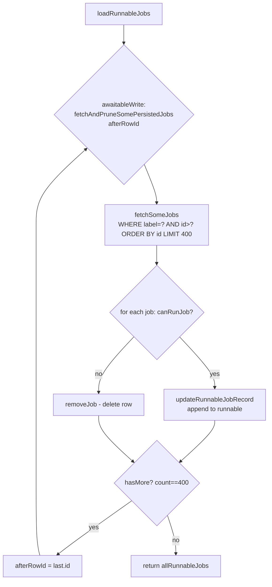

# Persistence & the job record finder

Source: `SignalServiceKit/Jobs/JobRecordFinder.swift`

`JobRecordFinder` is the data-access layer between `JobQueueRunner` and the shared
`model_SSKJobRecord` table. Each queue uses `JobRecordFinderImpl<ConcreteRecord>`.

## Protocol

```swift
public protocol JobRecordFinder<JobRecordType> {
    associatedtype JobRecordType: JobRecord
    func fetchJob(rowId: JobRecord.RowId, tx: DBReadTransaction) throws -> JobRecordType?
    func removeJob(_ jobRecord: JobRecordType, tx: DBWriteTransaction)
    func loadRunnableJobs(updateRunnableJobRecord: @escaping (JobRecordType, DBWriteTransaction) -> Void) async throws -> [JobRecordType]
}
```

**[High]** (`JobRecordFinder.swift:9-32`).

Documented contract of `loadRunnableJobs`:

- May use **multiple transactions**, may use **write** transactions, and may
  **delete** jobs that can't run. **[High]** (`JobRecordFinder.swift:24-31`)
- Returns all runnable jobs and invokes the callback for each one.
- Conformers "should avoid long-running write transactions." **[High]**

## Implementation

### Batched, paginated loading

`loadRunnableJobs` loops over `fetchAndPruneSomePersistedJobs`, advancing an
`afterRowId` cursor until a batch returns fewer than `batchSize` rows. **[High]**
(`JobRecordFinder.swift:66-82`)

```swift
private enum Constants { static let batchSize = 400 }
```

The batch size is a tradeoff: most queues hold only a few records, but a queue can
build a "huge backlog" and batching prunes it efficiently. **[High]**
(`JobRecordFinder.swift:35-45`)



### The query

```sql
SELECT * FROM <table>
WHERE "label" = ?
  AND id > ?            -- only when paginating
ORDER BY id
LIMIT 400
```

Arguments bind `JobRecordType.jobRecordType.jobRecordLabel`. **[High]**
(`JobRecordFinder.swift:130-153`). Because the table is shared, the `label`
predicate is what scopes a finder to its own job type. **[High]**

`hasMore` is `results.count == batchSize`. **[High]** (`JobRecordFinder.swift:150`)

### Pruning rules — `canRunJob`

For each fetched job, `fetchAndPruneSomePersistedJobs` decides runnable vs. prune:

| Condition | Outcome | Citation |
| --- | --- | --- |
| `exclusiveProcessIdentifier != nil` | **prune** (belonged to a prior process) | `JobRecordFinder.swift:106-110` |
| `MessageSenderJobRecord.removeMessageAfterSending == true` | **prune** (deprecated message type) | `JobRecordFinder.swift:112-115` |
| `status` in `.unknown`, `.permanentlyFailed`, `.obsolete` | **prune** | `JobRecordFinder.swift:117-124` |
| `status` in `.ready`, `.running` | **runnable** | `JobRecordFinder.swift:122-124` |

Runnable jobs get `updateRunnableJobRecord(job, tx)` invoked (letting a queue mutate
them in the same write — e.g. MessageSender re-marks recipients as "sending");
non-runnable jobs are deleted via `removeJob`. **[High]**
(`JobRecordFinder.swift:126-134`)

> `.ready` vs `.running` are **no longer distinguished** on restart — the comment
> states they're "treated exactly the same when we restart existing jobs." A job
> that was mid-flight when the app died simply restarts from the top. **[High]**
> (`JobRecordFinder.swift:116-120`)

### `fetchJob` / `removeJob`

- `fetchJob` is `JobRecordType.fetchOne(db, key: rowId)`, wrapping GRDB errors via
  `grdbErrorForLogging`. **[High]** (`JobRecordFinder.swift:54-62`)
- `removeJob` delegates to `jobRecord.anyRemove(transaction:)`. **[High]**
  (`JobRecordFinder.swift:64-66`)

## Persistence lifecycle

```mermaid
stateDiagram-v2
    [*] --> ready: anyInsert (status=.ready)
    ready --> running: (vestigial; not set on restart)
    ready --> deleted: runJobAttempt .finished ⇒ runner deletes row
    running --> deleted: terminal success/failure
    ready --> pruned: load sees deprecated/obsolete ⇒ removeJob
    running --> pruned: same
    deleted --> [*]
    pruned --> [*]
```



- A record is created `.ready` (default in subclass inits) and `anyInsert`ed inside
  the enqueuing write transaction. **[High]** (e.g. `JobRecord.swift:62-69`,
  `CallRecordDeleteAllJobQueue.swift:101`)
- A record is deleted by the **runner** on a terminal result (success or
  non-retryable failure / out-of-retries). The finder never deletes a *runnable*
  job. **[High]** (`JobQueueRunner.swift:109-116`, `JobAttemptResult` default handler)
- There is **no explicit transition into `.permanentlyFailed`** anywhere in this
  folder — terminal failures *delete* the row rather than mark it failed. The
  `.permanentlyFailed`/`.obsolete` prune branch exists for records written by other
  parts of the tree or by older app versions. **[High]**
  (`JobAttemptResult.performDefaultErrorHandler` removes rather than marks; prune in
  `JobRecordFinder.swift:117-124`)

## Error paths

| Path | Behavior |
| --- | --- |
| GRDB throws in `fetchOne`/`fetchAll` | rethrown as `grdbErrorForLogging`; `loadRunnableJobs` propagates → `_start` aborts, no jobs run this launch. **[High]** (`JobRecordFinder.swift:54-62`, `JobQueueRunner.swift:216-220`) |
| `fetchJob` throws during an attempt | `runJobAttempt` returns `.fetchError`; that one job is skipped (`.ranSuccessfullyOrError` → failure). **[High]** (`JobQueueRunner.swift:349-352`) |
| Record deleted out from under a running attempt | re-fetch returns `nil` → `.notFound` → `didFinishJob(.notFound)`. **[High]** (`JobQueueRunner.swift:353-356`) |

## Feature flags / environment gates

- The finder itself has **no feature flags**. **[High]**
- Whether persisted jobs are *loaded* at all is gated by the queue via
  `shouldRestartExistingJobs` (usually `appContext.isMainApp`). The finder is
  agnostic. **[High]** (see [runner-model.md](runner-model.md#starting-a-runner))
- A `TODO` notes a future DB migration to "fully obsolete" the deprecated
  `exclusiveProcessIdentifier` / `removeMessageAfterSending` properties. **[High]**
  (`JobRecordFinder.swift:105`)
