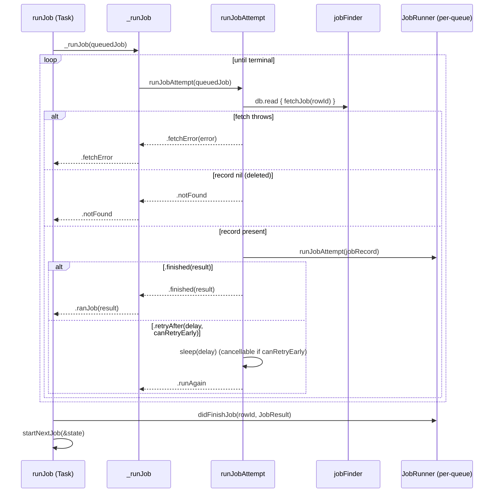

# The durable job queue / runner model

Source: `SignalServiceKit/Jobs/JobQueueRunner.swift`

`JobQueueRunner` is the generic engine that drives a single durable queue. Each
concrete queue (SendGiftBadge, DonationReceiptCredentialRedemption,
IncomingContactSync, CallRecordDeleteAll, BulkDeleteInteraction,
LocalUserLeaveGroup) owns one `JobQueueRunner` instance parameterized by:

- a **`JobRecordFinder`** (always `JobRecordFinderImpl<SpecificJobRecord>`), and
- a **`JobRunnerFactory`** that builds the per-queue `JobRunner` containing the
  actual business logic.

```swift
public class JobQueueRunner<
    JobFinderType: JobRecordFinder & Sendable,
    JobRunnerFactoryType: JobRunnerFactory & Sendable,
> where JobFinderType.JobRecordType == JobRunnerFactoryType.JobRunnerType.JobRecordType
```

**[High]** (`JobQueueRunner.swift:150-156`). The `where` clause statically
guarantees the finder and runner agree on the concrete `JobRecord` subclass.

> Note: `MessageSenderJobQueue` does **not** use `JobQueueRunner`; it hand-rolls
> its own queueing. It is covered separately in
> [concrete-queues.md](concrete-queues.md#messagesenderjobqueue). **[High]**

## The three protocols

### `JobRunner` — runs one record

```swift
public protocol JobRunner<JobRecordType> {
    associatedtype JobRecordType: JobRecord
    associatedtype JobAttemptResultSuccessType
    func runJobAttempt(_ jobRecord: JobRecordType) async -> JobAttemptResult<JobAttemptResultSuccessType>
    func didFinishJob(_ jobRecordId: JobRecord.RowId, result: JobResult<JobAttemptResultSuccessType>) async
}
```

**[High]** (`JobQueueRunner.swift:98-137`).

Key contracts documented in-source:

- **A single `JobRunner` instance is reused for all attempts** of a record within
  one app launch. It is therefore a good place for mutable per-job transient state
  (e.g. a retry counter). **[High]** (`JobQueueRunner.swift:85-96`)
- Custom `JobRunner`s supplied at scheduling time can hold **in-memory completion
  callbacks** (promises/continuations). These callbacks are *lost on relaunch*
  because a fresh `JobRunner` is built by the factory — which is acceptable because
  the UX awaiting them is also torn down on relaunch. **[High]**
  (`JobQueueRunner.swift:87-93`)
- When `runJobAttempt` returns `.finished`, **the runner itself is responsible for
  having deleted the `JobRecord` from the database** (atomically with any other
  writes). DEBUG/`assert` builds verify this invariant after the fact. **[High]**
  (`JobQueueRunner.swift:109-116`, `JobQueueRunner.swift:283-287`)
- `didFinishJob` is **guaranteed to be invoked exactly once** per runner provided
  to `addPersistedJob(...)` (absent a crash), *even if the record was deleted
  before it could run or fetching it threw*. It is the correct place for
  exactly-once in-memory completion handlers. **[High]** (`JobQueueRunner.swift:118-131`)

### `JobRunnerFactory` — builds runners

```swift
public protocol JobRunnerFactory<JobRunnerType> {
    associatedtype JobRunnerType: JobRunner, Sendable
    func buildRunner() -> JobRunnerType
}
```

**[High]** (`JobQueueRunner.swift:139-148`). `buildRunner()` (no args) is used for
records loaded from disk on launch; several factories add an overload taking a
promise/continuation for freshly-scheduled jobs (e.g.
`SendGiftBadgeJobRunnerFactory.buildRunner(chargeFuture:completionFuture:)`).
**[High]** (`SendGiftBadgeJobQueue.swift:140-146`)

## Result types

| Type | Cases | Meaning |
| --- | --- | --- |
| `JobAttemptResult<Success>` | `.finished(Result)` / `.retryAfter(TimeInterval, canRetryEarly:)` | Outcome of **one** attempt. See [retry-and-backoff.md](retry-and-backoff.md). **[High]** (`JobQueueRunner.swift:8-19`) |
| `JobResult<Success>` | `.ranJob(Result)` / `.notFound` / `.fetchError(Error)` | Outcome of the **whole** job, passed to `didFinishJob`. **[High]** (`JobQueueRunner.swift:68-83`) |

`JobResult.ranSuccessfullyOrError` collapses `.notFound` to a failure
(`OWSGenericError("JobRecord not found.")`) and surfaces `.fetchError` as its
error. **[High]** (`JobQueueRunner.swift:75-82`)

## Scheduling modes (the internal state machine)

`JobQueueRunner` holds an `AtomicValue<State>` with a `Mode` enum:

| Mode | Description |
| --- | --- |
| `.loading(canExecuteJobsConcurrently:, jobsToEnqueueAfterLoading:)` | Not yet started, or starting. New jobs are **buffered** until on-disk jobs load, ensuring old jobs run first. |
| `.concurrent` | New jobs start immediately; many run at once. |
| `.serialPaused` | Serial queue, nothing running; a new job starts immediately. |
| `.serialRunning(nextJobs:)` | Serial queue, one job running; new jobs queue in `nextJobs`. |

**[High]** (`JobQueueRunner.swift:158-186`).

`canExecuteJobsConcurrently` is fixed at construction per queue:

| Queue | Concurrent? | Citation |
| --- | --- | --- |
| SendGiftBadge | **true** | `SendGiftBadgeJobQueue.swift:17-23` |
| DonationReceiptCredentialRedemption | **true** | `DonationReceiptCredentialRedemptionJobQueue.swift:71-76` |
| IncomingContactSync | **false** | `IncomingContactSyncJobQueue.swift:24-29` |
| CallRecordDeleteAll | **false** | `CallRecordDeleteAllJobQueue.swift:48-53` |
| BulkDeleteInteraction | **false** | `BulkDeleteInteractionJobQueue.swift:30-35` |
| LocalUserLeaveGroup | **false** | `LocalUserLeaveGroupJob.swift:117-123` |

Serial queues only ever guarantee **FIFO** ordering; the in-source comparison with
`TaskQueueLoader` notes that `JobRunner` "only handles FIFO ordering" and
`TaskQueueLoader` should be preferred when a priority order is needed. **[High]**
(`JobQueueRunner.swift:40-50`)

## Starting a runner

`start(shouldRestartExistingJobs:)` spawns a `Task` calling `_start`. **[High]**
(`JobQueueRunner.swift:208-210`)

`_start`:

1. If `shouldRestartExistingJobs`, calls `jobFinder.loadRunnableJobs(...)`. If that
   **throws, no jobs start at all** and the method returns — the runner is left in
   `.loading` forever (a hard failure mode). **[High]** (`JobQueueRunner.swift:212-221`)
2. Merges on-disk jobs with any jobs enqueued during loading. If a new job's
   `rowId` is already present in the loaded set it is **ignored from the loaded
   set** (to preserve the new job's possibly-custom `JobRunner`). **[High]**
   (`JobQueueRunner.swift:222-241`)
3. Transitions `.loading` → `.concurrent` (starting all jobs), or
   `.serialPaused` (empty), or `.serialRunning` (starting the first job). **[High]**
   (`JobQueueRunner.swift:242-256`)
4. Starting twice is a programmer error: `owsFail("Can't start a JobQueueRunner
   more than once.")`. **[High]** (`JobQueueRunner.swift:257-259`)

`shouldRestartExistingJobs` is typically `appContext.isMainApp` — the share
extension / NSE generally do not restart persisted jobs. **[High]** (e.g.
`IncomingContactSyncJobQueue.swift:31-33`, `CallRecordDeleteAllJobQueue.swift:55-57`)

## Enqueueing jobs

`addPersistedJob(_:runner:)` wraps the record's `rowId` and a runner (the supplied
one, else `jobRunnerFactory.buildRunner()`) into a `QueuedJob` and calls
`enqueueAndStartJob`. **[High]** (`JobQueueRunner.swift:289-291`)

`enqueueAndStartJob` dispatches on the current `Mode`:

- `.loading` → appended to `jobsToEnqueueAfterLoading`. **[High]**
- `.concurrent` → `runJob` immediately. **[High]**
- `.serialPaused` → `runJob` immediately and transition to `.serialRunning([])`.
- `.serialRunning` → appended to `nextJobs`.

**[High]** (`JobQueueRunner.swift:293-312`).

> **Edge case.** `addPersistedJob` force-unwraps `jobRecord.id!`
> (`JobQueueRunner.swift:290`). A record that was never inserted (no row id) would
> crash here. In practice callers `anyInsert` the record first and schedule via a
> `tx.addSyncCompletion` / ordered serializer, so the id is set. **[High]** (e.g.
> `CallRecordDeleteAllJobQueue.swift:103-108`)

## The attempt loop



**[High]** (`JobQueueRunner.swift:314-375`).

Details:

- `runJob` runs the entire job in a detached `Task`, then calls
  `didFinishJob`, then `startNextJob`. **[High]** (`JobQueueRunner.swift:318-324`)
- `_runJob` loops: `.runAgain` continues; `.notFound`/`.finished`/`.fetchError`
  terminate. A `.fetchError` logs a warning and skips just that job. **[High]**
  (`JobQueueRunner.swift:326-337`)
- `runJobAttempt` re-fetches the record on **every attempt** (so each attempt sees
  the freshest persisted state, e.g. an incremented `failureCount`). **[High]**
  (`JobQueueRunner.swift:347-371`)
- On `.retryAfter`, a `Task.sleep(nanoseconds: retryAfter.clampedNanoseconds)` is
  created. If `canRetryEarly`, the task is registered in `state.waitingTasks[rowId]`
  so an external trigger can cancel it to retry early; it is removed afterward.
  **[High]** (`JobQueueRunner.swift:360-371`)

## Reachability-triggered early retries

```swift
public func listenForReachabilityChanges(reachabilityManager: SSKReachabilityManager)
```

Registers a notification observer for `owsReachabilityDidChange`; when
`isReachable`, calls `retryWaitingJobs()`, which **cancels every waiting task** so
each sleeping retry fires immediately. **[High]** (`JobQueueRunner.swift:263-283`)

Observers are removed in `deinit`. **[High]** (`JobQueueRunner.swift:204-206`)

> Only jobs that returned `.retryAfter(_, canRetryEarly: true)` are eligible for
> early retry — those are the only ones recorded in `waitingTasks`. **[High]**
> (`JobQueueRunner.swift:362-368`)

## `startNextJob` (serial advancement)

After each job finishes:

- `.loading` / `.serialPaused` → `owsFailBeta` (shouldn't happen). **[High]**
- `.concurrent` → no-op (all jobs already started). **[High]**
- `.serialRunning` → if `nextJobs` empty, go `.serialPaused`; else pop the first
  and `runJob` it. **[High]**

**[High]** (`JobQueueRunner.swift:377-396`).

## Concurrency / thread-safety

- All mutable runner state is behind a single `AtomicValue<State>` with a lock;
  mode transitions and `waitingTasks` edits happen inside `state.update { … }`.
  **[High]** (`JobQueueRunner.swift:188-202`)
- Job bodies run on unstructured `Task`s. Serial queues bound concurrency to one
  in-flight job via the `Mode` machine, **not** via an executor. **[High]**

## Known limitations / caller gotchas (from source)

- **Load failure is terminal for the launch.** A thrown error in
  `loadRunnableJobs` leaves the runner stuck in `.loading`; no jobs — old or new —
  will run until the next launch. **[High]** (`JobQueueRunner.swift:216-220`)
- **No cancellation of the generic loop.** Nothing cancels the `_runJob` loop
  except reaching a terminal result; `MessageSenderJobQueue` explicitly asserts
  "Cancellation isn't supported." in its (separate) loop. **[High]**
  (`MessageSenderJobQueue.swift` `_runOperation`)
- **DEBUG-only deletion check.** The "`.finished` ⇒ you deleted the record"
  invariant is only enforced via `assert` in DEBUG. A buggy runner that forgets to
  delete would leave an orphan row that gets pruned/re-run on next launch. **[High]**
  (`JobQueueRunner.swift:355-358`)
