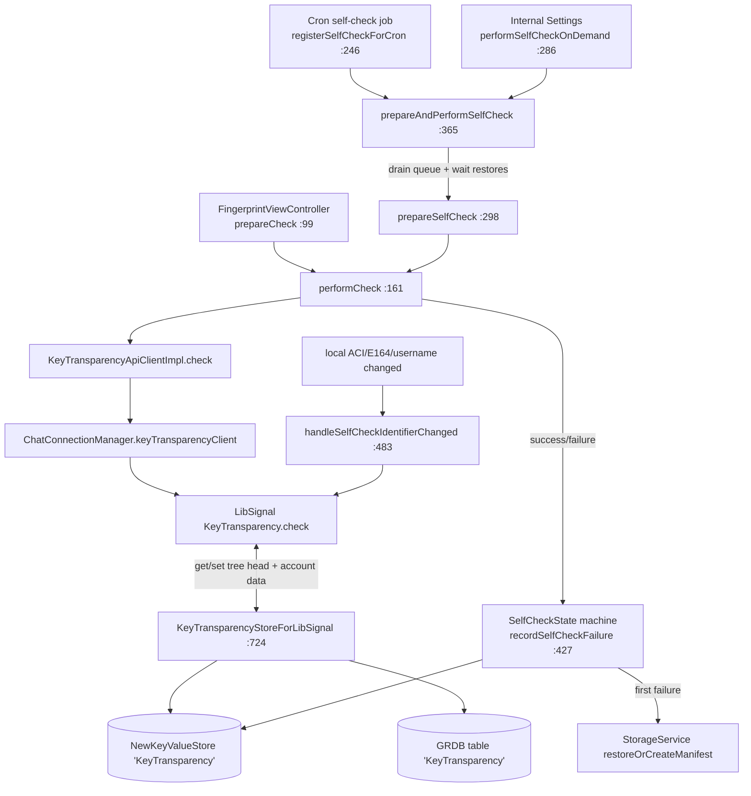

# Key Transparency

Covers `SignalServiceKit/KeyTransparency/`:

- `KeyTransparencyManager.swift`
- `KeyTransparencyApiClient.swift`

Key Transparency (KT) lets a client cryptographically verify that the identity key, phone number,
and username the server reports for an account match what has been committed to the server's
append-only *transparency log*. This folder is the SSK-side **orchestration and persistence** layer:
it decides *when* to run a check, prepares the inputs, delegates the actual cryptographic
verification to `LibSignalClient`'s `KeyTransparency` APIs over the chat connection, and persists
the opaque LibSignal state blobs (account data + distinguished tree head) that make incremental
verification possible.

> The cryptographic protocol itself (what the log proves, how monitoring/search works, the
> LibSignal `Store` contract) is documented separately in
> [Cryptography/key-transparency.md](../Cryptography/key-transparency.md). This README focuses on
> the two files in *this* folder and their wiring into the rest of SSK and the app. Where the two
> overlap, the Cryptography doc is authoritative on the protocol.

---

## Responsibility (confidence: HIGH — both files read in full)

1. **Opt-out state.** KT is on by default; the user can disable it. State is mirrored to Storage
   Service so it syncs across devices.
2. **Running checks.** Two flavors: a **self-check** (verify the local account) and a **contact
   check** (verify another user, gated on a prior successful self-check).
3. **Scheduling.** A periodic `Cron` job runs the self-check; it can also be triggered on demand.
4. **Persistence.** An opt-out flag, a self-check failure state machine, a "capability" flag, a
   first-time-education flag, and the LibSignal state blobs (per-ACI account data + the global
   distinguished tree head).
5. **Reacting to local identifier changes.** When the local user's ACI/E164/username changes, SSK
   must tell LibSignal to reset the corresponding field so stale committed data isn't verified.

---

## `KeyTransparencyApiClient` — `KeyTransparencyApiClient.swift:9`

Confidence: HIGH. A one-method protocol (`check(for:aciInfo:e164Info:usernameHash:)`,
`KeyTransparencyApiClient.swift:10`) that exists purely so the network boundary can be mocked in
tests.

### `KeyTransparencyApiClientImpl` — `KeyTransparencyApiClient.swift:20`
Confidence: HIGH. Obtains a `ktClient` via
`chatConnectionManager.keyTransparencyClient()` (`:41`) and calls LibSignal's
`ktClient.check(for:account:e164:usernameHash:store:)` (`:43`), passing a freshly constructed
`KeyTransparencyStoreForLibSignal` as the `store`. So **all KT traffic rides the unauthenticated
chat connection** (`ChatConnectionManager`), not a bespoke REST endpoint:
`keyTransparencyClient()` is implemented over `connectionUnidentified`
(`ChatConnectionManager.swift:197`), which is typed `OWSUnauthConnectionUsingLibSignal`
(`ChatConnectionManager.swift:92`). The call modes come from
`LibSignalClient.KeyTransparency.CheckMode`.

---

## `KeyTransparencyManager` — `KeyTransparencyManager.swift:9-507`

Confidence: HIGH (read in full). The public orchestrator. Logs under the `[KT]` prefix (`:10`).
Dependencies are injected (`:15-27`) and the manager is constructed once in
`AppSetup.swift:1341` and exposed app-wide as
`DependenciesBridge.shared.keyTransparencyManager` (`DependenciesBridge.swift:134`).

Concurrency is serialized per-ACI by a `KeyedConcurrentTaskQueue<Aci>(concurrentLimitPerKey: 1)`
(`:29`, `:56`): at most one in-flight check per account.

### Opt-out API
| Method | Line | Behavior |
|--------|------|----------|
| `isEnabled(tx:)` | 60 | Reads the store flag (defaults to **enabled**). |
| `setIsEnabled(_:updateStorageService:tx:)` | 64 | Writes the flag; if `updateStorageService`, schedules `storageServiceManager.recordPendingLocalAccountUpdates()` on sync-completion so the opt-out syncs across devices (`:72-74`). |

> UI entry point: `AdvancedPrivacySettingsViewController.swift:169-178` reads/writes this flag.
> Storage Service maps it to `automaticKeyVerificationDisabled` and **inverts the value**:
> `setAutomaticKeyVerificationDisabled(!isEnabled)` (`StorageServiceProto+Sync.swift:1465`).
> Backups maps it to `allowAutomaticKeyVerification` **directly, with no inversion**:
> `allowAutomaticKeyVerification = isEnabled` (`BackupArchiveAccountDataArchiver.swift:295`).
> The differing field-name polarity (`Disabled` vs `allow`) is just naming — only Storage Service
> actually negates the stored value. Confidence: HIGH.

### Contact check flow
- **`CheckParams`** (`:82`) bundles the validated inputs: `AciInfo` (ACI + identity key),
  optional `E164Info` (E164 + unidentified-access key), optional `username`, and
  `localIdentifiers`. `isLocalUser` (`:84`) is derived.
- **`prepareCheck(aci:localIdentifiers:tx:)`** (`:99`) is the read-side gatekeeper. Returns `nil`
  (check impossible) if: the ACI is the local user (`:107` — use the self-check path instead), KT
  is opted out (`:112`), the identity key is missing (`:118`), or the E164/unidentified-access-key
  pair can't be assembled (`:135`). The username is intentionally **not** used when checking other
  users (`:150`, `username = nil`).
- **`performCheck(params:)`** (`:161`) runs inside the per-ACI task queue and wraps the work in
  `Retry.performWithBackoff(maxAttempts: .max, …)` (`:170`). Network/rate-limit errors are retried
  **indefinitely** (`isRetryable` covers `SignalError.rateLimitedError` and `error.isRetryable`,
  `:189-197`) because a transient network failure must not be surfaced as "KT failed." Throwing
  therefore signals a *non-transient* verification failure.
- **`_performCheck(params:logger:)`** (`:199`) branches on `isLocalUser`:
  - Self: calls `apiClient.check(for: .self(isE164Discoverable:), …)` passing the username hash.
    Discoverability comes from `tsAccountManager.phoneNumberDiscoverability` (`:208-209`).
  - Other: **requires a prior successful self-check** — reads `selfCheckState` (`:223`) and, if
    `nil`, runs a self-check first (`:230`); if the self-check previously failed, it throws
    `"Cannot check other with failed self-check."` (`:234`). Only on `.succeeded` does it call
    `apiClient.check(for: .contact, …, usernameHash: nil)` (`:239`).

> UI entry point: `SignalUI/SafetyNumbers/FingerprintViewController.swift:54-57` calls
> `prepareCheck` while building the safety-number screen; a `nil` result renders as
> `.unableToVerify`. First-time education is gated by `shouldShowFirstTimeEducation`. Confidence: HIGH.

### Self-check flow
- **`registerSelfCheckForCron(cron:)`** (`:246`) schedules a frequent, must-be-registered /
  must-be-connected job that is **not** `Cron`-retried (`isRetryable` returns `false`, `:252`)
  because the manager retries internally. The job no-ops unless KT is enabled, it's time
  (`getIsTimeForSelfCheckCronJob`, `:265`), and the device is registered (`:271-276`), then calls
  `prepareAndPerformSelfCheck`. Registered from the app at `AppLifecycleManager.swift:821-822`.
- **`performSelfCheckOnDemand()`** (`:286`) is the manual path (Internal Settings —
  `InternalMiscViewController.swift:31`).
- **`prepareSelfCheck(localIdentifiers:tx:)`** (`:298`) returns `.success / .selfCheckUnavailable /
  .failure`. It assembles `AciInfo` from the local ACI identity key pair (`:306`); omits
  `E164Info` when the account is not discoverable (`:329` — self-check still runs, just without the
  E164); and resolves the username, but **skips the username** if it's corrupted
  (`.usernameAndLinkCorrupted` → `.selfCheckUnavailable`, `:357`) or if not all linked devices are
  `UsernameChangeSyncMessage`-capable (`:362`, sets `username = nil`).
- **`prepareAndPerformSelfCheck(localIdentifiers:)`** (`:365`) is the heart of self-check:
  1. Best-effort drain the message queue (`messageProcessor.waitForFetchingAndProcessing()`,
     `:369`) and wait for pending Storage Service restores (`:373`) — self-check depends on
     username state that lives in Storage Service and arrives via sync messages.
  2. Call `prepareSelfCheck`. On `.selfCheckUnavailable`, defer by scheduling the next cron a day
     out (`:390-396`) instead of recording a failure. On `.failure`, throw.
  3. `performCheck(params:)` (`:406`).
  4. On success, set `selfCheckState = .succeeded` and record cron completion (`:411-416`).
  5. `CancellationError` is rethrown untouched; any other error records a self-check failure
     (`recordSelfCheckFailure`, `:421`) and rethrows.

### Self-check failure state machine — `recordSelfCheckFailure(tx:)` (`:427`)
Confidence: HIGH. Drives `SelfCheckState` (`:596`, raw-`Int64`:
`succeeded=1, failedOnce=2, failedRepeatedly=3, failedRepeatedlyAndWarned=4`):

| Current state | New state | Next-cron interval | Side effect |
|---------------|-----------|--------------------|-------------|
| `nil` / `.succeeded` | `.failedOnce` | 1 day | Kick off `restoreOrCreateManifestIfNecessary` (a linked device may have changed KT-relevant data this device hasn't learned yet) (`:449`). |
| `.failedOnce` | `.failedRepeatedly` | default | — |
| `.failedRepeatedly` | `nil` (reset) | default | — |
| `.failedRepeatedlyAndWarned` | `.failedRepeatedly` if `isConservativeSelfCheck` else `nil` | default | In conservative mode, re-arm so the user is warned again. |

> `isConservativeSelfCheck` comes from `BuildFlags.KeyTransparency.conservativeSelfCheck`
> (`AppSetup.swift:1350`), which also shortens the cron interval from a week to a day
> (`KeyTransparencyManager.swift:538-543`). Confidence: HIGH.

The warning banner is driven by `shouldWarnSelfCheckFailed` (true only on `.failedRepeatedly`,
`:616`) and acknowledged via `setWarnedSelfCheckFailed` (`:625`).

### Reacting to local-identifier changes — `handleSelfCheckIdentifierChanged(...)` (static, `:483`)
Confidence: HIGH. When an `AccountDataField` (ACI / E164 / username) for the local user changes,
this builds a `KeyTransparencyStoreForLibSignal` and calls `KeyTransparency.resetField(...)`
(`:493`) so LibSignal discards the stale committed value. Malformed data is swallowed with
`owsFailDebug` (`:502`). Called from several places that mutate local identifiers:
`RegistrationStateChangeManagerImpl.swift:135`, `MessageReceiver.swift:870`, and
`LocalUsernameManager.swift:587`. Confidence: HIGH.

---

## `KeyTransparencyStore` — `KeyTransparencyManager.swift:511-718`

Confidence: HIGH. A value-type façade over two backing stores (`:548-550`):

- `NewKeyValueStore(collection: "KeyTransparency")` (`KeyTransparencyManager.swift:549`) — scalar
  flags/state. (Note: the collection name is `"KeyTransparency"`; the `NewKeyValueStore` allow-list
  at `NewKeyValueStore.swift:383` registers the string `"KeyTransparencyManager"`, a distinct
  entry — the collection name itself is not what appears there.)
- `CronStore(uniqueKey: .keyTransparencySelfCheck)` — self-check scheduling timestamp.

### KV keys — `KVStoreKeys` (`:517`)
| Key | Type | Meaning | Wiped on opt-out? |
|-----|------|---------|-------------------|
| `isEnabled` | `Bool` (default `true`) | KT opt-out flag. | n/a (the flag itself) |
| `selfCheckState` | `Int64` raw | Failure state machine (above). | **Yes** |
| `shouldShowFirstTimeEducation` | `Bool` (default `true`) | One-time KT education sheet. | No |
| `isUsernameChangeSyncMessageCapable` | `Bool` (default `false`) | All linked devices support `UsernameChangeSyncMessage`. | No |
| `distinguishedTreeHead` | opaque LibSignal `Data` blob | Last verified distinguished tree head. | **Yes** |

`setIsEnabled(false)` (`:559`) is the "wipe" path: it clears the distinguished tree head and
self-check state, resets the cron timestamp to `.distantPast`, and **deletes all
`KeyTransparencyRecord` rows** (`:567`). This is why new KV keys need an explicit decision about
whether they should be wiped (`:514-516`).

### Capability flag
`isUsernameChangeSyncMessageCapable` / `setIsUsernameChangeSyncMessageCapable` (`:575`, `:580`).
Set from `ProfileFetcherJob.swift:546` once a profile fetch reports all devices have the
`usernameChangeSyncMessage` capability. Until then, username self-checking is suppressed (see
`prepareSelfCheck`). Confidence: HIGH.

### Cron timing — `getIsTimeForSelfCheckCronJob` (`:649`) / `setSelfCheckCronJobCompletedAt` (`:661`)
Confidence: HIGH. `Cron` tracks the *most-recent* date, not the next date, so to schedule a check
at a specific future interval the completion timestamp is written *in the past*
(`mostRecentDate - interval + specialInterval`, `:671-674`). Jitter is `interval /
Cron.jitterFactor` (`:678`).

### LibSignal blob persistence
- Distinguished tree head: `getLastDistinguishedTreeHead` / `setLastDistinguishedTreeHead`
  (`:685`, `:689`) — a single global `Data` blob in the KV store.
- Per-ACI account data: `getKeyTransparencyBlob` / `setKeyTransparencyBlob` (`:695`, `:704`) backed
  by the `KeyTransparencyRecord` GRDB table.
- `wipeSelfCheckState(localAci:tx:)` (`:634`) clears the self-check state and deletes the local
  ACI's record.

---

## `KeyTransparencyStoreForLibSignal` — `KeyTransparencyManager.swift:724-759`

Confidence: HIGH. The adapter that conforms to `LibSignalClient.KeyTransparency.Store`. It is the
*only* thing passed to LibSignal's KT APIs and bridges the async/`StoreContext` store methods onto
`KeyTransparencyStore` reads/writes via `DB` (`:724-759`). It exposes exactly four conceptual
operations — get/set distinguished tree head and get/set per-ACI account data — each with an async
variant and a synchronous `StoreContext` variant. This is the hand-off point where SSK persistence
meets the LibSignal protocol state machine documented in
[Cryptography/key-transparency.md](../Cryptography/key-transparency.md).

## `KeyTransparencyRecord` — `KeyTransparencyManager.swift:763-781`

Confidence: HIGH. Private GRDB record, table `"KeyTransparency"` (`:764`). Primary key `aci: UUID`,
payload `libsignalBlob: Data`. Uses an insert/update `.replace` conflict policy (`:767-772`) so
re-persisting an ACI's blob overwrites in place.

---

## Shims — `KeyTransparencyManager.swift:785-811`

Confidence: HIGH. A thin `MessageProcessor` shim/wrapper
(`_KeyTransparencyManager_MessageProcessor_Shim`, `:797`) exposing only
`waitForFetchingAndProcessing()` so self-check's "drain the queue first" step can be mocked. Wired
in `AppSetup.swift:1353`.

---

## End-to-end data flow

---

## Cryptography & networking notes

- **No cryptography is implemented here.** All proof verification happens inside
  `LibSignalClient.KeyTransparency`; this folder only orchestrates and persists opaque blobs
  (distinguished tree head, per-ACI account data). Confidence: HIGH.
- **Transport.** KT requests ride the **unauthenticated** chat connection via
  `ChatConnectionManager.keyTransparencyClient()` (`KeyTransparencyApiClient.swift:41`), not a
  dedicated REST endpoint. The implementation runs over `connectionUnidentified`
  (`ChatConnectionManager.swift:197`), typed `OWSUnauthConnectionUsingLibSignal`
  (`ChatConnectionManager.swift:92`). Confidence: HIGH.
- **Inputs.** A check feeds LibSignal the ACI + identity key, optionally the E164 + its
  unidentified-access key (`udManager.udAccessKey`, `:134`/`:321`), and optionally the username
  hash — mirroring the account fields the transparency log commits to. Confidence: HIGH.
- **Retry policy.** Network and rate-limit errors retry indefinitely with backoff so that
  connectivity problems never masquerade as a KT verification failure; only a thrown non-transient
  error flips the self-check state machine (`:170-197`). Confidence: HIGH.
- **Prerequisite ordering.** A contact check is refused unless the local self-check has succeeded
  (`_performCheck`, `:223-236`). Confidence: HIGH.
- **Cross-device consistency.** Self-check deliberately waits for message processing and Storage
  Service restores first (`:369-373`), and a first failure proactively refreshes the Storage
  Service manifest (`:449`), because the most common benign failure is a linked device having
  changed KT-relevant data (e.g., username) that this device hasn't synced yet. Confidence: HIGH.
- **Opt-out wipes crypto state.** Disabling KT deletes the distinguished tree head, self-check
  state, and all per-ACI blobs (`setIsEnabled(false)`, `:559-568`). Confidence: HIGH.
