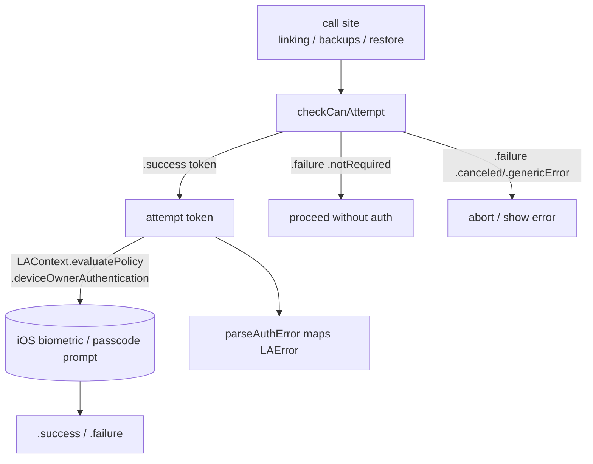

# Local Device Authentication

Covers `SignalServiceKit/LocalDeviceAuth/`:

- `LocalDeviceAuthentication.swift`

This folder is tiny: it is a thin, policy-free wrapper around Apple's `LocalAuthentication`
(`LAContext`) that gates sensitive in-app actions behind the **device owner's** biometrics
(Face ID / Touch ID / Optic ID) or device passcode. It answers one question — *"has the person
holding this phone just proven they are the device owner?"* — and nothing else. It is distinct from
Signal's **Screen Lock** feature (`SignalServiceKit/Util/ScreenLock.swift`), which uses the same
underlying `LAContext` machinery to lock the whole app on a timeout; `LocalDeviceAuth` is a
per-action challenge invoked by individual call sites (device linking, backups, QuickRestore).

---

## `LocalDeviceAuthentication` — `LocalDeviceAuthentication.swift:8`

Confidence: HIGH (read in full). A `public struct`, value-typed and cheap to create; each instance
owns a single `LAContext` built in `init()` via
`DeviceOwnerAuthenticationType.localAuthenticationContext()` (`:23`). Because the context is created
per-instance, callers that want to re-prompt generally create a fresh `LocalDeviceAuthentication()`.

### Result/token types
Confidence: HIGH.
- `AuthError` (`:9`) — three cases:
  - `.notRequired` — the device cannot evaluate the policy (no biometrics enrolled / no passcode
    set / biometrics unavailable). Treated by callers as **"let the action proceed"**, not as a hard
    failure (see error mapping below).
  - `.canceled` — the user (or system/app) dismissed the prompt; callers typically silently abort.
  - `.genericError(localizedErrorMessage:)` — a surfaceable, already-localized message string
    callers can show in an alert.
- `AuthSuccess` (`:16`) — an **opaque empty struct** returned on success. Its only purpose is to be
  an unforgeable-ish "proof token" that an auth happened; it is threaded through call sites (e.g.
  `BackupSaveKeyViewController.swift:25` stores `LocalDeviceAuthentication.AuthSuccess` in its state
  enum) so a function signature can *require* that authentication occurred before it runs.
- `AttemptToken` (`:18`) — another opaque empty struct, returned by `checkCanAttempt()` and consumed
  by `attempt(token:)`. It encodes the required call ordering in the type system: you cannot call
  `attempt` without first having obtained a token from `checkCanAttempt`.

### API

| Member | Line | Behavior |
|--------|------|----------|
| `init()` | 22 | Builds a fresh `LAContext` (never recycles biometric auth; see below). |
| `performBiometricAuth() async -> AuthSuccess?` | 28 | Convenience one-shot: runs `checkCanAttempt()` then `attempt(token:)`, collapsing `.notRequired` into success and both error kinds into `nil`. |
| `checkCanAttempt() -> Result<AttemptToken, AuthError>` | 47 | Calls `LAContext.canEvaluatePolicy(.deviceOwnerAuthentication)`; returns a token on success, else a parsed `AuthError`. **Must** be called before `attempt`. |
| `attempt(token:) async -> Result<AuthSuccess, AuthError>` | 60 | Calls `LAContext.evaluatePolicy(.deviceOwnerAuthentication, localizedReason:)`, which presents the OS prompt. Maps thrown errors via `parseAuthError`. |
| `parseAuthError(_:)` (private) | 76 | Maps `LAError.Code` → `AuthError`. |

Note the two call styles:
- **One-shot** via `performBiometricAuth()` (`:28`) — used by the Backups and QuickRestore flows
  (`Signal/Backups/BackupSettingsViewController.swift:548`,
  `Signal/QuickRestore/OutgoingDeviceRestoreViewModel.swift:60`, etc.), where the caller only needs a
  yes/no and doesn't need to interleave UI between the capability check and the prompt.
- **Two-phase** via `checkCanAttempt()` then `attempt(token:)` — used by device linking
  (`Signal/src/ViewControllers/AppSettings/Linked Devices/LinkedDevicesView.swift:539`), where the
  app first checks whether auth is possible, shows an explanatory `HeroSheetViewController`, and only
  then triggers the actual OS prompt when the user taps *Continue*
  (`authenticateThenShowLinkNewDeviceView`, `LinkedDevicesView.swift:661`).

### `LAError` → `AuthError` mapping — `parseAuthError` `:76`
Confidence: HIGH. The mapping encodes the subsystem's security posture:

| `LAError.Code` | Mapped to | Rationale |
|----------------|-----------|-----------|
| `biometryNotAvailable`, `biometryNotEnrolled`, `passcodeNotSet`, `touchIDNotAvailable`, `touchIDNotEnrolled` | `.notRequired` | Device has no auth configured → the gate is effectively **open** (`:92`). |
| `userCancel`, `userFallback`, `systemCancel`, `appCancel` | `.canceled` | User/system backed out (`:98`). |
| `biometryLockout`, `touchIDLockout` | `.genericError(…lockout)` | Too many failed biometric attempts (`:100`). |
| `authenticationFailed` | `.genericError(…authenticationFailed)` | Credentials rejected (`:102`). |
| `invalidContext`, `notInteractive`, `companionNotAvailable`, unknown / missing / non-`LAError` | `.genericError(…unknownError)` | Programmer/environment errors; each path also fires `owsFailDebug` (`:81`, `:104`, `:107`, `:110`, `:113`). |

The user-facing strings (`DeviceAuthenticationErrorMessage.unknownError` / `.lockout` /
`.authenticationFailed` / `.errorSheetTitle`) are **not** defined here — they live on
`DeviceAuthenticationErrorMessage` in `SignalServiceKit/Util/ScreenLock.swift:352`, shared with the
Screen Lock feature.

---

## Interactions with the rest of SignalServiceKit / the app

Confidence: HIGH (verified via usage search).

- **Dependencies (into `Util`):**
  - `DeviceOwnerAuthenticationType.localAuthenticationContext()`
    (`SignalServiceKit/Util/DeviceOwnerAuthenticationType.swift:18`) constructs the `LAContext` and
    sets `touchIDAuthenticationAllowableReuseDuration = 0` so biometric auth is **never recycled**
    (every call forces a fresh prompt). `DeviceOwnerAuthenticationType.current`
    (`DeviceOwnerAuthenticationType.swift:30`) is used by *call sites* (e.g.
    `PrivacySettingsViewController.swift:160`, `PaymentOnboarding.swift:11`) to tailor copy/icons
    (Face ID vs Touch ID vs passcode), but is not consumed inside `LocalDeviceAuthentication` itself.
  - `DeviceAuthenticationErrorMessage` (`Util/ScreenLock.swift:352`) for localized error text.
  - `OWSLocalizedString` for the `evaluatePolicy` reason string
    (`"LINK_NEW_DEVICE_AUTHENTICATION_REASON"`, `:65`) and `owsFailDebug` for assertions.
- **Consumers (app layer, outside SignalServiceKit):**
  - **Device linking** — `LinkedDevicesView.swift` (two-phase; gates showing the link-new-device UI).
  - **Backups** — `BackupSettingsViewController.swift`, `BackupOnboardingCoordinator.swift`,
    `BackupRecoveryKeyReminderCoordinator.swift`, `LocalFileBackupsSettingsViewController.swift`,
    `BackupSaveKeyViewController.swift` (gates revealing/using the recovery key / Account Entropy
    Pool).
  - **QuickRestore** — `OutgoingDeviceRestoreViewModel.swift:60`.
  - Payments and Screen Lock features do **not** go through this type; they use `OWSPaymentsLock` /
    `ScreenLock` with their own `LAContext` usage, though they share the same `Util` helpers.

Build membership: `LocalDeviceAuthentication.swift` is compiled into the app target
(`Signal.xcodeproj/project.pbxproj:3222`), consistent with it being `public` API consumed from the
`Signal/` app module.

---

## Important state

Confidence: HIGH. The subsystem is essentially **stateless** from Signal's perspective — there is no
database, `KeyValueStore`, or persisted flag here. The only state is the per-instance `LAContext`
(`:19`), which holds the transient OS authentication context for one challenge. Because
`touchIDAuthenticationAllowableReuseDuration` is `0`, a success does not persist or get reused across
instances; the proof of success is carried purely by passing the opaque `AuthSuccess` value up the
call stack.

---

## Notable security considerations

Confidence: HIGH, with one MEDIUM caveat noted.

- **Fail-open on `.notRequired`.** When the device has no biometrics/passcode configured,
  `checkCanAttempt`/`attempt` return `.notRequired` and essentially every caller treats this as
  "proceed" (e.g. `performBiometricAuth()` returns a non-nil `AuthSuccess`, `:33`/`:38`). This is a
  deliberate UX trade-off: the gate protects against someone *other than* the device owner, but it
  cannot provide protection on a device the owner never secured. Call sites should be aware the gate
  can be absent.
- **No biometric reuse window.** Setting `touchIDAuthenticationAllowableReuseDuration = 0`
  (`DeviceOwnerAuthenticationType.swift:22`) means iOS will not silently honor a recent unlock; each
  gated action demands a fresh presence check. This narrows the window where a briefly-unattended
  unlocked phone could perform a sensitive action.
- **Type-enforced ordering.** `AttemptToken` and `AuthSuccess` are opaque proof tokens. They raise
  the bar against call sites skipping the capability check or invoking a sensitive routine without
  having authenticated — the compiler requires the token to flow through. Note this is a
  *same-process convention*, not a cryptographic guarantee: the structs are empty and can be
  constructed within the module, so they document/enforce intent rather than defend against a
  compromised process (MEDIUM confidence on how strongly callers rely on this invariant everywhere).
- **Device-owner, not account auth.** This proves local presence only; it is unrelated to Signal
  account/registration credentials or server-side auth. It must not be mistaken for authorization of
  a server operation — it only gates *initiating* sensitive local flows (linking, revealing backup
  keys, restore).
- **Error details are logged, values are not.** Unexpected `LAError` paths call `owsFailDebug` with
  the error code (`:81`, `:104`, `:107`, `:110`, `:113`); no biometric data or secrets pass through
  this type (the OS never exposes raw biometrics to the app).
