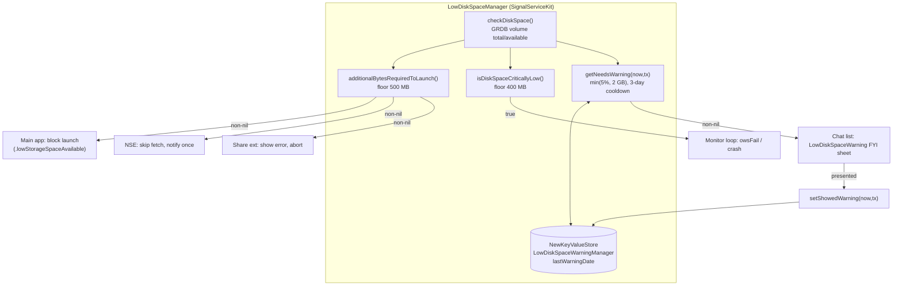

# Low Disk Space

Covers `SignalServiceKit/LowDiskSpace/`:

- `LowDiskSpaceManager.swift`

This folder is a single, small, dependency-light class whose job is to **measure the device's
available disk space and tell callers whether to take remedial action** at three escalating
thresholds:

1. **Block launch / foreground entry** when space is below a hard floor (main app, NSE, and share
   extension all refuse to start).
2. **Crash a running main app** when space becomes "critically" low (continuous background
   monitor).
3. **Show a soft, rate-limited warning sheet** when space dips under a softer threshold.

The manager itself is pure measurement + a tiny bit of persisted state (the last-warning date). It
makes **no decisions about UI**; each consumer decides what to do with the answer. The actual
monitoring loop and all UI live outside SignalServiceKit — in the `Signal` app target
(`Signal/LowDiskSpace/`), the NSE (`SignalNSE/`), and the share extension (`SignalShareExtension/`).

> **Confidence labels** on each claim:
> - **[High]** — directly read from the cited source; behavior is explicit in code.
> - **[Medium]** — inferred from strong local evidence (call sites, naming, comments) without
>   tracing every collaborator.
> - **[Low]** — plausible inference not fully verified in-source.
>
> **Citations** use `LowDiskSpaceManager.swift:line` for files in this folder, and
> `<target-relative-path>:line` for cross-target consumers. Line numbers reflect the tree at
> authoring time and may drift; relocate by symbol name.

---

## `LowDiskSpaceManager` — `LowDiskSpaceManager.swift:8`

Confidence: HIGH (read in full). A `public final class`; constructed with no arguments
(`init()`, `:34`). Its only persisted state is a single `NewKeyValueStore(collection:
"LowDiskSpaceWarningManager")` (`:32`/`:35`) holding one key, `lastWarningDate` (`StoreKeys`, `:27`).

### Thresholds — `Constants` (`:9`)

| Constant | Value | Line | Used by |
|---|---|---|---|
| `minBytesAvailableToLaunch` | 500 MB | `:11` | `additionalBytesRequiredToLaunch()` (launch/foreground gate) |
| `minBytesAvailableBeforeCriticallyLow` | 400 MB | `:14` | `isDiskSpaceCriticallyLow()` (crash gate) |
| `minBytesAvailableBeforeWarning(totalBytes:)` | `min(5% of total, 2 GB)` | `:17` | `getNeedsWarning(...)` (soft warning) |

Confidence: HIGH. The warning threshold is deliberately `min(percentageThreshold,
absoluteThreshold)` — warn at 2 GB, or 5% of total storage, whichever is smaller, so the 2 GB
figure isn't disproportionate on small-capacity devices (comment, `:21-22`). Note the ordering:
the launch floor (500 MB) is **higher** than the critical floor (400 MB), so a device that is too
low to launch is, by construction, also already past "critically low."

### API

| Member | Line | Kind | Behavior |
|---|---|---|---|
| `additionalBytesRequiredToLaunch()` | 41 | `static func -> UInt64?` | Returns the number of **additional** bytes needed to reach `minBytesAvailableToLaunch`, or `nil` if launch should not be blocked (also `nil` if disk space can't be measured). Logs a warning when blocking. |
| `isDiskSpaceCriticallyLow()` | 56 | `func -> Bool` | `true` iff measured available space is below `minBytesAvailableBeforeCriticallyLow`. Logs a warning when `true`. Returns `false` (fail-open) if space can't be measured. |
| `getNeedsWarning(now:tx:)` | 73 | `func -> UInt64?` | Returns the warning threshold in bytes if a warning is due, else `nil`. **Rate-limited:** returns `nil` if a warning was shown within the last 3 days (`:78-83`). Then compares available space to the computed warning threshold. |
| `setShowedWarning(now:tx:)` | 94 | `func` | Records `now` under `lastWarningDate`, starting the 3-day quiet period. |

Confidence: HIGH. All four read directly from source.

> **Fail-open on measurement failure.** All three query methods route through
> `checkDiskSpace()` (`:117`) and treat a measurement failure as "no action needed":
> `additionalBytesRequiredToLaunch()` and `getNeedsWarning` return `nil`,
> `isDiskSpaceCriticallyLow()` returns `false`. Intent (confidence: MEDIUM): avoid locking users
> out of or crashing the app merely because the free-space API threw.

### Measurement internals — `DiskSpace` / `checkDiskSpace()`

Confidence: HIGH.

- `private struct DiskSpace` (`:100`) holds `total` and `available` byte counts and a deliberately
  coarse `logDescription` (`:105`) that rounds available down to the nearest 100 MB and total to
  whole GB — presumably to avoid logging a precise fingerprint of the device.
- `checkDiskSpace()` (`:113`) measures the **volume that holds the GRDB database**
  (`SDSDatabaseStorage.grdbDatabaseFileUrl`, `:116`) via `OWSFileSystem.totalSpaceInBytes` /
  `freeSpaceInBytes`. A comment (`:114-115`) notes this intentionally matches the on-launch check
  in `AppDelegate.checkEnoughDiskSpaceAvailable()`. On error it logs via `owsFailDebug` and returns
  `nil`.

---

## Interactions with the rest of the app

The manager has no SignalServiceKit-internal callers; all consumers are in app/extension targets.
Confidence: HIGH (each call site read).

| Consumer | Target | Method used | What it does |
|---|---|---|---|
| `AppLifecycleManager.checkIfAllowedToLaunch(...)` | `Signal` | `additionalBytesRequiredToLaunch()` | First preflight check; non-nil → returns `.lowStorageSpaceAvailable(bytesRequired:)` and launch is blocked (`AppLifecycleManager.swift:1181-1182`). |
| `LowDiskSpaceMonitoringManager` | `Signal` | `isDiskSpaceCriticallyLow()` | Background loop; `owsFail("Disk space is critically low; crashing.")` when true (`Signal/LowDiskSpace/LowDiskSpaceMonitoring.swift:43-44`). |
| `ChatListFYISheetCoordinator` | `Signal` | `getNeedsWarning(now:tx:)` / `setShowedWarning(now:tx:)` | Decides whether to enqueue a `.lowDiskSpaceWarning` FYI sheet (`ChatListFYISheetCoordinator.swift:186`), and marks it shown after presentation (`:631`). |
| `NotificationService._didReceive(...)` | `SignalNSE` | `additionalBytesRequiredToLaunch()` | Non-nil → skip fetch and (once) notify the user instead of decrypting the pushed message (`SignalNSE/NotificationService.swift:104`). |
| `ShareViewController.setUp(...)` | `SignalShareExtension` | `additionalBytesRequiredToLaunch()` | Non-nil → abort sharing and show the low-disk-space view (`SignalShareExtension/ShareViewController.swift:76`). |

### Ownership / wiring

Confidence: HIGH. `AppEnvironment` owns the singletons (`Signal/AppLaunch/AppEnvironment.swift`):

- `lowDiskSpaceManager = LowDiskSpaceManager()` (`:174`).
- `lowDiskSpaceMonitoringManager = LowDiskSpaceMonitoringManager(lowDiskSpaceManager:,
  monitoringInterval: 5 * .second)` (`:175-178`) — polls every 5 seconds.
- The monitor is started in a ready-block via `lowDiskSpaceMonitoringManager.start()` (`:361`), so
  continuous monitoring only runs after app-readiness.
- The manager is handed to the chat-list FYI coordinator via
  `AppEnvironment.shared.lowDiskSpaceManager` (`ChatListViewController.swift:386`).

> The NSE and share extension call the **static** `additionalBytesRequiredToLaunch()` directly and
> never construct a `LowDiskSpaceManager` instance — the instance (and its persisted warning date)
> only exists in the main app. Confidence: HIGH.

---

## Data flow / state

Persisted state (confidence: HIGH): exactly one value — `lastWarningDate` — written by
`setShowedWarning` and read by `getNeedsWarning` to enforce the **3-day warning cooldown** (`:80`,
`3 * .day`). Everything else is computed on demand from the live file system; nothing about launch
or critical-low decisions is cached.

Threshold interplay (confidence: HIGH): because `launch floor (500 MB) > critical floor (400 MB) >`
and the warning threshold is up to 2 GB, a typical descent is **warning sheet → launch blocked →
critical crash** as free space shrinks; however the sheet, launch gate, and crash gate are
evaluated independently by their respective consumers rather than as a single state machine.
