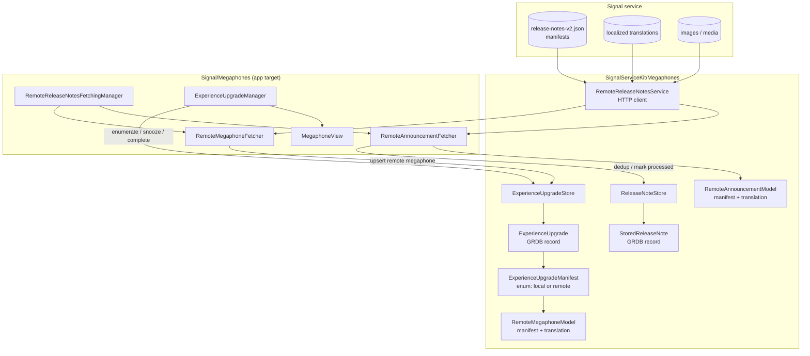

# Megaphones

Covers `SignalServiceKit/Megaphones/`:

- `ExperienceUpgrade.swift`
- `ExperienceUpgradeManifest.swift`
- `ExperienceUpgradeStore.swift`
- `RemoteMegaphoneModel.swift`
- `RemoteAnnouncementModel.swift`
- `RemoteReleaseNotesService.swift`
- `ReleaseNoteStore.swift`
- `StoredReleaseNote.swift`

This folder holds the **data model, persistence, and network client** for Signal's "megaphones" —
the in-app promotional/reminder banners shown atop the chat list (create a PIN, enable
notifications, inactive-device warnings, donation prompts, backups upsell, etc.) — and for
server-driven **release notes / announcements** that arrive as chat messages.

Two broad families live here:

1. **Experience upgrades / megaphones.** An `ExperienceUpgrade` is a persisted record tracking a
   single megaphone's lifecycle (first-viewed, snoozed N times, completed). Its *identity and
   behavior* come from an `ExperienceUpgradeManifest`, an enum that is either a **locally
   well-known** upgrade (hard-coded in the app) or a **remote megaphone** fetched from the service
   (`RemoteMegaphoneModel`).
2. **Remote release notes & announcements.** `RemoteReleaseNotesService` is the HTTP client that
   fetches the remote manifest + localized translations + media. Remote megaphones become
   `ExperienceUpgrade`s; remote **announcements** become in-chat release-note messages whose
   fetch/dedup state is tracked by `StoredReleaseNote` via `ReleaseNoteStore`.

> **Scope note.** This folder is SSK-side **model + store + network** only. The orchestration,
> presentation, and most of the fetch pipeline live in the app target under `Signal/Megaphones/`
> (`ExperienceUpgradeManager`, `RemoteReleaseNotesFetchingManager`, `RemoteMegaphoneFetcher`,
> `RemoteAnnouncementFetcher`, `MegaphoneView`), which are **outside this folder** and only
> referenced here to explain interactions.

> **Confidence labels.** Every claim carries a confidence label:
> - **HIGH** — directly read from the cited source; behavior is explicit in code.
> - **MEDIUM** — inferred from strong local evidence (naming, call sites, signatures) but not every
>   collaborator was traced in-tree.
> - **LOW** — plausible inference not fully verified in-source.
>
> **Citations** use `File.swift:line` for files under `SignalServiceKit/Megaphones/`, and
> otherwise give the full repo-relative path. Line numbers reflect the tree at authoring time and
> may drift; use the cited symbol name to relocate code.

---

## High-level architecture

Confidence: HIGH for the SSK boxes and their relationships (all read in this folder); MEDIUM for
the exact app-target wiring (traced via `Signal/Megaphones/RemoteReleaseNotesFetchingManager.swift`
and `RemoteMegaphoneFetcher.swift`, not every call site exhaustively verified).

---

## `ExperienceUpgrade` — `ExperienceUpgrade.swift:9`

Confidence: HIGH (read in full). A GRDB `Codable, FetchableRecord, PersistableRecord` persisted in
table **`model_ExperienceUpgrade`** (`:12`). It is the per-megaphone lifecycle record.

Stored columns (`CodingKeys`, `:14`): `id`, `recordType` (always encoded as `0`, `:104`),
`uniqueId`, `firstViewedTimestamp`, `lastSnoozedTimestamp`, `snoozeCount`, `isComplete`, and the
embedded `manifest`.

- **`uniqueId` is derived**, not stored independently — it is `manifest.uniqueId` (`:28`). On
  decode the code asserts the persisted `uniqueId` matches the deserialized manifest's
  (`owsAssertDebug`, `:97`).
- **Legacy records.** If a persisted record predates the `manifest` column, decode falls back to
  `ExperienceUpgradeManifest.makeLegacy(fromPersistedExperienceUpgradeUniqueId:)` (`:77`/`:94`).
- **Upsert semantics.** `persistenceConflictPolicy` is `.replace` on both insert and update
  (`:66`); `upsert(tx:)` just calls `insert` (`:71`). `didInsert` captures the row ID (`:62`).
  `recordType` is always encoded as `0` (`:104`).
- **Factory.** New records start all-zero/`isComplete = false` via `makeNew(withManifest:)`
  (`:56`); the designated `init` is private (`:47`).

### Lifecycle predicates
| Method | Line | Behavior |
|--------|------|----------|
| `isSnoozed(now:)` | 117 | True when `lastSnoozedTimestamp > 0 && snoozeCount > 0` **and** elapsed time since last snooze is within `manifest.snoozeDuration(forSnoozeCount:)`. |
| `hasPassedNumberOfDaysToShow(now:)` | 130 | True when days since `firstViewedTimestamp` exceeds `manifest.numberOfDaysToShowFor` (used to stop showing a shown-but-ignored upgrade). |

> The schema for `model_ExperienceUpgrade` is created in
> `SignalServiceKit/Storage/Database/GRDBSchemaMigrator.swift:853` (columns `id`, `recordType`,
> `uniqueId` + a unique index on `uniqueId`). Note the richer columns (`firstViewedTimestamp`,
> etc.) are persisted via GRDB's record encoding on top of this base table. Confidence: HIGH that
> the base table + index exist; MEDIUM on exactly how the extra columns were added over time (there
> are later migrations, e.g. `completePermasnoozedReminderMegaphones`, `GRDBSchemaMigrator.swift:342`).

---

## `ExperienceUpgradeManifest` — `ExperienceUpgradeManifest.swift:9`

Confidence: HIGH (read in full). An enum that is the **source of truth for a megaphone's identity
and behavior**. Cases are either locally well-known reminders/notifications or a
`.remoteMegaphone(megaphone:)` carrying a `RemoteMegaphoneModel` (`:33`). `.unrecognized(uniqueId:)`
(`:65`) represents a persisted upgrade whose case no longer exists in the app.

Well-known cases (`:11`-`:63`) include `newLinkedDeviceNotification`, `introducingPins`,
`notificationPermissionReminder`, `createUsernameReminder`, `inactiveLinkedDeviceReminder`,
`inactivePrimaryDeviceReminder`, `pinReminder`, `contactPermissionReminder`, `recoveryKeyReminder`,
`backupsUpsellReminder`, `backupsEnabledRecentlyNotification`.

### Identity & encoding
- **`uniqueId`** (`:167`) is the stable persistence key per case. Several IDs intentionally differ
  from the enum name for historical compatibility — e.g. `.introducingPins` → `"009"` (`:174`),
  `.recoveryKeyReminder` → `"backupKeyReminder"` (`:190`), `.backupsUpsellReminder` →
  `"enableBackupsReminder"` (`:192`). For `.remoteMegaphone` the ID is the megaphone's ID (`:180`).
- **Codable** persists only `uniqueId` and (for remote megaphones) the nested `remoteMegaphone`
  (`:88`). Decode (`:77`) reconstructs the case from the unique ID via a private `init` (`:109`),
  falling back to `.remoteMegaphone` if a model is present, else `.unrecognized`
  (`:136`-`:140`).
- **Equatable/Hashable** are defined purely on `uniqueId` (`:202`/`:208`).
- **`wellKnownLocalUpgradeManifests`** (`:150`) is the set the app seeds locally; it deliberately
  omits removed-but-once-known manifests.

### Presentation policy (per-case metadata)
These computed properties drive *whether/when* a megaphone shows. Confidence: HIGH; the policy
numbers are read directly.

| Member | Line | Meaning |
|--------|------|---------|
| `importanceIndex` / `sortedByImportance(_:)` | 222 / 258 | Relative priority ordering; lower is more important. Remote megaphones sit at primary index `4` with secondary = inverted `megaphone.manifest.priority` (`:235`). |
| `snoozeDuration(forSnoozeCount:)` | 274 | Per-case snooze interval. Some cases (`pinReminder`, `newLinkedDeviceNotification`, `backupsEnabledRecentlyNotification`) track state externally and `owsFailDebug` if asked to snooze (`:289`). `backupsUpsellReminder` escalates 60→120 days (`:300`). Remote megaphones read `snoozeDurationDays` from action data. |
| `numberOfDaysToShowFor` | 343 | Local cases return `Int.max`; remote reads `manifest.showForNumberOfDays` (`:359`). |
| `delayAfterRegistration` | 367 | Grace period after registration before showing. Remote `.standardDonate` conditional ⇒ 7 days (`:388`-`:389`). |
| `expirationDate` | 407 | Local cases `distantFuture`; remote uses `dontShowAfter`; `.unrecognized` ⇒ `distantPast` (never show). |
| `showOnLinkedDevices` | 430 | Which upgrades may appear on linked (non-primary) devices; remote is gated by its conditional check. |

---

## `ExperienceUpgradeStore` — `ExperienceUpgradeStore.swift:12`

Confidence: HIGH (read in full). A stateless `struct` (public `init`, `:14`) of CRUD + lifecycle
helpers over `ExperienceUpgrade`.

| Method | Line | Behavior |
|--------|------|----------|
| `markAsSnoozed(experienceUpgrade:tx:)` | 18 | Set `lastSnoozedTimestamp = now`, `snoozeCount += 1`, upsert. |
| `markAsComplete(experienceUpgrade:tx:)` | 26 | Set `isComplete = true`, upsert. |
| `markAsViewed(experienceUpgrade:tx:)` | 33 | Set `firstViewedTimestamp = now` once (no-op if already viewed). |
| `upsertRemoteMegaphone(experienceUpgrade:newRemoteMegaphoneModel:tx:)` | 48 | Selectively merge re-fetched remote fields (`owsFailDebug` if the upgrade isn't a remote megaphone). |
| `enumerateExperienceUpgrades(tx:block:)` | 74 | Cursor over all persisted upgrades. |
| `remove(experienceUpgrade:tx:)` | 89 | Delete the record; for a remote megaphone with an image, also best-effort-deletes the cached image under `RemoteMegaphoneModel.imagesDirectory` (`owsFailDebug` on failure, `:117`). |

- **State-change notification.** The file defines `Notification.Name.megaphoneStateDidChange`
  (`:7`), posted elsewhere to tell UI to refresh. Confidence: HIGH it is declared here; MEDIUM on
  all posters/observers (they live in the app target).
- All writes funnel through the private `upsert` wrapped in `failIfThrows` (`:66`).

---

## `RemoteMegaphoneModel` — `RemoteMegaphoneModel.swift:8`

Confidence: HIGH (read in full). `Codable` value type = `Manifest` (metadata) + `Translation`
(localized content). `id` is `manifest.id` (`:17`).

- **`updateSelectively(newRemoteMegaphoneModel:)`** (`:39`) merges a re-fetched model into an
  existing one: it refreshes `priority`, `countries`, `conditionalCheck`, primary/secondary
  actions + action data, and translation `title`/`body`/action text — but **not** image URLs. Per
  the comment (`:30`-`:35`), once an image is fetched it is treated as immutable.

### `Manifest` — `:82`
Fields: `id`, `priority`, `minAppVersion`, `countries` (CSV `<country>:<ppm>` rollout string,
`:102`), `dontShowBefore`/`dontShowAfter` (epoch seconds, `:105`), `showForNumberOfDays`,
optional `conditionalCheck`, and optional primary/secondary `Action` + `ActionData`.

- **`ConditionalCheck`** (`:236`): `standardDonate` (`"standard_donate"`, `:244`), `internalUser`
  (`"internal_user"`), or `unrecognized`.
- **`Action`** (`:289`): `finish`, `donate`, `snooze`, `donateFriend` (`"donate_friend"`, `:305`),
  or `unrecognized`.
- **`ActionData`** (`:352`): currently `snoozeDurationDays(days:)` (`:353`, parsed from JSON via
  `parse(fromJson:)`, `:358`) or `unrecognized`.
- Unknown IDs decode to `.unrecognized(...)` rather than failing — forward-compatible with
  server-added values. Confidence: HIGH.

### `Translation` — `:421`
Localized `title`/`body`, optional `imageRemoteUrlPath`, `primaryActionText`/`secondaryActionText`,
and image state. `imageLocalRelativePath` is just the `id` (`:438`) and the images live under
**`RemoteMegaphoneModel.imagesDirectory`** = `<appSharedDataDirectory>/MegaphoneImages` (`:415`).
`hasImage` decode is backward-compatible with an older `imageLocalUrl` key (`:512`). The parser
rejects IDs that aren't legal filenames (`:642`).

### JSON parsing
`Manifest.parseFrom(parser:)` (`:558`) reads the `"megaphones"` array; entries missing
`iosMinVersion` are skipped (`:565`). `Translation.parseFrom(parser:)` (`:634`) reads a single
translation object.

---

## `RemoteAnnouncementModel` — `RemoteAnnouncementModel.swift:8`

Confidence: HIGH (read in full). Structurally parallel to `RemoteMegaphoneModel` but models
**release-note announcements** that are presented as in-chat messages rather than banners.

- **`Manifest`** (`:47`): `id`, `minAppVersion` (as `AppVersionNumber4`, `:53`), `countries` CSV
  rollout, optional `link` URL, and optional `Action` (`:132`) whose only known value is
  `backupSettings` (`:134`).
- **`Translation`** (`:186`): localized `title`/`body`, optional media (`mediaRemoteUrlPath`,
  `mediaSize`, `mediaMimeType`), `linkText`, `callToActionText`, and `bodyRanges` (`:365`) that map
  to `MessageBodyRanges.SingleStyle` (bold/italic/spoiler/strikethrough/mono, `:370`/`:387`-`:399`).
- **Media directory.** `RemoteAnnouncementModel.mediaDirectory` =
  `<appSharedDataDirectory>/AnnouncementMedia` (`:180`).
- JSON parsing: `Manifest.parseFrom` reads the `"announcements"` array (`:319`);
  `Translation.parseFrom` builds a single announcement translation (`:414`).

---

## `RemoteReleaseNotesService` — `RemoteReleaseNotesService.swift:29`

Confidence: HIGH (read in full). The HTTP client. The protocol
`RemoteReleaseNotesServiceProtocol` (`:11`) exposes four async operations; the concrete class wraps
`OWSSignalServiceProtocol.urlSessionForUpdates2()` (`:37`).

| Operation | Line | Behavior |
|-----------|------|----------|
| `fetchManifests()` | 40 | GET `dynamic/release-notes/release-notes-v2.json` (`:8`), parse into **both** megaphone + announcement manifests. |
| `fetchMegaphoneTranslation(translationUrlPath:)` | 54 | GET + parse a megaphone translation. |
| `fetchAnnouncementTranslation(translationUrlPath:)` | 59 | GET + parse an announcement translation. |
| `downloadMedia(mediaRemoteUrlPath:mediaFileUrl:translationId:)` | 74 | Download media only if not already on disk, then move into place; returns `false` and `owsFailDebug`s on 404, rethrows other HTTP errors (`:98`-`:104`). |

- The service is a shared `DependenciesBridge` dependency (`SignalServiceKit/Environment/DependenciesBridge.swift:176`),
  constructed in `SignalServiceKit/Environment/AppSetup.swift:1785` with the app's `signalService`.
  Confidence: HIGH (both lines read via search).
- A `MockRemoteReleaseNotesService` implementation exists for tests
  (`Signal/test/RemoteReleaseNotes/RemoteReleaseNotesFetchingManagerTests.swift:420`). Confidence:
  MEDIUM (located via search, not read in full).

---

## `StoredReleaseNote` — `StoredReleaseNote.swift:10` and `ReleaseNoteStore` — `ReleaseNoteStore.swift:9`

Confidence: HIGH (both read in full).

`StoredReleaseNote` is a GRDB record in table **`StoredReleaseNote`** (`:11`) recording a release
note the client has **already fetched/processed**, so announcements are not re-inserted as duplicate
chat messages. Columns: `uniqueId` (primary key), optional `interactionId` (the `TSInteraction`
row; nil for blocked threads that don't create one, `:22`), optional `ctaId`/`ctaText`. Its
`persistenceConflictPolicy` is `.ignore` on insert (`:35`) — re-inserting the same note is a no-op.

`ReleaseNoteStore` is a stateless `struct` with three operations:

| Method | Line | Behavior |
|--------|------|----------|
| `existingReleaseNoteForManifestId(_:tx:)` | 12 | Fetch by primary key (dedup check during manifest filtering). |
| `existingReleaseNoteForInteractionId(_:tx:)` | 19 | Fetch by `interactionId`. |
| `storeReleaseNote(uniqueId:interactionId:ctaText:callToActionId:tx:)` | 27 | Insert a processed note. |

> **Schema history** (`SignalServiceKit/Storage/Database/GRDBSchemaMigrator.swift`): the table is
> created with just `uniqueId` in `.addStoredReleaseNotesTable` (`:5264`-`:5266`); `interactionId`,
> `ctaId`, `ctaText` plus a partial index on `interactionId` are added later in
> `.addReleaseNotesCallToAction` (`:5314`-`:5324`). `StoredReleaseNote.databaseTableName` is also
> listed among recovery-managed tables in `DatabaseRecovery.swift:348`. Confidence: HIGH (read).

---

## Data flow & interactions (end to end)

Confidence: HIGH for the SSK-side steps (read here); MEDIUM for the app-target orchestration
(traced via `Signal/Megaphones/`).

1. **Fetch.** The app's `RemoteReleaseNotesFetchingManager`
   (`Signal/Megaphones/RemoteReleaseNotesFetchingManager.swift`) calls
   `RemoteReleaseNotesService.fetchManifests()` with retry/backoff, yielding megaphone +
   announcement manifests.
2. **Megaphones → ExperienceUpgrades.** `RemoteMegaphoneFetcher`
   (`Signal/Megaphones/RemoteMegaphoneFetcher.swift`) fetches translations, then in a single write
   enumerates existing remote-megaphone `ExperienceUpgrade`s, upserts the freshly fetched ones via
   `ExperienceUpgradeStore.upsertRemoteMegaphone(...)` / `makeNew`, and removes megaphones no longer
   on the service (which also deletes their cached image, `ExperienceUpgradeStore.swift:89`).
3. **Announcements → chat messages.** `RemoteAnnouncementFetcher` filters manifests by app version
   and existing `StoredReleaseNote` (via `ReleaseNoteStore.existingReleaseNoteForManifestId`),
   downloads media into `RemoteAnnouncementModel.mediaDirectory`, inserts a chat interaction, and
   records a `StoredReleaseNote` so it isn't re-processed.
4. **Presentation.** The app's `ExperienceUpgradeManager` enumerates persisted upgrades, filters by
   the `ExperienceUpgradeManifest` policy (`isSnoozed`, `delayAfterRegistration`, `expirationDate`,
   `showOnLinkedDevices`, importance ordering) and shows a `MegaphoneView` atop the chat list.
5. **User interaction** maps back to `ExperienceUpgradeStore.markAsViewed/markAsSnoozed/
   markAsComplete`, and `Notification.Name.megaphoneStateDidChange`
   (`ExperienceUpgradeStore.swift:7`) prompts UI to re-evaluate.

### Persistence summary
| Data | Where | Durability |
|------|-------|-----------|
| Per-megaphone lifecycle | GRDB `model_ExperienceUpgrade` | Permanent until removed/completed |
| Remote-megaphone content (manifest + translation) | embedded in `ExperienceUpgrade.manifest` | Refreshed on each fetch |
| Remote-megaphone images | `<appShared>/MegaphoneImages/<id>` | Immutable once fetched; deleted with the upgrade |
| Processed release-note dedup | GRDB `StoredReleaseNote` | Permanent (insert-ignore) |
| Announcement media | `<appShared>/AnnouncementMedia/` | On disk |

Confidence: HIGH for the table/directory names (each cited above); MEDIUM for the exact
insert/cleanup call sites that live in the app target.
