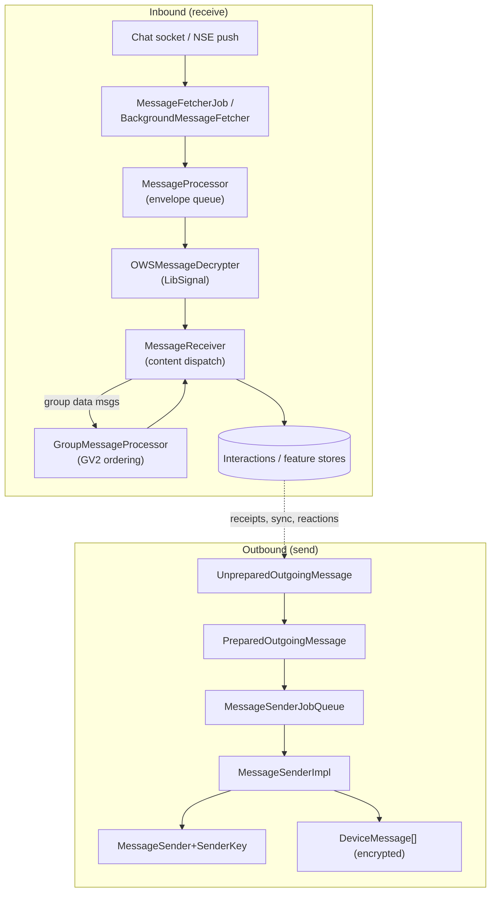

# Signal iOS — Messages Subsystem

This document covers the first-party source under `SignalServiceKit/Messages/`,
the largest subsystem in SignalServiceKit. It owns the **message model**
(`TSInteraction`/`TSMessage` and subclasses), the **inbound pipeline**
(fetch → decrypt → process → persist), the **outbound pipeline**
(prepare → encrypt per-device → fan-out → record state), and a large family of
message *features* (reactions, edits, stickers, stories, polls, pinned messages,
quoted replies, link previews, contact shares, payments, device-sync messages,
receipts, typing indicators, body ranges/mentions, and attachments).

Because the subsystem is so large, this README is an **orienting map**: it
describes the central concepts, the two end-to-end pipelines, and where each
piece of code lives, with file+line anchors. Several subtrees already have their
own dedicated docs (see the cross-reference table); this document does not
duplicate them.

> **Confidence labels.** Each claim is tagged:
> - **[High]** — directly read from source; behavior is explicit in code.
> - **[Medium]** — inferred from code with reasonable certainty, but depends on
>   collaborators defined outside `SignalServiceKit/Messages/` (the chat socket,
>   the LibSignal crypto layer, the job-queue infrastructure, Storage Service).
> - **[Low]** — inferred from naming/comments; not fully verified in-tree.
>
> File+line citations refer to the tree at the time of writing. Line numbers are
> approximate anchors; use the cited symbol name if lines have drifted.

## Cross-references to existing docs

Several subtrees rooted under `SignalServiceKit/Messages/` are documented
elsewhere and are intentionally **not** re-documented here:

| Subtree | See |
| --- | --- |
| `Messages/Attachments/**` (V2 attachment model, store, downloads, validation, media) | [../Attachments/README.md](../Attachments/README.md) |
| Disappearing-message timers and expiration | [../DisappearingMessages/README.md](../DisappearingMessages/README.md) |
| Call messages / `callMessage` handling | [../Calls/README.md](../Calls/README.md) |
| Chat socket, request-making, CDN transport | [../Network/README.md](../Network/README.md) |
| Group model used by group fan-out and `GroupMessageProcessor` | [../Groups/README.md](../Groups/README.md) |

This document focuses on the **core message pipelines and model** plus the
feature folders that have no dedicated doc.

## The two central pipelines

Everything in this subsystem exists to serve one of two directions of travel.

### Inbound pipeline (fetch → decrypt → process → persist)

1. **Fetch.** `MessageFetcherJob` is a thin wrapper that reports whether the
   chat connection has drained its initial queue; actual envelope delivery comes
   through the chat socket / NSE. `MessageFetcherJob.hasCompletedInitialFetch`
   defers to `chatConnectionManager.hasEmptiedInitialQueue`
   (`MessageFetcherJob.swift:12-18`). **[High]** The `BackgroundMessageFetcher`
   actor coordinates holding the socket open and waiting for processing +
   side-effects to go idle (`BackgroundMessageFetcher.swift:48`,
   `start()` at `:76`, `waitForFetchingProcessingAndSideEffects()` at `:91`).
   **[High]**

2. **Enqueue.** `MessageProcessor.enqueueReceivedEnvelopeData(...)` parses the
   raw bytes into an `SSKProtoEnvelope`, rejects empty/oversize envelopes
   (`maxEnvelopeByteCount = 256 * 1024`), and enqueues a `ReceivedEnvelope`
   (`MessageProcessor.swift:84-150`, limit constant at `:150`). Batches are
   bounded by `incomingMessageBatchLimit = 16` / `incomingReceiptBatchLimit = 32`
   (`MessageProcessor.swift:13-17`). Draining happens in `drainPendingEnvelopes()`
   (`MessageProcessor.swift:171`). **[High]**

3. **Validate.** Before decryption, each envelope is wrapped in a
   `ValidatedIncomingEnvelope`, whose initializer is the *only* way to construct
   the type and therefore enforces invariants: valid timestamp/serverTimestamp,
   a `Kind` enum (`serverReceipt` / `identifiedSender` / `unidentifiedSender`),
   and a `localIdentity` (ACI vs PNI) resolved from the destination
   (`ValidatedIncomingEnvelope.swift:21-69`). **[High]**

4. **Decrypt.** `OWSMessageDecrypter` turns a validated envelope into a
   `DecryptedIncomingEnvelope` via LibSignal. Identified senders are decrypted in
   `decryptIdentifiedEnvelope(...)` (`OWSMessageDecrypter.swift:391`); sealed
   sender ("unidentified") envelopes are decrypted in
   `decryptUnidentifiedSenderEnvelope(...)` (`:546`), which first unwraps the
   outer sealed-sender layer to learn the `sourceAci`, then decrypts the nested
   payload (`processDecryptedEnvelope(...)` at `:667`). The two paths converge on
   the single `DecryptedIncomingEnvelope` type so downstream code is
   source-agnostic (`DecryptedIncomingEnvelope.swift:7-22`). **[High]**

   On decryption failure the decrypter performs **automatic session recovery**:
   it may send a null message to reset the session
   (`trySendNullMessage` `OWSMessageDecrypter.swift:44`, gated by
   `automaticSessionResetKillSwitch` and `automaticSessionResetAttemptInterval`)
   and/or a reactive profile key (`trySendReactiveProfileKey` `:106`). Reset
   bookkeeping is per-batch via `senderIdsResetDuringCurrentBatch`, cleared when
   the queue drains and the initial fetch has completed
   (`OWSMessageDecrypter.swift:10`, `messageProcessorDidDrainQueue` `:30-37`).
   **[High]**

5. **Content validation & replay protection.** `DecryptedIncomingEnvelope`
   parses the plaintext into `SSKProtoContent` and enforces that a message
   contains exactly one content type (a `decryptionErrorMessage` cannot coexist
   with a data/sync/call/story/etc. message) and that data/typing message
   timestamps match the envelope timestamp — "this prevents replay attacks by the
   service" (`DecryptedIncomingEnvelope.swift:51-89`). **[High]**

6. **Dispatch.** `MessageReceiver.processEnvelope(...)` (`MessageReceiver.swift:125`)
   builds a `MessageReceiverRequest`, drops blocked senders, and routes to a
   per-type handler in `handleRequest(...)`: `syncMessage`, `dataMessage`,
   `callMessage`, `typingMessage`, `nullMessage`, `receiptMessage`,
   `decryptionErrorMessage`, `storyMessage`, `editMessage`
   (`MessageReceiver.swift:185-245`). Server-generated receipts take the
   `serverReceipt` branch into `handleDeliveryReceipt(...)` (`:247`), and
   `finishProcessingEnvelope(...)` (`:298`) marks completion. **[High]**

7. **Group ordering.** Group (GV2) data messages are routed through
   `GroupMessageProcessor` / `GroupMessageProcessorManager`
   (`GroupMessageProcessor.swift:542`), which serializes per-group application so
   that group-state changes apply in order; completion is signaled by the
   `didFlushGroupsV2MessageQueue` notification
   (`GroupMessageProcessor.swift:544`, posted at `:618`). The main
   `MessageProcessor` waits on all three stages — fetcher, processor, group
   processor — via `waitForFetchingAndProcessing(stages:)`
   (`MessageProcessor.swift:28-33`, `Stages` option set at `:24-35`). **[High]**

8. **Early messages.** Messages that arrive before their prerequisite (e.g. an
   edit or receipt that references a not-yet-received message) are parked by
   `EarlyMessageManager` keyed by `(timestamp, authorAci)` and replayed later
   (`EarlyMessageManager.swift:8-24`; the edit path records early envelopes at
   `MessageReceiver.swift:231-240`). **[High]**

### Outbound pipeline (prepare → encrypt → fan-out → record)

1. **Prepare.** Callers build an `UnpreparedOutgoingMessage` wrapping a
   `TSOutgoingMessage` plus unsaved drafts (body/media attachments, link preview,
   quoted reply, sticker, contact share, poll)
   (`UnpreparedOutgoingMessage.swift:7-45`). "Preparing" inserts the message and
   its attachments into the database and yields a `PreparedOutgoingMessage`,
   which also has `preprepared(...)` constructors for transient messages
   (receipts, null messages, sync messages) and already-inserted resends
   (`PreparedOutgoingMessage.swift:7-55`). **[High]**

2. **Enqueue & durability.** Prepared messages are added to the
   `MessageSenderJobQueue` (a persistent job queue; see `../../Jobs`), so sends
   survive app restarts. The decrypter's recovery paths enqueue transient
   messages this way (`OWSMessageDecrypter.swift:70-99`). **[Medium]**

3. **Send.** `MessageSender` is the protocol
   (`MessageSender.swift:9-13`); `MessageSenderImpl.sendMessage(_:)` is the entry
   point (`MessageSender.swift:378`). Per-recipient effort is modeled by
   `OWSMessageSend` ("a single effort to send a message to a given recipient,
   which may span multiple attempts"; group messages produce one per recipient)
   (`OWSMessageSend.swift:54-66`). Session establishment (prekey fetch →
   `createSession`) is at `MessageSender.swift:72-110`;
   `performMessageSend`/`performMessageSendAttempt` are at `:1336`/`:1349`.
   **[High]**

4. **Per-device encryption.** `DeviceMessageBuilder.buildDeviceMessages(...)`
   produces an encrypted `DeviceMessage` per recipient device, choosing an
   `EncryptionStyle` and optionally wrapping in **sealed sender**
   (`MessageSender.swift:15-28`, `DeviceMessage.swift`). Sealed-sender parameters
   (`SealedSenderParameters`) bundle the sender certificate, unidentified-access
   key, and a group-send endorsement token; a message is only sendable sealed if
   it is a story send, has UD access, or has an endorsement
   (`OWSMessageSend.swift:7-50`). **[High]**

5. **Sender key fan-out.** For large groups, `MessageSender+SenderKey` sends a
   single ciphertext to the multi-recipient endpoint using a shared sender key,
   distributing the key via `OutgoingSenderKeyDistributionMessage`
   (`MessageSender+SenderKey.swift`, request at `:484`;
   `OutgoingSenderKeyDistributionMessage.swift`). **[High]**

6. **Record state & side-effects.** After a successful local send,
   `handleMessageSentLocally(...)` (`MessageSender.swift:1165`) runs post-send
   bookkeeping. Per-recipient delivery/read/viewed state lives in
   `TSOutgoingMessageRecipientState` (`Interactions/TSOutgoingMessageRecipientState.swift`)
   and `RecipientStateMerger` (`RecipientStateMerger.swift`). The
   **Message Send Log (MSL)** persists the plaintext payload + content hint so
   that a later `decryptionErrorMessage` can trigger an exact resend
   (`MessageSendLog.swift:18-50`, `Payload` struct at `:38`); payloads expire
   after `messageSendLogEntryLifetime` and are cleaned in bounded batches
   (`cleanupLimit = 25`, `:29-35`). **[High]**

7. **Resend requests.** When a peer can't decrypt, it sends a decryption-error
   message; we respond with `OWSOutgoingResendResponse`
   (`OWSOutgoingResendResponse.swift`) built from the MSL, or an
   `OutgoingResendRequest` in the reverse direction
   (`OutgoingResendRequest.swift`). The `SealedSenderContentHint`
   (`MessageReceiver.swift:10-56`) determines whether a decryption failure
   inserts a placeholder (`OWSRecoverableDecryptionPlaceholder`) and when the user
   sees an error (`.default` immediately, `.resendable` after a deferral,
   `.implicit` never). **[High]**

## The message/interaction model (persistence)

All conversation items are `TSInteraction` subclasses persisted via GRDB through
the generated `+SDS.swift` files. The ObjC base defines the interaction-type enum
(`OWSInteractionType_IncomingMessage`, `_OutgoingMessage`, `_Error`, `_Call`,
`_Info`, `_TypingIndicator`, …) (`Interactions/TSInteraction.h:12-27`). **[High]**

Key hierarchy (under `Interactions/`):

- `TSInteraction` → `TSMessage` → `TSIncomingMessage` / `TSOutgoingMessage`.
  `TSMessage` holds body, body ranges, attachments-by-reference, expiration,
  quoted reply, link preview, sticker, contact share, etc.
  (`Interactions/TSMessage.{h,m,swift}`, `TSOutgoingMessage.{h,m,swift}`,
  `TSIncomingMessage.{h,m}`). **[High]**
- `TSOutgoingMessage` tracks per-recipient state and is extended by many feature
  subclasses listed below. Builders live in the `+Builder.swift` files. **[High]**
- `TSInfoMessage` and `TSErrorMessage` represent system events (group updates,
  profile changes, phone-number changes, session switchover, thread merges,
  disappearing-timer updates, payments, polls, pins). Note the very large
  `TSInfoMessage+GroupUpdates+*` files that render group-update items
  (`Interactions/TSInfoMessage+GroupUpdates+GroupUpdateItemBuilder.swift` is
  ~100 KB). **[High]**
- `TSInteraction+SDS.swift` (~365 KB) is **generated** GRDB
  serialization code (see the "generated by `sds_generate.py`" marker in
  `TSInteraction.h:58`). It, and the sibling `*+SDS.swift` files, are generated
  and should not be hand-edited. **[High]**

### Feature folders (model + manager + store)

Most features follow the same shape: a model type, a `*Manager` for business
logic, a `*Store`/`*Finder` for persistence, and `Outgoing*Message` subclasses
for the wire send.

| Folder | Purpose | Key types |
| --- | --- | --- |
| `Reactions/` | emoji reactions | `OWSReaction`, `ReactionManager` (`Reactions/ReactionManager.swift`), `ReactionStore`, `ReactionFinder`, `OutgoingReactionMessage` |
| `Edit/` | message edits + edit history | `EditManagerImpl` (`Edit/EditManagerImpl.swift`), `EditMessageStore`, `EditRecord`, `MessageEdits`, `OutgoingEditMessage` |
| `Stories/` | stories & story contexts | `StoryManager`, `SystemStoryManager`, `StoryMessage`, `StoryStore`, `StoryFinder`, `OutgoingStoryMessage` |
| `Stickers/` | sticker packs & install | `StickerManager` (`Stickers/StickerManager.swift`), `StickerInfo`, `MessageStickerManager`, `Download*Operation` |
| `Payments/` | in-chat payment messages | `OWSOutgoingPaymentMessage`, `OWSIncomingPaymentMessage`, `ArchivedPayment(Store)` |
| `Interactions/Polls/` | polls | `OWSPoll`, `PollMessageManager`, `PollStore`, `OutgoingPollVote/Terminate` |
| `Interactions/PinnedMessages/` | pinned messages | `PinnedMessageManager`, `PinnedMessageRecord`, `OutgoingPin/UnpinMessage` |
| `Interactions/Quotes/` | quoted replies | `TSQuotedMessage`, `QuotedReplyManager`, `DraftQuotedReplyModel` |
| `Interactions/LinkPreview/` | link previews | `OWSLinkPreview`, `LinkPreviewManager` |
| `Interactions/ContactShare/` | shared contacts | `OWSContact(+fields)`, `ContactShareManager` |
| `Interactions/AdminDelete/` | admin delete-for-everyone | `AdminDeleteManager`, `AdminDeleteRecord`, `OutgoingAdminDeleteMessage` |
| `BodyRanges/` | mentions & text styles | `MessageBodyRanges`, `MessageBody`, `HydratedMessageBody`, `EditableMessageBody` |
| `DeviceSyncing/` | linked-device sync messages | `OutgoingSyncMessage` subclasses, `OWSIncomingSentMessageTranscript`, `DeleteForMe/*` |
| `UD/` | sealed sender | `OWSUDManager`, `SMKSecretSessionCipher`, `SMKUDAccessKey`, `OWSRequestMaker` |

Supporting top-level types: `BlockingManager` + `Blocked*Store` (block list),
`OWSIdentityManager` (identity keys / safety numbers), `OWSReceiptManager` +
`ReceiptSender` + `MessageRequestPendingReceipts` (read/delivery receipts),
`RecipientHidingManager` (hidden recipients), `TypingIndicatorMessage`,
`PniSignatureProcessor` / `IncomingPniChangeNumberProcessor` (PNI identity),
and the `*Job` cleanup tasks (`FailedMessagesJob`, `IncompleteCallsJob`,
`OWSDecryptionPlaceholderExpirationJob`). **[High]**

## State, protocols, and persistence notes

- **Envelope → content → interaction.** The pipeline progressively narrows types:
  `SSKProtoEnvelope` → `ValidatedIncomingEnvelope` → `DecryptedIncomingEnvelope`
  (with `SSKProtoContent`) → a persisted `TSInteraction` subclass. Each stage's
  type encodes guarantees from the prior stage. **[High]**
- **Protobufs.** Wire types (`SSKProtoEnvelope`, `SSKProtoContent`, `SSKProtoDataMessage`,
  etc.) are **generated** protobuf code and live outside this folder (`SignalServiceKit/protobuf`),
  not under `Messages/`. **[Medium]**
- **GRDB persistence.** Interactions persist via generated `*+SDS.swift`;
  feature records (`EditRecord`, `PollRecord`, `PinnedMessageRecord`,
  `AdminDeleteRecord`, `InstalledStickerRecord`, …) are `Codable`/
  `PersistableRecord` GRDB rows with their own tables. **[High]**
- **Transactions.** Processing and sending run inside `DBWriteTransaction`s; the
  decrypter uses `transaction.addSyncCompletion` to schedule follow-up sends only
  after the write commits (`OWSMessageDecrypter.swift:68-99`). **[High]**

## Concurrency, cryptography, and networking considerations

- **Pipeline suspension.** `MessagePipelineSupervisor`
  (`MessagePipelineSupervisor.swift:9`) gates all processing behind a thread-safe
  (`UnfairLock`) ref-counted set of `Suspension` reasons — NSE wake-up,
  registration/provisioning, pending change-number, link'n'sync, device transfer
  (`:40-56`). `isMessageProcessingPermitted` is false unless suspensions are empty
  *and* the app context should process messages (`:28-37`). Suspension handles
  **must** be invalidated or the app crashes on dealloc (`:60-72`). **[High]**
- **Serialized queues.** `MessageProcessor` uses a dedicated enqueueing queue and
  bounded batches; the group processor serializes per-group to preserve GV2
  revision ordering. The main processor exposes `waitForFetchingAndProcessing`
  with precondition-based waiting over three stages
  (`MessageProcessor.swift:28-62`). **[High]**
- **Actors.** `BackgroundMessageFetcher` is an `actor`
  (`BackgroundMessageFetcher.swift:48`) coordinating connection tokens and idle
  detection with cooperative-race helpers (`:91-96`). **[High]**
- **Cryptography boundary.** All session/sealed-sender crypto is delegated to
  LibSignalClient; this subsystem orchestrates it. Sealed-sender decryption uses
  `SMKSecretSessionCipher` (`UD/SMKSecretSessionCipher.swift`), and the decrypter
  performs session recovery (null message / reactive profile key) on failure.
  Replay protection is enforced by timestamp matching in
  `DecryptedIncomingEnvelope`. **[High]**
- **Sealed sender & endorsements.** Outbound sealed sends require UD access or a
  group-send endorsement token; `SealedSenderContentHint` controls error/resend
  behavior on the recipient side (`MessageReceiver.swift:10-56`). **[High]**
- **Networking.** Envelope ingress is via the chat socket / NSE push, not this
  folder; `UD/OWSRequestMaker` builds UD-vs-identified requests and handles
  fallback. Sender-key sends hit the multi-recipient endpoint. CDN transport for
  stickers/attachments is handled in `Stickers/*Operation` and the Attachments
  subtree (see cross-references). **[Medium]**

## Subfolders that are tests/mocks/generated only

- `Messages/Attachments/V2/Mocks/` and `Edit/Attachments/MockEditManagerAttachments.swift`,
  `Stories/SystemStoryManagerMock.swift`, `Interactions/Quotes/QuotedReplyManagerMock.swift`,
  `MockIdentityManager.swift` — test doubles/mocks only. **[High]**
- `*Test.swift` files (`MessageTimestampGeneratorTest.swift`,
  `OWSOutgoingResendResponseTest.swift`) are unit tests only. **[High]**
- `*+SDS.swift` and `TSInteraction+SDS.swift` are **generated** GRDB
  serialization code (not hand-edited); the `*.pb`/`SSKProto*` protobuf types are
  generated and live outside this folder. **[High]**

> Note: `Messages/Attachments/**` is a full subsystem documented separately in
> [../Attachments/README.md](../Attachments/README.md); it is not tests/mocks and
> is only summarized here via cross-reference.
