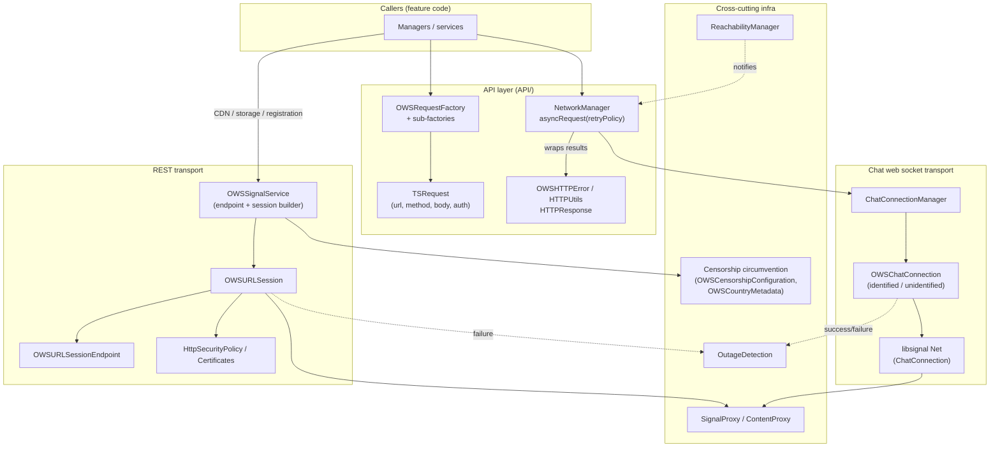
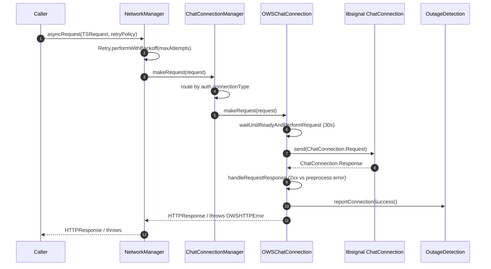

# 01 · Architecture

High-level view of the `SignalServiceKit/Network/` layer and how a request
travels through it.

## Layering

(Confidence: **High** for the edges backed by the files cited below; **Medium**
for the exact caller fan-in, which lives outside this directory.)

## Request shape: `TSRequest`

Every service request is modeled by `TSRequest`
(`SignalServiceKit/Network/API/Requests/TSRequest.swift:9-44`), carrying:

- `url` (usually just a path + query, host resolved later), `method`, `headers`,
  `body` (`.parameters` / `.encodable` / `.data`),
- `timeoutInterval` (default `OWSRequestFactory.textSecureHTTPTimeOut` = **10s**;
  `TSRequest.swift:12`, `OWSRequestFactory.swift:19`),
- `maxResponseSize` (default `.max`; `TSRequest.swift:13`),
- an `auth` discriminator (`TSRequest.swift:97`).

(Confidence: **High**.)

## Two transports, one request type

- `NetworkManager.asyncRequest(_:retryPolicy:)` → `ChatConnectionManager.makeRequest`
  → chat web socket. See [02-chat-websocket.md](02-chat-websocket.md).
  (`SignalServiceKit/Network/API/NetworkManager.swift:170-179`.)
- `OWSSignalService` builds `OWSURLSession`s for REST calls (CDN, storage,
  registration, updates). See [03-rest-stack.md](03-rest-stack.md).
  (`SignalServiceKit/Network/OWSSignalServiceProtocol.swift:55-78`.)

Both transports apply the same auth rules via `TSRequest.applyAuth(to:socketAuth:)`
(`TSRequest.swift:127-146`) and surface the same `HTTPResponse` /
`OWSHTTPError` result types. See [04-api-layer.md](04-api-layer.md).

## End-to-end flow (web socket request)

Citations: `NetworkManager.swift:159-189`; `ChatConnectionManager.swift:184-187`;
`OWSChatConnection.swift` (`makeRequest` `406-424`, `waitUntilReadyAndPerformRequest`
`176-205`, `handleRequestResponse` `431-470`, `makeRequestInternal` for libsignal
`~690-760`). (Confidence: **High**.)
