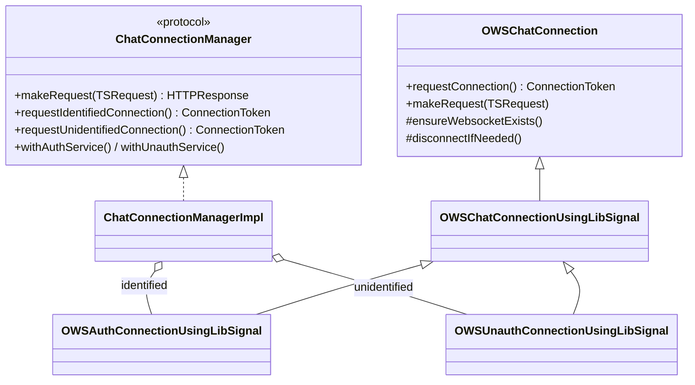
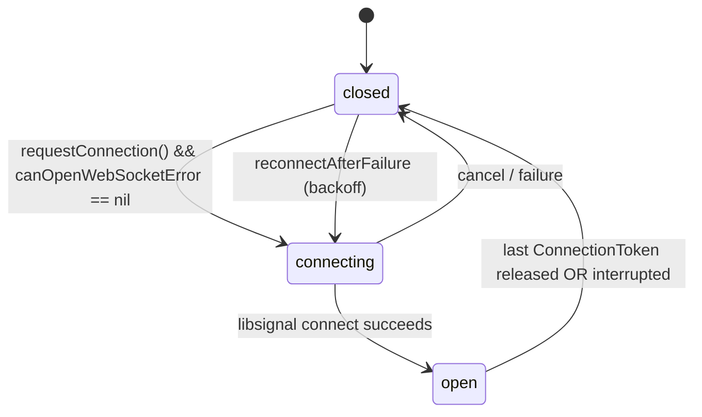

# 02 · Chat Web Socket

Covers the long-lived chat connection and its supporting primitives:

- [`OWSChatConnection.swift`](../../../SignalServiceKit/Network/OWSChatConnection.swift)
- [`ChatConnectionManager.swift`](../../../SignalServiceKit/Network/ChatConnectionManager.swift)
- [`SSKWebSocket.swift`](../../../SignalServiceKit/Network/SSKWebSocket.swift)
- [`WebSocketPromise.swift`](../../../SignalServiceKit/Network/WebSocketPromise.swift)
- [`ConnectionLock.swift`](../../../SignalServiceKit/Network/ConnectionLock.swift)

> **Transport note.** The *primary* chat socket is driven by **libsignal**
> (`OWSChatConnectionUsingLibSignal`), not by `SSKWebSocket`. `SSKWebSocket` is a
> thin `URLSessionWebSocketTask` wrapper used by other call sites (e.g. provisioning
> socket via `WebSocketPromise`). Both are documented here. (Confidence: **High** —
> `OWSChatConnection.swift:484` vs `SSKWebSocket.swift:140-193`.)

## Class hierarchy

Citations: `ChatConnectionManager.swift:9-56` (protocol), `126-200` (impl),
`OWSChatConnection.swift:45` (base), `484` (libsignal base), `~930` (unauth),
`~980` (auth). (Confidence: **High**.)

## Connection types & states

| Type | enum | Source |
| --- | --- | --- |
| Identified (authenticated) | `OWSChatConnectionType.identified` | `OWSChatConnection.swift:9-11` |
| Unidentified (sealed sender / anonymous) | `.unidentified` | `OWSChatConnection.swift:12` |

External state (`OWSChatConnectionState`): `closed` / `connecting` / `open`
(`OWSChatConnection.swift:25-37`). Internal libsignal state
(`ConnectionState`): `.closed(task:)` / `.connecting(token:task:)` / `.open(Connection)`
(`OWSChatConnection.swift:488-520`). State changes post
`OWSChatConnection.chatConnectionStateDidChange` on the main thread
(`OWSChatConnection.swift:46`, `notifyStatusChange` `155-180`). (Confidence: **High**.)

## Keeping the socket open — `ConnectionToken`

The socket is opened on demand via reference-counted tokens. `requestConnection()`
increments a token set; the socket should be open iff the set is non-empty.
Releasing the last token drives a disconnect.

Citations: `ConnectionToken` `OWSChatConnection.swift:235-277`;
`requestConnection` `291-307`; `releaseConnection` `309-318`;
`shouldSocketBeOpen` `329-336`; `_applyDesiredSocketState` `345-355`.
(Confidence: **High**.)

### "Fatal" blockers — `canOpenWebSocketError`

If non-nil, the app will not open a socket and `makeRequest` fails with it.
Checked conditions:

- app expired → `AppExpiredError` (`OWSChatConnection.swift:216-224`)
- clock skew should block → `ClockSkewError` (same)
- (auth connection only) not registered → `NotRegisteredError`
  (`OWSChatConnection.swift` `OWSAuthConnectionUsingLibSignal._canOpenWebSocketError`,
  `~1030`).

Transient errors (no network, 5xx) do **not** use this property.
(Confidence: **High** — doc comment at `OWSChatConnection.swift:200-214`.)

## Making a request

`makeRequest(_:)` wraps `waitUntilReadyAndPerformRequest`, which races three
operations with a **30s** timeout:

1. `waitForOpen()` — socket reaches `.open`,
2. `waitUntilSocketShouldBeClosed()` — gives up if we no longer want a socket,
3. a 30s sleep that throws `CooperativeTimeoutError` → mapped to
   `OWSHTTPError.networkFailure(.genericFailure)`.

On success, `OutageDetection.shared.reportConnectionSuccess()` is called.

Citations: `makeRequest` `OWSChatConnection.swift:406-424`;
`waitUntilReadyAndPerformRequest` `176-205` (30s timeout `177`, success report `203`).
(Confidence: **High**.)

### libsignal request/response mapping

`makeRequestInternal` (`OWSChatConnection.swift:~690-760`):

- applies auth via `request.applyAuth(to:socketAuth:)`,
- serializes body (`.data` as-is; `.encodable`/`.parameters` → JSON with
  `Content-Type: application/json`),
- asserts the `TSRequest.url` has no scheme/host and a relative path,
- builds a `ChatConnection.Request(method:pathAndQuery:headers:body:timeout:)`,
- sends over the open libsignal `Connection`,
- on `connectionTimeoutError`/`requestTimeoutError`, cycles the socket,
- maps the response via `handleRequestResponse`.

`handleRequestResponse` (`OWSChatConnection.swift:431-470`): `200...299` →
`HTTPResponse`; otherwise `HTTPUtils.preprocessMainServiceHTTPError(...)` →
throws `OWSHTTPError`. (Confidence: **High**.)

## Reconnect / backoff

On interruption or connect failure, `reconnectAfterFailure()` schedules a retry:

- first failure → reconnect **immediately** (delay `0`),
- subsequent failures → exponential backoff via
  `OWSOperation.retryIntervalForExponentialBackoff(failureCount:maxAverageBackoff:)`
  with `maxAverageBackoff = socketReconnectDelay = 5s`,
- the consecutive-failure counter resets if the last failure was more than
  `2 * socketReconnectDelay` ago.

Citations: `socketReconnectDelay` `OWSChatConnection.swift:458`;
`reconnectAfterFailure` `~870-915`. (Confidence: **High**.)

## Auth connection specifics (`OWSAuthConnectionUsingLibSignal`)

- **Keepalive:** a low-priority task sends `GET /v1/keepalive` **~30s** after each
  previous keepalive *response*; honors rate-limit `retryAfter`; keeps looping
  until disconnected. (`makeKeepaliveTask` `OWSChatConnection.swift:~1130-1175`.)
- **Cross-process lock:** acquires a `ConnectionLock` before connecting so that
  only one app context holds the identified connection at a time; interruption
  cycles the socket. (`connectChatService` `~1080`, `acquireConnectionLock`
  `~1105`.)
- **Incoming envelopes:** `chatConnection(_:didReceiveIncomingMessage:...)`
  enqueues into `MessageProcessor` with `envelopeSource: .websocketIdentified`
  and calls `sendAck()` after enqueue. (`OWSChatConnection.swift:~1240-1260`.)
- **Alerts:** `chatConnection(_:didReceiveAlerts:)` handles the
  `idle-primary-device` alert (`AlertType`, `OWSChatConnection.swift:479-481`,
  handler `~1205-1235`).
- **Server timestamp:** forwarded to `ClockSkewManager.serverDidReportTimestamp`.
- **Queue empty:** `chatConnectionDidReceiveQueueEmpty` flushes the enqueue queue
  then flips `hasEmptiedInitialQueue`. (`~1265-1290`.)
- **Receive stories:** connects with `receiveStories: StoryManager.areStoriesEnabled`
  (`connectChatService`, `~1095`).

(Confidence: **High** for behavior; **Low** for exact `MessageProcessor` /
`StoryManager` semantics defined elsewhere.)

### Unauth connection (`OWSUnauthConnectionUsingLibSignal`)

Connects via `libsignalNet.connectUnauthenticatedChat(languages:)` using
`HttpHeaders.topPreferredLanguages()` and starts a `ConnectionEventsListener`
(`OWSChatConnection.swift:~935-960`). (Confidence: **High**.)

## `ChatConnectionManagerImpl`

Owns one identified + one unidentified connection and routes:

- `makeRequest` picks the connection by `request.auth.connectionType`
  (identified vs unidentified; `registration` auth **throws** — those must go via
  REST). (`ChatConnectionManager.swift:184-187`, `TSRequest.swift:77-91`.)
- `withAuthService` / `withUnauthService` expose libsignal "services"
  (e.g. key transparency) over the live connection
  (`ChatConnectionManager.swift:181-224`).
- `requestConnections()` opens both at once (`ChatConnectionManager.swift:58-64`).

A `ChatConnectionManagerMock` exists for tests
(`ChatConnectionManager.swift:230-305`, `#if TESTABLE_BUILD`). (Confidence: **High**.)

## `SSKWebSocket` (URLSession-backed socket)

`SSKWebSocketNative` wraps a `URLSessionWebSocketTask`
(`SSKWebSocket.swift:140-193`). Key points:

- State: `connecting` → `open` → `disconnected` (`SSKWebSocket.swift:9-27`,
  `state` `193-205`).
- Built from a `WebSocketRequest` which produces a **`wss`** request via the
  endpoint (`overrideUrlScheme: "wss"`; `SSKWebSocket.swift:75-105`).
- Only **binary** frames are expected; string frames `owsFailDebug`
  (`SSKWebSocket.swift:263-271`).
- Errors surface as `WebSocketError.httpError(statusCode:retryAfter:)` or
  `.closeError(statusCode:closeReason:)`; `normalClosure = 1000`
  (`SSKWebSocket.swift:56-63`).
- `WebSocketFactoryNative` builds real sockets; `WebSocketFactoryMock` fails
  (`SSKWebSocket.swift:118-135`).
- Because `URLSessionWebSocketTask` only honors proxies when started with a URL
  (not a `URLRequest`), header fields are copied onto
  `configuration.httpAdditionalHeaders` (`SSKWebSocket.swift:160-170`).

(Confidence: **High**.)

## `WebSocketPromise`

A Promise adapter over `SSKWebSocket` for a **request/response** paradigm
(not full duplex). Errors (connect/send failures, closure) are only observed by
`waitForResponse()`. Callers must invoke `waitForResponse()` sequentially.
Received messages and a terminal `socketError` are buffered and matched to a
pending future. (`WebSocketPromise.swift:28-170`.) (Confidence: **High**.)

## `ConnectionLock`

A cross-process advisory lock implemented with `fcntl` byte-range locks on a file
in the app group container. Used by the identified chat connection so only one
process holds it.

- Priorities (lower = more important): `share = 1`, `main = 2`, `nse = 3`
  (set in `OWSAuthConnectionUsingLibSignal.init`, `OWSChatConnection.swift:~1000-1012`).
- Byte 0 is the connection lock; bytes `1..<priority` signal that a more
  important process wants the lock. More important processes post a Darwin
  notification so less important ones release quickly (`onInterrupt`).
- `lock(onInterrupt:)` is cancellable and polls with backoff during contention
  (`FileLock.lockWithCancellationHandler`, `ConnectionLock.swift:187-205`).

Citations: `ConnectionLock.swift:8-120` (lock protocol), `122-213` (`FileLock`).
(Confidence: **High**.)
