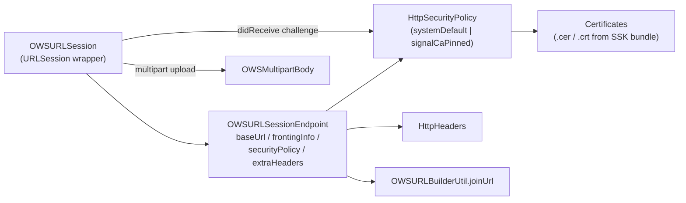

# 03 · REST Stack (`URLSession`)

The one-shot HTTPS transport, used for CDN, storage service, registration,
updates, Giphy, and the reachability wake-up request.

Files:

- [`OWSUrlSession.swift`](../../../SignalServiceKit/Network/OWSUrlSession.swift)
- [`OWSURLSessionProtocol.swift`](../../../SignalServiceKit/Network/OWSURLSessionProtocol.swift)
- [`OWSURLSessionEndpoint.swift`](../../../SignalServiceKit/Network/OWSURLSessionEndpoint.swift)
- [`OWSURLBuilderUtil.swift`](../../../SignalServiceKit/Network/OWSURLBuilderUtil.swift)
- [`OWSMultipart.swift`](../../../SignalServiceKit/Network/OWSMultipart.swift)
- [`HttpHeaders.swift`](../../../SignalServiceKit/Network/HttpHeaders.swift)
- [`HttpSecurityPolicy.swift`](../../../SignalServiceKit/Network/HttpSecurityPolicy.swift)
- [`Certificates.swift`](../../../SignalServiceKit/Network/Certificates.swift)
- [`BaseOWSURLSessionMock.swift`](../../../SignalServiceKit/Network/BaseOWSURLSessionMock.swift)

## Composition

(Confidence: **High**.)

## `HTTPMethod`

`get / post / put / head / patch / delete`, with `methodName` and
`method(for:)` string parsing. (`OWSURLSessionProtocol.swift:9-50`.)

## `OWSURLSessionProtocol`

The transport contract (`OWSURLSessionProtocol.swift:85-166`):

- `performRequest(_ rawRequest: TSRequest) -> HTTPResponse`
- `performUpload(request:requestData:...)` and `performUpload(request:fileUrl:...)`
- `performRequest(request: URLRequest, maxResponseSize:ignoreAppExpiry:)`
- `performDownload(request:...)` and `performDownload(requestUrl:resumeData:...)`
- `webSocketTask(requestUrl:didOpenBlock:didCloseBlock:)`

Config knobs: `require2xxOr3xx` (default **true** — 4xx/5xx become errors),
`allowRedirects`, `customRedirectHandler`
(`OWSURLSessionProtocol.swift:96-100`). Static policies / configs:
`defaultSecurityPolicy`, `signalServiceSecurityPolicy`,
`defaultConfigurationWithCaching`, `defaultConfigurationWithoutCaching`
(`OWSURLSessionProtocol.swift:102-115`).

### Convenience extensions

String-URL helpers for upload/data/download that build the `URLRequest` via
`endpoint.buildRequest` (`OWSURLSessionProtocol.swift:170-247`), and
`performMultiPartUpload(...)` which writes a multipart body to a temp file, sets
`Content-Type: multipart/form-data; boundary=...` + `Content-Length`, forces
`POST`, and uploads the file (`OWSURLSessionProtocol.swift:251-310`).
(Confidence: **High**.)

## `OWSURLSession` (concrete)

(`OWSUrlSession.swift:12`.)

- Uses an **ephemeral** `URLSessionConfiguration`; `defaultConfigurationWithoutCaching`
  additionally nils the cache and uses `reloadIgnoringLocalCacheData`
  (`OWSUrlSession.swift:77-87`).
- `performRequest(_:TSRequest)` (`OWSUrlSession.swift:~340-400`):
  checks `appExpiry` → `AppExpiredError`; `applyAuth(socketAuth: nil)`; builds body
  (data as-is; encodable/non-empty parameters → JSON + `Content-Type`); builds
  request via `endpoint.buildRequest`; sets `timeoutInterval`; delegates to
  `performUpload`. Wraps in `OWSBackgroundTask`.
- 2xx/3xx gate: `handleResult` enforces `require2xxOr3xx`; `>= 400` with a positive
  status → `OWSHTTPError.serviceResponse(...)`; status `0` →
  `OWSHTTPError.networkFailure(.invalidResponseStatus)`
  (`OWSUrlSession.swift:~300-330`).
- **Remote deprecation:** when `shouldHandleRemoteDeprecation`, a response with
  `AppExpiry.appExpiredStatusCode` marks the app expired
  (`handleRemoteDeprecation`, `OWSUrlSession.swift:~332-342`).
- **Max response size:** enforced for data/download tasks; exceeding →
  `OWSURLSessionError.responseTooLarge` (`OWSUrlSession.swift:8-9`, enforced in
  delegate callbacks `~560-640`).
- **TLS pinning:** `urlSession(didReceive challenge:)` evaluates server trust via
  `endpoint.securityPolicy.evaluate(serverTrust:domain:)`; failure cancels the
  challenge (`OWSUrlSession.swift:~470-495`).
- **Proxy:** when `canUseSignalProxy`, `configuration.connectionProxyDictionary` is
  set to `SignalProxy.connectionProxyDictionary` (`OWSUrlSession.swift:~100-112`).
- **HTTP/3:** optional `assumesHTTP3Capable` sets `request.assumesHTTP3Capable`
  to enable QUIC racing (`OWSUrlSession.swift:~250`, `prepareRequest` `~430-455`).
- **TaskState:** `DataTaskState` (also uploads), `DownloadTaskState`,
  `WebSocketTaskState` track progress/response via `AsyncStream` + a deferred
  continuation (`OWSUrlSession.swift:~700-790`).
- **Retain-cycle management:** `URLSessionDelegateBox` holds a strong ref to the
  session only while tasks are outstanding, then drops to weak
  (`OWSUrlSession.swift:~800-900`).
- **Redirects:** gated by `allowRedirects` and optional `customRedirectHandler`
  (`OWSUrlSession.swift:~520-540`).

(Confidence: **High**.)

## `OWSURLSessionEndpoint`

Holds `baseUrl`, optional `frontingInfo` (censorship circumvention),
`extraHeaders`, and `securityPolicy` (`OWSURLSessionEndpoint.swift:9-35`).

- `buildRequest(_:overrideUrlScheme:method:headers:body:)` merges caller headers +
  default headers + `extraHeaders`, disables cookies, and resolves the URL
  (`OWSURLSessionEndpoint.swift:37-59`).
- `buildUrl` applies domain fronting when `frontingInfo` is present (unless the
  URL is already fronted), delegating to `OWSURLBuilderUtil.joinUrl`
  (`OWSURLSessionEndpoint.swift:61-93`).

`OWSUrlFrontingInfo` (`OWSURLSessionProtocol.swift:70-78`) distinguishes fronting
URLs with/without the path prefix and detects already-fronted URLs.
(Confidence: **High**.)

## `OWSURLBuilderUtil`

`joinUrl(urlString:overrideUrlScheme:baseUrl:)` always prefers the `baseUrl`
scheme/host/port, always clears `user`/`password`, joins paths with `/`, and
honors `overrideUrlScheme` (used to turn `https` into `wss`).
(`OWSURLBuilderUtil.swift:9-74`.) (Confidence: **High**.)

## `HttpHeaders`

Case-insensitive header store with conflict resolution
(`HttpHeaders.swift:14-170`).

- `addDefaultHeaders()` adds `User-Agent: Signal-iOS/<ver> iOS/<sysver>` and
  `Accept-Language` (`HttpHeaders.swift:200-240`).
- `topPreferredLanguages()` returns up to **10** RFC4647-valid languages;
  `formatAcceptLanguageHeader` adds `q`-values (`HttpHeaders.swift:171-240`).
- `authHeaderValue(username:password:)` = `Basic <base64(user:pass)>`
  (`HttpHeaders.swift:246-256`).
- Only `retry-after` and `x-signal-timestamp` header values are logged;
  others are logged by key only (`whitelistedLoggedHeaderKeys`,
  `HttpHeaders.swift:270-290`). Good privacy default.
- `retryAfterDate` / `retryAfterTimeInterval` live in the API-layer extension
  (see [04-api-layer.md](04-api-layer.md)).

(Confidence: **High**.)

## `HttpSecurityPolicy` + `Certificates`

- `HttpSecurityPolicy.systemDefault` uses the OS trust store;
  `HttpSecurityPolicy.signalCaPinned` pins `signal-messenger.cer`
  (`HttpSecurityPolicy.swift:9-15`).
- `evaluate(serverTrust:domain:)` sets an SSL policy, optionally replaces the
  trust anchors with the pinned certs, then validates
  (`HttpSecurityPolicy.swift:19-47`).
- `Certificates.load(_:extension:)` reads `.cer`/`.crt` from the SignalServiceKit
  bundle; a missing/invalid cert is fatal (`Certificates.swift:11-39`).
  Domain-fronting pins (`GIAG2`, `GSR2/4`, `GTSR1-4`) are loaded this way — see
  [06-signal-service-censorship.md](06-signal-service-censorship.md).

(Confidence: **High**.)

## `OWSMultipart`

`OWSMultipartBody.write(...)` streams a multipart/form-data body (text parts
first, then one file body part) to an output file, using boundary helpers ported
from AFNetworking. `createMultipartFormBoundary()` produces a random boundary.
(`OWSMultipart.swift:9-205`.) Used by `performMultiPartUpload`. (Confidence: **High**.)

## Test mock

`BaseOWSURLSessionMock` conforms to `OWSURLSessionProtocol` and returns HTTP 200
for every operation (`webSocketTask` is unimplemented). Subclass for custom
behavior. (`BaseOWSURLSessionMock.swift:9-205`, `#if TESTABLE_BUILD`.)
(Confidence: **High**.)
