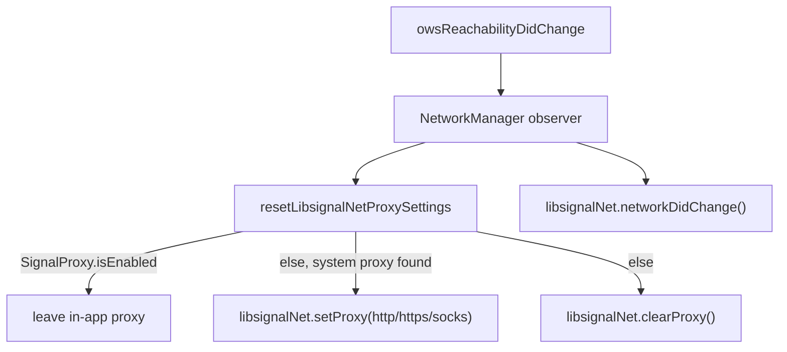
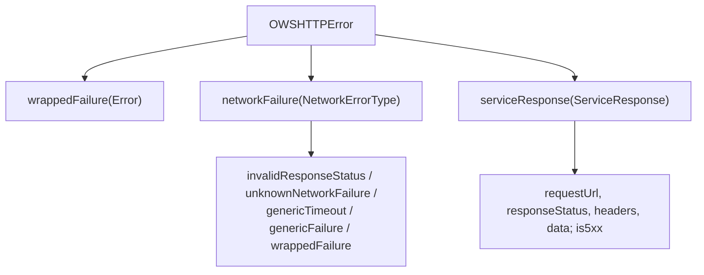
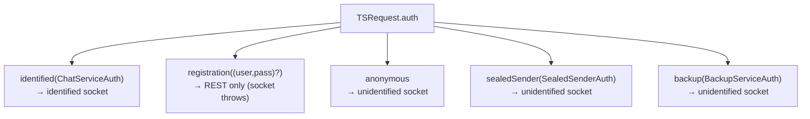

# 04 · API Layer (`API/`)

Request orchestration, request/response types, auth, error handling, request
factories, provisioning, and Giphy.

Files in `API/`:

- [`NetworkManager.swift`](../../../SignalServiceKit/Network/API/NetworkManager.swift)
- [`HTTPUtils.swift`](../../../SignalServiceKit/Network/API/HTTPUtils.swift)
- [`HTTPResponse.swift`](../../../SignalServiceKit/Network/API/HTTPResponse.swift)
- [`OWSHTTPError.swift`](../../../SignalServiceKit/Network/API/OWSHTTPError.swift)
- [`DeviceProvisioningService.swift`](../../../SignalServiceKit/Network/API/DeviceProvisioningService.swift)
- [`DeviceLimitExceededError.swift`](../../../SignalServiceKit/Network/API/DeviceLimitExceededError.swift)
- [`AccountDataReport.swift`](../../../SignalServiceKit/Network/API/AccountDataReport.swift)
- `API/Requests/` (see [05-endpoints.md](05-endpoints.md) for the endpoint catalog)
- `API/Giphy/` ([`GiphyAPI`](../../../SignalServiceKit/Network/API/Giphy/GiphyAPI.swift),
  [`GiphyDownloader`](../../../SignalServiceKit/Network/API/Giphy/GiphyDownloader.swift),
  [`GiphyImageInfo`](../../../SignalServiceKit/Network/API/Giphy/GiphyImageInfo.swift))

## `NetworkManager`

The entry point for service requests over the chat socket.

- `asyncRequest(_:retryPolicy: = .dont)` → `asyncRequestImpl` →
  `Retry.performWithBackoff(maxAttempts:isRetryable:block:)` →
  `chatConnectionManager.makeRequest` (`NetworkManager.swift:16-23`, `159-189`).
- Cancellation: a `URLError.cancelled` wrapped failure is rethrown as a Swift
  cancellation (`NetworkManager.swift:181-188`).

### `RetryPolicy`

| Policy | `maxAttempts` | retries on | Source |
| --- | --- | --- | --- |
| `.dont` | 1 | — | `NetworkManager.swift:128-131` |
| `.hopefullyRecoverable` | 3 | 5xx responses **and** network failure/timeout | `NetworkManager.swift:133-136` |

`RetryOn` is an `OptionSet` with `.fiveXXResponse` and `.networkFailureOrTimeout`
(`NetworkManager.swift:103-124`). Retryability is decided by
`error.is5xxServiceResponse` / `error.isNetworkFailureOrTimeout`
(`NetworkManager.swift:160-177`). (Confidence: **High**.)

### libsignal proxy wiring

`NetworkManager` resets `libsignalNet` proxy settings on init and on each
`SSKReachability.owsReachabilityDidChange` (also calling
`libsignalNet.networkDidChange()`). If `SignalProxy.isEnabled`, in-app proxy
settings are left alone; otherwise the **system** proxy
(`ProxyConfig.fromCFNetwork()`, reading `http`/`https`/`socks` via CFNetwork) is
applied or cleared. (`NetworkManager.swift:38-100`, `191-258`.) (Confidence: **High**.)

### Test doubles

`OWSFakeNetworkManager` never resolves; `MockNetworkManager` plays queued
handlers (`NetworkManager.swift:262-287`, `#if TESTABLE_BUILD`). (Confidence: **High**.)

## Result + error types

### `HTTPResponse`

Struct with `requestUrl`, `responseStatusCode`, `headers`, `responseBodyData`,
plus parsing helpers (`responseBodyJson/Dict/ParamParser/String`) and
`asError()` → `serviceResponse`. (`HTTPResponse.swift:5-78`.) (Confidence: **High**.)

### `OWSHTTPError`

- `isRetryableProvider`: `wrappedFailure` → true, `networkFailure` → true,
  `serviceResponse` → `is5xx` (`OWSHTTPError.swift:112-121`).
- `responseStatusCode` is `0` for non-service errors (`OWSHTTPError.swift:125-132`).
- Status `429` yields a localized rate-limit description
  (`OWSHTTPError.swift:85-99`).

(Confidence: **High**.)

### `HTTPUtils`

- `preprocessMainServiceHTTPError(...)`: status `0` →
  `networkFailure(.invalidResponseStatus)`, else `serviceResponse`; then
  `applyHTTPError` (`HTTPUtils.swift:34-55`).
- `applyHTTPError`: on network failure/timeout calls
  `OutageDetection.shared.reportConnectionFailure()`; on
  `appExpiredStatusCode` marks the app expired (`HTTPUtils.swift:57-69`).
- `retryDelayNanoSeconds(_:defaultRetryTime:15)` uses `Retry-After` if present
  (`HTTPUtils.swift:71-73`).
- `Error` classification helpers: `isNetworkFailure`, `isTimeout`,
  `isNetworkFailureOrTimeout`, `is5xxServiceResponse`, `isCancellation`,
  `httpStatusCode`, `httpRetryAfterDate`, `httpResponseData`,
  `httpResponseHeaders` (`HTTPUtils.swift:78-205`).
- `HttpHeaders.retryAfterDate` parses HTTP-date / ISO8601 / seconds from
  `Retry-After` (`HTTPUtils.swift:258-300`).

(Confidence: **High**.)

## Auth model

- `applyAuth(to:socketAuth:)` sets `Basic` auth (identified/registration) or
  sealed-sender headers (`Unidentified-Access-Key`, `Group-Send-Token`) or
  backup auth (`TSRequest.swift:127-175`).
- `ChatServiceAuth`: `implicit` (uses `TSAccountManager` credentials) or
  `explicit(username,password)`; `explicit(aci:deviceId:password:)` builds a
  username of `aci` (primary) or `aci.deviceId` (linked)
  (`ChatServiceAuth.swift:11-70`).
- `AuthedAccount`: `implicit` or `explicit(aci,phoneNumber,deviceId,authPassword)`;
  `chatServiceAuth` bridges to the above (`AuthedAccount.swift:9-90`).

(Confidence: **High**.)

## Device provisioning

`DeviceProvisioningServiceImpl` (`DeviceProvisioningService.swift:34-73`):

- `requestDeviceProvisioningCode()` → `GET v1/devices/provisioning/code`, decodes
  `DeviceProvisioningCodeResponse { verificationCode, tokenIdentifier }`; maps
  `411` → `DeviceLimitExceededError`.
- `provisionDevice(messageBody:ephemeralDeviceId:)` →
  `PUT v1/provisioning/{ephemeralDeviceId}` with `{ "body": base64 }`.

`DeviceLimitExceededError` is a localized error for HTTP `411`
(`DeviceLimitExceededError.swift:9-29`). `AccountDataReport` parses the account
data report JSON + its `text` field (`AccountDataReport.swift:9-41`).
(Confidence: **High**.)

## Giphy

- `GiphyAPI` uses its **own** `OWSURLSession` to `https://api.giphy.com/` with
  `ContentProxy` (no caching, default security policy). `trending()` →
  `GET /v1/gifs/trending`; `search(query:)` → `GET /v1/gifs/search?q=...`. Common
  query params: `api_key` (hard-coded Signal iOS key), `limit=100`, a `fields`
  filter. Responses decode to `[GiphyImageInfo]`. **No app auth.**
  (`GiphyAPI.swift:9-170`.)
- `GiphyDownloader` is a `ProxiedContentDownloader` subclass with folder `"GIFs"`
  (`GiphyDownloader.swift:9-14`) — see [07-proxy.md](07-proxy.md).
- `GiphyImageInfo` holds `giphyId`, `fullSize`/`preview`
  `ProxiedContentAssetDescription`s (mp4), and aspect ratio; `GiphyError` carries
  localized messages (`GiphyImageInfo.swift:9-42`).

(Confidence: **High**.)

## Account attributes

- `AccountAttributes` is the `Codable` payload (`fetchesMessages`,
  `registrationId`, `pniRegistrationId`, `unidentifiedAccessKey`,
  `registrationLock`, `recoveryPassword`, `name`, `discoverableByPhoneNumber`,
  `capabilities`). `Capabilities`: `transfer`, `storage`, `spqr`,
  `attachmentBackfill`, `usernameChangeSyncMessage`
  (`AccountAttributes.swift:9-150`).
- `AccountAttributesGenerator.generateForPrimary(...)` assembles it from local
  stores (`AccountAttributesGenerator.swift:30-90`).
- `AccountAttributesUpdaterImpl` (`AccountAttributesUpdaterImpl.swift:7-230`) runs
  via `Cron` and triggers an update when: an explicit request token is set, the
  periodic interval (**14 days**) elapses, or capabilities changed. It then
  best-effort fetches the local profile and, for a registered primary, sends a
  configuration sync message. Primary → `PUT v1/accounts/attributes`; linked →
  `PUT v1/devices/capabilities`.

(Confidence: **High**.)
