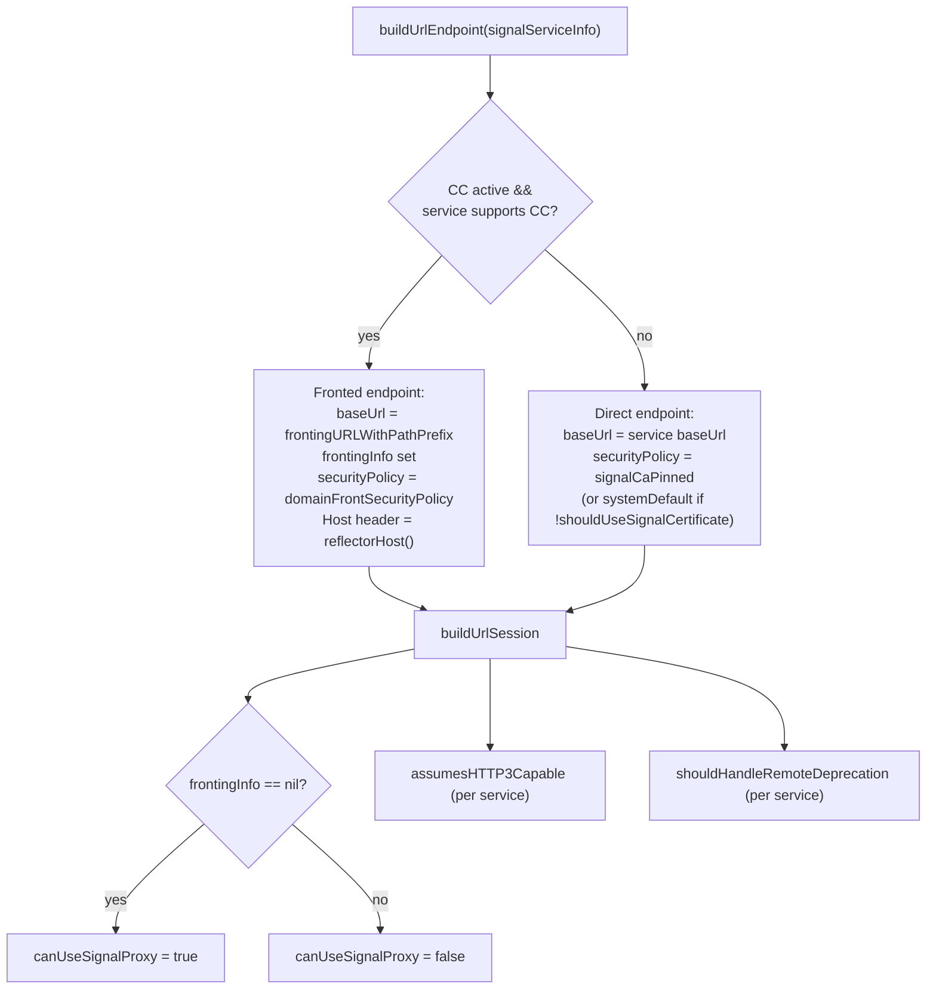
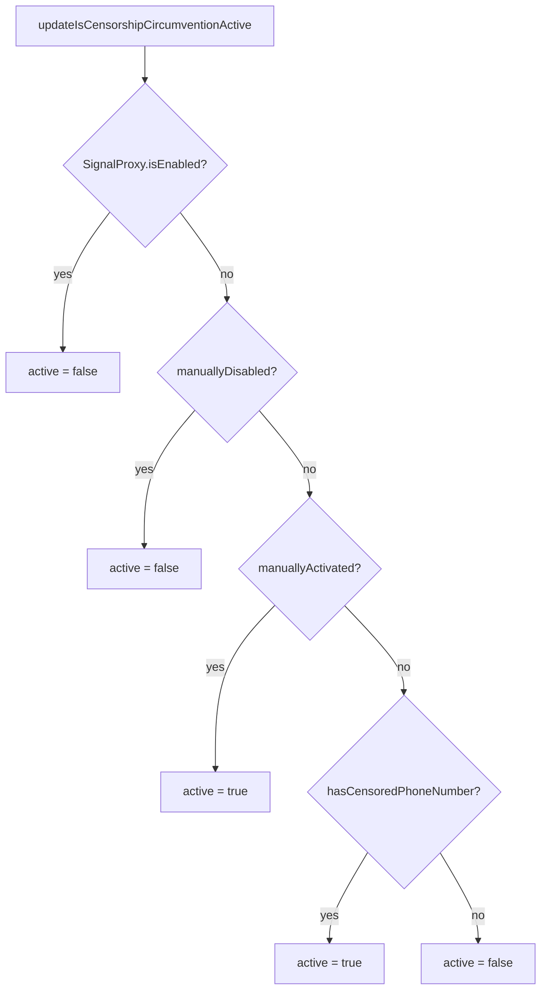

# 06 · Signal Service & Censorship Circumvention

Files:

- [`OWSSignalService.swift`](../../../SignalServiceKit/Network/OWSSignalService.swift)
- [`OWSSignalServiceProtocol.swift`](../../../SignalServiceKit/Network/OWSSignalServiceProtocol.swift)
- [`OWSSignalServiceMock.swift`](../../../SignalServiceKit/Network/OWSSignalServiceMock.swift)
- [`OWSCensorshipConfiguration.swift`](../../../SignalServiceKit/Network/OWSCensorshipConfiguration.swift)
- [`OWSCountryMetadata.swift`](../../../SignalServiceKit/Network/OWSCountryMetadata.swift)

`OWSSignalService` is the factory for REST `OWSURLSession`s and the owner of
censorship-circumvention (CC) state.

## Service types

`SignalServiceType` + `SignalServiceInfo` describe each backend
(`OWSSignalServiceProtocol.swift:34-170`):

| Type | assumesHTTP3 | CC supported | Signal cert | handles remote deprecation |
| --- | --- | --- | --- | --- |
| `mainSignalService` | no | yes | yes | yes |
| `storageService` | no | yes | yes | yes |
| `updates` | yes | no | no | no |
| `updates2` | yes | no | yes | no |
| `svr2` | no | yes | yes | no |

Convenience builders: `urlSessionForMainSignalService()`,
`urlSessionForStorageService()`, `urlSessionForUpdates()`,
`urlSessionForUpdates2()` (`OWSSignalServiceProtocol.swift:48-78`).
(Confidence: **High**; base URLs come from `TSConstants` — **Low** on their values.)

## Endpoint / session construction

Citations: `buildUrlEndpoint` `OWSSignalService.swift:132-200`; `buildUrlSession`
`202-240`. Note that when domain fronting is used, the Signal proxy is **not**
used for that session (`canUseSignalProxy = endpoint.frontingInfo == nil`,
`OWSSignalService.swift:~225`). (Confidence: **High**.)

## Censorship-circumvention state machine

`isCensorshipCircumventionActive` is recomputed by
`updateIsCensorshipCircumventionActive()` with this precedence:

When the value flips, `libsignalNet.setCensorshipCircumventionEnabled(...)` is
called and `.isCensorshipCircumventionActiveDidChange` is posted (which causes
chat connections to cycle — see [02-chat-websocket.md](02-chat-websocket.md)).

Manual flags and the manual country code are persisted in a `KeyValueStore`.
`hasCensoredPhoneNumber` is derived from the local E164 via
`OWSCensorshipConfiguration.isCensored(e164:)` and refreshed on registration /
local-number / proxy-ready changes.

Citations: `isCensorshipCircumventionActive` didSet `OWSSignalService.swift:17-33`;
`updateIsCensorshipCircumventionActive` `~355-375`; persistence `~290-350`;
observers `~265-285`. (Confidence: **High**.)

## CDN sessions

`sharedUrlSessionForCdn(cdnNumber:)` returns a cached session per
`(cdnNumber, CC params)` via a `CDNSessionCache` actor:

- CDN `0`/`2`/`3` map to `TSConstants` CDN URLs + CC path prefixes (unknown →
  fallback to CDN 2),
- request timeout **600s**, `assumesHTTP3Capable = true` (QUIC racing from the
  first request, since ephemeral sessions don't persist Alt-Svc),
- on any **network failure** the cache entry is invalidated so a fresh session
  (and re-randomized SNI) is used next time,
- the cache is fully reset when the Signal proxy becomes ready/not-ready
  (`isSignalProxyReadyDidChange`).

Citations: `OWSSignalService.swift:242-345` (CDN cache + builder),
`isSignalProxyReadyDidChange` `~285-300`. (Confidence: **High**.)

## `OWSCensorshipConfiguration` + domain fronting

- `OWSFrontingHost` enumerates fronting providers: `fastly`, `googleEgypt`,
  `googleUae`, `googleOman`, `googlePakistan`, `googleQatar`, `googleUzbekistan`,
  `googleVenezuela`, `default` (`OWSCensorshipConfiguration.swift:7-18`).
- Each host provides a `securityPolicy`, a reflector `host`
  (`censorshipGReflectorHost` / `censorshipFReflectorHost` from `TSConstants`),
  and a `randomSniHeader()` chosen from a per-country SNI list
  (`OWSCensorshipConfiguration.swift:20-110`).
- `PinningPolicy.google` pins `GIAG2`, `GSR2`, `GSR4`, `GTSR1-4` `.crt` certs
  (loaded via `Certificates`); `PinningPolicy.fastly` uses `systemDefault`
  (`OWSCensorshipConfiguration.swift:~245-265`).
- `censorshipConfiguration(e164:)` / `censorshipConfiguration(countryCode:)`
  resolve a config (falling back to `defaultConfiguration`, which uses the Google
  default host). `isCensored(e164:)` checks the hard-coded calling-code map
  (`OWSCensorshipConfiguration.swift:120-225`).

### Hard-coded censored calling codes

(`OWSCensorshipConfiguration.swift:~195-215`.)

| Calling code | Country |
| --- | --- |
| `+20` | Egypt (EG) |
| `+968` | Oman (OM) |
| `+974` | Qatar (QA) |
| `+971` | UAE (AE) |
| `+53` | Cuba (CU) |
| `+58` | Venezuela (VE) |
| `+998` | Uzbekistan (UZ) |
| `+92` | Pakistan (PK) |

(Confidence: **High**.)

## `OWSCountryMetadata`

`OWSCountryMetadata { name, frontingDomain: OWSFrontingHost?, countryCode,
localizedCountryName }`. `allCountryMetadatas` is the full ISO country list;
`countryMetadata(countryCode:)` looks up by code. Censored countries map to a
`frontingDomain` (e.g. `AE → .googleUae`, `CU → .fastly`); the rest are `nil`.
`OWSCensorshipConfiguration.censorshipConfiguration(countryCode:)` uses this to
pick the fronting host. (`OWSCountryMetadata.swift:8-80`, full list continues to
EOF.) (Confidence: **High**.)

## Mock

`OWSSignalServiceMock` provides injectable endpoint/session builders and returns
`BaseOWSURLSessionMock`s; CC flags are plain stored properties
(`OWSSignalServiceMock.swift:9-90`, `#if TESTABLE_BUILD`). (Confidence: **High**.)
