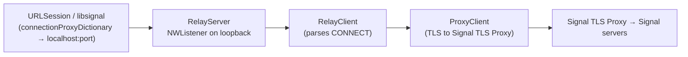

# 07 · Proxy Support

Two unrelated proxy mechanisms plus a generic proxied content downloader.

Files:

- [`SignalProxy/SignalProxy.swift`](../../../SignalServiceKit/Network/SignalProxy/SignalProxy.swift)
- [`SignalProxy/SignalProxy+RelayServer.swift`](../../../SignalServiceKit/Network/SignalProxy/SignalProxy+RelayServer.swift)
- [`SignalProxy/SignalProxy+RelayClient.swift`](../../../SignalServiceKit/Network/SignalProxy/SignalProxy+RelayClient.swift)
- [`SignalProxy/SignalProxy+ProxyClient.swift`](../../../SignalServiceKit/Network/SignalProxy/SignalProxy+ProxyClient.swift)
- [`ContentProxy.swift`](../../../SignalServiceKit/Network/ContentProxy.swift)
- [`ProxiedContentDownloader.swift`](../../../SignalServiceKit/Network/ProxiedContentDownloader.swift)

## SignalProxy — user-configured TLS proxy

A user can paste a `signal.tube` link; the fragment is the proxy host. When
enabled, Signal runs a **local HTTP CONNECT proxy** on loopback and relays
traffic to the configured Signal TLS Proxy, and also tells `libsignal` about it.

### `SignalProxy` (facade)

- `isEnabled = useProxy && host != nil`;
  `isEnabledAndReady = isEnabled && relayServer.isReady`;
  `connectionProxyDictionary` comes from the relay server
  (`SignalProxy.swift:14-26`).
- `setProxyHost(host:useProxy:transaction:)` persists host + flag to a
  `KeyValueStore`, then on commit updates state, (re)starts the relay, updates
  libsignal, and posts `.signalProxyConfigDidChange`
  (`SignalProxy.swift:36-56`).
- Validation: `isValidProxyLink` requires `signal.tube` host, `https`/`sgnl`
  scheme, no user/pass/port, and a valid fragment; `isValidProxyFragment`
  enforces ≥2 non-empty domain labels, ≤2048 octets, no path/query, etc.
  (A `UNENCRYPTED_FOR_TESTING@` user is only allowed under internal settings.)
  (`SignalProxy.swift:71-150`.)
- `updateLibSignalProxy()` calls `libsignalNet.setProxy(host:port:)` when enabled
  (poisoning the Net instance on failure) or `resetLibsignalNetProxySettings()`
  when disabled (`SignalProxy.swift:160-195`).
- The **NSE manages the relay itself**, so `ensureProxyState` is a no-op there
  (`SignalProxy.swift:152-170`).

(Confidence: **High**.)

### `RelayServer`

- An `NWListener` bound to the **loopback** interface; `connectionProxyDictionary`
  advertises `localhost:<port>` for HTTP and HTTPS once `isReady`
  (`SignalProxy+RelayServer.swift:19-35`).
- `isReady` posts `.isSignalProxyReadyDidChange` (observed by `OWSSignalService`
  and chat connections) (`SignalProxy+RelayServer.swift:12-18`).
- Lifecycle guarded by an `OWSBackgroundTask`; `restartIfNeeded` uses exponential
  backoff capped at **15s** via `OWSOperation.retryIntervalForExponentialBackoff`
  (`SignalProxy+RelayServer.swift:40-150`).

(Confidence: **High**.)

### `RelayClient` → `ProxyClient`

- `RelayClient` is created per inbound connection, must see an HTTP `CONNECT`
  request, then bridges bytes to a `ProxyClient`
  (`SignalProxy+RelayClient.swift:11-130`).
- `ProxyClient` connects to the Signal TLS Proxy. `parseHost("host:port")`
  defaults the port to **443**. Normally uses **TLS**; the special
  `UNENCRYPTED_FOR_TESTING@host` form connects over plain **TCP** (outer layer
  only; inner connection to Signal still uses TLS). On ready it writes
  `HTTP/1.1 200` back to the relay client; on failure `HTTP/1.1 503`
  (`SignalProxy+ProxyClient.swift:11-140`).

(Confidence: **High**.)

## ContentProxy — fixed content proxy

A simpler mechanism for third-party content (Giphy, link previews). Routes
through `contentproxy.signal.org:443` as an HTTP/HTTPS proxy and pads requests to
obscure size.

- `sessionConfiguration()` sets `connectionProxyDictionary` for
  `contentproxy.signal.org:443` (`ContentProxy.swift:9-22`).
- `configureProxiedRequest(request:)` sets the Signal `User-Agent`, calls
  `padRequestSize`, and only succeeds for `https` URLs
  (`ContentProxy.swift:24-35`).
- `padRequestSize` adds an `X-SignalPadding` header of random length 1–64
  (`ContentProxy.swift:37-48`).

(Confidence: **High**.)

## ProxiedContentDownloader

Generic (segmented, cached) downloader for proxied content; `GiphyDownloader`
subclasses it (see [04-api-layer.md](04-api-layer.md)).

- Uses a `URLSession` built from `ContentProxy.sessionConfiguration()` with no
  caching and up to 10 connections per host
  (`ProxiedContentDownloader.swift:443-470`).
- In-memory `LRUCache<NSURL, ProxiedContentAsset>` (max 100 entries) plus an
  on-disk download folder (`downloadFolderName`)
  (`ProxiedContentDownloader.swift:432-490`).
- `requestAsset(assetDescription:priority:)` returns a cached asset synchronously
  on hit, otherwise enqueues a `ProxiedContentAssetRequest` processed
  asynchronously; `cancelAllRequests()` cancels the queue
  (`ProxiedContentDownloader.swift:487-560`).
- Supporting types: `ProxiedContentRequestPriority` (`low`/`high`),
  `ProxiedContentAssetDescription` (`url`, `fileExtension`),
  `ProxiedContentAssetSegment(State)`, `ProxiedContentAsset`,
  `ProxiedContentAssetRequest(State)` (`ProxiedContentDownloader.swift:9-428`).

(Confidence: **High** for structure/configuration; **Medium** for the full
segmented-download/merge state machine, which was reviewed at the type level and
entry points rather than line-by-line.)
