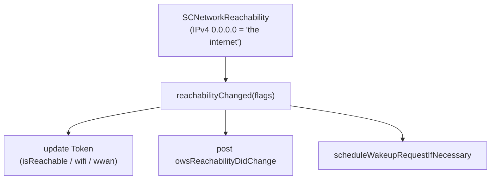
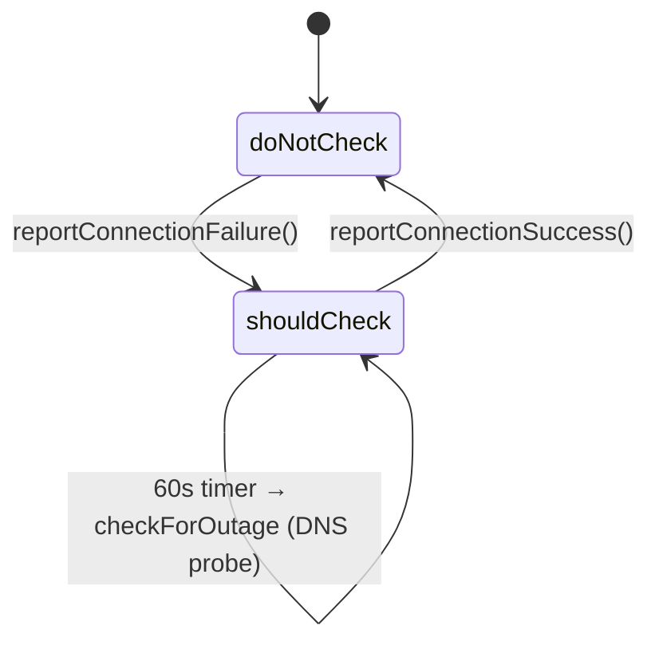
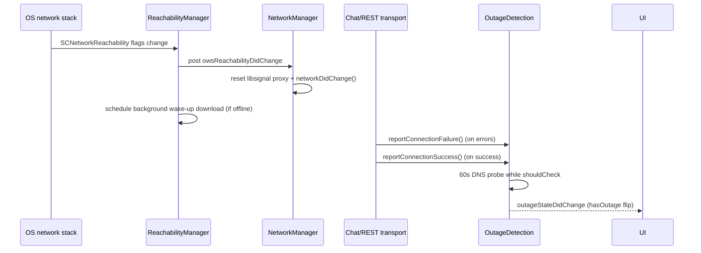

# 08 · Reachability & Outage Detection

Files:

- [`ReachabilityManager.swift`](../../../SignalServiceKit/Network/ReachabilityManager.swift)
- [`OutageDetection.swift`](../../../SignalServiceKit/Network/OutageDetection.swift)
- [`NetworkInterfaceSet.swift`](../../../SignalServiceKit/Network/NetworkInterfaceSet.swift)

## `NetworkInterfaceSet`

A small `OptionSet` model of connectivity:

- `NetworkInterface` enum: `cellular`, `wifi` (`NetworkInterfaceSet.swift:7-16`).
- `NetworkInterfaceSet`: `none`, `cellular`, `wifi`, `wifiAndCellular`, plus an
  `inverted` computed set (`NetworkInterfaceSet.swift:18-37`).

Used by `SSKReachabilityManager.isReachable(with:)` to check whether the current
connection satisfies a required interface set. (Confidence: **High**.)

## `ReachabilityManager`

- `SSKReachability.owsReachabilityDidChange` is the notification other components
  observe (e.g. `NetworkManager` resets libsignal proxy + calls
  `networkDidChange()` — see [04-api-layer.md](04-api-layer.md))
  (`ReachabilityManager.swift:16-19`).
- `SSKReachabilityManagerImpl` creates an `SCNetworkReachability` for IPv4
  `0.0.0.0` ("the IPv4 internet in general") and installs a callback on the main
  queue (`ReachabilityManager.swift:62-170`).
- `isReachable(via:)` reports `.any` / `.wifi` / `.cellular` from a cached
  `Token` derived from `SCNetworkReachabilityFlags`
  (`ReachabilityManager.swift:96-150`). Transient `[connectionRequired,
  transientConnection]` combos are treated as *not* reachable (airplane-mode
  toggle guard).
- **Wake-up request:** when connectivity is lost, it starts a **background**
  `OWSURLSession` (`.background(withIdentifier:)`, pinned to the Signal CA) that
  performs a download of `TSConstants.mainServiceURL` so the OS wakes the app
  when the network returns (`ReachabilityManager.swift:70-78`, `172-195`).
- `MockSSKReachabilityManager` is available for tests
  (`ReachabilityManager.swift:~210-235`, `#if TESTABLE_BUILD`).

(Confidence: **High**; `TSConstants.mainServiceURL` value is **Low**.)

## `OutageDetection`

Detects *confirmed* Signal service outages (distinct from local connectivity).

- Shared singleton; posts `OutageDetection.outageStateDidChange` when
  `hasOutage` flips (`OutageDetection.swift:9-55`).
- `reportConnectionFailure()` moves state to `shouldCheck`;
  `reportConnectionSuccess()` moves back to `doNotCheck`
  (`OutageDetection.swift:~160-175`). These are called from the chat connection
  and `HTTPUtils.applyHTTPError` (see [02-chat-websocket.md](02-chat-websocket.md),
  [04-api-layer.md](04-api-layer.md)).
- The check resolves `uptime.signal.org`: `127.0.0.1` = healthy, `127.0.0.2` =
  outage; other addresses are logged as unexpected
  (`OutageDetection.swift:60-110`).
- A **60s** repeating timer (matching the DNS record TTL) runs the probe while in
  `shouldCheck`, and only in the **main app** when active
  (`OutageDetection.swift:120-155`).

(Confidence: **High**.)

## How the pieces interact

(Confidence: **High** for the edges cited above; **Medium** for UI observers,
which live outside this directory.)
