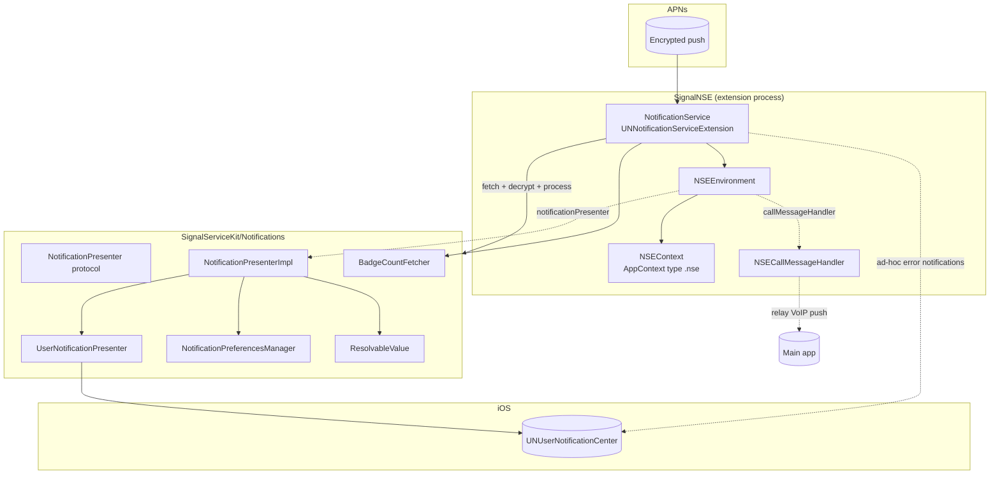

# Signal iOS — Notifications Subsystem

This documentation set covers the first-party source that builds, schedules,
displays, cancels, and badges Signal iOS's **local system notifications**, plus
the **Notification Service Extension (NSE)** that wakes in the background to
fetch and decrypt pushed messages before they are presented. It spans two
targets:

| Tree | Role |
| --- | --- |
| `SignalServiceKit/Notifications/` | Framework-level notification logic shared by the main app and the NSE: the `NotificationPresenter` protocol + production impl, the `UserNotificationPresenter` (the `UNUserNotificationCenter` wrapper), notification preferences, badge-count computation, and the `ResolvableValue` async-name primitive. (~3.2k LOC) |
| `SignalNSE/` | The App Extension target: the `UNNotificationServiceExtension` entry point, process-wide environment/app-context setup, and the NSE-specific call-message handler. |

> **Confidence labels.** Every documented claim carries a confidence label:
> - **[High]** — directly read from the cited source; behavior is explicit in code.
> - **[Medium]** — inferred from strong local evidence (naming, call sites,
>   signatures, comments) but not every collaborator was traced in-tree.
> - **[Low]** — plausible inference not fully verified in-source.
>
> Where the code gives no evidence of *why* something is done, the text says
> **"intent undetermined — no evidence in source."**
>
> **Citations** use `File.swift:line` for files under
> `SignalServiceKit/Notifications/`, and `SignalNSE/<file>:line` for files under
> the NSE target. Line numbers reflect the tree at authoring time and may drift;
> use the cited symbol name to relocate code.

## Document map

| Doc | Covers |
| --- | --- |
| [notification-presenter.md](./notification-presenter.md) | The `NotificationPresenter` protocol, `NotificationPresenterImpl`, the `UserNotificationPresenter` `UNUserNotificationCenter` wrapper, how each notification is built, titled, sounded, scheduled, suppressed, and cancelled; `ResolvableValue` async name resolution; the `AppNotificationCategory`/`AppNotificationAction`/`AppNotificationUserInfo` model. |
| [preferences.md](./preferences.md) | `NotificationPreferencesManager`: preview type, sounds, reactions, badge-count type, per-thread "while muted" overrides, and reset. |
| [badge-count.md](./badge-count.md) | `BadgeCountFetcher` / `BadgeCount`: how the app-icon badge number is computed from unread chats and missed calls. |
| [nse.md](./nse.md) | The Notification Service Extension: lifecycle, `NSEEnvironment`/`NSEContext` setup, the message fetch/decrypt path, `NSECallMessageHandler`, error/edge-case notifications, and logging. |

## High-level architecture

[High] The main app and the NSE both construct a `NotificationPresenterImpl`
(`SignalServiceKit/Notifications/NotificationPresenterImpl.swift:277`), which
delegates all `UNUserNotificationCenter` interaction to a single
`UserNotificationPresenter` (`.../NotificationPresenterImpl.swift:278`,
`.../UserNotificationsPresenter.swift:72`). [High] The NSE wires its own
`NSECallMessageHandler` and a `NotificationPresenterImpl` into the shared
dependency graph during database setup (`SignalNSE/NSEEnvironment.swift:63-73`).

## First-party file inventory

| File | Doc |
| --- | --- |
| `SignalServiceKit/Notifications/NotificationPresenter.swift` | [notification-presenter.md](./notification-presenter.md) |
| `SignalServiceKit/Notifications/NotificationPresenterImpl.swift` | [notification-presenter.md](./notification-presenter.md) |
| `SignalServiceKit/Notifications/NoopNotificationPresenterImpl.swift` | [notification-presenter.md](./notification-presenter.md) |
| `SignalServiceKit/Notifications/UserNotificationsPresenter.swift` | [notification-presenter.md](./notification-presenter.md) |
| `SignalServiceKit/Notifications/ResolvableValue.swift` | [notification-presenter.md](./notification-presenter.md) |
| `SignalServiceKit/Notifications/NotificationPreferencesManager.swift` | [preferences.md](./preferences.md) |
| `SignalServiceKit/Notifications/BadgeCountFetcher.swift` | [badge-count.md](./badge-count.md) |
| `SignalNSE/NotificationService.swift` | [nse.md](./nse.md) |
| `SignalNSE/NSEEnvironment.swift` | [nse.md](./nse.md) |
| `SignalNSE/NSEContext.swift` | [nse.md](./nse.md) |
| `SignalNSE/NSECallMessageHandler.swift` | [nse.md](./nse.md) |
| `SignalNSE/NSELogger.swift` | [nse.md](./nse.md) |

## Feature flags that affect this subsystem

| Flag | Definition | Effect |
| --- | --- | --- |
| `BuildFlags.improvedNotifications` | `build <= .dev` (`SignalServiceKit/Environment/BuildFlags.swift:84`) [High] | Gates the new per-thread "notify-while-muted" preferences and `BadgeCountType` selection. When off, legacy per-thread flags / `.unreadMessages` are used. Comment: *"Don't enable until Storage Service is integrated"* (`BuildFlags.swift:83`). [High] |
| `DebugFlags.testPopulationErrorAlerts` | `build <= .beta` (`BuildFlags.swift:141`) [High] | Gates whether `.internalError` / `.listMediaIntegrityCheckFailure` notifications are shown at all (`UserNotificationsPresenter.swift:239`, `NotificationPresenterImpl.swift` `notifyTestPopulation`). [High] |
| `DebugFlags.internalLogging` | `build <= .internal` (`BuildFlags.swift:137`) [High] | Enables the periodic NSE memory-usage log timer (`SignalNSE/NotificationService.swift:47`). [High] |
