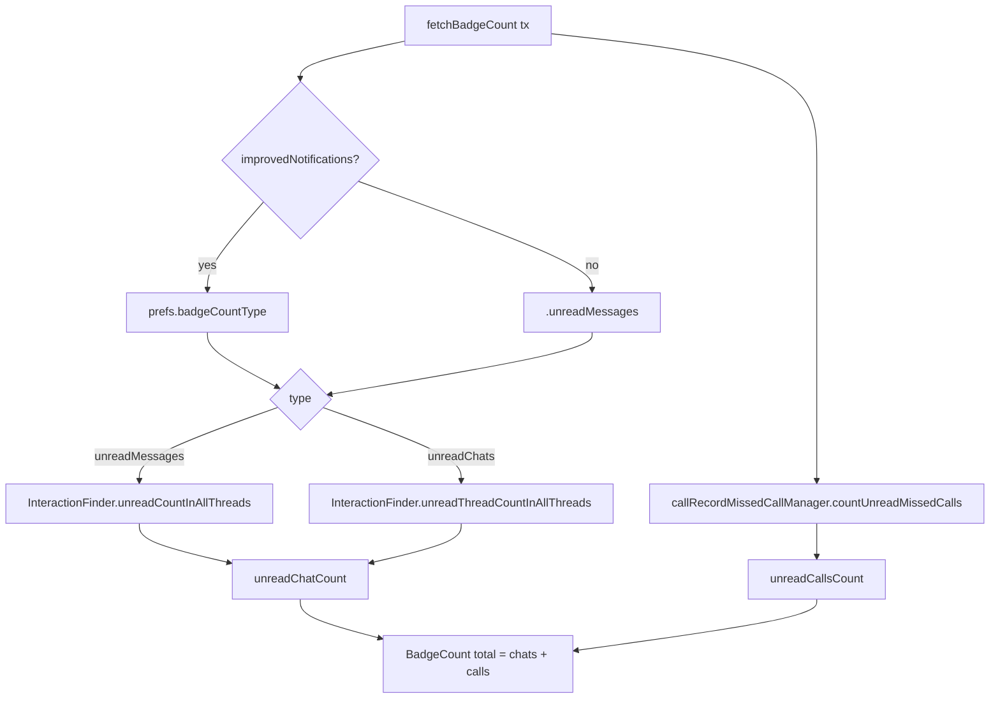

# Badge Counts

Covers `SignalServiceKit/Notifications/BadgeCountFetcher.swift`.

> Confidence labels: **[High]** read from source · **[Medium]** inferred ·
> **[Low]** plausible but unverified. Citations are `File.swift:line` within
> `SignalServiceKit/Notifications/`.

---

## 1. `BadgeCount`

[High] `BadgeCountFetcher.swift:6-13`. A value type holding:
- `unreadChatCount: UInt`
- `unreadCallsCount: UInt`
- `unreadTotalCount: UInt` (computed) = `unreadChatCount + unreadCallsCount`.

This total is what the NSE writes to the app-icon badge
(`SignalNSE/NotificationService.swift` end of `fetchAndProcessMessages`:
`content.badge = NSNumber(value: badgeCount.unreadTotalCount)`). [High]

---

## 2. `BadgeCountFetcher`

[High] `BadgeCountFetcher.swift:15-49`. A `struct` with two collaborators
injected at init:
- `notificationPreferencesManager: NotificationPreferencesManager`
- `callRecordMissedCallManager: CallRecordMissedCallManager`

### 2.1 `fetchBadgeCount(tx:) -> BadgeCount`

[High] Algorithm (`BadgeCountFetcher.swift:27-48`):

1. **Choose a badge-count type:**
   - If `BuildFlags.improvedNotifications` → read
     `notificationPreferencesManager.badgeCountType(tx:)`.
   - Else → force `.unreadMessages`.
   (`BadgeCountFetcher.swift:28-32`) [High]
2. **Compute unread chat count** from the chosen type:
   - `.unreadMessages` → `InteractionFinder.unreadCountInAllThreads(transaction:)`
     (counts unread **messages**).
   - `.unreadChats` → `InteractionFinder.unreadThreadCountInAllThreads(transaction:)`
     (counts unread **threads/chats**).
   (`BadgeCountFetcher.swift:34-40`) [High]
3. **Compute unread missed-call count** via
   `callRecordMissedCallManager.countUnreadMissedCalls(tx:)`
   (`BadgeCountFetcher.swift:41`). [High]
4. Return `BadgeCount(unreadChatCount:, unreadCallsCount:)`
   (`BadgeCountFetcher.swift:43-46`). [High]

---

## 3. Notes & boundaries

- **Feature-flag behavior:** on production builds (`improvedNotifications` is
  `build <= .dev`), the type selection collapses to `.unreadMessages`, so the
  badge counts unread *messages* + unread *missed calls*. [High]
- **"Include muted threads in badge count"** preference exists on
  `NotificationPreferencesManager` (`includeMutedThreadsInBadgeCount`, default
  `false`) but is **not** consumed inside `BadgeCountFetcher`. Where (if anywhere)
  the `InteractionFinder` queries honor it is **not evident in this file** —
  intent undetermined — no evidence in source within `BadgeCountFetcher.swift`.
  [High] (that the fetcher doesn't read it) / [Low] (as to where it is applied)
- **Transaction scope:** `fetchBadgeCount` is a pure read; the NSE calls it inside
  a `databaseStorageRef.read { }` block. [High]
- The implementations of `InteractionFinder.unreadCountInAllThreads` /
  `unreadThreadCountInAllThreads` and `CallRecordMissedCallManager.countUnreadMissedCalls`
  live outside this directory and are not traced here. [Medium — names strongly
  imply behavior]
