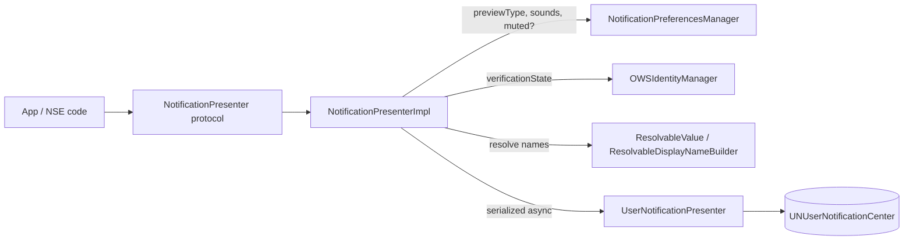

# Notification Presenter — building, scheduling & cancelling notifications

Covers:
- `SignalServiceKit/Notifications/NotificationPresenter.swift`
- `SignalServiceKit/Notifications/NotificationPresenterImpl.swift`
- `SignalServiceKit/Notifications/NoopNotificationPresenterImpl.swift`
- `SignalServiceKit/Notifications/UserNotificationsPresenter.swift`
- `SignalServiceKit/Notifications/ResolvableValue.swift`

> Confidence labels: **[High]** read from source · **[Medium]** inferred from
> strong local evidence · **[Low]** plausible but unverified. Citations are
> `File.swift:line` within `SignalServiceKit/Notifications/`.

---

## 1. Layering

There are three layers plus a model layer:

1. **`NotificationPresenter` protocol** — the public surface the rest of the app
   calls (`notifyUser(forIncomingMessage:...)`, `cancelNotifications(...)`,
   etc.) (`NotificationPresenter.swift:8-80`). [High]
2. **`NotificationPresenterImpl`** — the production implementation. It decides
   *what* a notification should say (title/body/category/sound/intent), reads
   preferences and identity state, and serializes delivery
   (`NotificationPresenterImpl.swift:277`). [High]
3. **`UserNotificationPresenter`** — the thin wrapper over Apple's
   `UNUserNotificationCenter`: permissions, building `UNNotificationRequest`,
   suppression, triggers (delays), and cancellation
   (`UserNotificationsPresenter.swift:72`). [High]
4. A **`NoopNotificationPresenterImpl`** that logs a warning for every call,
   used where notifications must not be shown (`NoopNotificationPresenterImpl.swift:8-...`). [High]

The impl comment states the two components are the `NotificationPresenterImpl`
(shows notifications) and the `NotificationActionHandler` (handles user
interaction with them); the action handler lives outside this directory
(`NotificationPresenterImpl.swift:9-18`). [High]

---

## 2. The notification model

### 2.1 Categories — `AppNotificationCategory`

[High] A string-raw `CaseIterable` enum enumerating every notification class
(`NotificationPresenterImpl.swift:148-174`). The raw values are stable
identifiers passed to iOS and persisted in delivered notifications. Cases
include incoming message (with/without actions, can/cannot reply), reactions,
`incomingMessageFromNoLongerVerifiedIdentity`, `infoOrErrorMessage`, missed-call
variants, `internalError`, `incomingGroupStoryReply`, `failedStorySend`,
`transferRelaunch`, `deregistration`, `newDeviceLinked`, `backupsEnabled`,
`backupsMediaTierQuotaConsumed`, `listMediaIntegrityCheckFailure`,
`pollEndNotification`, `pollVoteNotification`, `attachmentBackfill`,
`releaseNotesMessage`, and three NSE-only cases `nse_lowDiskSpace`,
`nse_dbNotAvailable`, `nse_clockSkew`.

Two derived properties:

- **`shouldClearOnAppActivate`** (`NotificationPresenterImpl.swift:178-215`):
  message/call/story/poll/backfill/release-notes/NSE categories return `true`
  (cleared when the app foregrounds); `deregistration`, `newDeviceLinked`,
  `backupsEnabled`, `backupsMediaTierQuotaConsumed`,
  `listMediaIntegrityCheckFailure`, and `internalError` return `false` (persist
  across activation). [High]
- **`actions`** (`NotificationPresenterImpl.swift:214-281`): the custom
  long-press actions each category offers. E.g. `incomingMessageWithActions_CanReply`
  → `[.markAsRead, .reply, .reactWithThumbsUp]`; `missedCallWithActions` →
  `[.callBack, .showThread]`; `releaseNotesMessage` → `[.markAsRead]`; most
  others `[]`. [High]

### 2.2 Custom actions — `AppNotificationAction`

[High] `String`-raw enum of long-press actions (`NotificationPresenterImpl.swift:26-32`):
`callBack`, `markAsRead`, `reply`, `showThread`, `reactWithThumbsUp`. Raw values
are fully-qualified identifiers (e.g. `"Signal.AppNotifications.Action.reply"`)
and the comment stresses they **must remain stable** because they are persisted
via notifications (`NotificationPresenterImpl.swift:20-25`). [High]

Each action's UI (title + SF Symbol icon, text-input vs. plain) is defined in
`UserNotificationConfig.notificationAction(_:)`
(`UserNotificationsPresenter.swift:31-71`); `.reply` is a
`UNTextInputNotificationAction`; `.callBack`/`.showThread` use the `.foreground`
option (callBack) or default. [High]

### 2.3 Default (tap) actions — `AppNotificationDefaultAction`

[High] `String`-raw enum stored inside a notification's `userInfo`; it is the
action taken when the user taps (not long-presses) the notification
(`NotificationPresenterImpl.swift:39-50`): `showThread`, `showMyStories`,
`showCallLobby`, `submitDebugLogs`, `submitDebugLogsForBackupsMediaError`,
`reregister`, `showChatList`, `showLinkedDevices`, `showBackupsSettings`,
`showMessage`. Also persisted → must remain stable. [High]

### 2.4 `AppNotificationUserInfo`

[High] A typed wrapper around the `[AnyHashable: Any]` dictionary iOS stores on a
notification (`NotificationPresenterImpl.swift:52-146`). Fields: `callBackAci`,
`callBackPhoneNumber`, `defaultAction`, `isMissedCall`, `messageId`,
`reactionId`, `roomId`, `storyMessageId`, `storyTimestamp`, `threadId`,
`voteAuthorServiceIdBinary`.

- **`init(_ userInfo:)`** parses the raw dict, using `owsAssertDebug` to flag
  parse failures for the ACI, default action, and roomId
  (`NotificationPresenterImpl.swift:68-92`). [High]
- **`build()`** serializes back to `[String: Any]`, writing only non-nil fields;
  ACI → `serviceIdString`, roomId → base64 string
  (`NotificationPresenterImpl.swift:108-145`). [High]
- The storage keys are namespaced constants under `UserInfoKey`
  (`NotificationPresenterImpl.swift:94-106`). Validation rule: these keys
  must remain stable to parse already-delivered notifications. [Medium — inferred
  from the "must remain stable" comments on the enums above and the parse-on-read
  design]

---

## 3. Building a notification: the common path

The impl exposes many `notifyUser(for…)` entry points. They all funnel into
`notifyViaPresenter(...)` (`NotificationPresenterImpl.swift` `private func
notifyViaPresenter`), which is invoked **inside** an `enqueueNotificationAction`
closure. [High]

### 3.1 Title & body: preview type

[High] `previewType(tx:)` reads `NotificationPreferencesManager.previewType`
(`NotificationPresenterImpl.swift:289-291`). The three values drive content:

- `.noNameNoPreview` → no title, no `threadIdentifier`, generic body.
- `.nameNoPreview` → title (sender/group name), generic body.
- `.namePreview` → title + the real message text.

`notificationTitle(for:senderAddress:isGroupStoryReply:previewType:tx:)` builds
the title per thread kind (`NotificationPresenterImpl.swift:829`): contact threads resolve the contact's display name; group
threads use `groupNameOrDefault` and, if a sender is known, format
`"<sender> → <group>"` (or the group-story-reply variant); release-notes threads
use a fixed localized channel name. [High]

### 3.2 Actions gating — `shouldShowActions`

[High] `shouldShowActions(for:tx:)` returns `true` only when
`previewType == .namePreview` **and** screen lock is disabled
(`NotificationPresenterImpl.swift:293-295`). This is why actionable categories
are only chosen when previews are on and the screen isn't locked (so reply text
isn't leaked on a locked screen). [High]

### 3.3 "No longer verified" downgrade

[High] For incoming messages and reactions, the impl scans
`thread.recipientAddresses` and, if **any** address has
`verificationState == .noLongerVerified`, forces the category to
`incomingMessageFromNoLongerVerifiedIdentity` (no actions)
(`NotificationPresenterImpl.swift` within `_notifyUser(forIncomingMessage:...)`
and `notifyUser(forReaction:...)`). The in-code comment: *"Don't reply from
lockscreen if anyone in this conversation is 'no longer verified'."* [High]

### 3.4 Sounds — `SoundQuery`

[High] `notifyViaPresenter` resolves a `Sound?` from a `SoundQuery`
(`NotificationPresenterImpl.swift:1684` for `enum SoundQuery`; the switch at the
top of `notifyViaPresenter`, `:1691`): `.none` → nil; `.global` → the global preference
sound; `.thread(id)` → the per-thread sound; `.constant(sound)` → a fixed sound
(used by `notifyUserToRelaunchAfterTransfer` so it doesn't read the DB, which is
unavailable until relaunch). [High]

**Sound throttling** (`NotificationPresenterImpl.swift:1845` `checkIfShouldPlaySound`,
constants `kAudioNotificationsThrottleCount = 2`,
`kAudioNotificationsThrottleInterval = 5` at `:274-275`): [High]
- If **not** main-app-and-active, always allow a sound.
- If main-app-and-active, require `playSoundInForeground` preference, then
  throttle to at most `kAudioNotificationsThrottleCount` (2) sounds per
  `kAudioNotificationsThrottleInterval` (5s), tracked in a
  `TruncatedList<UInt64>` under an `UnfairLock`.

### 3.5 Intents (`INIntent`) & Communication Notifications

[High] Most message/reaction/call notifications build a `SendMessageIntent` or
incoming-call intent via `thread.generateSendMessageIntent(...)` /
`generateIncomingCallIntent(...)`, wrapped as a `ResolvableValue<INIntent>` and
tagged with an `INInteractionDirection` (`.incoming`/`.outgoing`). In
`notifyViaPresenter` the intent is resolved (≤5s) into an `INInteraction` and
passed down (`NotificationPresenterImpl.swift:1691`). [High] The
`UserNotificationPresenter` donates the interaction and updates the content from
the intent to render iOS "communication" style notifications
(`UserNotificationsPresenter.swift:187-205`). [High]

### 3.6 Name resolution — `ResolvableValue`

[High] `ResolvableValue<Element>` wraps a value that may need async resolution,
with a `resolve(timeout:)` that **must** return a fallback within the timeout
(`ResolvableValue.swift:15-33`). `ResolvableDisplayNameBuilder` builds one for a
display name: if the current `DisplayName` already `hasProfileNameOrBetter`, it
resolves synchronously; otherwise it waits (up to `timeout`) for in-flight
profile fetches via `profileFetcher.waitForPendingFetches(for:)`, falling back
to the latest known name (or "Unknown") on timeout/error
(`ResolvableValue.swift:36-99`). [High]

In `notifyViaPresenter`, titles and intents are resolved with a 5s timeout
(`let kProfileNameFetchTimeout: TimeInterval = 5`) and fetched concurrently via
`async let` (`NotificationPresenterImpl.swift:1691`). The comment
notes this is *"currently best effort."* [High]

### 3.7 Serialization & "post within 2s" watchdog — `enqueueNotificationAction`

[High] `enqueueNotificationAction(afterCommitting:_:)`
(`NotificationPresenterImpl.swift:1801`) chains each notification
block onto `mostRecentTask` (an `AtomicValue<Task<Void, Never>?>`), so blocks run
**serially** in enqueue order. If a write `tx` is supplied, the block waits for
the transaction's sync completion (`addSyncCompletion`) before posting, i.e.
notifications only fire **after the DB commit**. A `PendingTasks` token tracks
in-flight work for `waitForPendingNotifications()`. If posting takes ≥2s it logs
a warning splitting queue vs. notify time. [High]

---

## 4. Per-type entry points (what each builds)

[High] All citations in this section are `NotificationPresenterImpl.swift`.

| Entry point | Category | Notable rules |
| --- | --- | --- |
| `notifyUser(forIncomingMessage:[editTarget:]thread:tx:)` | incoming message (actions variant chosen by gating) | Early-outs via `canNotify(...)`; chooses body = message-request string / generic / preview; for edits, first calls `presenter.replaceNotification(messageId:)` and *skips* if the original was dismissed; edited notifications use `soundQuery: .none`. |
| `notifyUser(forReleaseNotesMessage:...)` | `releaseNotesMessage` | Skipped if thread muted. |
| `notifyUser(forReaction:onOutgoingMessage:...)` | reaction (actions variant chosen) | Requires `areReactionNotificationsEnabled`; skipped if muted; requires `.namePreview`; body chosen by reacted-to content type (text/view-once/sticker/contact/album/gif/photo/video/voice/audio/file). |
| `notifyUserOfPollEnd(forMessage:...)` | `pollEndNotification` | Skipped if muted; requires `.namePreview`; body prefixed with 📊; requires `message.body` (question). |
| `notifyUserOfPollVote(forMessage:voteAuthor:...)` | `pollVoteNotification` | Skipped if muted; requires `.namePreview`; dedupes via `existingPollVoteNotification(author:pollId:)`. |
| `notifyUser(forErrorMessage:...)` | `infoOrErrorMessage` (only for `.sessionRefresh`) | Returns for `OWSRecoverableDecryptionPlaceholder` and for a long list of error types (noSession, invalidMessage, decryptionFailure, …) — only `.sessionRefresh` notifies. |
| `notifyUser(forTSMessage:wantsSound:...)` / `notifyUser(forPreviewableInteraction:...)` | `infoOrErrorMessage` | Skipped if muted; default action `.showCallLobby` for group-call messages else `.showThread`; may synthesize a sender intent for group updates / "user joined Signal" / group-call creator. |
| `notifyUserOfFailedSend(inThread:)` | `infoOrErrorMessage` | Ungrouped (`threadIdentifier: nil`). |
| `notifyTestPopulation(ofErrorMessage:)` | `internalError` | Gated on `DebugFlags.testPopulationErrorAlerts`; `forceBeforeRegistered: true`; default action `.submitDebugLogs`. |
| `notifyForGroupCallSafetyNumberChange(...)` | `infoOrErrorMessage` | Default action `.showCallLobby`; body differs when `presentAtJoin`. |
| `notifyUser(forFailedStorySend:to:...)` | `failedStorySend` | Requires stories enabled; builds a bespoke `INSendMessageIntent` (`.outgoing`); default action `.showMyStories`. |
| `notifyUserToRelaunchAfterTransfer(completion:)` | `transferRelaunch` | `forceBeforeRegistered: true`; `.constant` sound (DB unavailable); runs `completion` after. |
| `notifyUserOfDeregistration(tx:)` | `deregistration` | `forceBeforeRegistered: true`; default action `.reregister`. |
| `scheduleNotifyForNewLinkedDevice(deviceLinkTimestamp:)` | `newDeviceLinked` | Scheduled with a delay (see §5); default action `.showLinkedDevices`. |
| `scheduleNotifyForBackupsEnabled(backupsTimestamp:)` | `backupsEnabled` | First cancels pending `backupsEnabled` requests; scheduled with delay; default action `.showBackupsSettings`. |
| `notifyUserOfAttachmentBackfill(threadUniqueId:messageUniqueId:body:)` | `attachmentBackfill` | `soundQuery: .none`; `replacingIdentifier: "attachmentBackfill-<messageUniqueId>"` so it replaces its predecessor. |
| `notifyUserOfMediaTierQuotaConsumed()` | `backupsMediaTierQuotaConsumed` | Default action `.showBackupsSettings`. |
| `notifyUserOfBackupsMediaError()` | `listMediaIntegrityCheckFailure` | Default action `.submitDebugLogsForBackupsMediaError`. |
| `notifyUserOfMissedCall(notificationInfo:offerMediaType:sentAt:tx:)` | missed-call (actions variant) | When `improvedNotifications` + muted + not `notifyForCallsWhenMuted` → skip; body localized by (audio/video × recency bucket); `replacingIdentifier` = call grouping UUID. |
| `notifyUserOfMissedCallBecauseOfNewIdentity(...)` / `...NoLongerVerifiedIdentity(...)` | missed-call variants | Identity-change body; grouped by call UUID. |

### 4.1 `canNotify(for:thread:transaction:)` — the muted/story gate

[High] `NotificationPresenterImpl.swift` `canNotify(...)` (`:561`):
- **Muted thread:** notify only for group threads where the local user is
  **@mentioned** (and `notifyForMentionsWhenMuted`/legacy flag allows) or
  **quoted** (and `notifyForRepliesWhenMuted` allows). Non-group muted → `false`.
- **Group-story reply:** notify if you authored the story, you're @mentioned, or
  you previously replied (`InteractionFinder.hasLocalUserReplied`).
- **Otherwise:** `true`.
  The mention/reply checks branch on `BuildFlags.improvedNotifications` (new
  per-thread prefs) vs. the legacy `shouldNotifyForMentionsWhenMutedLegacy`. [High]

### 4.2 Missed-call timestamp bucketing — `TimestampClassification`

[High] `NotificationPresenterImpl.swift:366` `private enum TimestampClassification`:
future → `.other` (with `owsFailDebug`), ≤5min → `.lastFewMinutes`, ≤1 day →
`.last24Hours`, ≤1 week → `.lastWeek`, else `.other`; each picks a different
localized body format and time argument. [High]

---

## 5. `UserNotificationPresenter` — the `UNUserNotificationCenter` wrapper

### 5.1 Permissions & categories

[High] `registerNotificationSettings()` requests `[.badge, .sound, .alert]`
authorization and registers all `AppNotificationCategory` categories (built via
`UserNotificationConfig`) (`UserNotificationsPresenter.swift:82-90`,
`:11-72`). On failure it `owsFailDebug`s but still registers categories. [High]

### 5.2 `notify(...)` — assembling the `UNNotificationRequest`

[High] `UserNotificationsPresenter.swift:102-213`:
1. **Registration gate:** unless `forceBeforeRegistered`, drops the notification
   if the account isn't registered (`:115-121`). The TODO comment flags that this
   check "might make sense to have the callers check instead" — **intent
   undetermined — no evidence in source** beyond the TODO. [High]
2. **Stories gate:** `incomingGroupStoryReply` dropped if stories disabled
   (`:123-125`). [High]
3. Builds `UNMutableNotificationContent`: category id, `userInfo.build()`, and a
   `sound` (unless `.standard(.none)`), choosing a quiet sound when
   main-app-active (`:127-134`). [High]
4. **Identifier / replacement:** uses a random UUID identifier unless
   `replacingIdentifier` is given, in which case it cancels the existing one
   first (`:136-141`). [High]
5. **Triggers (delays):** see §5.3.
6. **Suppression:** only sets `title`/`body` if `shouldPresentNotification(...)`
   returns `true`; otherwise it still plays sound/vibrates but shows no banner
   (`:174-181`). [High]
7. Sets `threadIdentifier` for grouping; donates the `INInteraction` and updates
   content from the intent for comm-style rendering (`:183-205`). [High]
8. Adds the request to the center, `owsFailDebug` on error (`:207-213`). [High]

### 5.3 Scheduled triggers (delays)

[High] `UserNotificationsPresenter.swift:143-173`:
- **Incoming message/reaction categories**, when **not** main-app-active and a
  sync message was received in the last 60s
  (`hasReceivedSyncMessageRecentlyWithSneakyTransaction`, `:92-99`): delay
  `kNotificationDelayForRemoteRead = 20s` (`:77`). Rationale in comment: avoid
  notifying on the phone while the user is actively reading on a linked desktop.
  [High]
- **`newDeviceLinked`:** delay = `linkedDeviceDetails.notificationDelay` (random
  1–3h set at link time), with an `owsFailDebug` fallback of `1h…3h`
  (`:152-167`). [High]
- **`backupsEnabled`:** delay = random `1h…3h` (`:169-171`). [High]
- Otherwise: no trigger (immediate). [High]

### 5.4 `shouldPresentNotification` — view-based suppression

[High] `UserNotificationsPresenter.swift:215-...` switches on category:
- **Always show:** no-longer-verified incoming, missed-call variants,
  `transferRelaunch`, `deregistration`, `newDeviceLinked`, `backupsEnabled`,
  `backupsMediaTierQuotaConsumed`, `attachmentBackfill`, and the three NSE
  categories. [High]
- **Test-population only:** `internalError`, `listMediaIntegrityCheckFailure`
  (shown only if `DebugFlags.testPopulationErrorAlerts`). [High]
- **Hide if thread visible:** incoming message/reaction, `infoOrErrorMessage`,
  poll end/vote, `releaseNotesMessage` — suppressed when
  `notificationSuppressionRule == .messagesInThread(thatThread)`. [High]
- **`incomingGroupStoryReply`:** suppressed when the matching group-reply sheet
  is open. [High]
- **`failedStorySend`:** suppressed when `.failedStorySends` is active. [High]

The `NotificationSuppressionRule` itself is computed in the impl from the
frontmost view controller (`NotificationPresenterImpl.swift:311`
`_notificationSuppressionRuleIfMainAppAndActive`): a `LinkAndSyncProgressUI`
that wants suppression → `.all`; a `ConversationSplit` → the visible thread; a
`StoryGroupReplier` → that story; a `FailedStorySendDisplayController` →
`.failedStorySends`; else `.none`. Returns `nil` when not main-app-and-active
(the outer `notificationSuppressionRuleIfMainAppAndActive`, `:303`, guards on
`CurrentAppContext().isMainApp`).
`NotificationSuppressionRule` is defined in `NotificationPresenter.swift:126-130`.
[High]

### 5.5 Cancellation & clearing

[High] `UserNotificationsPresenter.swift` cancellation helpers map to a private
`CancellationType` (`threadId`, `messageIds`, `reactionId`, `missedCalls(inThreadWithUniqueId:)`,
`storyMessage`) and scan **both delivered and pending** requests, matching on the
parsed `AppNotificationUserInfo` and removing matches (`cancel`, `cancelSync`,
`getNotificationsRequests`). [High] Other helpers:
- `replaceNotification(messageId:)` cancels any existing notification for a
  message id and returns whether one was found (used for edits). [High]
- `clearAllNotifications()` removes **all** pending + delivered. [High]
- `clearNotificationsForAppActivate()` removes only categories whose
  `shouldClearOnAppActivate` is `true` (unknown categories also removed). [High]
- `clearDeliveredNewLinkedDevicesNotifications()` removes delivered
  `newDeviceLinked`. [High]
- `cancelPendingNotificationsForBackupsEnabled()` removes pending
  `backupsEnabled`. [High]
- `existingPollVoteNotification(author:pollId:)` checks for a duplicate
  poll-vote notification. [High]

### 5.6 Sound file resolution

[High] `Sound.notificationSound(isQuiet:)` extension
(`UserNotificationsPresenter.swift:488-...`): resolves the sound filename, logs if
the file is missing in both the sounds dir and the bundle, and falls back to
`UNNotificationSound.default` (with `owsFailDebug`) if the filename is nil. [High]

---

## 6. `NoopNotificationPresenterImpl`

[High] Implements the full protocol with every method logging `Logger.warn("")`
and doing nothing (`NoopNotificationPresenterImpl.swift:8-...`). It carries an
`expectErrors` flag; `notifyTestPopulation(ofErrorMessage:)` asserts
`expectErrors` is set (`owsAssertDebug`) — used in tests/contexts where no
notifications should be surfaced. [High] Where it is injected is outside this
directory — **intent undetermined — no evidence in source** here. [Medium]

---

## 7. Validation rules, error paths & edge cases (summary)

- **Registration gate** before showing any notification unless
  `forceBeforeRegistered` (deregistration/transfer/test-population use it). [High]
- **Preview type** governs title/body/threadIdentifier/actions and whether
  reaction & poll notifications show at all (require `.namePreview`). [High]
- **Screen lock** disables actionable categories (`shouldShowActions`). [High]
- **Muted threads** suppressed except group @mentions/quotes per prefs; muted
  calls suppressed under `improvedNotifications` unless `notifyForCallsWhenMuted`. [High]
- **No-longer-verified** identities downgrade message/reaction notifications to a
  non-actionable category. [High]
- **Edited messages** only re-notify if the original is still present. [High]
- **Error messages**: only `.sessionRefresh` notifies; recoverable decryption
  placeholders and the rest return silently. [High]
- **Sound throttling**: max 2 sounds / 5s while foregrounded, and only if
  `playSoundInForeground`. [High]
- **Async name/intent resolution** best-effort with a 5s timeout and fallback. [High]
- **Serialization**: notifications post in order, after the originating DB
  commit; a 2s post-time watchdog logs slowness. [High]
- **Missing sound file** falls back to the system default sound. [High]
- `owsFailDebug` is used liberally for "can't happen" states: non-`NotifiableThread`
  threads, missing local identifiers, intent/content update failures, parse
  failures in `AppNotificationUserInfo.init`, and add-request errors. [High]

---

## 8. `NotificationPresenter` protocol surface (reference)

[High] `NotificationPresenter.swift:8-80` declares (abridged): `registerNotificationSettings()`; the `notifyUser(for…)` family (incoming message, edit, release notes, reaction,
error, TS message, previewable interaction, poll end/vote, failed story send,
failed send); `notifyTestPopulation(ofErrorMessage:)`; the missed-call family;
`notifyForGroupCallSafetyNumberChange`; the schedule-with-delay pair
(`scheduleNotifyForNewLinkedDevice`, `scheduleNotifyForBackupsEnabled`); the
backups/backfill notifiers; `notifyUserToRelaunchAfterTransfer`,
`notifyUserOfDeregistration`; and the clear/cancel family. [High]

`CallNotificationInfo` (`NotificationPresenter.swift:104-115`) bundles a per-call
`groupingId` (UUID — reused as `replacingIdentifier` so only the latest call
notification shows), the `TSContactThread`, and the caller `Aci`. The
`@objc NotificationPresenterObjC.cancelNotifications(for:)` shim bridges a single
message-id cancellation for ObjC callers (`NotificationPresenter.swift:95-100`). [High]
