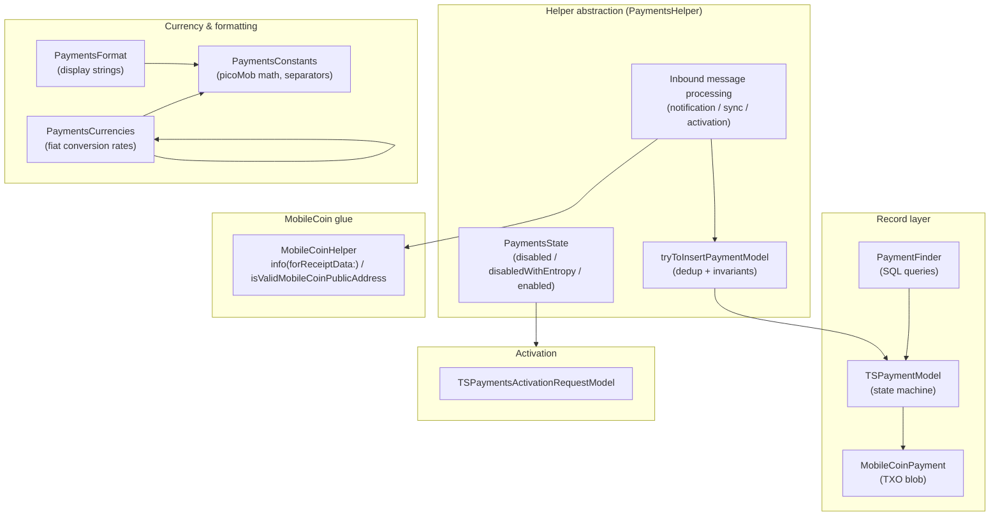

# `SignalServiceKit/Payments/` — The Payments Subsystem

This documentation set covers the first-party source in
`SignalServiceKit/Payments/` (~3.8k LOC) that implements Signal iOS's
**in-app payments** feature. Payments are built on **MobileCoin (MOB)** — the
only supported payment currency — and the directory contains the on-device
**payment record model + state machine**, the **MobileCoin receipt/address
decoding glue**, **fiat currency conversion & number formatting**, the
**payments-activation** handshake, and the **helper abstraction** that owns the
enabled/entropy state and processes inbound payment messages.

> **Confidence labels.** Each claim is tagged with a confidence level:
> - **[High]** — directly read from source; behavior is explicit in code.
> - **[Medium]** — inferred from code with reasonable certainty, but depends on
>   collaborators defined outside this directory (e.g. `SSKEnvironment`,
>   `MobileCoinAPI`, `PaymentsReconciliation`, the SSKProto types).
> - **[Low]** — inferred from naming/comments; not fully verified in-tree.
>
> Where a design decision's purpose cannot be established from the source, it is
> marked **intent undetermined — no evidence in source**.
>
> Citations are given as `File.swift:line`, pointing at the definition being
> described. Line numbers reflect the state of the tree at authoring time and
> may drift; use the cited symbol name to relocate code if lines have moved.
> Diagrams are [Mermaid](https://mermaid.js.org/).

## Document map

| Doc | Area covered | Primary source |
| --- | --- | --- |
| [mobilecoin-integration.md](mobilecoin-integration.md) | MobileCoin receipt/address decoding, the `MobileCoinPayment` TXO blob, the minimal vs. full helper split | `MobileCoinHelper.swift`, `MobileCoinHelperMinimal.swift`, `MobileCoinPayment.swift` |
| [payment-model-and-state-machine.md](payment-model-and-state-machine.md) | `TSPaymentModel`, the `TSPaymentState`/`TSPaymentType`/`TSPaymentFailure` enums, the `isValid` invariant matrix, `PaymentFinder` queries | `TSPaymentModel.swift`, `TSPaymentModels.{swift,h,m}`, `PaymentFinder.swift` |
| [currency-and-formatting.md](currency-and-formatting.md) | picoMob↔MOB conversion, fiat conversion rates, locale-aware decimal formatting | `Payments+SSK.swift`, `PaymentsCurrencies.swift`, `PaymentsCurrenciesImpl.swift`, `PaymentsFormat.swift` |
| [payments-activation.md](payments-activation.md) | The activation-request handshake and the pending-request model | `TSPaymentsActivationRequestModel.swift`, `PaymentsHelperImpl.swift` |
| [helper-abstraction.md](helper-abstraction.md) | `PaymentsHelper`/`PaymentsState`, enable/disable/entropy, inbound message processing, `PaymentsEvents` hooks | `PaymentsHelper.swift`, `PaymentsHelperImpl.swift`, `PaymentsEvents.swift` |

## The central concept: a two-layer design

Payments are intentionally split into a **currency-agnostic record layer**
(stored in SSK) and a **MobileCoin-specific blob**. `TSPaymentModel` holds the
generic fields (type, state, amount, memo, timestamps) while the embedded
`MobileCoinPayment` carries the MobileCoin transaction/receipt/key-image data
(`TSPaymentModel.swift:59`, `MobileCoinPayment.swift:9`). **[High]** Only
`TSPaymentCurrency.mobileCoin` is ever used; `.unknown` is the sentinel invalid
value (`TSPaymentModels.h:12-15`). **[High]**

The actual signing of transactions, SDK ledger access, and fog interaction live
**outside** this directory (in the `MobileCoinAPI`/`PaymentsImpl` layer). This
directory decodes receipts/addresses, persists records, and drives the state
machine. **[Medium]**

## How the pieces interact at runtime

- **`PaymentsHelper`/`PaymentsHelperImpl`** owns the durable "are payments
  enabled + the 32-byte `paymentsEntropy`" state, decides whether the device
  *can* use payments (kill switch + region gate), and processes inbound payment
  notifications, outgoing-payment sync messages, and activation messages
  (`PaymentsHelperImpl.swift:8`, `:39`, `:122`, `:369`). **[High]**
- **`TSPaymentModel`** is a `SDSCodableModel` persisted in `model_TSPaymentModel`
  that moves through a strict state machine; its `isValid` getter encodes a
  large per-state invariant matrix governing which MobileCoin fields must or
  must not be present (`TSPaymentModel.swift:16`, `TSPaymentModels.swift:306`).
  **[High]**
- **`MobileCoinHelper`** is a tiny protocol: decode a receipt to its TXO public
  key, and validate a public-address blob (`MobileCoinHelper.swift:8`). The
  **minimal** implementation (NSE/extension) only parses protos; the full
  implementation (main app) lives outside this directory. **[High]**
- **`PaymentsCurrencies`/`PaymentsFormat`** convert MOB↔fiat and render
  locale-aware strings; all amounts are internally `picoMob`
  (`1 MOB = 10¹² picoMob`, `Payments+SSK.swift:64`). **[High]**

## Feature flags & global gates (summary)

| Gate | Where | Effect |
| --- | --- | --- |
| `RemoteConfig.current.paymentsResetKillSwitch` | `PaymentsHelperImpl.swift:40` | When set, `canUsePayments()` returns `false` — local activation is blocked. **[High]** |
| `RemoteConfig.current.paymentsDisabledRegions` | `PaymentsHelperImpl.swift:34-36` | If the local E.164 is in a disabled region, payments cannot be used locally. **[High]** |
| `arePaymentsEnabled` k-v flag + 32-byte `paymentsEntropy` | `PaymentsHelperImpl.swift:52-91` | Durable enabled state; entropy is never discarded once set. **[High]** |
| `CurrentAppContext().isRunningTests` | `TSPaymentModels.swift:229-231` | Inbound payment protos are ignored under test. **[High]** |
| `PaymentsError.killSwitch` | `Payments+SSK.swift:46` | Error surfaced to the send flow when the kill switch is active. **[Medium]** |

See each document for the detailed design, per-type purpose, validation rules,
error paths, edge cases, and cross-subsystem interactions.
