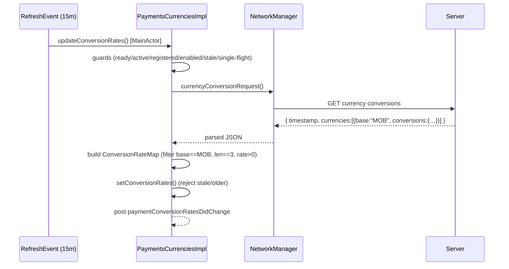

# Currency Handling & Formatting

This document covers how the Payments subsystem represents MobileCoin amounts,
converts between MOB and fiat currencies, and renders amounts as locale-aware
display strings. Three files cooperate:

- `Payments+SSK.swift` — the `PaymentsConstants` numeric model (`picoMob` math,
  locale separators, entropy length) and the `PaymentsError`/`PaymentsUIError`
  enums.
- `PaymentsCurrencies.swift` / `PaymentsCurrenciesImpl.swift` — fiat conversion
  rates and the supported/preferred currency lists.
- `PaymentsFormat.swift` — the display/parse formatters.

- [1. The picoMob numeric model](#1-the-picomob-numeric-model)
- [2. `PaymentsConstants` locale formatting primitives](#2-paymentsconstants-locale-formatting-primitives)
- [3. Fiat conversion: `PaymentsCurrencies`](#3-fiat-conversion-paymentscurrencies)
- [4. Conversion-rate refresh (`PaymentsCurrenciesImpl`)](#4-conversion-rate-refresh-paymentscurrenciesimpl)
- [5. Supported & preferred currencies](#5-supported--preferred-currencies)
- [6. Display formatting: `PaymentsFormat`](#6-display-formatting-paymentsformat)
- [7. Validation rules / error paths / edge cases](#7-validation-rules--error-paths--edge-cases)
- [8. File reference checklist](#8-file-reference-checklist)

---

## 1. The picoMob numeric model

All MobileCoin amounts are stored and manipulated internally as **picoMob**
(`UInt64`), where `1 MOB = 10¹² picoMob`
(`PaymentsConstants.picoMobPerMob = 1000 * 1000 * 1000 * 1000`,
`Payments+SSK.swift:64`). **[High]**

Conversions (`Payments+SSK.swift:72-77`): **[High]**
- `convertMobToPicoMob(_ mob: Double) -> UInt64 = UInt64(round(mob * picoMobPerMob))`
  — note the **rounding**; a `Double` MOB value is rounded to the nearest picoMob.
- `convertPicoMobToMob(_ picoMob: UInt64) -> Double = Double(picoMob) / picoMobPerMob`
  — this loses precision at large magnitudes because `Double` has 52 bits of
  mantissa; the UI constrains input to avoid overflow (next bullet).

Input-range guards (`Payments+SSK.swift:81-88`): **[High]**
- `maxMobDecimalDigits: UInt = 12` — the number of decimal digits in a picoMob
  (i.e. 12 fractional digits).
- `maxMobNonDecimalDigits: UInt = 7` — the largest number of integer digits a
  user may enter and still be safely expressed as `UInt64` picoMob. The comment
  gives the boundary: `9,999,999.999,999,999,999` is safe,
  `99,999,999.…` is not.

The currency symbol/identifier is the string `"MOB"`
(`mobileCoinCurrencyIdentifier`, `Payments+SSK.swift:67`). **[High]**

Related constants in the same file: `paymentsEntropyLength: UInt = 32`
(`:235`), `passphraseWordCount: Int = 24` (`:90`), and the two notification
names `arePaymentsEnabledDidChange` / `isPaymentsVersionOutdatedDidChange`
(`:56-61` region). **[High]**

## 2. `PaymentsConstants` locale formatting primitives

`PaymentsConstants.decimalFormattingInfo` (`Payments+SSK.swift:99`) derives
locale-appropriate separators once, lazily, by probing `NumberFormatter`.
**[High]** The algorithm:

1. Build a `.currency` and a `.decimal` `NumberFormatter` for `Locale.current`.
2. Pick a **decimal separator** from the currency formatter, else the decimal
   formatter, validated against the whitelist `[",", ".", "'", "·"]`.
3. Pick a **grouping separator** validated against
   `[",", ".", " ", "'", U+202F]` (note the explicit *narrow no-break space*,
   which `NumberFormatter` sometimes emits).
4. Pick a **grouping size** from the whitelist `[2, 3, 4]`.
5. Infer `shouldUseGroupingSeparatorsAfterDecimal` by formatting the exemplar
   `1.23456789` with 32 fraction digits and checking whether the fractional part
   contains the grouping separator.
6. If any derived value fails validation (or decimal == grouping), **fall back**
   to international style: decimal `","`, grouping `"."`, size `3`.

Exposed as static computed props `decimalSeparator` / `groupingSeparator` /
`groupingSize` / `shouldUseGroupingSeparatorsAfterDecimal`
(`Payments+SSK.swift:219-232`). **[High]**

> **Note.** This block is defensive against the wide variety of locale
> conventions; the fallback ensures the payments keyboard always has a usable
> separator pair even on misconfigured locales. **[Medium]**

## 3. Fiat conversion: `PaymentsCurrencies`

`protocol PaymentsCurrencies` (`PaymentsCurrencies.swift:8`) exposes the current
fiat currency code, a setter, a `@MainActor updateConversionRates()`, and
`warmCaches()`. The `CurrencyConversionRate` typealias is a `Double` defined as
**"price of fiat currency / price of payment currency (MobileCoin)"**
(`PaymentsCurrencies.swift:11-13`). **[High]**

`PaymentsCurrenciesSwift` (`:27`) adds `preferredCurrencyInfos`,
`supportedCurrencyInfos`, `supportedCurrencyInfosWithCurrencyConversions`, and
`conversionInfo(forCurrencyCode:)`. **[High]**

`CurrencyConversionInfo` (`PaymentsCurrencies.swift:40`) bundles a code, name,
a **private** `conversionRate`, and a `conversionDate`. The rate is private on
purpose — the comment says *"Don't use this field; use convertToFiatCurrency()
instead."* **[High]**

- `convertToFiatCurrency(paymentAmount:)` (`:60`): requires
  `currency == .mobileCoin` (else `owsFailDebug` + `nil`), converts picoMob→MOB,
  returns `conversionRate * mob`. **[High]**
- `convertFromFiatCurrencyToMOB(_:)` (`:69`): guards `value >= 0` (else
  `owsFailDebug` + `zeroMob`), computes `mob = value / conversionRate`, returns a
  `TSPaymentAmount` built from `convertMobToPicoMob(mob)`. **[High]**

`MockPaymentsCurrencies` (`:96`) returns empty lists, `nil` conversion info, and
a fixed `currentCurrencyCode = GBP`. **[High]**

## 4. Conversion-rate refresh (`PaymentsCurrenciesImpl`)

`PaymentsCurrenciesImpl` (`PaymentsCurrenciesImpl.swift:6`) owns the live rate
cache and the current currency code. **[High]**

**Current currency code** — stored in k-v collection `"PaymentsCurrencies"`
under key `currentCurrencyCodeKey`, guarded by an `UnfairLock`
(`PaymentsCurrenciesImpl.swift:36-59`). `loadCurrentCurrencyCode` (`:61`) prefers
the stored value, else the locale's 3-letter currency code, else the default
`GBP` (`defaultCurrencyCode = PaymentsConstants.currencyCodeGBP`,
`PaymentsCurrencies` fallback). On simulator a missing code warns rather than
`owsFailDebug`. **[High]** `setCurrentCurrencyCode` (`:84`) updates both the
cache and the k-v store. **[High]**

**Rate cache & staleness** — `ConversionRates` (`:96`) holds the rate map plus a
`serviceDate`; `isStale` (`:101`) is `true` when `serviceDate` is more than an
hour in the past (computed as `-serviceDate.timeIntervalSinceNow > .hour`, which
deliberately does **not** use `abs()` so future-dated service clocks aren't
treated as stale). **[High]**

**Refresh trigger** — the impl registers a `RefreshEvent` on a 15-minute
interval and observes `arePaymentsEnabledDidChange`
(`PaymentsCurrenciesImpl.swift:16-27`). `updateConversionRates()` (`:146`) is a
`@MainActor` method guarded by: app ready, main app active, registered, payments
enabled, cache not fresh, and a single-flight `AtomicBool`. **[High]**

`_updateConversionRates()` (`:176`) performs the network request: **[High]**
1. `OWSRequestFactory.currencyConversionRequest()` via `networkManagerRef`.
2. Parse `timestamp` → `serviceDate`, and a `currencies` array.
3. For each currency object, only consider the entry whose `base == "MOB"`
   (`mobileCoinCurrencyIdentifier`), then read its `conversions` map.
4. Skip currency codes whose length `!= 3` and non-positive exchange rates
   (each with a warning).
5. `setConversionRates(…)` — which refuses stale or older-than-current updates
   and posts `paymentConversionRatesDidChange`.

## 5. Supported & preferred currencies

- `preferredCurrencyCodes` (`PaymentsCurrenciesImpl.swift:275`): a fixed short
  list — `EUR, GBP, JPY, CNY, AUD, CAD`. **[High]**
- `supportedCurrencyCodesList` (`:284`): a large static ISO-4217 allowlist
  (hundreds of codes). **[High]**
- `supportedCurrencyCodes` (`:585`): the **intersection** of the allowlist with
  `Locale.isoCurrencyCodes` (what iOS actually supports), **unioned** with the
  preferred codes so those always appear. **[High]**

`conversionInfo(forCurrencyCode:)` (`:241`) returns `nil` if there are no fresh
rates, the code isn't in the map, the rate is non-positive, or the currency has
no display name — otherwise a `CurrencyConversionInfo` dated with the service
date (`:248`). **[High]**

## 6. Display formatting: `PaymentsFormat`

`enum PaymentsFormat` (`PaymentsFormat.swift:8`) is a namespace of static
formatters. It uses `.decimal` (not `.currency`) number style everywhere so that
no currency symbol is auto-appended — the `"MOB"` suffix is added manually.
**[High]**

- `buildMobFormatter(isShortForm:locale:)` (`:10`) — min 1 integer digit, min 1
  fraction digit, max fraction digits = `4` short-form else
  `maxMobDecimalDigits` (12); short-form uses `.halfEven` rounding. **[High]**
- `doubleFormat` (`:38`) — a fixed `en_US`, comma-free formatter used to turn an
  amount into the "input string" the custom payments keyboard parses; **not for
  display** (per comment). **[High]**
- `formatInChat(paymentAmount:amountBuilder:)` (`:54`) — short-form MOB string
  passed to a caller-supplied attributed-string builder; on failure returns the
  localized `"PAYMENTS_CURRENCY_UNKNOWN"`. **[High]**
- `format(paymentAmount:isShortForm:withCurrencyCode:withSpace:withPaymentType:)`
  (`:73`) — the main display entry point. Requires `.mobileCoin` (else localized
  unknown string), formats picoMob, then prepends `+`/`-` from the payment
  type's `isIncoming` and optionally appends `" MOB"`. **[High]**
- `format(amountString:withCurrencyCode:withSpace:isIncoming:)` (`:108`) — the
  string-assembly helper (sign prefix + amount + optional currency code). **[High]**
- `format(mob:isShortForm:)` (`:131`), `format(picoMob:isShortForm:locale:)`
  (`:138`) — numeric→string. **[High]**
- `formatAsDoubleString(picoMob:)` / `formatAsDoubleString(_:)` (`:148`, `:152`)
  — the keyboard "input string" form via `doubleFormat`. **[High]**
- `formatAsFiatCurrency(paymentAmount:currencyConversionInfo:locale:)` (`:160`)
  — converts to fiat then formats with 2 fraction digits via `format(fiat…)`
  (`:175`). **[High]**
- `formatForArchive(picoMob:)` (`:192`) — formats long-form in the fixed
  `en_US_POSIX` locale for stable serialization; `formatFromArchive(amount:)`
  (`:201`) parses an `en_US_POSIX` string back to a `Double` and re-formats it
  short-form in the current locale. These feed `TSArchivedPaymentInfo` (see
  [payment-model-and-state-machine.md](payment-model-and-state-machine.md) §7).
  **[High]**

## 7. Validation rules / error paths / edge cases

- **Non-MobileCoin currency** is rejected everywhere amounts are formatted or
  converted (`owsFailDebug` + localized "unknown" or `nil`)
  (`PaymentsFormat.swift:73-91`, `PaymentsCurrencies.swift:60-63`). **[High]**
- **Rounding at the MOB→picoMob boundary** means UI must enforce the
  `maxMobNonDecimalDigits`/`maxMobDecimalDigits` limits to avoid `UInt64`
  overflow (`Payments+SSK.swift:81-88`). **[High]**
- **Stale/clock-skew rates** — the `isStale` check avoids `abs()` on purpose so
  that a service clock ahead of the client does not mark fresh rates as stale
  (`PaymentsCurrenciesImpl.swift:101-107`); `setConversionRates` also refuses to
  install rates older than the current ones (`:120-144`). **[High]**
- **Rate refresh is best-effort** — `_updateConversionRates` errors are
  swallowed via `owsFailDebugUnlessNetworkFailure`
  (`PaymentsCurrenciesImpl.swift:166-173`). **[High]**
- **`PaymentsError`** (`Payments+SSK.swift:13`) enumerates the full set of send-
  flow failures (`invalidCurrency`, `invalidAmount`, `invalidFee`,
  `insufficientFunds`, `killSwitch`, `invalidEntropy`, `invalidPassphrase`, …).
  Most are produced in the `PaymentsImpl`/`MobileCoinAPI` layer outside this
  directory; within this directory `invalidModel`/`invalidPassphrase` are the
  ones thrown (`TSPaymentModels.swift`, `PaymentsHelperImpl.swift:683` region).
  **[Medium]**

## 8. File reference checklist

- `Payments+SSK.swift` — §1, §2, §7 (constants, picoMob math, separators, errors)
- `PaymentsCurrencies.swift` — §3 (protocols, `CurrencyConversionInfo`, mock)
- `PaymentsCurrenciesImpl.swift` — §4, §5 (rate refresh, currency lists)
- `PaymentsFormat.swift` — §6 (display/parse formatters)
