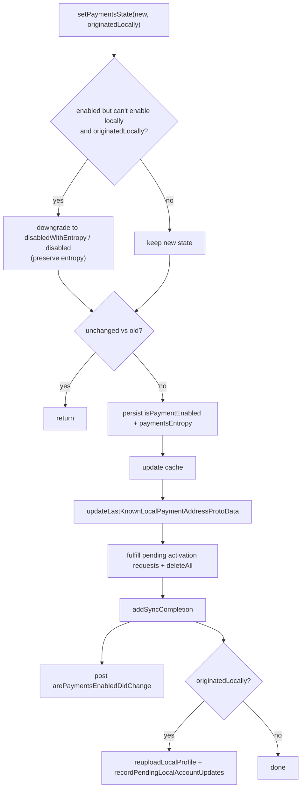

# The Helper Abstraction

`PaymentsHelper` is the façade through which the rest of the app interacts with
the Payments subsystem's **durable state** (enabled? what entropy?) and its
**inbound-message processing** (notifications, outgoing-payment sync messages,
activation). This document covers the protocol, the `PaymentsState` value type,
`PaymentsHelperImpl`, and the `PaymentsEvents` observer hooks.

- [1. The protocols](#1-the-protocols)
- [2. `PaymentsState`](#2-paymentsstate)
- [3. Can the device use payments?](#3-can-the-device-use-payments)
- [4. Enable / disable / entropy lifecycle](#4-enable--disable--entropy-lifecycle)
- [5. `setPaymentsState` — the central mutation](#5-setpaymentsstate--the-central-mutation)
- [6. Inbound message processing](#6-inbound-message-processing)
- [7. Insert invariants & de-duplication](#7-insert-invariants--de-duplication)
- [8. `PaymentsEvents` hooks](#8-paymentsevents-hooks)
- [9. Validation rules / error paths / edge cases](#9-validation-rules--error-paths--edge-cases)
- [10. File reference checklist](#10-file-reference-checklist)

---

## 1. The protocols

`protocol PaymentsHelper: AnyObject` (`PaymentsHelper.swift:9`) is the Obj-C-
visible surface: cache warming, the k-v store, `canUsePayments()`, the
version-outdated flag, the enabled/entropy accessors, enable/disable, the
"last known local payment address proto" accessors, and the five
`processIncoming…`/`tryToInsertPaymentModel` message entry points. **[High]**

`protocol PaymentsHelperSwift: PaymentsHelper` (`PaymentsHelper.swift:71`) adds
the Swift-only `paymentsState` getter, `setPaymentsState(_:originatedLocally:
transaction:)`, and `clearState(transaction:)`. **[High]**

`MockPaymentsHelper` (`PaymentsHelper.swift:144`) implements the whole surface
with `owsFail("Not implemented.")` stubs for tests, except `canUsePayments()`
returns `false` and `paymentsState` returns `.disabled`. **[High]**

## 2. `PaymentsState`

`enum PaymentsState: Equatable` (`PaymentsHelper.swift:84`) has three cases
(`:86-88`): **[High]**
- `.disabled`
- `.disabledWithPaymentsEntropy(paymentsEntropy: Data)`
- `.enabled(paymentsEntropy: Data)`

The distinction between the two "disabled" cases is the key design point:
**entropy is never thrown away**. A user who disables payments keeps their
entropy (so re-enabling restores the same wallet), modeled by
`.disabledWithPaymentsEntropy`. **[High]**

`PaymentsState.build(arePaymentsEnabled:paymentsEntropy:)`
(`PaymentsHelper.swift:96`) enforces three invariants (per its comment): entropy
is not discarded, payments are only enabled with **valid** entropy, and only
with entropy of **valid length** (`PaymentsConstants.paymentsEntropyLength`,
32 bytes). If entropy is `nil` → `.disabled`; if the wrong length →
`owsFailDebug` + `.disabled`; else enabled/disabled-with-entropy per the flag.
**[High]**

`isEnabled` (`:114`) is `true` only for `.enabled`; `paymentsEntropy` returns the
entropy for both the enabled and disabled-with-entropy cases. Equality compares
`isEnabled` **and** `paymentsEntropy` (`:136`). **[High]**

## 3. Can the device use payments?

`canUsePayments()` (`PaymentsHelperImpl.swift:39`) gates local activation on two
things: **[High]**
1. `RemoteConfig.current.paymentsResetKillSwitch` (`:40`) — if set, return
   `false` outright.
2. `hasValidPhoneNumberForPayments()` (`:29`) — the local E.164 must **not** be
   in `RemoteConfig.current.paymentsDisabledRegions` (`:34-36`).

These are the subsystem's two remote feature gates. See the
[README](README.md#feature-flags--global-gates-summary) summary table. **[High]**

## 4. Enable / disable / entropy lifecycle

State is persisted in the shared k-v collection `"Payments"`
(`PaymentsHelperImpl.swift:52`) under keys `isPaymentEnabled` and
`paymentsEntropy` (`:55-56`). It is cached in an `AtomicOptional<PaymentsState>`
warmed by `warmCaches()` on launch and on registration-state change
(`:58-60`, `:24-27`). **[High]**

- `enablePayments(transaction:)` (`PaymentsHelperImpl.swift:80`) — prefers
  existing in-memory entropy, then stored entropy, then **generates new random
  32-byte entropy** (`generateRandomPaymentsEntropy`, `:245`); then calls the
  entropy overload. **[High]**
- `enablePayments(withPaymentsEntropy:transaction:) -> Bool` (`:88`) — refuses
  (returns `false` + `owsFailDebug`) if a **different** entropy is already set;
  otherwise builds an enabled state and commits it. **[High]**
- `disablePayments(transaction:)` (`:108`) — transitions `.enabled(e)` →
  `.disabledWithPaymentsEntropy(e)`, preserving entropy; `owsFailDebug` if
  already disabled. **[High]**
- `clearState(transaction:)` (`:249`) — `removeAll` on the k-v store and nils the
  cache. Invoked from `PaymentsEventsAppExtension.clearState` (see §8). **[High]**

`loadPaymentsState` (`:229`) returns `.disabled` if not registered, else builds
state from the stored flag+entropy. **[High]**

## 5. `setPaymentsState` — the central mutation

`setPaymentsState(_:originatedLocally:transaction:)`
(`PaymentsHelperImpl.swift:122`) is where every state change funnels. Its
sequence: **[High]**

1. **Remote-vs-local enable rule** (`:134-144`): compute
   `canEnablePaymentsLocallyOrRemotely = canUsePayments() || !originatedLocally`.
   If the new state is enabled but the device can't enable locally **and** the
   change originated locally, downgrade to a disabled-with-entropy (or disabled)
   state — preserving entropy. This lets a *remote* enable (another device /
   prior install) keep payments enabled in the UI even on a device whose kill
   switch is on. **[High]**
2. **No-op guard** (`:146-148`): bail if unchanged.
3. **Entropy-mismatch assert** (`:149-155`): `owsFailDebug` if old & new entropy
   differ.
4. **Persist** (`:156-168`): write `isPaymentEnabled` bool and (if present)
   `paymentsEntropy` data; update the cache (`:169`).
5. **Refresh local address proto** (`:171`) via `paymentsEventsRef`.
6. **Fulfill pending activation requests** (`:174-202`) — see
   [payments-activation.md](payments-activation.md) §5.
7. **Sync completion** (`:204-226`): post `arePaymentsEnabledDidChange`; then
   asynchronously fire `paymentsStateDidChange()`, and — **only if
   `originatedLocally`** — re-upload the local profile
   (`reuploadLocalProfile`, `:215`) and `recordPendingLocalAccountUpdates()`
   (`:223`) so the enabled state propagates to profile + storage service. **[High]**

## 6. Inbound message processing

`PaymentsHelperImpl` handles four kinds of inbound payment traffic: **[High]**

- **Payment notification** — `processIncomingPaymentNotification`
  (`PaymentsHelperImpl.swift:280`): validates the notification
  (`paymentNotification.isValid`, `:287`) and upserts an **incoming** record via
  `upsertPaymentModelForIncomingPaymentNotification` (`:630`), which decodes the
  receipt (`mobileCoinHelperRef.info`) and creates an `incomingUnverified`
  record. **[High]**
- **Outgoing-payment sync message** — `processIncomingPaymentSyncMessage`
  (`:369`): a transcript of a payment made on another of the user's devices.
  Validates the `mobileCoin` sub-proto, amounts, fee, de-duplicated
  `spentKeyImages`/`outputPublicKeys`, receipt, and `ledgerBlockIndex > 0`;
  classifies as `outgoingDefragmentationNotFromLocalDevice` (no recipient
  address, zero amount) or `outgoingPaymentNotFromLocalDevice`; creates the
  record in `.outgoingComplete`; then, for a real outgoing payment to someone
  else, inserts an `OWSOutgoingPaymentMessage` in that contact thread and links
  it. **[High]**
- **Activation request / activated** — delegated to the activation handshake,
  see [payments-activation.md](payments-activation.md). **[High]**
- **Received transcript payment notification** —
  `processReceivedTranscriptPaymentNotification` (`:360`) is a deliberate no-op
  that logs *"Ignoring payment notification from sync transcript."* **[High]**

## 7. Insert invariants & de-duplication

`tryToInsertPaymentModel(_:transaction:)` (`PaymentsHelperImpl.swift:518`) is the
only sanctioned insert path. It: **[High]**
1. Throws `OWSAssertionError` if `!paymentModel.isValid` (`:525`).
2. Calls `isProposedPaymentModelRedundant` (`:529` → `:541`) and throws if a
   duplicate exists.
3. `anyInsert`s the record.

`isProposedPaymentModelRedundant` (`:541`) checks three conflict dimensions,
each returning `true` (and `owsFailDebug`-ing) on a hit: **[High]**
- **Transaction data** uniqueness — via
  `PaymentFinder.paymentModels(forMcTransactionData:)` ("Transaction conflict",
  `:560`); throws if `shouldHaveMCTransaction` but transaction data is missing.
- **Receipt data** uniqueness — via `forMcReceiptData` ("Receipt conflict",
  `:579`); throws if `shouldHaveMCReceipt` but receipt is missing.
- **Spent-key-image / output-public-key** uniqueness among **identified**
  payments at the same `mcLedgerBlockIndex` — via `forMcLedgerBlockIndex`,
  skipping unidentified models (left to `PaymentsReconciliation`), reporting
  "spentKeyImage conflict" (`:615`) / "outputPublicKey conflict" (`:619`). **[High]**

## 8. `PaymentsEvents` hooks

`protocol PaymentsEvents` (`PaymentsEvents.swift:9`) lets other subsystems react
to payment lifecycle events without the model depending on them. Members:
`willInsertPayment`, `willUpdatePayment`,
`updateLastKnownLocalPaymentAddressProtoData`, `paymentsStateDidChange`,
`clearState`. **[High]**

`TSPaymentModel.anyWillInsert`/`anyWillUpdate` call the first two
(`TSPaymentModel.swift:288`, `:297`), and `setPaymentsState` calls
`updateLastKnownLocalPaymentAddressProtoData` and `paymentsStateDidChange`
(§5). **[High]**

Two implementations ship in this directory: **[High]**
- `PaymentsEventsNoop` (`PaymentsEvents.swift:23`) — all no-ops.
- `PaymentsEventsAppExtension` (`:37`) — all no-ops **except** `clearState`,
  which forwards to `SSKEnvironment.shared.paymentsHelperRef.clearState(...)`.

The "real" main-app `PaymentsEvents` implementation (that actually reacts to
payment changes — reconciliation, address proto rebuilding) lives **outside**
this directory. **The concrete production conformer is intent undetermined — no
evidence in source within `SignalServiceKit/Payments/`.** **[Low]**

## 9. Validation rules / error paths / edge cases

- **Entropy immutability** — once set, entropy cannot be replaced with a
  different value; `enablePayments(withPaymentsEntropy:)` refuses and
  `setPaymentsState` asserts (`PaymentsHelperImpl.swift:88-101`, `:149-155`).
  **[High]**
- **Remote enable survives a local kill switch** — the
  `canEnablePaymentsLocallyOrRemotely` rule (`:134-144`) keeps payments visible
  when enabled remotely even if the local device can't *newly* enable. **[High]**
- **Inbound errors are swallowed** — both `processIncomingPaymentSyncMessage`
  and `upsertPaymentModelForIncomingPaymentNotification` wrap their bodies in
  `do/catch` that `owsFailDebug`s and returns, so malformed inbound payments are
  dropped, not fatal (`:511-512`, `:668-669`). **[High]**
- **Self-payment guard** — the sync-message path only inserts an outgoing chat
  message when the recipient ACI differs from the local ACI
  (`PaymentsHelperImpl.swift:488`, inside the `.outgoingPaymentNotFromLocalDevice`
  branch). **[High]**
- **Version-outdated flag** — `isPaymentsVersionOutdated` /
  `setPaymentsVersionOutdated` (`:268`, `:272`) toggle an atomic and post
  `isPaymentsVersionOutdatedDidChange`; used to prompt the user to update when
  the server reports a newer payments protocol. **[Medium]**
- **`PaymentsPassphrase`** (`PaymentsHelperImpl.swift:676`) validates a 24-word
  (`PaymentsConstants.passphraseWordCount`) mnemonic, throwing
  `PaymentsError.invalidPassphrase` (`:683`) on the wrong count. **[High]**

## 10. File reference checklist

- `PaymentsHelper.swift` — §1, §2 (protocols, `PaymentsState`, mock)
- `PaymentsHelperImpl.swift` — §3–§7, §9 (state, enable/disable, inbound,
  insert, passphrase)
- `PaymentsEvents.swift` — §8 (observer protocol + noop/extension impls)
- `Payments+SSK.swift` — §2, §9 (entropy length, errors, passphrase count)
