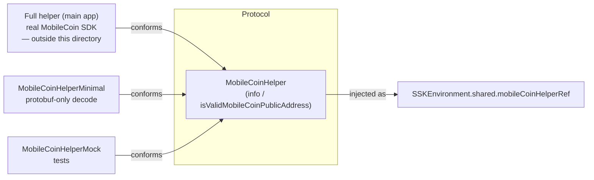

# MobileCoin Integration

This document covers how `SignalServiceKit/Payments/` touches **MobileCoin
(MOB)** — the only payment currency the app supports. The actual MobileCoin SDK
(building/submitting transactions, ledger scanning, fog, attestation) lives
**outside** this directory; what lives here is:

1. A thin decoding/validation protocol, `MobileCoinHelper`
   (`MobileCoinHelper.swift:8`). **[High]**
2. A minimal, SDK-free implementation for app extensions,
   `MobileCoinHelperMinimal` (`MobileCoinHelperMinimal.swift:12`). **[High]**
3. The on-device, currency-specific blob persisted inside every payment record,
   `MobileCoinPayment` (`MobileCoinPayment.swift:9`). **[High]**

- [1. `MobileCoinHelper` — the decode/validate seam](#1-mobilecoinhelper--the-decodevalidate-seam)
- [2. `MobileCoinHelperMinimal` vs. the full helper](#2-mobilecoinhelperminimal-vs-the-full-helper)
- [3. `MobileCoinPayment` — the TXO blob](#3-mobilecoinpayment--the-txo-blob)
- [4. Where the helper is used](#4-where-the-helper-is-used)
- [5. Validation rules & error paths](#5-validation-rules--error-paths)
- [6. Edge cases](#6-edge-cases)
- [7. File reference checklist](#7-file-reference-checklist)

---

## 1. `MobileCoinHelper` — the decode/validate seam

`protocol MobileCoinHelper: AnyObject` (`MobileCoinHelper.swift:8`) is
deliberately tiny — only two members: **[High]**

- `func info(forReceiptData:) throws -> MobileCoinReceiptInfo`
  (`MobileCoinHelper.swift:9`) — parse a MobileCoin **receipt** and extract the
  single piece of data SSK needs, the TXO public key.
- `func isValidMobileCoinPublicAddress(_:) -> Bool`
  (`MobileCoinHelper.swift:11`) — can this blob be decoded as a MobileCoin
  public address?

`MobileCoinReceiptInfo` (`MobileCoinHelper.swift:16`) carries exactly one field,
`txOutPublicKey: Data`. **[High]** This is the TXO (transaction output) public
key used to de-duplicate and reconcile incoming payments.

`MobileCoinHelperMock` (`MobileCoinHelper.swift:26`) throws from `info(...)` and
returns `false` from the address check — used in tests where no SDK is
available. **[High]**

The concrete production implementation that uses the real MobileCoin SDK is
**not in this directory** — this protocol is the abstraction boundary. It is
injected via `SSKEnvironment.shared.mobileCoinHelperRef` (see §4). **[Medium]**

## 2. `MobileCoinHelperMinimal` vs. the full helper

`MobileCoinHelperMinimal` (`MobileCoinHelperMinimal.swift:12`) is a
**dependency-light** implementation that only needs the generated protobuf
types `External_Receipt` / `External_PublicAddress`, not the full MobileCoin
SDK. **[High]**

- `info(forReceiptData:)` (`MobileCoinHelperMinimal.swift:15`): decodes
  `External_Receipt(serializedBytes:)`; on failure logs a warning and throws
  `MobileCoinHelperMinimalError.invalidReceipt`
  (`MobileCoinHelperMinimal.swift:8`). On success returns
  `MobileCoinReceiptInfo(txOutPublicKey: proto.publicKey.data)`. **[High]**
- `isValidMobileCoinPublicAddress(_:)`
  (`MobileCoinHelperMinimal.swift:24`): attempts
  `External_PublicAddress(serializedBytes:)`; returns `true` iff decoding
  succeeds, `false` (with a warning) otherwise. **[High]**

**Why a "minimal" variant exists:** it lets code paths that must run in
constrained contexts — most plausibly the **Notification Service Extension**,
which decodes incoming payment notifications but cannot link the full MobileCoin
SDK — still validate receipts/addresses. The specific host of
`MobileCoinHelperMinimal` is wired up outside this directory; **the exact call
site is intent undetermined — no evidence in source within
`SignalServiceKit/Payments/`.** **[Low]**

## 3. `MobileCoinPayment` — the TXO blob

`MobileCoinPayment` (`MobileCoinPayment.swift:9`) is an
`NSObject`/`NSSecureCoding` value type embedded in `TSPaymentModel` and
serialized via the legacy keyed archiver. Its fields and their applicability
(from the source comments): **[High]**

| Field | Line | Set for | Notes |
| --- | --- | --- | --- |
| `recipientPublicAddressData: Data?` | `:12` | transfer in/out flows | the recipient MC public address |
| `transactionData: Data?` | `:15` | outgoing only | the submitted MC transaction |
| `receiptData: Data?` | `:18` | incoming **and** outgoing | the MC receipt |
| `incomingTransactionPublicKeys: [Data]?` | `:21` | incoming & outgoing | TXO public keys |
| `spentKeyImages: [Data]?` | `:24` | outgoing | key images of spent TXOs |
| `outputPublicKeys: [Data]?` | `:27` | outgoing | public keys of output TXOs |
| `ledgerBlockTimestamp: UInt64` | `:30` | once in ledger | `0` means "not set" |
| `ledgerBlockIndex: UInt64` | `:35` | once in ledger | `0` means "not set" |
| `feeAmount: TSPaymentAmount?` | `:38` | outgoing only | the MC network fee |

**Serialization.** `encode(with:)` (`MobileCoinPayment.swift:64`) only encodes
non-nil optionals; the two `UInt64` ledger values are always encoded as
`NSNumber`. `init?(coder:)` (`MobileCoinPayment.swift:90`) decodes each key,
defaulting `ledgerBlockIndex`/`ledgerBlockTimestamp` to `0` when absent. **[High]**
`supportsSecureCoding` is `true`. **[High]**

**Zero-as-unset convention.** `ledgerBlockDate` (`MobileCoinPayment.swift:130`)
returns a `Date` only when `ledgerBlockTimestamp > 0`, otherwise `nil` — the
code treats `0` as "no ledger timestamp yet". **[High]**

**Immutable copy-with-mutation.** Because the stored fields are `let`, two
static copy helpers rebuild a new blob with a single field changed: **[High]**

- `copy(_:withLedgerBlockIndex:)` (`MobileCoinPayment.swift:138`) —
  `owsAssertDebug(ledgerBlockIndex > 0)`, carries everything else forward.
- `copy(_:withLedgerBlockTimestamp:)` (`MobileCoinPayment.swift:153`) —
  `owsAssertDebug(ledgerBlockTimestamp > 0)`, carries everything else forward.

These are what `TSPaymentModel.update(mcLedgerBlockIndex:)` /
`update(mcLedgerBlockTimestamp:)` call to advance a payment's ledger position
(`TSPaymentModel.swift:230`, `:241`). **[High]**

## 4. Where the helper is used

Within this directory, `SSKEnvironment.shared.mobileCoinHelperRef` is consulted
in three places: **[High]**

1. **Address validity** — `TSPaymentAddress.isValid`
   (`TSPaymentModels.swift:87`) calls
   `isValidMobileCoinPublicAddress(mobileCoinPublicAddressData)`. A payment
   address is only valid if currency is `.mobileCoin` *and* the SDK/proto
   accepts the address bytes. **[High]**
2. **Incoming notification receipts** —
   `upsertPaymentModelForIncomingPaymentNotification`
   (`PaymentsHelperImpl.swift:630`) calls `info(forReceiptData:)` to obtain the
   `txOutPublicKey`, stored as the record's `incomingTransactionPublicKeys`.
   **[High]**
3. **Outgoing-payment sync messages** — `processIncomingPaymentSyncMessage`
   (`PaymentsHelperImpl.swift:369`) calls `info(forReceiptData:)` purely to
   **validate** the receipt (`_ = try …`) before persisting the mirrored
   outgoing record (`PaymentsHelperImpl.swift:430` region). **[High]**

## 5. Validation rules & error paths

- **Receipt decode failure** → `MobileCoinHelperMinimalError.invalidReceipt`
  thrown from `info(...)` (`MobileCoinHelperMinimal.swift:18-20`). Callers in
  `PaymentsHelperImpl` are wrapped in `do/catch` that `owsFailDebug`s and
  returns, so a bad receipt silently drops the inbound record rather than
  crashing release builds (`PaymentsHelperImpl.swift:511-512` catch,
  `:668-669` catch). **[High]**
- **Address decode failure** → `isValidMobileCoinPublicAddress` returns `false`;
  `TSPaymentAddress.isValid` then returns `false`, which makes
  `TSPaymentAddress.buildProto`/`fromProto` throw `PaymentsError.invalidModel`
  (`TSPaymentModels.swift:95-99`, `:118-148`). **[High]**
- **Non-MobileCoin currency** → `TSPaymentAddress.isValid` `owsFailDebug`s and
  returns `false` (`TSPaymentModels.swift:88-91`). **[High]**

## 6. Edge cases

- **`ledgerBlockIndex`/`ledgerBlockTimestamp == 0`** is overloaded to mean
  "unknown"; there is no separate optional. Consumers must branch on `> 0`
  (`MobileCoinPayment.swift:130`, `TSPaymentModels.swift:531` `hasMCLedgerBlockIndex`).
  **[High]**
- **Failure scrubbing.** When a payment transitions to a failed state,
  `TSPaymentModel.update(withPaymentFailure:…)` sets `mobileCoin = nil` and
  clears `mcLedgerBlockIndex`/`mcTransactionData`/`mcReceiptData`
  (`TSPaymentModel.swift:251-271`) — i.e. the MobileCoin blob is intentionally
  dropped on failure. **[High]**
- **De-duplication keys.** `spentKeyImages`/`outputPublicKeys` are turned into
  `Set`s and asserted to be duplicate-free in the sync-message path
  (`PaymentsHelperImpl.swift:402-408`), and are the basis for conflict
  detection in `isProposedPaymentModelRedundant`
  (`PaymentsHelperImpl.swift:541`). See
  [payment-model-and-state-machine.md](payment-model-and-state-machine.md). **[High]**

## 7. File reference checklist

- `MobileCoinHelper.swift` — §1, §4 (protocol, `MobileCoinReceiptInfo`, mock)
- `MobileCoinHelperMinimal.swift` — §2, §5 (minimal impl + error enum)
- `MobileCoinPayment.swift` — §3, §6 (TXO blob, coding, copy helpers)
- `TSPaymentModels.swift` — §4, §5 (`TSPaymentAddress` validity/proto)
- `PaymentsHelperImpl.swift` — §4, §5 (helper call sites)
